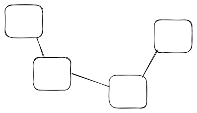

# MANG

## Les principes directeurs et cadre du cours

* Cadre éthique (responsabilité sociétale, respect des personnes, des travailleurs, de la société, de l'environnement)
* Équité et courage
* Cadre d'approbation des outils de gestion
* Notion d'efficacité, d'efficience et de pertinence de l'action

La pertinence d'une action, c'est établir des priorités. C'est la définition des objectifs les plus pertinents sur base de l'analyse des risques en fonction des ressources réelles potentielles (lorsque quelque chose est au-dessus de mes moyens, je vais essayer de trouver de nouvelles ressources, comme un job d'étudiant pour un jeune afin de créer un revenu complémentaire).

