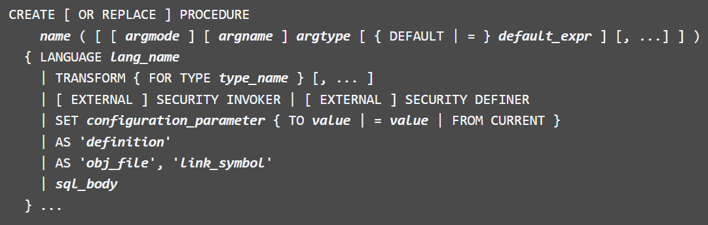

# Base de données

### Importer une base de données

```
psql -U user -d plaisance -f script
```

### Commandes

#### Basiques

| Commande                 | Description                                 |
| ------------------------ | ------------------------------------------- |
| `\d [table]`             | Afficher la définition de la table          |
| `\dt [table]`            | Description de la table                     |
| `\dt+ [table]`           | Description avancée de la table             |
| `\help create procedure` | Manuel de la création d'une procédure       |
| `\set`                   | Montre les variables d'environnement        |
| `\df [proc\|func]`       | Description des fonctions et des procédures |
| `\sf proc\|func`         | Contenu d'une fonction ou d'une procédure   |
| `\dS`                    | Afficher la liste des relations             |
| `\h create trigger`      | Affiche l'aide du trigger                   |

#### Variables d'environnement

| Libellé      | Description |
| ------------ | ----------- |
| `AUTOCOMMIT` | ...         |

#### Aide

`\help create procedure` donne le manuel de la création d'une procédure. Une procédure est **transactionnelle**.

<figure><figcaption></figcaption></figure>

### `SELECT`

Les vues peuvent être utilisées comme des tables. Il suffit de le inclure dans les requêtes.

| Description                                               | Requête                                                                                   |
| --------------------------------------------------------- | ----------------------------------------------------------------------------------------- |
| Affichage du contenu d'une vue.                           | `SELECT * FROM vue1`                                                                      |
| Affichage de certaines colonnes d'une vue.                | `SELECT col1, col2 FROM vue1`                                                             |
| Affichage d'une vue qui avait renommé certaines colonnes. | `SELECT * FROM vue2`                                                                      |
| Affichage du contenu d'une vue avec filtre.               | `SELECT * FROM vue3 WHERE ID > 10`                                                        |
| Affichage d'une jointure avec 2 vues.                     | `SELECT A.col1, B.col2 FROM vue1 A JOIN vu4 B USING (col1)`                               |
| Affichage du nombre de lignes retournées par une vue.     | `SELECT COUNT(*) FROM vue2`                                                               |
| Affichage d'un agrégat sur une vue.                       | `SELECT COUNT(*) AS occurence, Number FROM vue5 GROUP BY Number ORDER BY COUNT(*)`        |
| Affichage d'une vue comprise dans un SELECT imbriqué.     | `SELECT col1, col2 FROM table1 WHERE col1 IN (SELECT col1 FROM vue6 WHERE col3 = "LAST")` |

### `DROP`

| Description              | Requête                                                                                                                                                                                  |
| ------------------------ | ---------------------------------------------------------------------------------------------------------------------------------------------------------------------------------------- |
| `DROP VIEW vue6`         | Effacement d'une vue                                                                                                                                                                     |
| `DROP VIEW vue4 CASCADE` | Effacement d'une vue qui est employée par une autre vue. Il faut utiliser `CASCADE` pour que cela soit autorisé. La vue est effacée ainsi que toutes les vues qui dépendent de celle-ci. |

### DML

Acronyme de Data Manipulation Language.

#### Utilisation

* Pour pouvoir utiliser des commande DML (`INSERT`, `UPDATE` et `DELETE`) sur une vue, il faut respecter quelques règles lors de la construction de la vue :
  * La vue doit être basée sur une table.
  * Elle ne doit pas comprendre de jointure.
  * Elle ne doit pas comprendre de fonction.
  * Elle ne doit pas comprendre d'agrégat (`MIN`, `MAX`, `SUM`, `COUNT`, `GROUP BY`, etc.).
* Les commande DML sur la vue sont soumises aux contraintes :
  * Définies sur la table référencée dans la vue.
  * Définies sur la vue.

| Description                                | Requête                                                          |
| ------------------------------------------ | ---------------------------------------------------------------- |
| Modification de recrods à travers une vue. | `UPDATE vue 2 SET Number = Number + 1 WHERE ID > 12 AND ID < 16` |
| Ajout d'un record en passant pas une vue.  | `INSERT INTO vue2 (ID, Number, col3) VALUES (12, 100, "LAST")`   |

Il est possible d'ajouter un record sans spécifier toutes les colonnes s'il n'y a pas de contraintes sur la table qui empêcheraient l'opération (`NOT NULL`, `CHECK`, etc.).

Effacement de records à travers une vue.

```sql
DELETE FROM vue4 WHERE ID = 12 AND ID = 13
```

Il est possible d'ajouter un record depuis une vue même si la vue ne reprend pas toutes les colonnes de la table. Il faut seulement que la vue reprenne les colonnes oblogatoire (`NOT NULL`).

Ajout d'un record en passant par une vue qui ne contient pas toutes les colonnes de la table référencée.

```sql
INSERT INTO vue3 (ID, Number) VALUES (13, 110);
```

Il est également possible d'utiliser les commandes DML (`INSERT` ou `UPDATE`) sur des vues qui contiennent des filtres même si les valeurs de certaines colonnes ne sont pas comprises par les filtres de la vue.

Modification d'un record en passant par une vue qui contient un filtre. La nouvelle valeur de la colonne exclura le record de la vue mais sera mise à jour dans la table référencée.

```sql
UPDATE vue4 SET col1 = 1 WHERE col1 = 12;
```

Si on demande d'afficher le contenu de la vue, le record ayant col1 = 1000, ne sera pas retournée car il y a un filtre `WHERE col1 > 10` dans la création de la vue (voir Création de vue)

Il est possible d'ajouter un record depuis une vue même si la vue ne reprend pas toutes les colonnes de la table. IL faut seulement que la vue reprenne les colonnes obligatoires (`NOT NULL`).

Ajout d'un record en passant par une vue qui ne contient pas toutes les colonenes de la table référencée.

```sql
INSERT INTO vue3 (ID, Number) VALUES (13, 110);
```

Il est également possible d'utiliser les commandes DML (`INSERT` ou `UPDATE`) sur des vues qui contiennent des filtres même si les valeurs de certaines colonnes ne sont pas comprises par les filtres de la vue.

Modification d'un recrod en passant par une vue qui contient un filtre. Lan nouvelle valeur de la colonne exlura le record de la vue mais sera mise à jour dans la table, référencée.

```sql
UPDATE vue4 SET col1 = 1 WHERE col1 = 12;
```

Si on demande d'afficher le contenu de la vue, le record ayant `col1 = 1000`, ne sera pas retourné car il y a un filtre `WHERE col1 > 10` dans la création de la vue (voir Création de vue).

```sql
SELECT * FROM table1 WHERE col1 = 1;
SELECT * FROM vue4 WHERE col1 = 1;
```

Quand est-ce qu'une DML n'est pas une transaction ?

* Lorsque la variable d'environnement `AUTOCOMMIT` est modifiée.
* Créer nous-même la transaction, lorsque la transaction est fragmentée avec des break-points et des rollbacks.
* Lors d'une procédure.

### `WITH CHECK OPTION`

#### Utilisation

Pour des raisons de cohérence et de sécurité, il est préférable d'empêcher des comportements comme celui montré précédemment, Cela est possible en utilisant une syntace plus complète lors de la création de la vue.

```sql
CREATE VIEW <nom> AS <query> [WITH [CASCADED|LOCAL] CHECK OPTION];
```

Avec cette syntaxe, seules les DML (`INSERT` et `UPDATE`) qui respectent les filtres de la vue seront acceptées. `CASCADED`, utilisation par défaut, empêche toute modification de la table qui ne respecte pas les filtres de la vue ou de la vue parente (dans le case d'une vue créée à partir d'une autre vue). `LOCAL`, la vérification n'est fait que sur la vue courante (celle reprise dans la DML).

#### Création d'une vue

Création d'une vue avec WITH CHECK OPTION pour respecter la cohérence du filtre dans la vue.

```sql
CREATE VIEW vue7 AS
SELECT * FROM table1 WHERE col1 > 10
WITH CHECK OPTION;
```

Avec cette syntaxe, seules les DML (`INSERT` et `UPDATE`) qui respectent les filtres de la vue seront acceptées. Comme le type de `CHECK OPTION` n'est pas spécifié, c'est `CASCADED` qui sera utilisé. La vérification des contraintes lors de la modification ou l'insertion d'un record se fera non seulement en fonction des filtres de la vue mais également des éventuels filtres qui pourraient exister sur des vues parentes.

Insertion d'un record en passant par une vue qui contient un filtre. La valeur de la colonne col1 est cohérente avec le filtre (col1 > 10).

```sql
INSERT INTO vue7 (col1, col2, col4) VALUES (15, 7, 0);
```

Insertion d'un record en passant par une vue qui contient un filtre. La valeur de la colonne col1 n'est pas cohérente avec le filtre (col1 > 10).

```sql
INSERT INTO vu7 (col1, col2, col4) VALUES (5, 17, 4);
```

\* Le record n'est pas ajouté à la table référencée par la vue car les valeurs des colonnes ne respectent pas les contraintes liées à la vue.

### `DEFAULT`

#### Utilisation

Il est également possible d'ajouter une contrainte `DEFAULT` sur une ou plusieurs colonnes de la vue. DAns ce cas, la valeur par défaut définie sur la vue est prioritaire sur une éventuelle valeur par défaut définie sur la table référencée par la vue. Mais cette contrainte doit respecter

```sql
ALTER VIEW <nomVue> ALTER <nomColonne>
  SET DEFAULT <expression>;
```

Pour retirer une contrainte `DEFAULT` mise sur une vue, il faut utiliser la commande suivante :

```sql
ALTER VIEW <nomVue> ALTER <nomColonne>
  DROP DEFAULT;
```

Ajout d'une contrainte DEFAULT. Lors d'une insertion d'un record, la valeur par défaut de la colonne `col2` sera `-1` si aucune valeur n'a été spécifiée au niveau de la commande DML.

```sql
ALTER VIEW vue1 ALTER col2 SET DEFAULT -1;
```

Insertion d'un record sans spécifier de valeur pour la colonne col2. La valeur par défaut définie sur la colonne de la vue va être utilisée.

```sql
INSERT INTO vue1 (col1, col4) VALUES (5, 4);
```

Ajouter d'une contrainte CHECK sur la table référencée par la vue. Dans le cas de nos exemples, il faut d'abord s'assureer que toutes les valeurs de col2 respecteront la règle.

```sql
UPDATE table1 SET col2 = 20 WHERE col2 <= 10;
ALTER TABLE table1 ADD CHECK (col2 > 10);
```

Insertion d'un record sans spécifier de valeur pour la colonne col2. La valeur par défaut définie sur la colonne de la vue va être utilisée.

```sql
INSERT INTO vu1 (col1, col4) VALUES (5, 4);
```

Le record n'est pas ajouté à la table référencée par la vue car la valeur par défaut définie dans la vue `(col2 = -1)` ne respecte pas la contrainte `CHECK (col2 > 10)`.

Insertion d'un record en spécifiant une valeur pour la colonne col2.

```sql
INSERT INTO vue1 (col1, col2, col4) VALUES (5, 17, 4);
```

Retrait de la valeur par défaut définie sur la colonne col2 de la vue.

```sql
ALTER VIEW vue1 ALTER col2 DROP DEFAULT;
```

### `VIEW`

#### Utilité

* C'est une requête stockée dans le SGBD.
* C'est une table virtuelle définie par une requête.
* Elle permet de simplifier l'utilisation de requêtes simples ou complexes en les nommant après les avoir créées.
* Elle propose à l'utilisateur une perception de la base plus proche de ses besoins.
* Une vue permet également de cacher certaines données ou colonnes à certains utilisateurs.
* Sous certaines conditions, il est possible d'utiliser des commandes DML au travers de la vue.
* Il est également possible d'ajouter des contraintes sur des colonnes de la vue.

#### Déclaration

* La déclaration de la vue se fait après les tables.
* Syntaxe :
  * `CREATE VIEW` + nom + `AS` + query (SELECT...);
  * `CREATE VIEW` + nom (colonnes) + `AS` + query (SELECT...);
* La 2ème forme permet de nommer les colonnes de la vue, cela évite d'utiliser des alias dans le `SELECT`.
* Il n'est pas possible de modifier la (les) colonnes de la (des) table(s) qui en est (sont) reprise(s) dans la vue, sauf renommage. La déclaration d'une vue n'est pas dynamique : si une colonne est ajoutée à une table reprise dans la vue, celle-ci n'apparait pas dans la vue. Il faut recréer la vue pour tenir compte du changement si nécessaire.
* Il est possible de modifier une vue en gardant sa configuration si la nouvelle vue a au minimum les mêmes champs que dans sa déclaration précédente à l'aide de `CREATE OR REPLACE VIEW` + nom + `AS` + query;
* Il est possible d'ajouter une contrainte `DEFAULT` sur une ou plusieurs colonnes de la vue. Celle-ci sera appliquée lors d'une commande DML `INSERT`.
* Pour retirer (effacer) une vue :
  * `DROP VIEW` nom \[`CASCADE`] : `CASCADE` est utilisé pour forcer la suppression lorsqu'une vue est utilisée par d'autres vues. Dans ce cas-là, toutes les vues qui dépendent de la vue supprimée seront également supprimées.

#### Création d'une table

```sql
CREATE TABLE table1(
  col1 INT,
  col2 INT,
  col3 VARCHAR(5),
  col4 INT
);
```

Création d'une vue qui affiche toutes les colonnes de la table et tous les records.

```sql
CREATE VIEW vue1 AS
SELECT * FROM table1;
```

Création d'une vue qui n'affiche que les 3 premières colonnes de la table tout en renommant col1 en ID et col2 en Number.

```sql
CREATE VIEW vue2 AS
SELECT col1 AS ID, col2 AS Number, col3 FROM table1;
```

Idem que pour la vue précédente mais en utilisant le 2ème format.

```sql
CREATE VIEW vue3 (ID, Number) AS
SELECT col1, col2, col3 FROM table1;
```

Il n'est pas obligatoire de renommer toutes les colonnes mais il n'est pas possible de 'sauter' une colonne pour ne renommer que la 1ère et la 3ème par exemple.

Création d'une vue avec un filtre (condition `WHERE`). Cette vue n'affichera que les records qui satisfont la condition.

```sql
CREATE VIEW vue4 AS
SELECT * FROM table1 WHERE col1 > 10;
```

Création d'une vue basée sur une autre vue (table virtuelle). Il y a donc un lien entre vu4 et vue5.

```sql
CREATE VIEW vue5 AS
SELECT col1 AS ID, col2 AS Number FROM vue4;
```

Création d'une 2ème table pour continuer à travailler avec les vues.

```sql
CREATE TABLE table2 (
  col1 INT,
  col8 INT,
  col9 VARCHAR(5)
);
```

Création d'une vue basée sur une requête avec jointure entre 2 tables.

```sql
CREATE VIEW vue6 (ID, Number) AS
SELECT col1, col2, col9, FROM table1
JOIN table2 USING (col1);
```

### `MATERIALIZED VIEW`

#### Utilisation

* Le résultat d'une vue est à usage unique et la vue doit être à chaque fois relancée pour toute nouvelle utilisation de celle-ci car le résultat est tenu en mémoire vive.
* Toutefois, il est possible de garder le résultat d'une vue de manière permanente sur le disque en utilisant une vue matérialisée (`MATERIALIZED VIEW`).
* L'utilisation d'une telle vue permet de ne pas recalculer à chaque fois le résultat de la vue mais plutôt de récupérer celui-ci depuis la sauvegarde.
* Ceic permet donc de mettre en "cache" le résultat de la vue et, par conséquent, permet donc un gain de temps puisque le résultat de la vue n'est pas recalculer à chaque utilisation de celle-ci.
* Par contre, il faut forcer la mise à jour du cache lorsque vous voulez utiliser un résultat.
* Par contre, il faut forcer la mise à jour du cache lorsque vous voulez utiliser un résultat de la vue qui tient compte des derniers changement qui ont pu s'opérer sur la (les) table(s) reférencée(s) par la vue.
* Les vues matérialisées sont principalement utilisées lorsque :
  * Le calcul de la vue prend du temps.
  * Le nombre de lignes du résultat n'est pas élevé. Le résultat de la vue est utilisé plusieurs fois pour des opération plus complexes = jointures, agrégats, etc.
  * Les tables référencées par la vues ne sont pas trop fréquemment modifiées.
* Le résultat de la vue est sauvergardé de manière permanente sur le disque. Il ne disparaît donc pas entre 2 sessions.

#### Déclaration

```sql
CREATE MATERIALIZED VIEW <nomVue> [<nomColonnes>] AS <query> [WITH [NO] DATA];
```

`WITH DATA`, après la création de la vue, celle-ci est exécutée une première fois et le résultat est mis en cache sur le disque du serveur. Cette option est utilisée par défaut si rien n'est spécifié. `WITH NO DATA`, la vue est simplement créée sans l'exécuter une première fois. Il n'y a donc aucun résultat mis en cache. Il faudra d'abord lancer une commande de mise à jour du cache de la vue avant de pouvoir utiliser la vue. Cela permet de ne pas perdre de temps à la création de la vue si vous n'avez pas besoin du résultat tout de suite.

#### Utilisation

Création d'une vue matérialisée avec création d'une sauvegarde du résultat de la vue.

La vue est créée et exécutée dans la foulée. Le résultat de la vue est sauvegardé sur le disque du serveur.

```sql
CREATE MATERIALIZED VIEW mv1 AS
SELECT * FROM mv1 [WITH DATA];
```

Affichage du résultat de la vue.

La vue n'est pas exéctuée. Le serveur va rechercher le résultat obtenu lors de la sauvegarde de celui-ci sur le disque. Cela permet de gagner du temps mais les affichages successifs du résultat de la vue ne tiennent pas compte des éventuelles modifications de données apportées sur la (les) table(s) référencée(s) par la vue.

Création d'une vue matérialisée sans exécution de celle-ci et donc, sans sauvegarde du résultat de la vue.

```sql
SELECT * FROM mv1;
```

La vue est créée mais elle n'est pas automatiquement exéctutée après la création. Il n'y a donc aucun résultat en cache et la vue ne peut être utilisée directement sans faire une mise à jour du cache de la vue.

```sql
CREATE MATERIALIZED VIEW mv2 AS
  SELECT * FROM mv2 WITH NO DATA;
```

Affichage du résultat de la vue.

La commande génère une erreur signifiant que la vue matérialisée n'a pas été peuplée (exécutée + sauvegarde du résultat dans le cache).

```sql
SELECT * FROM mv2;
```

#### Mise à jour

Rafraîchissment du résultat de l'exécution de la vue (et sauvegarde de celui-ci dans le cache).

La vue est exécutée et le résultat est sauvegardé sur le disque (en effaçant le résultat précédemment sauvegardé).

```sql
REFRESH MATERIALIZED VIEW mv1;
```

Création d'une première sauvegarde si WITH NO DATA a été utilisé lors de la création de la vue.

La vue est exécutée et le résultat est sauvegardé sur le disque.

```sql
REFRESH MATERIALIZED VIEW mv2;
```

* Lors du rafraîchissement du résultat de la vue, celle-ci est rendue momentanément indisponible (locked) durant l'exécution de la vue. Les autres requêtes faisant appel à cette vue sont en attente de la fin de l'opération de rafraîchissement de la vue.
* Il est possible d'éviter cette situation en faisant un rafraîchissement de manière concurentielle. Néanmoins, il faut au préalable créer un index `UNIQUE` qui n'utilise que les noms de colonnes de la vue et qui porte sur l'entièreté des résultats retournés par celle-ci.

```sql
CREATE UNIQUE INDEX uimv1 ON mv1 (col1, col2);
REFRESH MATERIALIZED VIEW CONCURRENTLY mv1;
```

Effacement de la sauvegarde du résultat de la vue.

```sql
REFRESH MATERIALIZED VIEW mv2 WITH NO DATA;
```

#### Suppression

Effacement de la vue matérialisée et de sa sauvegarde sur le disque du serveur, et éventuellement des index créés sur cette vue. `CASCADE` permet de forcer l'effacement de la vue et des vues qui dépendent de celle-ci.

```sql
DROP MATERIALIZED VIEW mv1 [CASCADE];
```

### Script

create view description as select idClient, prenom, nom, libelle, date\_location from location l join exemplaire using(numero) join client using (idClient) join titre using(idTitre) order by nom asc, date\_location asc;

\sv pour "show view \d+ pour describe plus \d pour describe

```sql
do $$
  declare
    nombre int;         -- Déclaration d'une variable locale "nombre" comme entier
    chaine varchar(20); -- Déclaration d'une variable locale "chaine" comme string
  begin
    nombre = 5;
    chaine = 'Bonjour';
    raise notice 'nombre = %, chaine = %', nombre, chaine;

-- Début de sous-bloc
    declare
      -- Déclaration et assignation
      nombresb int = 10 + nombre;
    begin
      nombre = 100;
      raise notice 'Debut sous-bloc';
      raise notice 'nombre = %, nombresb = %', nombre, nombresb;
    end;
-- Fin de sous-bloc

    declare
      vtitre titre.libelle%type;
      vid titre.idtitre%type;
      ligne titre%rowtype;
      ligneraw record;
    begin
      raise notice '2ème sous-bloc';
      select idtitre, libelle from titre order by 1 desc into nombre, chaine;
      select libelle, idtitre from titre into vtitre, vid;
      select * from titre into ligne;
      select libelle, rated, id from titre into ligne;
      select libelle, rated, id from titre into ligneraw;
      raise notice 'titre = %, id = %, ligne = %, libelle = %', vtitre, vid, ligne, ligne.libelle;
      raise notice 'id = %, titre = %, rated = %', ligneraw.idtitre, ligneraw.titre, ligneraw.rated;
    end;

    raise notice 'Retour bloc principal';
    raise notice 'nombre = %', nombre;
  end;
$$;
```

#### Commit et Rollback

En ajoutant `replace`, les métadonnées de la table ne sont pas effacées.

```sql
create or replace procedure nomp() language plpsql as $$
declare
  temp as int;
begin
  begin transaction;
  insert into accounts values('Lazare', 15000);
  commit;
end
$$;
```

Le rollback dans une procédure efface toutes les transactions effectuées pendant celle-ci.

```sql
-- première procédure
create or replace procedure nomp2() language plpsql as $$
  begin
    insert into accounts value('Prof', 20000);
  end
$$;

-- deuxième procédure
create or replace procedure nomp() language plpsql as $$
  begin
    begin transaction;
    insert into accounts values('Lazare', 15000);
    insert into accounts values('Max', 15000);
    nomp2();
    rollback;
  end
$$;
```

Pour appeler la procédure : `call nomp()` Pour commencer une transaction, utiliser

```
postgres=# begin;
postgres=*# -- mode transaction
postgres=!# -- erreur lors de la transaction
postgres=!# rollback; -- revenir au dernier point restauration
```

En Postgres, ce n'est pas possible de créer des sous-transactions.

```
postgres=# begin;
postgres=# begin;
ATTENTION: une transaction est déjà en cours
```

L'utilisation de `rollback` revient jusqu'au dernier `commit`. S'il n'y en a pas, il remonte jusqu'au `begin` de la procédure.

Exemple où il y a un `commit` dans la procédure appelée et un `rollback` dans l'appelante.

```sql
-- procédure appelée
create or replace procedure nomp2() language plpsql as $$
  begin
    insert into accounts value('Prof', 20000);
    commit; -- ajout
  end
$$;

-- procédure appelante
create or replace procedure nomp() language plpsql as $$
  begin
    begin transaction;
    insert into accounts values('Lazare', 15000);
    insert into accounts values('Max', 15000);
    nomp2(); --appel
    rollback; --ajout
  end
$$;
```

Exemple où il y a un `rollback` dans la procédure appelée et un `commit` dans l'appelante.

```sql
-- procédure appelée
create or replace procedure nomp2() language plpsql as $$
  begin
    insert into accounts value('Prof', 20000);
    rollback; -- modification
  end
$$;

-- procédure appelante
create or replace procedure nomp() language plpsql as $$
  begin
    begin transaction;
    insert into accounts values('Lazare', 15000);
    insert into accounts values('Max', 15000);
    nomp2(); --appel
    commit; -- modification
  end
$$;
```

#### Savepoint \[name]

Utilisation du `savepoint [name]`.

```sql
-- procédure appelée
create or replace procedure nomp2() language plpsql as $$
  begin
    insert into accounts value('Prof', 20000);
    savepoint p1; -- modification
  end
$$;

-- ⚠️ invalide car on ne peut pas utiliser de transaction dans une fonction
create or replace function nomf() returns int language plpsql as $$
  begin
    insert into accounts values('Proff', 4444);
    commit;
    insert into accounts values('Profff', 44445);
    rollback;
    return 0;
  end
$$;

```

Les deux différences entre une **procédure** et une **fonction** sont

| Libellé          | Procédure | Fonction |
| ---------------- | --------- | -------- |
| Transactionnel   | ✅         | ❌        |
| Valeur de retour | ❌         | ✅        |

Ce n'est pas possible de faire une transaction dans une fonction, **même via une procédure**. Mais on peut tout de même appeler la procédure s'il n'y a aucune commande de transaction dedans.

### ACID

* `Atomicity` : chaque état dans une transaction est traitée comme une unité simple, cette propriété empêche la perte de données et la corruption, par exemple une perte de connexion au milieu de la transaction.
* `Consistency` : s'assure que la transaction fait seulement des changement sur des tables prédéfinies, ça permet de prévenir la corruption ou les erreurs de données afin de ne pas créer des conséquence sur l'intégrité de la table.
* `Isolation` : lorsque plusieurs utilisateurs lisent et écrivent en même temps sur une même table, l'isolation de leur transaction concurrente assure qu'elles ne s'interfèrent pas.
* `Durability` : s'assure que tous les changements réussis faits sur les données sont enregistrées, même si le système disfonctionne par après.

### Deadlock

<figure><figcaption></figcaption></figure>

### Les tables système

```sql
select * from pg_lock
select * from pg_trigger
```

| Action | Old | New |
| ------ | --- | --- |
| insert | x   | v   |
| update | v   | v   |
| delete | v   | x   |

Les triggers peuvent être utilisés pour créer une table de logs
