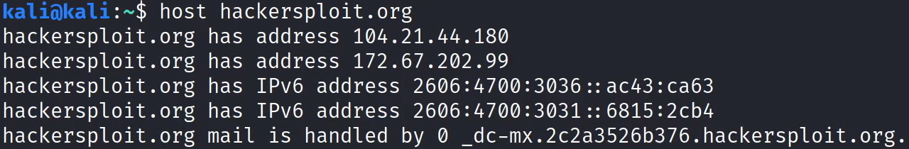
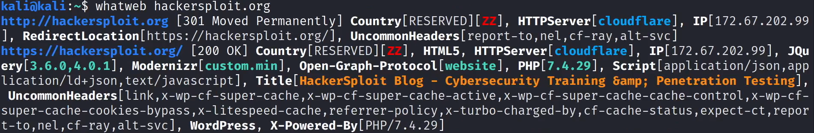
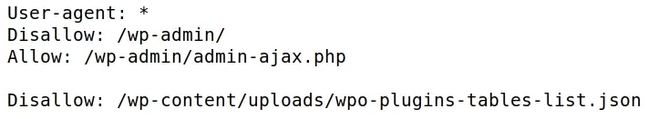
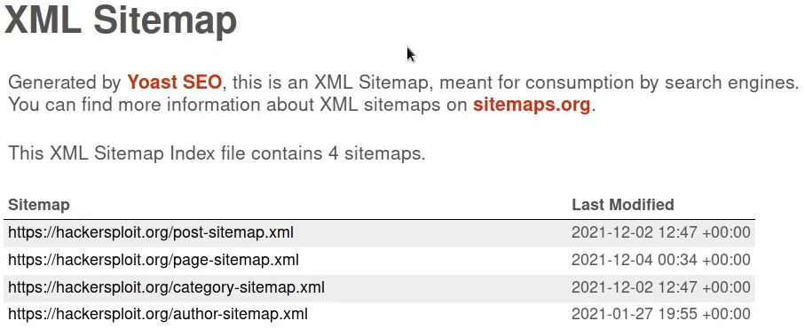
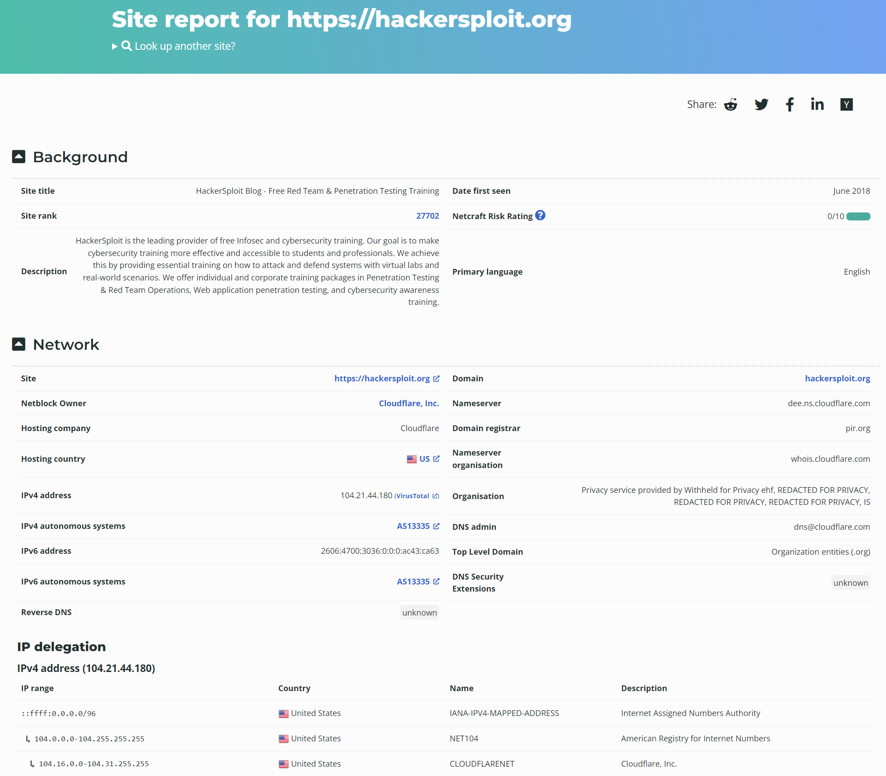
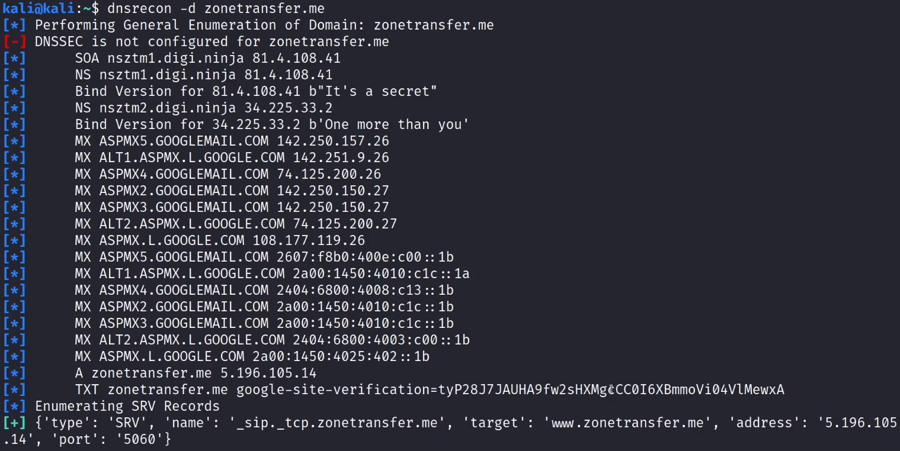
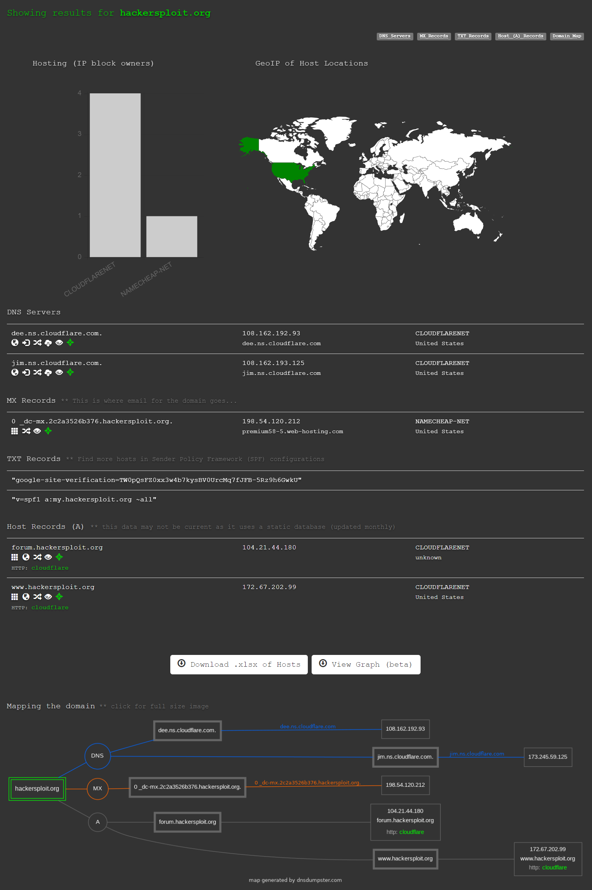
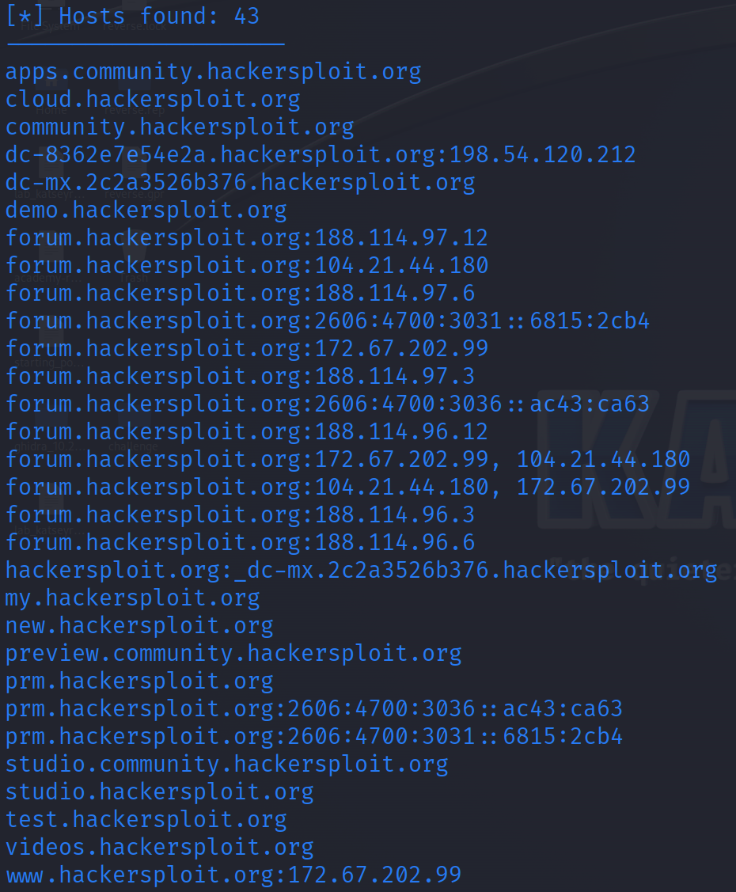
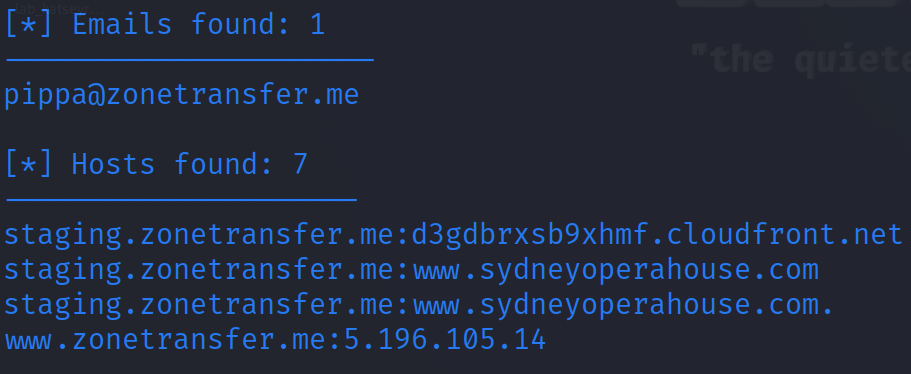
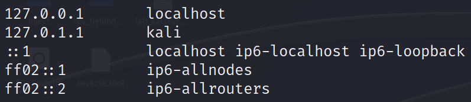

# 1. Information gathering

### Introduction to information gathering

#### What is information gathering ?

This is the first step of any pentest and involves gathering or collecting information about an individual, company, website or system that you are targeting. The more information you have on your target, the more successful you will be during the latter stages of a penetration test. Information gathering is typically broken down into 2 types :

| Type                          | Description                                                                                                                                                                       |
| ----------------------------- | --------------------------------------------------------------------------------------------------------------------------------------------------------------------------------- |
| Passive information gathering | Involves gathering as much information as possible without actively engagin with the target.                                                                                      |
| Active information gathering  | Involves gathering as much information as possible by actively engaging with the target system (you will require authorization in order to perform active information gathering). |

#### What information are we looking for ?

The information by passive gathering :

* Identifying IP addresses and DNS information
* Identifying domain names and domain ownership information
* Indentifying email addresses and social media profiles
* Identifying web technologies being used on target sites
* Identifying subdomains

The information by active gathering :

* Discovering open ports on target systems
* Learning about the internal infrastructure of a target network/organization
* Enumerating information from target systems

### Passive information gathering

#### Website Recon and footprinting

What are we looking for ?

* IP addresses
* Directories hidden from search engines
* Names
* Email addresses
* Phone Numbers
* Physical Addresses
* Web technologies being used

**IP address**

```bash
whatis host
host hackersploit.org  # get the ip address
```

<figure><figcaption></figcaption></figure>

**Services**

```bash
whatweb hackersploit.org
```

<figure><figcaption></figcaption></figure>

**Website plan**

The **first** file is https://hackersploit.org/robots.txt. The `robots.txt` file set rules for crawling. In this case, you can't go inside of `/wp-admin/` excepted for `/wp-admin/admin-ajax.php` and you can't go to `/wp-content/uploads/wpo-plugins-tables-list.json`.

<figure><figcaption></figcaption></figure>

The **second** file is https://hackersploit.org/sitemap\_index.xml. It is used to provide search engine and indexing the web site.

<figure><figcaption></figcaption></figure>

**Firefox add-ons**

It exists Firefox add-ons to detect more information about the website : [Builtwith](https://addons.mozilla.org/en-US/addon/builtwith), [Wappalyzer](https://addons.mozilla.org/en-US/addon/wappalyzer)

**Explore directories**

To explore directories, there is a tool on this site : https://www.httrack.com/page/2/en/index.html or you can install it with the `apt` command.

```bash
john@kali$ sudo apt-get install webhttrack
```

#### Whois enumeration

The `whois` can be reached on https://who.is. You can have a lot of information with this command.

```bash
whois hackersploit.org
```

#### Website footprinting with netcraft

The link of the tool is https://sitereport.netcraft.com. It returns a lot of information about the website.

<figure><figcaption></figcaption></figure>

#### DNS recon

**dnsrecon**

```bash
john@kali$ dnsrecon -d zonetransfer.me
```

<figure><figcaption></figcaption></figure>

| Type of record | Description                                                                   |
| -------------- | ----------------------------------------------------------------------------- |
| NS             | Name Server, delegates a DNS zone to use the given authoritative name servers |
| MX             | Mail exchange record, list of servers that accept email for a domain          |
| A              | IPv4 address                                                                  |
| AAAA           | IPv6 address                                                                  |
| TXT            | Text record, used to track analytics Google                                   |
| CNAME          | Canonical name, alias of one name to another                                  |

**DNSdumpster**

The tool is available on https://dnsdumpster.com.

<figure><figcaption></figcaption></figure>

#### WAF with wafw00f

WAF = Web Application Firewall The tool is available on https://github.com/EnableSecurity/wafw00f. You can detect firewalls with this tool.

```bash
john@kali$ wafw00f -l  # list all possible firewalls detected
john@kali$ wafw00f hackersploit.org
john@kali$ wafw00f zonetransfer.me
john@kali$ wafw00f hackertube.net
```

The domain `hackersploit.org` is behind the firewall **Cloudflare**. The domain `zonetransfer.org` has no firewall detected. The domain `hackertube.net` is behind the firewall **LiteSpeed**.

#### Subdomain enumeration with sublist3r

The tool is available on https://github.com/aboul3la/Sublist3r.

It's a Python tool designed to enumerate subdomains of websites using OSINT. It helps pentesters and bug hunters collect and gather subdomains for the domain they are targeting. Sublist3r enumerates subdomains using many search engines such as Google, Yahoo, Bing, Baidu and Ask. Sublist3r also enumerates subdomains using Netcraft, Virustotal, ThreatCrowd, DNSdumpster and ReverseDNS.

It's also used to subdomain bruteforce (which is **active** information gathering).

```bash
john@kali$ sudo apt-get install sublist3r
john@kali$ sublist3r -d ine.me
john@kali$ sublist3r -d ine.me -e google,yahoo # only use specific engines
```

#### Google Dorks

It's the search navigation bar of Google.

| Search Command   | Description                                          |
| ---------------- | ---------------------------------------------------- |
| `site:ine.com`   | Limit all research to the domain `ine.com`.          |
| `inurl:admin`    | Search for all urls with the value `admin`.          |
| `site:*.ine.com` | Find all subdomains of `ine.com`.                    |
| `intitle:admin`  | Search all site with the value `admin` in its title. |
| `filetype:pdf`   | Search all pdf file.                                 |
| `cache:ine.com`  | The cache of the website                             |

Examples :

```
site:ine.com inurl:admin
site:ine.com inurl:forum
intitle:index of
cache:ine.com
inurl:auth_user_file.txt
```

The snapshots of the websites are on https://archive.org/web. The Google Dorks Hacking Database is available on https://www.exploit-db.com/google-hacking-database.

#### Email Harvesting with theHarvester

The tool is available on https://github.com/laramies/theHarvester.

**theHarvester** is a very simple to use, yet powerful and effective tool designed to be used in the early stages of a penetration test or red team engagement. Use it for OSINT gathering to help determine a company's external threat landscape on the Internet. The tool gathers **emails**, **names** and **sub-domains**. IPs and URLs using multiple public data sources.

It has **passive** and **active** gathering information features.

```bash
john@kali$ theHarvester -d hackersploit.org -b duckduckgo,crtsh,rapiddns,yahoo,dnsdumpster,bing,baidu,certspotter
```

<figure><figcaption></figcaption></figure>

```bash
john@kali$ theHarvester -d zontransfer.me -b duckduckgo,crtsh,rapiddns,yahoo,dnsdumpster,bing,baidu,certspotter
```

<figure><figcaption></figcaption></figure>

#### Leaked Password Databases

The site is https://haveibeenpwned.com. You can check if the email address has its password leaked in a database.

### Active information gathering

**Definition**

* Domain Name System (DNS) is a protocol that is used to resolve domain name/hostnames to IP addresses.
* During the early days of the internet, users would have to remember the IP addresses of the sites that they wanter to visit, DNS resolves this issue by mapping domain names (easier to recall) to their respective IP addresses.
* A DNS server (nameserver) is like a telephone directory that contains domain names and their corresponding IP addresses.
* A plethora of public DNS servers have been set up by companies like Cloudflare (1.1.1.1) and Google (8.8.8.8). These DNS servers contains the records of almost all domains on the internet.

**DNS records**

| Name  | Description                                       |
| ----- | ------------------------------------------------- |
| A     | Resolves a hostname or domain to an IPv4 address. |
| AAAA  | Resolves a hostname or domain to an IPv6 address. |
| NS    | Reference to the domains nameserver.              |
| MX    | Resolves a domain to a mail server.               |
| CNAME | User for domain aliases.                          |
| TXT   | Text record.                                      |
| HINFO | Host information.                                 |
| SOA   | Domain authority.                                 |
| SRV   | Service record.                                   |
| PTR   | Resolves an IP address to a hostname.             |

**DNS interrogation**

* DNS interrogation is the process of enumerating DNS records for a specific domain.
* The objective of DNS interrogation is to probe a DNS server to provide us with DNS records for a specific domain.
* This process can provide with important information like the IP address of a domain, subdomains, mail server addresses, etc.

**DNS zone transfer**

* In certain cases DNS server admins may want to copy or transfer zone files from one DNS server to another. This process is known as a zone transfer.
* If missconfigured and left unsecured, this functionality can be abused by attackers to copy the zone file from the primary DNS server to another DNS server.
* A DNS zone transfer can provide penetration testers with a holistic view of an organization's network layout.
* Furthermore, in certain cases, internal network addresses may be found on an organization's DNS s erver.

```bash
john@kali$ sudo vi /etc/hosts
```

<figure><figcaption></figcaption></figure>

It's possible to use `hosts` file to add custom domain name for the local machine.

```bash
john@kali$ dnsenum zonetransfer.me
john@kali$ whatis dig
john@kali$ whatis fierce
```

The command `dig` is a DNS lookup utility.
