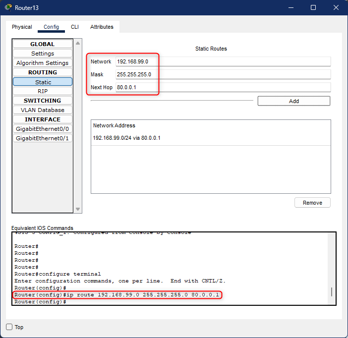
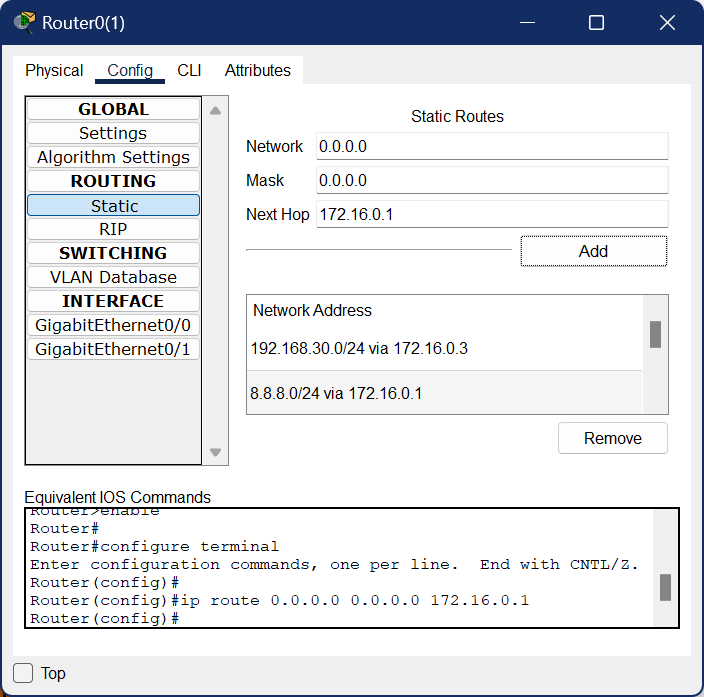
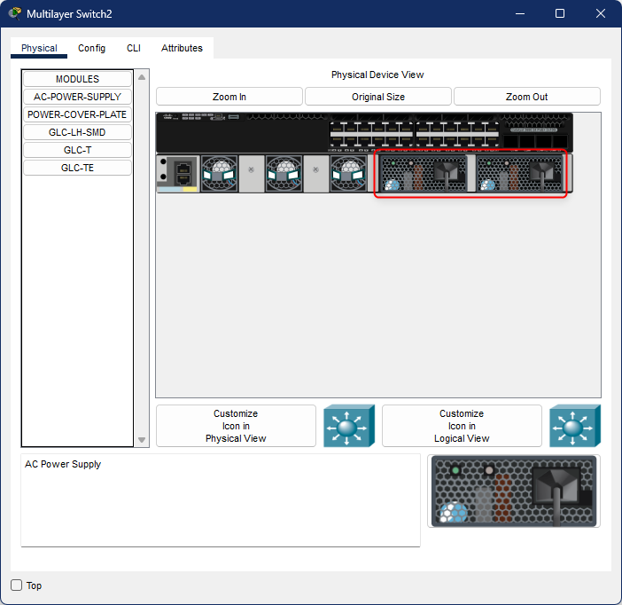
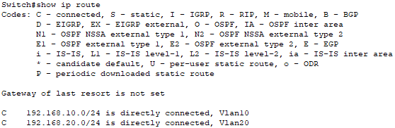
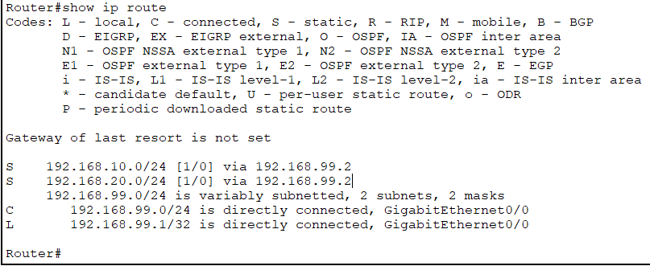
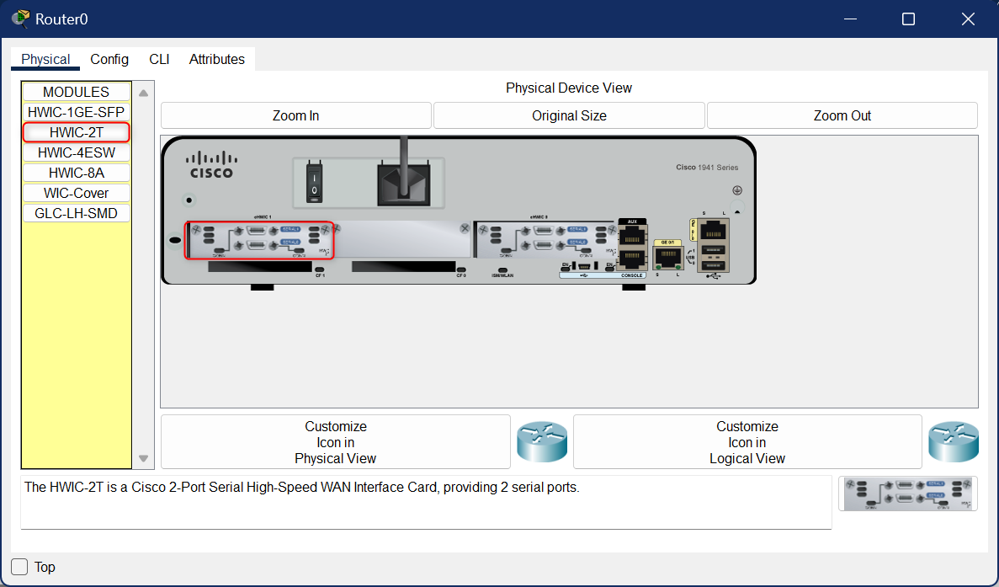
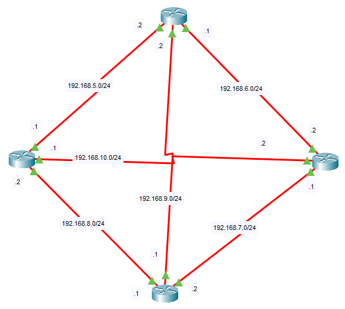
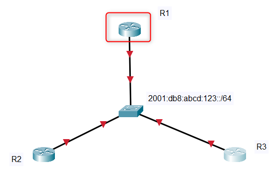
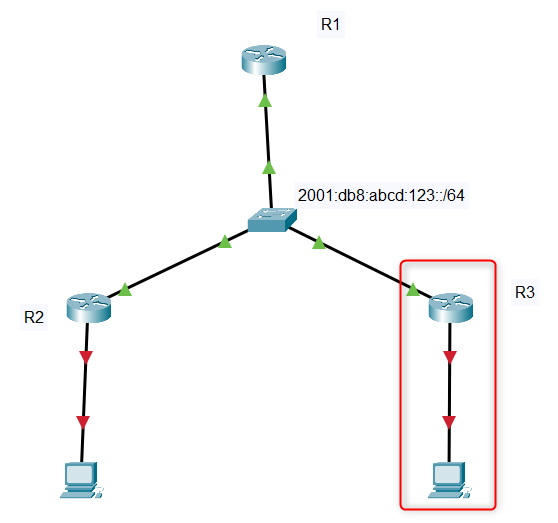

# Bases des réseaux

### Calcul de sous-réseaux

Découpage d'un réseau en sous-réseaux ci-dessous.

```
Exercice de découpage réseau

adresse reseau : 192.168.1.0/24

SR0 : 128 IPs
SR1 :  32 IPs
SR2 :  32 IPs
SR3 :  16 IPs
SR4 :   8 IPs

SR0
  masque = 192.168.1.10000000 = 192.168.1.128
  start  = 192.168.1.00000000 = 192.168.1.0
  end    = 192.168.1.01111111 = 192.168.1.127

SR1
  masque = 192.168.1.11100000 = 192.168.1.224
  start  = 192.168.1.10000000 = 192.168.1.128
  end    = 192.168.1.10011111 = 192.168.1.159

SR2
  masque = 192.168.1.11100000 = 192.168.1.222
  start  = 192.168.1.10100000 = 192.168.1.160
  end    = 192.168.1.10111111 = 192.168.1.191

SR3
  masque = 192.168.1.11110000 = 192.168.1.240
  start  = 192.168.1.11000000 = 192.168.1.192
  end    = 192.168.1.11001111 = 192.168.1.207

SR4
  masque = 192.168.1.11111000 = 192.168.1.248
  start  = 192.168.1.11010000 = 192.168.1.208
  end    = 192.168.1.11010111 = 192.168.1.215
```

Découpage d'un réseau en 32 sous-réseaux.

```
réseau  : 172.16.0.0
masqueb : 11111111 11111111 00000000 00000000
masqueh : 255 255 0 0

nombre de sous-réseaux : 32
nombre d'IP disponible : 2^16 = 65.536
nombre d'IP par sous-réseau = 65.536 / 32 = 2048 = 1000 0000 0000

SR0
    masque = 172.16.00001000.00000000 = 172.16.8.0
    start  = 172.16.00000000.00000000 = 172.16.0.0
    end    = 172.16.00000111.11111111 = 172.16.7.255
SR1
    masque = 172.16.00001000.00000000 = 172.16.8.0
    start  = 172.16.00001000.00000000 = 172.16.8.0
    end    = 172.16.00001111.11111111 = 172.16.15.255
SR2
    masque = 172.16.00001000.00000000 = 172.16.8.0
    start  = 172.16.00010000.00000000 = 172.16.16.0
    end    = 172.16.00010111.11111111 = 172.16.23.255

SR3 : 172.16.24.0 - 172.16.31.255
SR4 : 172.16.32.0 - 172.16.39.255

SRx : 172.16.(8*(x-1)).0 : 172.16.((8*(x-1)+7).255

172.16.(8*31).0 - 172.16.((8*31)+7).255
172.16.248.0 - 172.16.255.255

SR32 : 172.16.248.0 - 172.16.255.255
```

### End-point

Ajouter une adresse IP statique qui se trouve dans le réseau auquel il est connecté.\
Ajouter la passerelle par défaut

### Routage statique

#### Routes basiques

Une fois que le routeur possède son adresse IP, il est nécessaire de rediriger les paquets qui lui sont envoyés vers un autre routeur. Ci-dessous, on peut voir que les paquets ayant comme destination le réseau 192.168.99.0/24 est envoyé vers l'adresse 80.0.0.1 (qui est un routeur). Ce dernier le reçoit et redistribue les paquets vers leurs destinataires.

C'est possible de le faire graphiquement ou en ligne de commande.

```
Router>             | en
Router#             | conf t
Router(config)#     | ip route 192.168.99.0 255.255.255.0 80.0.0.1
```

<figure><figcaption></figcaption></figure>

#### Route par défaut

La route par défaut permettent de rediriger tous les paquets qui ne sont pas destinés au réseau du routeur vers le prochain saut. Ci-dessous, tous les paquets qui ne sont pas envoyés dans le réseau du routeur sont redirigés vers l'adresse IP `172.16.0.1`.

```
Router>             | en
Router#             | conf t
Router(config)#     | ip route 0.0.0.0 0.0.0.0 172.16.0.1
```

<figure><figcaption></figcaption></figure>

### Les VLANs

Pour ajouter des VLANs au switch, il faut d'abord créer les VLANs puis les assigner aux différents ports

#### Switch Layer 2

1. Passer en mode root :

```
Switch>     | enable
Switch#     | configure terminal
```

2. Créer les VLANs 10 et 20 :

```
Switch(config)#         | vlan 10
Switch(config-vlan)#    | name RH
Switch(config-vlan)#    | exit
                        |
Switch(config)#	        | vlan 20
Switch(config-vlan)#    | name COMPTA
Switch(config-vlan)#    | exit
```

3. Attribution des ports aux VLANs en mode `ACCESS` et assignation des ports `1-10` au VLAN 10 et des ports `11-20` au VLAN 20.

```
Switch(config)#             | interface range fastEthernet 0/1-10
Switch(config-if-range)#    | switchport mode access
Switch(config-if-range)#    | switchport access vlan 10
Switch(config-if-range)#    | exit
                            |
Switch(config)#             | interface range fastEthernet 0/11-20
Switch(config-if-range)#    | switchport mode access
Switch(config-if-range)#    | switchport access vlan 20
Switch(config-if-range)#    | exit
```

4. Ajout d'un port en mode `TRUNK` : pour faire passer tous les VLANs dans un seul fil entre les switchs, il faut configurer sur chacun d'eux un port en mode TRUNK. Il faut donc répéter les instructions sur le nombres de switchs qu'il faut configurer.

```
Switch>                 | enable
Switch#                 | configure terminal
Switch(config)#         | interface gigabitEthernet 0/1
Switch(config-if)#      | switchport mode trunk
Switch(config-if)#      | exit
                        |
Switch(config)#         | interface gigabitEthernet 0/2
Switch(config-if)#      | switchport mode trunk
Switch(config-if)#      | exit
```

#### Routeur

1.  Passer en mode configuration.

    ```
    Router>                 | enable
    Router#                 | configure terminal
    ```
2.  Allumer l'interface réseau physique.

    ```
    Router(config)#         | interface gigabitEthernet 0/0
    Router(config-if)#      | no shutdown
    ```
3.  Créer une interface réseau virtuelle "gigabitEthernet 0/0.1" à partir d'une physique "gigabitEthernet 0/0".

    ```
    Router(config)#	        | interface gigabit 0/0.1
    ```
4.  Ajouter l'encapsulation `IEEE` et mettre le numéro du VLAN.

    ```
    Router(config-subif)#   | encapsulation dot1Q 10
    ```
5.  Lier l'adresse IP et son masque à l'interface réseau virtuelle.

    ```
    Router(config-subif)#   | ip address 192.168.1.1 255.255.255.0
    Router(config-subif)#   | exit
    ```
6.  Sauvegarder les changements pour que le routeur conserve les modifications à son redémarrage.

    ```
    Router#                 | copy running-config startup-config
    ```

#### Switch Layer 3

La couche switch layer 3 est la couche distribution. Il sert principalement à relier les VLANs entre eux, lorsqu'il faut faire du routage, il renvoie la demande vers le routeur de la couche CORE.

* Il regroupe la fonctionnalité de switch et de routeur.
* Le switch est en bas et le routeur est en haut.
* La connection entre ce dernier et le switch L2 est un TRUNK.
* Il faut ajouter 2 composant d'alimentation pour allumer le switch L3, il est censé s'allumer automatiquement.
* Ne pas utiliser un assistant.
* Le Switch Layer 3 est par défaut en Layer 2, pour le passer en L3 il faut exécuter `iprouting`.

Avant d'entrer les commandes, le modèle choisi est le `3650-24PS` et possède 24 + 4 ports en gigabitEthernet. Il faut ajouter les modules d'alimentation afin d'allumer le switch.

<figure><figcaption></figcaption></figure>

Lorsque les blocs d'alimentation sont placés, le switch est mis sous tension et le terminal est disponible.

```
Switch>             | enable
Switch#             | configure terminal
Switch(config)#	    | configuration globale
```

1. Configuration de la partie `L2` du Switch Layer 3.

```
Switch(config)#         | interface gigabitEthernet 1/0/24  -> passer le nom du port
Switch(config-if)#      | switchport mode trunk             -> mettre ce port en mode TRUNK
Switch(config)#         | exit
                        |
Switch(config)#         | vlan 10
Switch(config-vlan)#    | name JAUNE
Switch(config-vlan)#    | exit
                        |
Switch(config)#         | vlan 20
Switch(config-vlan)#    | name VERT
Switch(config-vlan)#    | exit
```

2. Configuration de la partie `L3` du Switch Layer 3.

```
Switch(config)#     | ip routing                                -> activer le routage
                    |
Switch(config)#     | interface vlan 10                         -> création carte réseau virtuelle
Switch(config-if)#  | ip address 192.168.10.1 255.255.255.0     -> lier l'adresse à la carte réseau
Switch(config-if)#  | exit
                    |
Switch(config)#     | interface vlan 20
Switch(config-if)#  | ip address 192.168.20.1 255.255.255.0
Switch(config-if)#  | exit
```

3. Vérification des informations.

```
Switch(config)#     | show ip route		-> montre la table de routage
Switch(config)#     | show vlan
Switch(config)#     | show interfaces trunk
```

<figure><figcaption></figcaption></figure>

### Connexion `Switch L3` ↔ `routeur`

1. Aller sur le Switch L3.

```
Switch>             | enable
Switch#             | configure terminal
Switch(config)#     | interface gigabitEthernet 1/0/23
```

2. Le port lié à un switch ne peut pas recevoir d'adresse IP, il faut modifier sa configuration, aller dessus et configurer le port.

```
Switch(config-if)#  | no switchport                             -> ce n'est plus un port switch
                    |                                           -> on peut dorénavant lui assigner une adresse IP
Switch(config-if)#  | ip address 192.168.99.2 255.255.255.0
Switch(config-if)#  | no shutdown                               -> vérifier que l'interface est allumée
```

3. Aller sur le routeur et configurer le port.

```
Router>             | enable
Router#             | configure terminal
Router(config)#     | interface gigabitEthernet 0/0
Router(config-if)#  | ip address 192.168.99.1 255.255.255.0
Router(config-if)#  | no shutdown
Router(config-if)#  | exit
```

4. Il faut configurer 3 routes par défaut.

Sur le switch layer 3.

```
Switch>             | enable
Switch#             | configure terminal
Switch(config)#     | ip route 0.0.0.0 0.0.0.0 192.168.99.1     -> syntaxe par route par défaut : 0.0.0.0 0.0.0.0
                    |                                           -> redigirer vers : 192.168.99.1
Switch(config)#     | exit
```

Sur le routeur.

```
Router>             | enable
Router#             | conf t
Router(config)#     | ip route 192.168.10.0 255.255.255.0 192.168.99.2
Router(config)#     | ip route 192.168.20.0 255.255.255.0 192.168.99.2
```

Vérifier le résultat avec `show ip route`.

<figure><figcaption></figcaption></figure>

5. Configuration des access lists

```
ip access-list standard <number>
permit 192.168.1.0 0.0.0.255
ip nat inside source list <number> interface gigabitEthernet 0/1 overload
redigirer sur une certaine adresse locale lorsque je me connecte sur 70.0.0.3
ip nat inside source static 192.168.1.2 70.0.0.3
```

Aller sur l'interface réseau et spécifier laquelle est externe et laquelle est interne.

```
interface gigabitEthernet0/0
ip nat inside
ip nat ouside
```

Pour voir les access-lists.

```
show ip access-list
```

Pour supprimer une access-list

```
no ip access-list standard <number>
```

### Les topologies

#### Campus

* La couche d'accès (Switch L2)
* La couche distribution (Switch L3)
* La couche core (Routeur)

#### Réseau maillé

Ajouter un routeur `1941`, l'éteindre et ajouter les composants `HWIC-2T`.

<figure><figcaption></figcaption></figure>

Prendre les câbles `serial`, ils simulent des câbles WAN et permettent de faire varier le flux via une commande pour simuler de la fibre optique, un VPN, etc.

<figure><figcaption></figcaption></figure>

### Routeur en IPv6

Configurer les adresses IPv6 pour chaque routeur.

<figure><figcaption></figcaption></figure>

```
en
conf t
ipv6 unicast-routing
interface gigabitEthernet 0/1
ipv6 address 2001:db8:abcd:123::<ROUTER-NUMBER>/64
ipv6 address fe80::<ROUTER-NUMBER> link-local
no shutdown
```

```
show ipv6 interface brief
show ipv6 route
```

Je teste la connexion entre les routeurs : `ping 2001:db8:abcd:123::2`. Configuration de la connexion entre le routeur et la machine.

<figure><figcaption></figcaption></figure>

```
en
conf t
interface gigabitEthernet 0/0
ipv6 address 2001::db8:abcd:1::1/64
ipv6 address fe80::1 link-local
no shutdown
```
