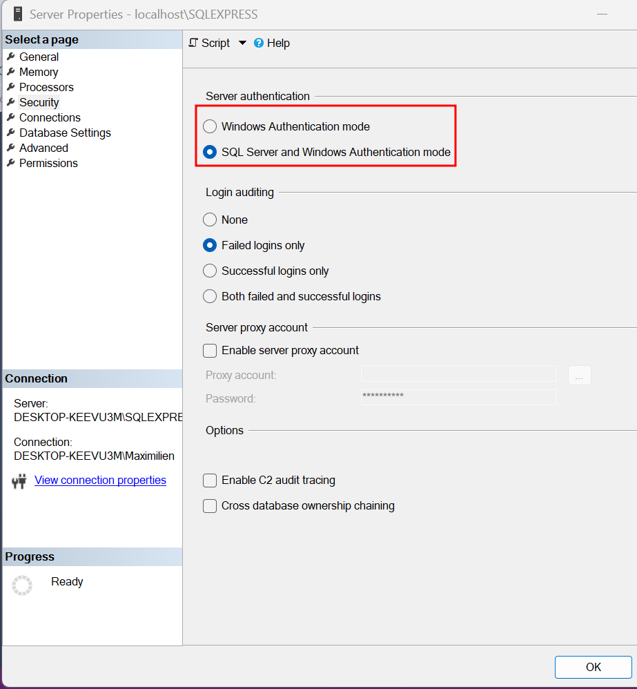

# PGBD

OLTP : Online Transactional Processing

OLAP : Online Analytical Processing

Une base de données est consituée de 2 fichier

* MDF : fichier de base.
* LDF : lors d'une modification (transaction), les données se mettent dans ce fichier pour pouvoir revenir en arrière s'il y a un soucis. Un fois la transaction terminée, les données dans ce fichier sont bougées dans le fichier de base.

Collation est le type d'encodage dans SQL.

<figure><figcaption></figcaption></figure>

\-> Activer l'authentification SQL Server et Windows Authentication.

Database -> System Database : ces base de données ne doivent pas être supprimées, ce sont des db systeme qui gèrent l'instance de SQL server.

Pour créer une base de donnée clic-droit sur Database.

Nvarchar s'adapte est utilisé pour des descriptions est c'est de l'unicode (16 bits), le varchar est codé sur 8 bits. Nous utilisons le nvarchar pour garder les caractères spéciaux et dépasser les caractères ASCII.

Autoriser la modification d'une table qui implique le DROP de cette table

<figure><figcaption></figcaption></figure>
