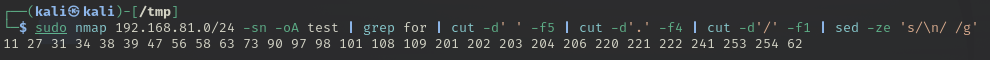
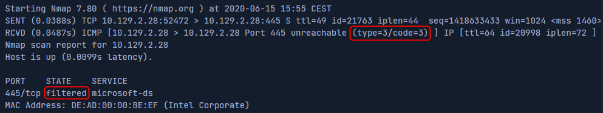

# Nmap

## Introduction

### Use Cases

* Audit the security aspects of networks
* Simulate penetration tests
* Check firewall and IDS settings and configurations
* Types of possible connections
* Network mapping
* Response analysis
* Identify open ports
* Vulnerability assessment as well

### Architecture

* Host discovery
* Port scanning
* Service enumeration & detection
* OS detection
* Scriptable interaction with the target service

## Host Discovery

### Network Range

```bash
sudo nmap 10.129.2.0/24 -sn -oA tnet | grep for | cut -d ' ' -f 5
sudo nmap 192.168.81.27 -sn -oA host
# -PE                : scan by using ICMP Echo Requests against the targets
# --packet-trace     : shows all packets sent & received
sudo nmap 192.168.81.27 -sn -oA host -PE --packet-trace
# --reason           : determine the target is alive
sudo nmap 192.168.81.27 -sn -oA host -PE --reason
# --disable-arp-ping : disable ARP requests
sudo nmap 192.168.81.27 -sn -oA host -PE --packet-trace --disable-arp-ping

```

<figure><figcaption></figcaption></figure>


You can find the Operating system with the TTL ICMP response (by example, TTL=128 is Windows).


## Host & Port Scanning

### Port States

* <mark style="color:green;">open</mark> : the connection the scanned port has been established (TPC, UDP or SCTP).
* <mark style="color:red;">closed</mark> : the TCP indicates the packet we received contains an **RST** flag.
* <mark style="color:yellow;">filtered</mark> : there is no response back from the target for the scanned port.
* <mark style="color:yellow;">unfiltered</mark> : the port is accessible but it cannot be determined if it's open or closed.
* <mark style="color:green;">open</mark>|<mark style="color:yellow;">filtered</mark> : a firewall may protect the port, nmap doesn't get a response for this port.
* <mark style="color:red;">closed</mark>|<mark style="color:yellow;">filtered</mark> : cannot determine of the port is closed or filtered by a firewall.

```bash
# --top-ports : scan top X ports
sudo nmap 127.0.0.1 --top-ports=10
# -n          : disable DNS resolution
sudo nmap 127.0.0.1 -p 22 --packet-trace -Pn -n --disable-arp-ping
```

Send a packet from `127.0.0.1:38463` to `127.0.0.1:22` , the **S** means SYN flag.

| Letter | Name  |
| ------ | ----- |
| S      | SYN   |
| R      | RESET |
| A      | ACK   |

OPEN

<figure><figcaption></figcaption></figure>

FILTERED

<figure><figcaption></figcaption></figure>

UDP scan

```bash
sudo nmap 10.129.2.28 -sU -Pn -n --disable-arp-ping --packet-trace -p 137 --reason 
# get additional available information from the open port (service version)
sudo nmap 10.129.2.28 -Pn -n --disable-arp-ping --packet-trace -p 445 --reason  -sV
```

## Saving Results

```bash
# -oA        : output all formats
sudo nmap 127.0.0.1 -p- -oA target
#              render XML to HTML page
xsltprox target.xml -o target.html
```

## Service Enumeration

```bash
sudo nmap 10.129.2.49 -p 80 -sV
# --stats-every    : print statistics every X seconds/minutes
sudo nmap 10.129.2.49 -p- -sV --stats-every=5s
sudo nmap 10.129.2.49 -p- -sV --stats-every=5m
# -v/-vv           : increase verbosity
sudo nmap 10.129.2.28 -p- -sV -v
sudo nmap 10.129.2.28 -p- -sV -vv
```

## Nmap Scripting Engine

