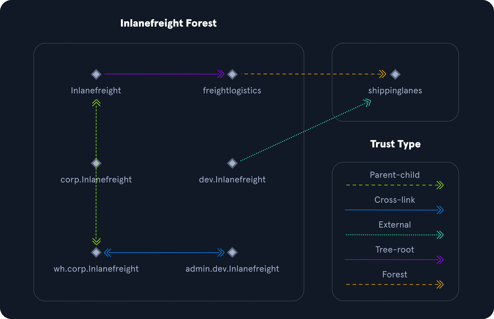
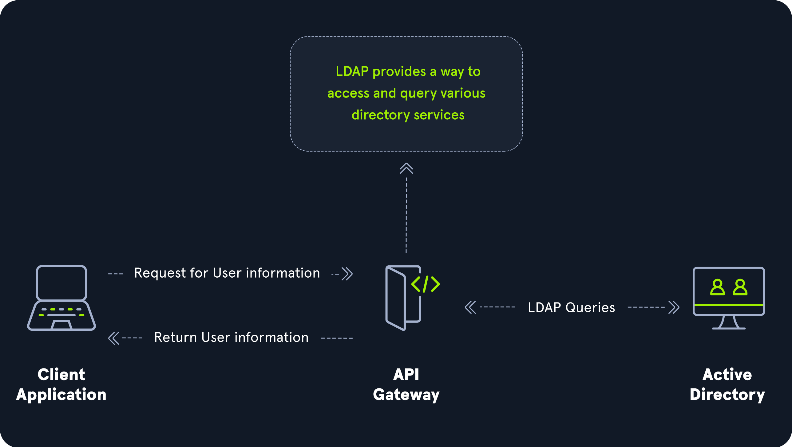
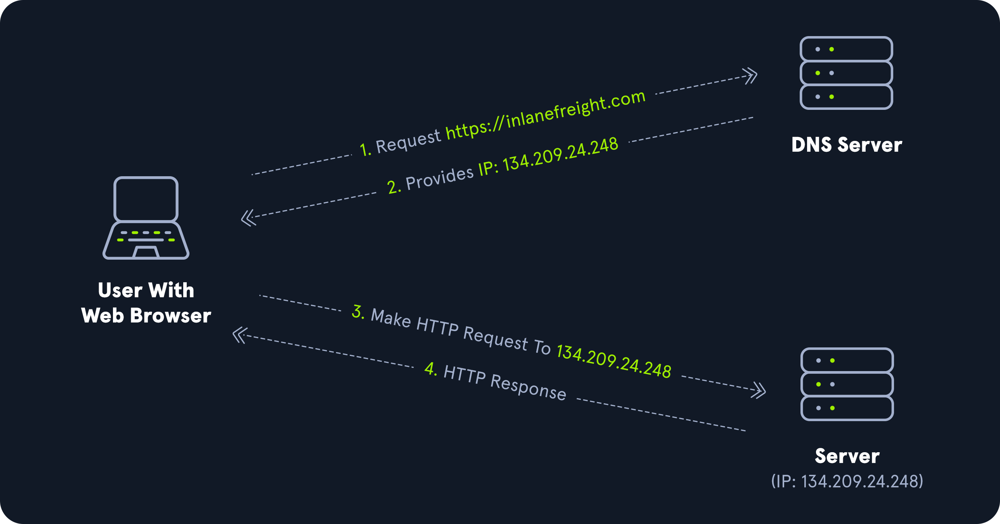

# Active Directory

## Introduction

The Active Directory (AD) contains :

* Domain Computers
* Domain Users
* Domain Group Information
* Organizational Units (OUs)
* Default Domain Policy
* Functional Domain Levels
* Password Policy
* Group Policy Objects (GPOs)
* Domain Trusts
* Access Control Lists (ACLs)
* ...

The root domain is "The Forest" and the subdomains are the children. The AD is essentially a large database.

```
INLANEFREIGHT.LOCAL/
├── ADMIN.INLANEFREIGHT.LOCAL
│   ├── GPOs
│   └── OU
│       └── EMPLOYEES
│           ├── COMPUTERS
│           │   └── FILE01
│           ├── GROUPS
│           │   └── HQ Staff
│           └── USERS
│               └── barbara.jones
├── CORP.INLANEFREIGHT.LOCAL
└── DEV.INLANEFREIGHT.LOCAL
```

## Terminology

| Word                | Description                                                                                                                                                                                                                 |
| ------------------- | --------------------------------------------------------------------------------------------------------------------------------------------------------------------------------------------------------------------------- |
| Object              | Any ressource present within an AD environment (OUs, printers, users, domain controllers, etc.).                                                                                                                            |
| Attributes          | Used to define characteristics of the given object.                                                                                                                                                                         |
| Schema              | Defines what types of objects can exist in the AD database and their associated attributes.                                                                                                                                 |
| Domain              | Logical group of objects such as computers, users, OUs, groups, etc.                                                                                                                                                        |
| Forest              | Collection of AD domains. This is the topmost container.                                                                                                                                                                    |
| Tree                | Collection of AD domains that begins at a single root domain.                                                                                                                                                               |
| Container           | Holds other objects and have a defined place in the directory subtree hierarchy.                                                                                                                                            |
| Leaf                | Does not contain other objects and are found at the end of the subtree hierarchy.                                                                                                                                           |
| GUID                | (Global Unique Identifier) Similar to a MAC address, every single object has a unique GUID.                                                                                                                                 |
| Security Principals | Anything that the operating system can authenticate, including users, computer accounts or even threads/processes that run in the context of a user or computer account.                                                    |
| SID                 | (Security IDentifier) Unique identifier for a security principal or security group.                                                                                                                                         |
| DN                  | (Distinguished Name) The full path of an object in AD.                                                                                                                                                                      |
| RDN                 | (Relative Dinstinguished Name) Single component of the DN.                                                                                                                                                                  |
| sAMAccountName      | The user's logon name.                                                                                                                                                                                                      |
| userPrincipalName   | Another way to identify users in the AD : `bjones@inlanefreight.local`.                                                                                                                                                     |
| FSMO Roles          | (Flexible Single Master Operation) The main domain controller.                                                                                                                                                              |
| GC                  | (Global Catalog) Domain controller that stores copies of all objects in an active directory forest.                                                                                                                         |
| RODC                | (Read-Only Domain Controller) Active Directory Database that allows administrator role separation, reduce replication traffix in the environment, and prevent SYSVOL modifications from being replicated to other DCs.      |
| Replication         | Happens in AD when AD objects are updated and transferred from one DC to another.                                                                                                                                           |
| SPN                 | (Service Principal Name) Identifies a service instance, it associates an instance of a service with a logon account, allowing a client to request the service without needing to know the account name.                     |
| GPO                 | (Group Policy Object) Contains local file system settings or AD settings. It can be applied to both user and computer objects or OU (Organization Unit).                                                                    |
| ACL                 | (Access Control List) Ordered collection of ACEs that apply to an object.                                                                                                                                                   |
| ACE                 | (Access Control Entry) Identifies a trustee and lists the access rights, denied, or audited.                                                                                                                                |
| DACL                | (Discretionary Access Control List) Type of ACL that defines which security principles are granted or denied access to an object.                                                                                           |
| SACL                | (System Access Control List) Allows for administrators to log access attempts that are made to secured objects.                                                                                                             |
| FQDN                | (Fully Qualified Domain Name) The complete name for a specific computer of host : `DC01.INLANEFREIGHT.LOCAL`.                                                                                                               |
| Tombstone           | The container object in AD that holds deleted AD objects. Objects can be recovered but their attributes are lost.                                                                                                           |
| AD Recycle Bin      | Can restore deleted objects with their attributes. It avoids restoring backup or rebooting DC.                                                                                                                              |
| SYSVOL              | Store copies of public files in the domain such as system policies, Group Policy setting, logon/logoff scripts, and often contains other types of scripts that are executed to perform various tasks in the AD environment. |
| AdminSDHolder       | Container that holds the Security Descriptor applied to members of protected groups. It checks the ACL rules and their applications to members of protected groups.                                                         |
| SDProp              | Process that checks members of protected groups to ensure that the correct ACL is applied to them.                                                                                                                          |
| dsHeuristics        | If a group is excluded via the hdHeuristics attribute, then any changes that affect it will not be reverted when the SDProp process runs.                                                                                   |
| adminCount          | Determines whether or not the SDProp process protects a user.                                                                                                                                                               |
| ADUC                | (Active Directory Users and Computers) GUI console used for managing users, groups, and contacts in the AD.                                                                                                                 |
| ADSI Edit           | GUI tool, it provides access to far more than is available in ADUC.                                                                                                                                                         |
| sIDHistory          | Attribute that holds any SIDs that an object was assigned previously.                                                                                                                                                       |
| NTDS.DIT            | The heart of an AD. It is stored on a DC at `C:\Windows\NTDS\` and is a database that stores AD data such as information about users and group objects, membership, etc.                                                    |
| MSBROWSE            | Old version of SMB (Simple Message Block).                                                                                                                                                                                  |

## Active Directory Objects

| Word                         | Description                                                                     |
| ---------------------------- | ------------------------------------------------------------------------------- |
| Users                        | Leaf objects                                                                    |
| Contacts                     | Leaf objects                                                                    |
| Printers                     | Leaf objects                                                                    |
| Computers                    | Leaf objects                                                                    |
| Shared folders               |                                                                                 |
| Groups                       | Container object                                                                |
| Organizinational Units (OUs) |                                                                                 |
| Domain                       |                                                                                 |
| Domain Controllers           |                                                                                 |
| Sites                        | A set of computers across one or more subnets connected using high-speed links. |
| Built-in                     | Holds default groups in an AD domain.                                           |
| Foreign Security Principals  | Stores SID of external domain objects.                                          |

## Active Directory Functionality

### FSMO Roles

| Roles                    | Description                                                                                                                                                                                                                                                                                                        |
| ------------------------ | ------------------------------------------------------------------------------------------------------------------------------------------------------------------------------------------------------------------------------------------------------------------------------------------------------------------ |
| Schema Master            | This role manages the read/write copy of the AD schema, which defines all attributes that can apply to an object in AD.                                                                                                                                                                                            |
| Domain Naming Master     | Manages domain names and ensures that two domains of the same name are not created in the same forest.                                                                                                                                                                                                             |
| Relative ID (RID) Master | The RID Master assigns blocks of RIDs to other DCs within the domain that can be used for new objects. The RID Master helps ensure that multiple objects are not assigned the same SID. Domain object SIDs are the domain SID combined with the RID number assigned to the object to make the unique SID.          |
| PDC Emulator             | The host with this role would be the authoritative DC in the domain and respond to authentication requests, password changes, and manage Group Policy Objects (GPOs). The PDC Emulator also maintains time within the domain.                                                                                      |
| Infrastructure Master    | This role translates GUIDs, SIDs, and DNs between domains. This role is used in organizations with multiple domains in a single forest. The Infrastructure Master helps them to communicate. If this role is not functioning properly, Access Control Lists (ACLs) will show SIDs instead of fully resolved names. |

### Trusts

| Parent-child | Domains within the same forest. The child domain has a two-way transitive trust with the parent domain.                                                                |
| ------------ | ---------------------------------------------------------------------------------------------------------------------------------------------------------------------- |
| Cross-link   | a trust between child domains to speed up authentication.                                                                                                              |
| External     | A non-transitive trust between two separate domains in separate forests which are not already joined by a forest trust. This type of trust utilizes SID filtering.     |
| Tree-root    | a two-way transitive trust between a forest root domain and a new tree root domain. They are created by design when you set up a new tree root domain within a forest. |
| Forest       | a transitive trust between two forest root domains.                                                                                                                    |

<figure><figcaption></figcaption></figure>

* Trusts can be transitive or non-transitive.
* A transitive trust means that trust is extended to objects that the child domain trusts.
* In a non-transitive trust, only the child domain itself is trusted.
* Trusts can be set up to be one-way or two-way (bidirectional).
* In bidirectional trusts, users from both trusting domains can access resources.
* In a one-way trust, only users in a trusted domain can access resources in a trusting domain, not vice-versa. The direction of trust is opposite to the direction of access.

## Domain Functional Level

| Domain Functional Level | Features Available                                                                                                                                                       | Supported Domain Controller Operating Systems                                                                 |
| ----------------------- | ------------------------------------------------------------------------------------------------------------------------------------------------------------------------ | ------------------------------------------------------------------------------------------------------------- |
| Windows 2000 native     | Universal groups for distribution and security groups, group nesting, group conversion (between security and distribution and security groups), SID history.             | Windows Server 2008 R2, Windows Server 2008, Windows Server 2003, Windows 2000                                |
| Windows Server 2003     | Netdom.exe domain management tool, lastLogonTimestamp attribute introduced, well-known users and computers containers, constrained delegation, selective authentication. | Windows Server 2012 R2, Windows Server 2012, Windows Server 2008 R2, Windows Server 2008, Windows Server 2003 |
| Windows Server 2008     | Distributed File System (DFS) replication support, Advanced Encryption Standard (AES 128 and AES 256) support for the Kerberos protocol, Fine-grained password policies  | Windows Server 2012 R2, Windows Server 2012, Windows Server 2008 R2, Windows Server 2008                      |
| Windows Server 2008 R2  | Authentication mechanism assurance, Managed Service Accounts                                                                                                             | Windows Server 2012 R2, Windows Server 2012, Windows Server 2008 R2                                           |
| Windows Server 2012     | KDC support for claims, compound authentication, and Kerberos armoring                                                                                                   | Windows Server 2012 R2, Windows Server 2012                                                                   |
| Windows Server 2012 R2  | Extra protections for members of the Protected Users group, Authentication Policies, Authentication Policy Silos                                                         | Windows Server 2012 R2                                                                                        |
| Windows Server 2016     | Smart card required for interactive logon new Kerberos features and new credential protection features                                                                   | Windows Server 2019 and Windows Server 2016                                                                   |

## Kerberos

<figure><figcaption></figcaption></figure>

## LDAP

<figure><figcaption></figcaption></figure>

## DNS

<figure><figcaption></figcaption></figure>

## MSRPC

* **lsarpc :** a set of RPC calls to the Local Security Authority (LSA) system which manages the local security policy on a computer, controls the audit policy, and provides interactive authentication services. LSARPC is used to perform management on domain security policies.
* **netlogon :** netlogon is a Windows process used to authenticate users and other services in the domain environment. It is a service that continuously runs in the background.
* **samr : r**emote SAM (samr) provides management functionality for the domain account database, storing information about users and groups. IT administrators use the protocol to manage users, groups, and computers by enabling admins to create, read, update, and delete information about security principles. Attackers (and pentesters) can use the samr protocol to perform reconnaissance about the internal domain using tools such as BloodHound to visually map out the AD network and create "attack paths" to illustrate visually how administrative access or full domain compromise could be achieved. Organizations can protect against this type of reconnaissance by changing a Windows registry key to only allow administrators to perform remote SAM queries since, by default, all authenticated domain users can make these queries to gather a considerable amount of information about the AD domain.
* **drsuapi :** it is the Microsoft API that implements the Directory Replication Service (DRS) Remote Protocol which is used to perform replication-related tasks across Domain Controllers in a multi-DC environment. Attackers can utilize drsuapi to create a copy of the Active Directory domain database (NTDS.dit) file to retrieve password hashes for all accounts in the domain, which can then be used to perform Pass-the-Hash attacks to access more systems or cracked offline using a tool such as Hashcat to obtain the cleartext password to log in to systems using remote management protocols such as Remote Desktop (RDP) and WinRM.

## Cheat sheet IAD

### Basic

```bash
xfreerdp /v:<IP> /u:<User> /p:<Password> ping <IP>
```

### General

```powershell
# return a list of loaded PowerShell Modules
Get-Module
# lists commands for the module specified
Get-Command -Module ActiveDirectory
# help syntax for the cmd-let specified
Get-Help <cmd-let>                  
# activeDirectory imports the active directory module
Import-Module                       
```

### User

```powershell
# add a user to AD and set attributes
New-ADUser -Name "first last" -Accountpassword (Read-Host -AsSecureString "Super$ecurePassword!") -Enabled $true -OtherAttributes @{'title'="Analyst";'mail'="f.last@domain.com"}
# removes a user from AD with the identity of 'name'
Remove-ADUser -Identity <name>
# unlocks a user account with the identity of 'name'
Unlock-ADAccount -Identity <name>
# set the password of an AD user to the password specified
Set-ADAccountPassword -Identity <'name'> -Reset -NewPassword (ConvertTo-SecureString -AsPlainText "NewP@ssw0rdReset!" -Force)
# force a user to change their password at next logon attempt.
Set-ADUser -Identity amasters -ChangePasswordAtLogon $true
```

### Group

```powershell
# create a new AD OU container named "name" in the path specified
New-ADOrganizationalUnit -Name "name" -Path "OU=folder,DC=domain,DC=local"
# create a new security group named "name" with the accompanying attributes
New-ADGroup -Name "name" -SamAccountName analysts -GroupCategory Security -GroupScope Global -DisplayName "Security Analysts" -Path "CN=Users,DC=domain,DC=local" -Description "Members of this group are Security Analysts under the IT OU"
# add an AD user to the group specified
Add-ADGroupMember -Identity 'group name' -Members 'ACepheus,OStarchaser,ACallisto'
```

### GPO

```powershell
# copy a GPO for use as a new GPO with a target name of "name"
Copy-GPO -SourceName "GPO to copy" -TargetName "Name"
# create a new GPO and link it to a specific OU or security group
New-GPLink -Name "Security Analysts Control" -Target "ou=Security Analysts,ou=IT,OU=HQ-NYC,OU=Employees,OU=Corp,dc=INLANEFREIGHT,dc=LOCAL" -LinkEnabled Yes 
# link an existing GPO for use to a specific OU or security group
Set-GPLink -Name "Security Analysts Control" -Target "ou=Security Analysts,ou=IT,OU=HQ-NYC,OU=Employees,OU=Corp,dc=INLANEFREIGHT,dc=LOCAL" -LinkEnabled Yes
```

### Computer

```powershell
# add a new computer to the domain using the credentials specified
Add-Computer -DomainName 'INLANEFREIGHT.LOCAL' -Credential 'INLANEFREIGHT\HTB-student_adm' -Restart
# remotely add a computer to a domain
Add-Computer -ComputerName 'name' -LocalCredential '.\localuser' -DomainName 'INLANEFREIGHT.LOCAL' -Credential 'INLANEFREIGHT\htb-student_adm' -Restart
# check for a computer named "name" and view its properties
Get-ADComputer -Identity "name" -Properties * | select CN,CanonicalName,IPv4Address
```

## &#x20;References

* [Microsoft](https://docs.microsoft.com/en-us/windows-server/identity/ad-ds/get-started/virtual-dc/active-directory-domain-services-overview)

\
