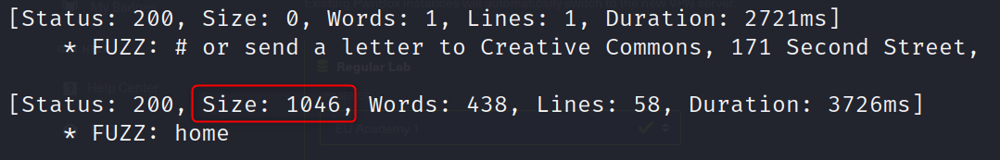
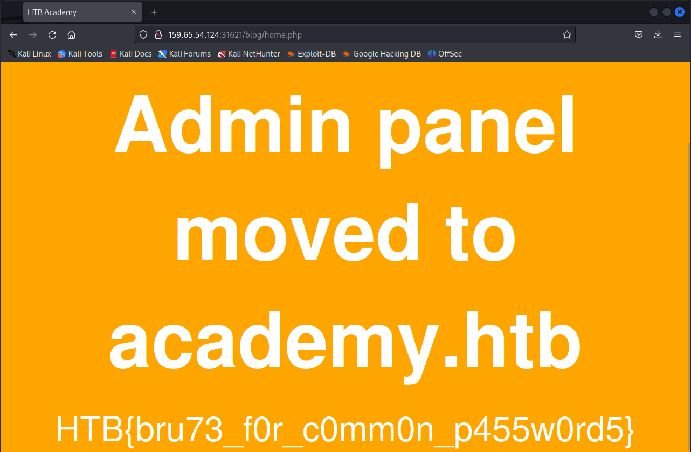
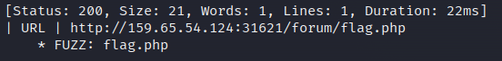
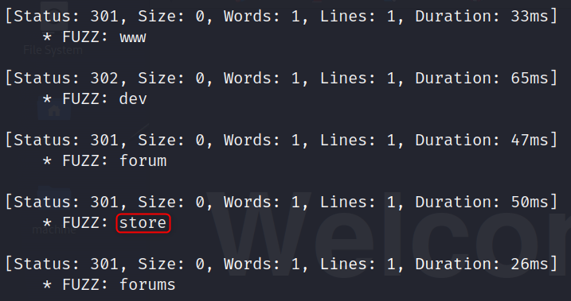
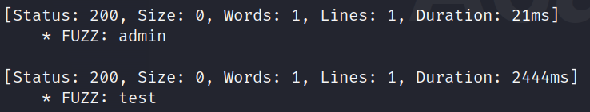
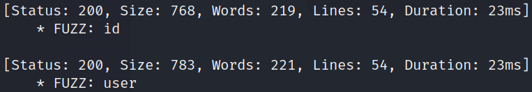

---
layout:
  title:
    visible: true
  description:
    visible: false
  tableOfContents:
    visible: true
  outline:
    visible: true
  pagination:
    visible: true
---

# FUFF - Web Apps

## Installation

Github repository : [https://github.com/ffuf/ffuf.git](https://github.com/ffuf/ffuf.git).\
Install with apt.

```bash
sudo apt install ffuf -y
```

## Basic Fuzzing

### Directory

The `:FUZZ` right after the wordlist file assigns the file to the keyword `FUZZ` that you can use in the url.

```bash
git clone https://github.com/danielmiessler/SecLists
ffuf -w SecLists/Discovery/Web-Content/directory-list-2.3-small.txt:FUZZ
ffuf -w directory-list-2.3-small.txt:FUZZ -u http://127.0.0.1:8080/FUZZ
```

Exercise : in addition to the directory we found above, there is another directory that can be found. What is it?

```bash
ffuf -w SecLists/Discovery/Web-Content/directory-list-2.3-small.txt:FUZZ \
     -u http://159.65.54.124:31621/FUZZ
```

Answer : `forum`

### Page

To check the extension, the worldlist is `SecLists/Discovery/Web-Content/web-extensions.txt`. These words already contain the "." thus you don't have to write it in the url.

```bash
ffuf -w SecLists/Discovery/Web-Content/web-extensions.txt \
     -u http://159.65.54.124:31621/blog/indexFUZZ
```

Ffuf found the extension `.php` with the status code 200. If you find the file extension, you can now find all `.php` hiddent files exposed.

```bash
ffuf -w SecLists/Discovery/Web-Content/directory-list-2.3-small.txt \
     -u http://159.65.54.124:31621/blog/FUZZ.php
```

Ffuf found the file `home.php` and it isn't empty :

<figure><figcaption></figcaption></figure>

If you search on this page, you can find the flag.

<figure><figcaption></figcaption></figure>

### Recursive

It's possible to execute a recursive fuzzing with the next command :

```bash
ffuf -w SecLists/Discovery/Web-Content/directory-list-2.3-small.txt \
     -u http://159.65.54.124:31621/FUZZ \
     -recursion \            # enable ffuf recursion
     -recursion-depth 1 \    # set the recursion depth to level 1
     -e .php \               # add the extension file ".php"
     -v                      # display the full url
```

<figure><figcaption></figcaption></figure>

Ffuf found the url [http://159.65.54.124:31621/forum/flag.php](http://159.65.54.124:31621/forum/flag.php) and the web page contains the flag.

## Domain Fuzzing

### DNS Record

Add the local domain in the `/etc/hosts` :

```bash
echo "159.65.54.124 academy.htb" | sudo tee -a /etc/hosts
```

Then you can browse on the website [http://academy.htb:31621](http://academy.htb:31621/).

### Sub-domain Fuzzing

Here you can fuzz public sub-domains. The subdomain wordlists are :

* subdomains-top1million-5000.txt
* subdomains-top1million-20000.txt
* subdomains-top1million-10000.txt

```bash
ffuf -w SecLists/Discovery/DNS/subdomains-top1million-5000.txt:FUZZ \
     -u https://FUZZ.hackthebox.eu
```

There are multiple subdomains and the Swag Store is the below one :

<figure><figcaption></figcaption></figure>

Thus the url is [https://store.hackthebox.eu](https://store.hackthebox.eu/) and the FQDN is `store.hackthebox.eu`.

### VHOST Fuzzing

If the sub-domain is not public, you must use the VHOST method. You will craft the header parameter `HOST` and add the keyword the enumerate the wordlist you mention :

```bash
ffuf -w SecLists/Discovery/DNS/subdomains-top1million-5000.txt:FUZZ \
     -u http://academy.htb:31621 \
     -H "Host: FUZZ.academy.htb"
```

There are a lot of status code 200...

### Filtering

With the previous command, you got a lot of 200 status code responses and their size are always 986. Thus you can filter them with the flag `-fs 986` (Filter Size) :

```bash
ffuf -w SecLists/Discovery/DNS/subdomains-top1million-5000.txt:FUZZ \
     -u http://academy.htb:31621 \
     -H "Host: FUZZ.academy.htb" \
     -fs 986
```

That's much more clear, there are only 2 sub-domains : `admin.academy.htb` and `test.academy.htb`.

<figure><figcaption></figcaption></figure>

Once you find a subdomain, add it into the `/etc/hosts` :

```bash
echo "159.65.54.124 admin.academy.htb" | sudo tee -a /etc/hosts
```

## Parameter Fuzzing

### GET

On the url [http://admin.academy.htb/admin/admin.php](http://admin.academy.htb/admin/admin.php), you are notified that you can't access to the flag. The wordlist file is `burp-parameter-names.txt`. Try to find a parameter to send in the url.

```bash
ffuf -w SecLists/Discovery/Web-Content/burp-parameter-names.txt:FUZZ \
     -u 'http://admin.academy.htb:30350/admin/admin.php?FUZZ=key' \
     -fs 798
```

The answer is the parameter `user`.

### POST

For the post request, you must pass the parameter in the body request, not in the url. You can pass them by adding the header `Content-Type: application/x-www-form-urlencoded` and add the body like the following command.

```bash
ffuf -w SecLists/Discovery/Web-Content/burp-parameter-names.txt:FUZZ \
     -u http://admin.academy.htb:30350/admin/admin.php \
     -X POST \
     -d 'FUZZ=key' \
     -H 'Content-Type: application/x-www-form-urlencoded' \
     -fs 798
```

<div data-full-width="false">

<figure><figcaption></figcaption></figure>

</div>

The answer are `user` and `id`. The curl command to check the POST response.

```bash
curl http://admin.academy.htb:30350/admin/admin.php \
  -X POST \
  -d 'id=key' \
  -H 'Content-Type: application/x-www-form-urlencoded'
```

And it returns `Invalid id!`. Build a crafted wordlist with the bash command.

```bash
for i in $(seq 1 1000); do echo $i >> ids.txt; done
```

And execute the Ffuf tool.

```bash
ffuf -w ids.txt:FUZZ 
     -u http://admin.academy.htb:30350 
     -X POST 
     -d 'id=FUZZ' 
     -H 'Content-Type: application/x-www-form-urlencoded'
     -fs 768
```

The answer is `id=73`.

```bash
curl http://admin.academy.htb:30350/admin/admin.php \
  -X POST \
  -d 'id=73' \
  -H 'Content-Type: application/x-www-form-urlencoded'
```

The flag is in the response content.

## Skill Assessment

Fuzz with the VHOST method :

```bash
ffuf -w SecLists/Discovery/DNS/subdomains-top1million-5000.txt:FUZZ \
     -u http://academy.htb:30302 \
     -H 'Host: FUZZ.academy.htb' \
     -fs 985
```

There are 3 subdomains :

* archive.academy.htb
* faculty.academy.htb
* test.academy.htb

To find all extensions (including subdomains), you must have 2 wordlists.


```
academy.htb
archive.academy.htb
faculty.academy.htb
test.academy.htb
```


```
ffuf -w SecLists/Discovery/Web-Content/directory-list-2.3-small.txt:FUZZ1 
     -w subdomains.txt:FUZZ2
     -u http://FUZZ2/indexFUZZ1
```

And the second one stored in `/usr/share/seclists/Discovery/Web-Content/web-extensions.txt`. The different file extensions are :

* php
* php7
* phps

To find the extension type, run :

```bash
ffuf -w SecLists/Discovery/Web-Content/web-extensions.txt:FUZZ \
     -u http://academy.htb:30302/indexFUZZ
```

The allowed extension is `.php` thus you can search all php files.

```bash
ffuf -w SecLists/Discovery/Web-Content/ \
     -u http://academy.htb:30302/FUZZ.php
```

To find the specific file with "You don't have access!" :

```bash
ffuf -w SecLists/Discovery/Web-Content/directory-list-2.3-small.txt:FUZZ \
     -u http://faculty.academy.htb:30302/FUZZ \
     -fs 0 \
     -recursion \
     -recursion-depth 2 \
     -e .php7 \
     -v
```

The answer is http://faculty.academy.htb:PORT/courses/linux-security.php7. Check accepted parameters with curl.

* GET request :

```bash
ffuf -w SecLists/Discovery/Web-Content/burp-parameter-names.txt:FUZZ \
     -u http://faculty.academy.htb:30302/courses/linux-security.php7?FUZZ=key \
     -fs 774
```

* POST request :

```bash
ffuf -w SecLists/Discovery/Web-Content/burp-parameter-names.txt:FUZZ \ 
     -u http://faculty.academy.htb:30302/courses/linux-security.php7 \
     -X POST \
     -H "Content-Type: application/x-www-form-urlencoded" \
     -d 'FUZZ=key' \
     -fs 774
```

The GET returns `user` parameter and POST returns `user` and `username` parameters. Let's fuzz the parameter `username` with the POST request :

```bash
ffuf -w SecLists/Usernames/Names/names.txt:FUZZ \
     -u http://faculty.academy.htb:30302/courses/linux-security.php7 \
     -X POST \
     -H "Content-Type: application/x-www-form-urlencoded" \
     -d 'username=FUZZ' \
     -fs 781
```

The output is the username `harry`. Check the response with curl and `username=harry` in parameters.

```bash
curl http://faculty.academy.htb:30302/courses/linux-security.php7 \ 
  -X POST \
  -H "Content-Type: application/x-www-form-urlencoded" \
  -d 'username=harry'
```

The flag is in the response.
