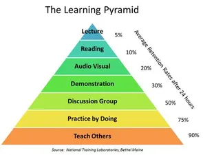

# Learning Process

## Documentation

> Do some research and find examples of penetration test reports and pick out the essential features. Get an overview of the following:
>
> 1. What topics have been covered?
> 2. How are they structured?
> 3. How are they presented?

Sources : [Offensive Security](https://www.offsec.com/reports/sample-penetration-testing-report.pdf)

There is a structure with 2 levels, the higher one to categorize report step and the second one to organize the steps. There are a lot of pictures of the code and the attacker interface. The reports only describes pictures if some information are not mentionned. The sentences are complementary.

### Executive summary

### Attack Narrative

Explain step by step how I discovered the problem :

* Remote System Discovery
* Admin webserver interface compromise
* Interactive shell to admin server
* Administrative privilege escalation
* Java client attacks
* Escalation to local administrator
* Deep packet inspection bypass
* ...

## Learning Efficiency

> Collect as much information as possible about the "Learning Pyramid" and create an overview of it. Analyze your research process and document it. We will need it later.

The Pyramid of Learning is also called "the cone of learning" or other synonyms... The Learning pyramid is subdivised in 7 groups :

| Percentage | Type of learning    | State   |
| ---------- | ------------------- | ------- |
| `90 %`     | teach               | active  |
| `75 %`     | practice            | active  |
| `50 %`     | discuss             | active  |
| `30 %`     | watch demonstration | passive |
| `20 %`     | watch audiovisual   | passive |
| `10 %`     | read                | passive |
| `5 %`      | listen              | passive |

<figure><figcaption></figcaption></figure>

## Learning Types

> Collect as much information as possible about creativity and problem-solving. Put all the information together and create an overview. Find the best way for us to think creatively.

Source : [Indeed](https://uk.indeed.com/career-advice/career-development/creative-problem-solving)

Propose several potential solutions. It can provide new perspectives to though challenges.

There are several core principles :

* Understand when to use it
* Rephrase problems as questions
* Suspend judgement
* Focus on positive language

Steps to solve a problem creatively :

1. Identify the problem
2. Research and understand the problem
3. Develop creative challenges
4. Generate ideas
5. Consolidate and evaluate the ideas
6. Create a plan of action
7. Implement the ideas

## Organization

> Create a list of different management techniques and methods that you can find and list all their negatives and positives. Experiment with the ones that suit you best and choose/create a method for yourself.

Source : [Herzing](https://www.herzing.edu/blog/4-techniques-keep-you-organized)

* `Write everything on my agenda for the day or week`
* `Keep clutter to a minimum`
* Learn to manage responsibilities (break big projects into several smaller)
* Download an application

Source : [The Thirty](https://thethirty.whowhatwear.com/best-organization-tips/slide9)

* Chronogical order of information
* Order of importance
* Comparison and contrast (diagram, chart, list)
* Geographical organization method
* Inductive method of organization
* Deductive method of organization

Source : [Little Coffee Fox](https://littlecoffeefox.com/organization-techniques/)

* `Everything has a place`
* Label it
* Use your space efficiently
* Clean up at the end of the day
* `Add it to your bullter journal`

## Way Of Learning

> Write down the goal you want to achieve with this course as precisely as possible. Try to break it down and describe it in 500 words at most.

I have to start from the beginning and this module teaches me all the basic requirements to understand how to think as a pentester. My goal is to finish this module and understand all of its content (without checking the link because it costs too much time), take notes to remember the main purposes, and do exercises to train the methodology. I must take notes to understand and memorize all content with explicit examples. Once I've finished this goal, I will start another one that teaches me fundamentals.

I think this module is different and will provide me with some new methods of thinking and thought processes which will be essential for my understanding.

To exercise myself, I should start asking myself a question and repeating the thought process that I learned during this module. It's a great way of thinking because I'm kinda unorganized when I want to plan a project or a process, I don't know where to start because it exists too many possibilities and that's pretty difficult to select the best solution.

I want this lesson teaches me how to create a guideline for project and processes to avoid wasting my time.

## Way of thinking

> Ask yourself why you didn't solve the problem in a different way. Write it down and try to think about the reasons for choosing the method that you chose. Take as much time as you need for it before you continue.

### First method

Mathematicians found methods to resolve this problem with variables, it exists mathematic rules. `20 * x + y = 65535` and create a ratio between variables thus I can have the isolate on both sides. It becomes `x = (65535 - y) / 20`.

### Second method

You just can set 0 on the right of 20 like `20 * 0 + x = 65535` thus `x` must be equal to 65535.

### Third method

You can add some operations : `20 * 0 (+ 1) + 65534 = 65535`.
