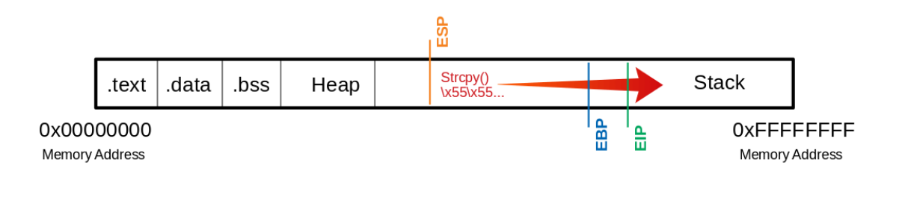

# Linux x86 - Buffer Overflow

## Introduction

An exploit is a code that causes the service to perform an operation we want by abusing the found vulnerability.

Types of exploits :

* 0-Day Exploits
* N-Day Exploits

Categories of exploits :

* Local
* Remote
* DoS (Denial of Service)
* WebApp

Von-Neumann architecture units :

* Memory
* Control Unit (CU)
* Arithmetical Logical Unit (ALU)
* Input/Output Unit

## Memories

Types :

* Primary Memory : RAM (Random Access Memory) and cache
* Secondary Memory : HDD/SSD, CD/DVD-ROMs

## Control unit roles (CU)

Roles :

* Reading data from the RAM
* Saving data in RAM
* Provide, decode and execute an instruction
* Processing the inputs from peripheral devices
* Processing of outputs to peripheral devices
* Interrupt control
* Monitoring of the entire system

It contains the IR (Instruction Register)

## Central processing unit (CPU)

### Types of architecture

* x86/i386 - (AMD & Intel)
* x86-64/amd64 - (Microsoft & Sun)
* ARM - (Acorn)

Each of these CPU architectures is built in a specific way, called Instruction Set Architecture (ISA).

### Types of ISA

* CISC - Complex Instruction Set Computing
* RISC - Reduced Instruction Set Computing
* VLIW - Very Long Instruction Word
* EPIC - Explicitly Parallel Instruction Computing

### Instruction cycles

1. `FETCH` : The next machine instruction address is read from the Instruction Address Register (IAR). It is then loaded from the Cache or RAM into the Instruction Register (IR).
2. `DECODE` : The instruction decoder converts the instructions and starts the necessary circuits to execute the instruction.
3. `FETCH OPERANDS` : If further data have to be loaded for execution, these are loaded from the cache or RAM into the working registers.
4. `EXECUTE` : The instruction is executed. This can be, for example, operations in the ALU, a jump in the program, the writing back of results into the working registers, or the control of peripheral devices. Depending on the result of some instructions, the status register is set, which can be evaluated by subsequent instructions.
5. `UPDATE INSTRUCTION POINTER` : If no jump instruction has been executed in the EXECUTE phase, the IAR is now increased by the length of the instruction so that it points to

## Vulnerable program

Write this C program.

```c
#include <stdlib.h>
#include <stdio.h>
#include <string.h>
​
int bowfunc(char *string) {
​
    char buffer[1024];
    strcpy(buffer, string);
    return 1;
}
​
int main(int argc, char *argv[]) {
​
    bowfunc(argv[1]);
    printf("Done.\n");
    return 1;
}
```

Disable ASLR

```
echo 0 > /proc/sys/kernel/randomize_va_space
cat /proc/sys/kernel/randomize_va_space
```

Compile the program.

```
gcc bow.c -o bow32 -fno-stack-protector -z execstack -m32
file bow32 | tr "," "\n"
gdb -q bow32
```

Vulnerable C functions

* strcpy
* gets
* sprintf
* scanf
* strcat

Change AT\&T to Intel

```
(gdb) set disassembly-flavor intel
(gdb) disassemble main
```

Hard change

```
echo 'set disassembly-flavor intel' > ~/.gdbinit
gdb ./bow32 -q
(gdb) disassemble main
```

## Data registers

| 32-bit Register | 64-bit Register | Description                                                                                                 |
| --------------- | --------------- | ----------------------------------------------------------------------------------------------------------- |
| EAX             | RAX             | Accumulator is used in input/output and for arithmetic operations                                           |
| EBX             | RBX             | Base is used in indexed addressing                                                                          |
| ECX             | RCX             | Counter is used to rotate instructions and count loops                                                      |
| EDX             | RDX             | Data is used for I/O and in arithmetic operations for multiply and divide operations involving large values |

## Pointer registers

| 32-bit Register | 64-bit Register | Description                                                                                             |
| --------------- | --------------- | ------------------------------------------------------------------------------------------------------- |
| EIP             | RIP             | Instruction Pointer stores the offset address of the next instruction to be executed                    |
| ESP             | RSP             | Stack Pointer points to the top of the stack                                                            |
| EBP             | RBP             | Base Pointer is also known as Stack Base Pointer or Frame Pointer thats points to the base of the stack |

## Take control of EIP

```bash
gdb -q bow32
run $(python -c "print '\x55' * 1200")
info registers
```

You overwrite EIP register.

<figure><figcaption></figcaption></figure>

## Determine the offset

Create a shellcode with metasploit

```bash
/usr/share/metasploit-framework/tools/exploit/pattern_create.rb -l 1200 > pattern.txt
cat pattern.txt
​
(gdb) run $(python -c "print 'Aa0Aa1Aa2Aa3Aa4Aa5...<SNIP>...Bn6Bn7Bn8Bn9'") 
info registers eip
```

Grab the EIP data output and run another metaploit shellcode.

```bash
/usr/share/metasploit-framework/tools/exploit/pattern_offset.rb -q 0x69423569
run $(python -c "print '\x55' * 1036 + '\x66' * 4")
```

## Questions

1. At which address in the "main" function is the "bowfunc" function gets called?

```bash
gdb

(gdb) set disassembly-flavor intel
(gdb) file bow
(gdb) disassemble main
```

\
