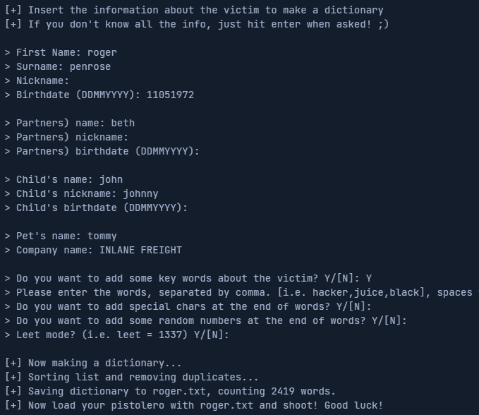
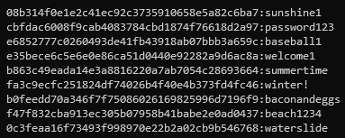
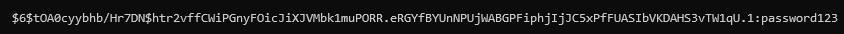
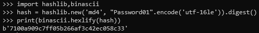
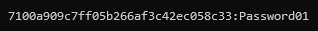
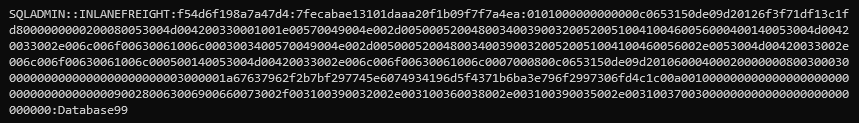
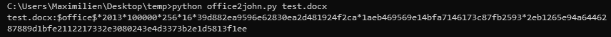
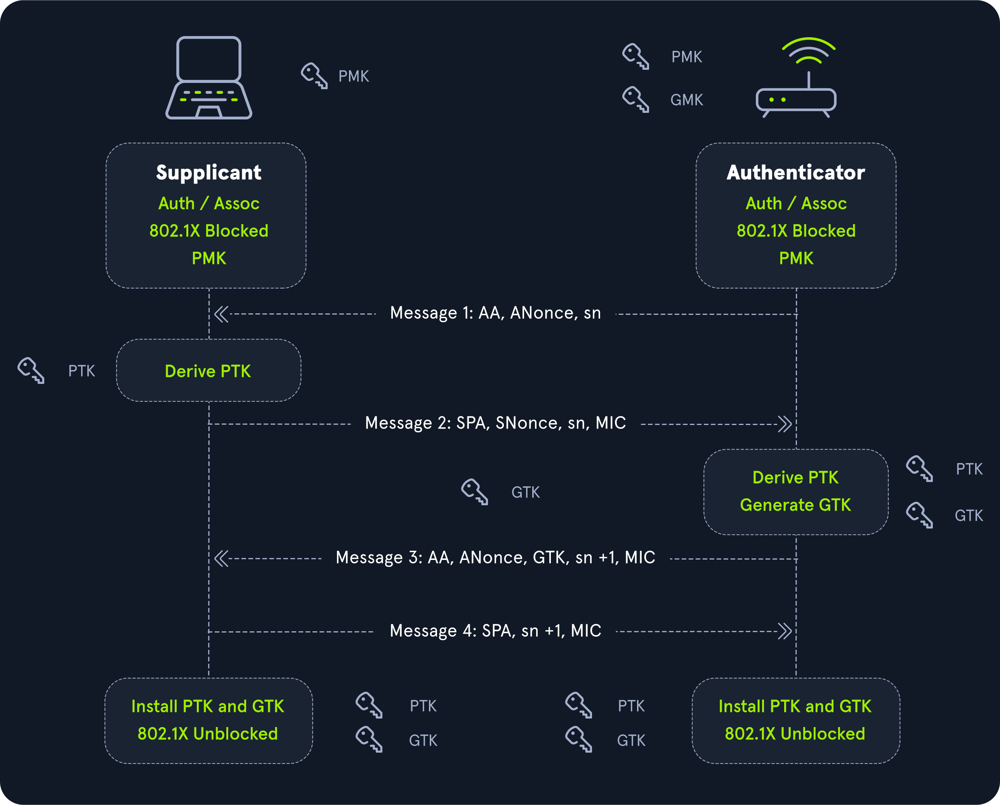
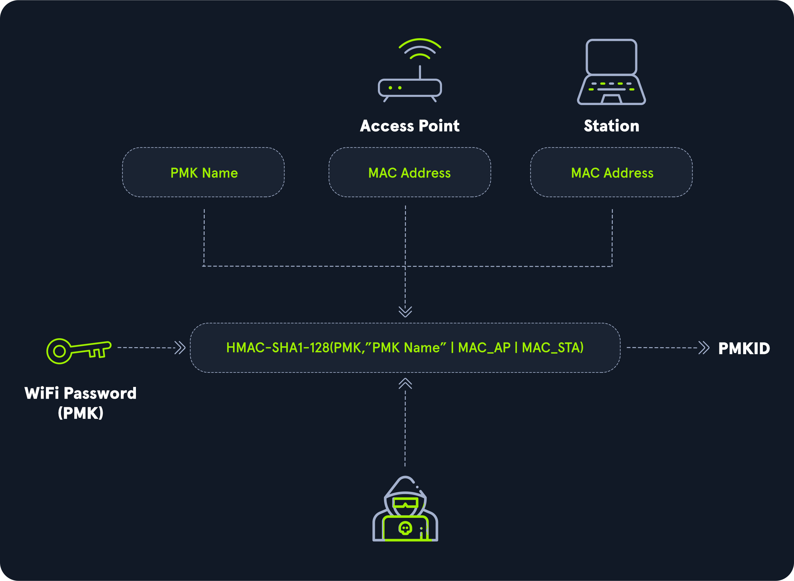

# Hashcat

## Introduction

### Hashing

As hashing is a one-way process, the only way to attack it is to use a list containing possible passwords. Each password from this list is hashed and compared to the original hash. The different hash algorithms are `SHA-512` `Blowfish` `BCrypt` `Argon2`.

```bash
echo 'p@ssw0rd' | md5sum  # 0f359740bd1cda994f8b55330c86d845
```

The MD5 can add salt (a random piece of data to the plaintext before hashing it). By example, it can add the salt `123456` at then end of the data then hash it.

```bash
echo 'p@ssw0rd123456' | md5sum  # f64c413ca36f5cfe643ddbec4f7d92d0
```

### Symmetric Encryption

These algorithms use the same key to encrypt/decrypt the data. The symmectric algorithms are `AES` `DES` `3DES` `Blowfish`. Here the key is `secret`.

```bash
from pwn import xor
xor("p@ssword","secret")                   # b'\x03%\x10\x01\x12D\x01\x01'
xor("\x03%\x10\x01\x12D\x01\x01","secret") # b'p@ssword'
```

### Asymmetric Encryption

It divides the key into 2 parts : public and private. The **public key** can be given to anyone who wishes to encrypt some information and pass it securely to the owner. The owner uses the **private key** to decrypt the content.

### Identify the hash

References : [https://hashcat.net/wiki/doku.php?id=example\_hashes](https://hashcat.net/wiki/doku.php?id=example\_hashes)

Sometimes, hashes are stored in certain formats. For example, `hash:salt` or `$id$salt$hash`.

<table><thead><tr><th width="172">Pattern</th><th>Algorithm</th></tr></thead><tbody><tr><td><code>$1$</code></td><td>MD5</td></tr><tr><td><code>$2a$</code></td><td>Blowfish</td></tr><tr><td><code>$2y$</code></td><td>Blowfish, with correct handling of 8 bit characters</td></tr><tr><td><code>$5$</code></td><td>SHA256</td></tr><tr><td><code>$6$</code></td><td>SHA512</td></tr></tbody></table>

```bash
pip install hashid
hashid '$apr1$71850310$gh9m4xcAn3MGxogwX/ztb.'
​
echo '2fc5a684737ce1bf7b3b239df432416e0dd07357:2014' | tee /tmp/hashes.txt
echo '$P$984478476IagS59wHZvyQMArzfx58u.' | tee -a /tmp/hashes.txt
hashid /tmp/hashes.txt
```

### Hashcat Overview

```bash
sudo apt install hashcat
hashcat -h
hashcat --example-hashes | less
hashcat -b -m 0                     # benchmark mode
hashcat -0                          # limit the password length to 32 elements
```

The flags `-a` and `-m` specify the type of attack mode.

<table><thead><tr><th width="178">Number</th><th>Attack Mode</th></tr></thead><tbody><tr><td><code>-a 0</code></td><td>Straight</td></tr><tr><td><code>-a 1</code></td><td>Combination</td></tr><tr><td><code>-a 3</code></td><td>Brute-force</td></tr><tr><td><code>-a 6</code></td><td>Hybrid Wordlist + Mask</td></tr><tr><td><code>-a 7</code></td><td>Hybrid Mask + Wordlist</td></tr></tbody></table>

The flag `-O` (Optimized Kernels) set the maximum password length to 32. It is recommended to run with `-O` to optimize the process. The flag `-w` (workload).

| Number | Description                           |
| ------ | ------------------------------------- |
| `-w 1` | Use the system while running hashcat. |
| `-w 2` | (default)                             |
| `-w 3` | The computer only runs hashcat.       |

The flag `--force` should be avoided.

## Hashcat Attack Types

### Dictionary Attack

Wordlists :

* [https://crackstation.net/crackstation-wordlist-password-cracking-dictionary.htm](https://crackstation.net/crackstation-wordlist-password-cracking-dictionary.htm)
* [https://github.com/danielmiessler/SecLists/tree/master/Passwords](https://github.com/danielmiessler/SecLists/tree/master/Passwords)

```bash
hashcat -a 0 -m <hash type> <hash file> <wordlist>
​
echo -n '!academy' | sha256sum | cut -f1 -d' ' > sha256_hash_example
hashcat -a 0 -m 1400 sha256_hash_example SecLists/Passwords/Leaked-Databases/rockyou.txt
```

### Combination Attack

It is the combination of 2 wordlists.


```
super
world
secret
```



```
hello
password
```



```
superhello
superpassword
worldhello
wordpassword
secrethello
secretpassword
```


The commands to create to combination wordlist.

```bash
awk '(NR==FNR) { a[NR]=$0 } (NR != FNR) { for (i in a) { print $0 a[i] } }' file2 file1  # command 1
hashcat -a 1 --stdout file1 file2  # command 2
```

The syntax to use wordlist combination.

```bash
hashcat -a 1 -m <hash type> <hash file> <wordlist1> <wordlist2>

echo -n 'secretpassword' | md5sum | cut -f1 -d' '  > combination_md5
hashcat -a 1 -m 0 combination_md5 wordlist1 wordlist2
```

### Mask Attack

<table><thead><tr><th width="154">Placeholder</th><th>Meaning</th></tr></thead><tbody><tr><td><code>?l</code></td><td>lower-case ASCII letters (a-z)</td></tr><tr><td><code>?u</code></td><td>upper-case ASCII letters (A-Z)</td></tr><tr><td><code>?d</code></td><td>digits (0-9)</td></tr><tr><td><code>?h</code></td><td>0123456789abcdef</td></tr><tr><td><code>?H</code></td><td>0123456789ABCDEF</td></tr><tr><td><code>?s</code></td><td>special characters («space»!"#$%&#x26;'()*+,-./:;&#x3C;=>?@[]^_`{</td></tr><tr><td><code>?a</code></td><td>?l?u?d?s</td></tr><tr><td><code>?b</code></td><td>0x00 - 0xff</td></tr></tbody></table>

```bash
echo -n 'ILFREIGHTabcxy2015' | md5sum | tr -d " -" > md5_mask_example_hash
hashcat -a 3 -m 0 md5_mask_example_hash -1 01 'ILFREIGHT?l?l?l?l?l20?1?d'
```

The `-1 01` means the element at `ILFREIGHT?l?l?l?l?l20<HERE>?d` can be 0 or 1.

### Hybrid Mode

You can combinate Mask attack and Dictionary attack on the same target. By example, the password `john12?` can be cracked with the pattern `<word>?d?d?s` and with the wordlist `/usr/share/wordlists/rockyou.txt`.

```bash
echo -n 'football1$' | md5sum | tr -d " -" > hybrid_hash
hashcat -a 6 -m 0 hybrid_hash /opt/useful/SecLists/Passwords/Leaked-Databases/rockyou.txt '?d?s'
```

```bash
echo -n '2015football' | md5sum | tr -d " -" > hybrid_hash_prefix
hashcat -a 7 -m 0 hybrid_hash_prefix -1 01 '20?1?d' /opt/useful/SecLists/Passwords/Leaked-Databases/rockyou.txt
```

## Creating Custom Wordlists

### [Crunch](https://sourceforge.net/projects/crunch-wordlist/)

It creates wordlist based on a specific pattern, minLength and maxLength. The format is `crunch <minLength> <maxLength> <charset> -t <pattern> -o <outputFile>`.

```
crunch 4 8 -o wordlist
crunch 17 17 ILFREIGHT201%@@@@ -o wordlist
crunc 12 12 -t 10031998@@@@ -d 1 -o wordlist
```

<table data-header-hidden><thead><tr><th width="210"></th><th></th></tr></thead><tbody><tr><td>Symbol</td><td>Meaning</td></tr><tr><td><code>%</code></td><td>Number</td></tr><tr><td><code>@</code></td><td>Uppercase letter</td></tr><tr><td><code>,</code></td><td>Lowercase letter</td></tr><tr><td><code>^</code></td><td>Special character</td></tr></tbody></table>

<table data-header-hidden><thead><tr><th width="210"></th><th></th></tr></thead><tbody><tr><td>Flag</td><td>Meaning</td></tr><tr><td><code>-o</code></td><td>Output file</td></tr><tr><td><code>-t</code></td><td>Pattern</td></tr><tr><td><code>-d</code></td><td>Amount of repetition.</td></tr></tbody></table>

### [CUPP](https://github.com/Mebus/cupp)

That means `Common User Password Profiler`. It creates a wordlist based on the information of the target dump previously with OSINT and social engineering.

```bash
python3 cupp.py -i
```

<figure><figcaption></figcaption></figure>

### [KWProcessor](https://github.com/hashcat/kwprocessor)

It generates wordlist based on the keyboard layout like `azertyuiop` (firstor `azertyqsdfgh`

```bash
git clone https://github.com/hashcat/kwprocessor
cd kwprocessor
make
```

```bash
kwp -s 1 basechars/full.base keymaps/en-us.keymap  routes/2-to-10-max-3-direction-changes.route
```

### [Princeprocessor](https://github.com/hashcat/princeprocessor)

PRINCE means `PRobability INfinite Chained Elements`. It generates passwords using the PRINCE algorithm.

```bash
wget https://github.com/hashcat/princeprocessor/releases/download/v0.22/princeprocessor-0.22.7z
7z x princeprocessor-0.22.7z
cd princeprocessor-0.22
./pp64.bin -h
```

Initial wordlist :

```
dog
cat
ball
```

Generated wordlist :

```
dog
cat
ball
dogdog
catdog
dogcat
catcat
dogball
catball
balldog
ballcat
ballball
dogdogdog
catdogdog
dogcatdog
catcatdog
dogdogcat
<SNIP>
```

```bash
# find the number of combinations produced from the input wordlist
./pp64.bin --keyspace < words

# generate by default words up to 16 length
./pp64.bin -o wordlist.txt < words

# the length can be controlled with these flags
./pp64.bin --pw-min=10 --pw-max=25 -o wordlist.txt < words

# the number of elements per word can be controlled with these flags (ie : "dogdogdog")
./pp64.bin --elem-cnt-min=3 -o wordlist.txt < words
```

### [CeWL](https://github.com/digininja/CeWL)

It scrapes a website an creates a list of the words that are present. The format is `cewl -d <depth to spider> -m <minimum word length> -w <output wordlist> <url of website>`.

```bash
cewl -d 5 -m 8 -e http://inlanefreight.com/blog -w wordlist.txt
```

| Flag | Meaning                                      |
| ---- | -------------------------------------------- |
| `-e` | Extract emails from websites.                |
| `-d` | Depth of the pages.                          |
| `-m` | Include only words greater than 8 in length. |
| `-w` | The output wordlist.                         |

### [Hashcat-utils](https://github.com/hashcat/hashcat-utils)

In this repository, there are a lot of tools including `maskprocessor`.

```bash
/mp64.bin Welcome?s
```

It outputs this text :

```
Welcome 
Welcome!
Welcome"
Welcome#
Welcome$
Welcome%
Welcome&
Welcome'
Welcome(
Welcome)
Welcome*
Welcome+

<SNIP>
```

## Cracking Common Hashes

A list of example hashes [here](https://hashcat.net/wiki/doku.php?id=example\_hashes).

<table data-header-hidden><thead><tr><th width="135.33333333333331"></th><th></th><th></th></tr></thead><tbody><tr><td>Hashmode</td><td>Hash Name</td><td>Example Hash</td></tr><tr><td>0</td><td>MD5</td><td>8743b52063cd84097a65d1633f5c74f5</td></tr><tr><td>100</td><td>SHA1</td><td>b89eaac7e61417341b710b727768294d0e6a277b</td></tr><tr><td>1000</td><td>NTLM</td><td>b4b9b02e6f09a9bd760f388b67351e2b</td></tr><tr><td>1800</td><td>sha512crypt $6$, SHA512 (Unix)</td><td>$6$52450745$k5ka2p8bFuSmoVT1tzOyyuaREkkKBcCNqoDKzYiJL9RaE8yMnPgh2XzzF0NDrUhgrcLwg78xs1w5pJiypEdFX/</td></tr><tr><td>3200</td><td>bcrypt $2*$, Blowfish (Unix)</td><td>$2a$05$LhayLxezLhK1LhWvKxCyLOj0j1u.Kj0jZ0pEmm134uzrQlFvQJLF6</td></tr><tr><td>5500</td><td>NetNTLMv1 / NetNTLMv1+ESS</td><td>u4-netntlm::kNS:338d08f8e26de93300000000000000000000000000000000:9526fb8c23a90751cdd619b6cea564742e1e4bf33006ba41:cb8086049ec4736c</td></tr><tr><td>5600</td><td>NetNTLMv2</td><td>admin::N46iSNekpT:08ca45b7d7ea58ee:88dcbe4446168966a153a0064958dac6:5c7830315c7830310000000000000b45c67103d07d7b95acd12ffa11230e0000000052920b85f78d013c31cdb3b92f5d765c783030</td></tr><tr><td>13100</td><td>Kerberos 5 TGS-REP etype 23</td><td>$krb5tgs$23$<em>user$realm$test/spn</em>$63386d22d359fe42230300d56852c9eb$ &#x3C; SNIP ></td></tr></tbody></table>

First, you can dump database. The common hashes in the databases are `MD5` `SHA1` and `bcrypt`. You can retreive them following a successful SQL injection attack or another way. `MD5` and `SHA1` are easier to crack than `bcrypt`.

### Example 1 : database

The initial database passwords in clear.

```
winter!
baseball1
waterslide
summertime
baconandeggs
beach1234
sunshine1
welcome1
password123
```

The `SHA1` encrypted passwords located in one table of the database. You retreived them with an SQLi.

```
fa3c9ecfc251824df74026b4f40e4b373fd4fc46
e6852777c0260493de41fb43918ab07bbb3a659c
0c3feaa16f73493f998970e22b2a02cb9b546768
b863c49eada14e3a8816220a7ab7054c28693664
b0feedd70a346f7f75086026169825996d7196f9
f47f832cba913ec305b07958b41babe2e0ad0437
08b314f0e1e2c41ec92c3735910658e5a82c6ba7
e35bece6c5e6e0e86ca51d0440e92282a9d6ac8a
cbfdac6008f9cab4083784cbd1874f76618d2a97
```

\* The command to encrypt them manually is the following one.

```bash
for i in $(cat words); do echo -n $i | sha1sum | tr -d ' -';done
```

Run Hashcat dictionnary attack using `rockyou.txt` wordlist.

```bash
echo -e 'winter!\nbaseball1\nwaterslide\nsummertime\nbaconandeggs\nbeach1234\nsunshine1\nwelcome1\npassword123' > words
for i in $(cat words); do echo -n $i | sha1sum | tr -d ' -' >> hashes;done
hashcat -m 100 hashes /usr/share/wordlists/rockyou.txt
```

<figure><figcaption></figcaption></figure>

### Example 2 : Ubuntu Linux

`SHA512crypt` hashes are commonly found in `/etc/shadow` file.

```bash
echo 'root:$6$tOA0cyybhb/Hr7DN$htr2vffCWiPGnyFOicJiXJVMbk1muPORR.eRGYfBYUnNPUjWABGPFiphjIjJC5xPfFUASIbVKDAHS3vTW1qU.1:18285:0:99999:7:::' > linuxhash
hashcat -m 1800 linuxhash /usr/share/wordlists/rockyou.txt
```

<figure><figcaption></figcaption></figure>

### Example 3 : Active Directory Password Hash Types

Retreive an `NTLM` password hash for a user that has `RDP` access to a server.

```bash
import hashlib,binascii
hash = hashlib.new('md4', "Password01".encode('utf-16le')).digest()
print(binascii.hexlify(hash))
```

<figure><figcaption></figcaption></figure>

Then crack the hash with Hashcat.

```bash
echo '7100a909c7ff05b266af3c42ec058c33' > ntlm_hash
hashcat -a 0 -m 1000 ntlm_hash /usr/share/wordlists/rockyou.txt
```

<figure><figcaption></figcaption></figure>

Another hash is `NetNTLMv2` and you can use [Responder](https://github.com/lgandx/Responder) to preform MITM attack. An example of hash you can dump with MITM.

```bash
echo 'sqladmin::INLANEFREIGHT:f54d6f198a7a47d4:7FECABAE13101DAAA20F1B09F7F7A4EA:0101000000000000C0653150DE09D20126F3F71DF13C1FD8000000000200080053004D004200330001001E00570049004E002D00500052004800340039003200520051004100460056000400140053004D00420033002E006C006F00630061006C0003003400570049004E002D00500052004800340039003200520051004100460056002E0053004D00420033002E006C006F00630061006C000500140053004D00420033002E006C006F00630061006C0007000800C0653150DE09D201060004000200000008003000300000000000000000000000003000001A67637962F2B7BF297745E6074934196D5F4371B6BA3E796F2997306FD4C1C00A001000000000000000000000000000000000000900280063006900660073002F003100390032002E003100360038002E003100390035002E00310037003000000000000000000000000000' > ntlmv2
hashcat -a 0 -m 5600 ntlmv2 /usr/share/wordlists/rockyou.txt
```

<figure><figcaption></figcaption></figure>

## Working with Rules

| **Function**    | **Description**                                                    | **Input**                             | **Output**                                                                                                        |
| --------------- | ------------------------------------------------------------------ | ------------------------------------- | ----------------------------------------------------------------------------------------------------------------- |
| l               | Convert all letters to lowercase                                   | InlaneFreight2020                     | inlanefreight2020                                                                                                 |
| u               | Convert all letters to uppercase                                   | InlaneFreight2020                     | INLANEFREIGHT2020                                                                                                 |
| c / C           | capitalize / lowercase first letter and invert the rest            | inlaneFreight2020 / Inlanefreight2020 | Inlanefreight2020 / iNLANEFREIGHT2020                                                                             |
| t / TN          | Toggle case : whole word / at position N                           | InlaneFreight2020                     | iNLANEfREIGHT2020                                                                                                 |
| d / q / zN / ZN | Duplicate word / all characters / first character / last character | InlaneFreight2020                     | InlaneFreight2020InlaneFreight2020 / IInnllaanneeFFrreeiigghhtt22002200 / IInlaneFreight2020 / InlaneFreight20200 |
| { / }           | Rotate word left / right                                           | InlaneFreight2020                     | nlaneFreight2020I / 0InlaneFreight202                                                                             |
| ^X / $X         | Prepend / Append character X                                       | InlaneFreight2020 (^! / $! )          | !InlaneFreight2020 / InlaneFreight2020!                                                                           |
| r               | Reverse                                                            | InlaneFreight2020                     | 0202thgierFenalnI                                                                                                 |

Complete list of rules [here](https://hashcat.net/wiki/doku.php?id=rule\_based\_attack#implemented\_compatible\_functions). Complete list of rejection rules [here](https://hashcat.net/wiki/doku.php?id=rule\_based\_attack#rules\_used\_to\_reject\_plains).

```bash
echo 'c so0 si1 se3 ss5 sa@ $2 $0 $1 $9' > rule.txt
```

The first letter word is capitalized with the `c` function. Then rule uses the substitute function `s` to replace `o` with `0`, `i` with `1`, `e` with `3` and a with `@`. At the end, the year `2019` is appended to it. Copy the rule to a file so that we can debug it.

```bash
# example 1
echo 'password_ilfreight' > test.txt
hashcat -r rule.txt test.txt --stdout  # output "P@55w0rd_1lfr31ght2019"
```

```bash
# example 2
echo -n 'St@r5h1p2019' | sha1sum | awk '{print $1}' | tee hash.txt
hashcat -a 0 -m 100 hash.txt /opt/useful/SecLists/Passwords/Leaked-Databases/rockyou.txt -r rule.txt
```

The default rules are stored at `/usr/share/hashcat/rules/`. It's possible to generate random rules with the flag `-g`.

```bash
hashcat -a 0 -m 100 -g 1000 hash.txt /opt/useful/SecLists/Passwords/Leaked-Databases/rockyou.txt
```

List of rules sites :

* [nsa-rules](https://github.com/NSAKEY/nsa-rules)
* [Hob0Rules](https://github.com/praetorian-code/Hob0Rules)
* [corporate.rule](https://github.com/sparcflow/HackLikeALegend/blob/master/old/chap3/corporate.rule)
* [How to Hack Like a Legend](https://www.hacklikeapornstar.com/new-release-hack-like-legend/)

## Cracking Miscellaneous Files & Hashes

### [JohnTheRipper](https://github.com/magnumripper/JohnTheRipper/tree/bleeding-jumbo/run)

```
sudo git clone https://github.com/magnumripper/JohnTheRipper.git
cd JohnTheRipper/src
sudo ./configure && make
```

The get the KeePass hash with [keepass2john.py](https://gist.github.com/HarmJ0y/116fa1b559372804877e604d7d367bbc#file-keepass2john-py). Cracking password protected Microsoft Office Documents with [office2john.py](https://raw.githubusercontent.com/magnumripper/JohnTheRipper/bleeding-jumbo/run/office2john.py). Cracking Zip password with [zip2john.py](https://github.com/magnumripper/JohnTheRipper/blob/bleeding-jumbo/src/zip2john.c).

### **Word Password**

First, create a Word an encrypt it with the password `12345`. Then get the document hash with John.

```bash
python office2john.py test.docx
```

<figure><figcaption></figcaption></figure>

```bash
echo '$office$*2013*100000*256*16*39d882ea9596e62830ea2d481924f2ca*1aeb469569e14bfa7146173c87fb2593*2eb1265e94a6446287889d1bfe2112217332e3080243e4d3373b2e1d5813f1ee' > office2013.hash

hashid office2013.hash
hashcat --help | grep 'Office 2013'
hashcat -a 0 -m 9600 office2013.hash /usr/share/wordlists/rockyou.txt
```

And it returns the Word password : `12345`

### Zip Password

... ?

### KeePass Password

```
keepass2john Database.kdbx | cut -d':' -f2 > keepass.hash
hashcat --help | grep -i 'keepass'
hashcat -a 0 -m 13400 keepass.hash /usr/share/wordlists/rockyou.txt
```

### PDF Password

```
pdf2john inventory.pdf | awk -F":" '{ print $2}'
hashcat -a 0 -m 10500 pdf_hash /opt/useful/SecLists/Passwords/Leaked-Databases/rockyou.txt
```

## Cracking wireless WPA/WPA2 handshakes

### Cracking MIC

<figure><figcaption></figcaption></figure>

* Client connects to an Access Point (AP) and his key is encrypted and verified by the AP.
* The attacker captures a valid 4-way handshake by sending de-authentication frames to force a client to disconnect from an AP.
* The client reauthenticates and the attacker can attempt to sniff out the WPA 4-way handshake without their knowledge. There are several keys used during this process.
* Theses keys are used to generate a common key called the Message Intregrity Check (MIC) used by an AP to verify that each packet has not been compromised an received in its original state.

To capture this 4-way handshake, there is the tool [airodump-ng](https://www.aircrack-ng.org/doku.php?id=airodump-ng) and convert it to a Hashcat supported format `hccapx`. The online conversion is [cap2hashcat online](https://hashcat.net/cap2hashcat) and the offline conversion is located in `hashcat-utils`.

```bash
git clone https://github.com/hashcat/hashcat-utils.git
cd hashcat-utils/src && make

./cap2hccapx.bin corp_capture1-01.cap mic_to_crack.hccapx
hashcat -a 0 -m 22000 mic_to_crack.hccapx /opt/useful/SecLists/Passwords/Leaked-Databases/rockyou.txt
```

### Cracking PMKID

It does not require deauthentication like MIC and can generally be obtained faster and without interrupting any users. PMKID means `Pairwise Master Key Identifier`. It is located in the first packet of the 4-way handshake.

PMKID is calculated with `HMC-SHA1` with :

* `PMK` used as key
* String PMK Name
* MAC address of the access point
* MAC address of the station

<figure><figcaption></figcaption></figure>

1.  Extract the hash from the capture `.cap` file using `hcxpcaptool` from `hcxtools`.

    ```bash
    # method 1
    sudo apt install hcxtools
    hcxpcapngtool  -z pmkidhash_corp cracking_pmkid.cap
    cat pmkidhash_corp 

    # method 2
    git clone https://github.com/ZerBea/hcxtools.git
    cd hxctools
    make && make install
    hcxpcapngtool cracking_pmkid.cap -o pmkidhash_corp2
    ```
2.  Crack the hash.

    ```bash
    hashcat -a 0 -m 22000 pmkidhash_corp /opt/useful/SecLists/Passwords/Leaked-Databases/rockyou.txt
    ```

## Questions

1. Generate an MD5 hash of the password 'HackTheBox123!'.

```bash
 echo -n 'HackTheBox123!' | md5sum
```

2. Create the XOR ciphertext of the password 'opens3same' using the key 'academy'. (Answer format: \x00\x00\x00....)

```bash
from pwn import xor
xor("opens3same", "academy")
```

3. Identify the following hash: $S$D34783772bRXEx1aCsvY.bqgaaSu75XmVlKrW9Du8IQlvxHlmzLc

```bash
hashid '$S$D34783772bRXEx1aCsvY.bqgaaSu75XmVlKrW9Du8IQlvxHlmzLc'
```

4. What is the hash mode of the hash type Cisco-ASA MD5?

```bash
hashcat --help | grep -i 'Cisco-ASA MD5'
```

## Hashcat Attack Types

1. Crack the following hash using the rockyou.txt wordlist: 0c352d5b2f45217c57bef9f8452ce376

```bash
 hashcat -a 0 -m 0 '0c352d5b2f45217c57bef9f8452ce376' SecLists/Passwords/Leaked-Databases/rockyou.txt.tar.gz
```

2. Using the Hashcat combination attack find the cleartext password of the following md5 hash: 19672a3f042ae1b592289f8333bf76c5. Use the supplementary wordlists shown at the end of this section.

```bash
echo -e 'sunshine\nhappy\nfrozen\ngolden' > wordlist1
echo -e 'hello\njoy\nsecret\napple' > wordlist2
echo '19672a3f042ae1b592289f8333bf76c5' > hash.txt
hashcat -a 1 -m 0 hash.txt wordlist1 wordlist2
```

3. Crack the following MD5 hash using a mask attack: 50a742905949102c961929823a2e8ca0. Use the following mask: -1 02 'HASHCAT?l?l?l?l?l20?1?d'

```bash
echo '50a742905949102c961929823a2e8ca0' > hash.txt
hashcat -a 3 -m 0 hash.txt -1 02 'HASHCAT?l?l?l?l?l20?1?d'
```

4. Crack the following hash: 978078e7845f2fb2e20399d9e80475bc1c275e06 using the mask ?d?s.

```bash
hashcat -a 6 -m 100 hash.txt /usr/share/wordlists/rockyou.txt '?d?s'
```

5. Crack the following SHA1 hash using the techniques taught for generating a custom rule: 46244749d1e8fb99c37ad4f14fccb601ed4ae283. Modify the example rule in the beginning of the section to append 2020 to the end of each password attempt.

```bash
echo '46244749d1e8fb99c37ad4f14fccb601ed4ae283' > hash.txt
echo 'c so0 si1 se3 ss5 sa@ $2 $0 $2 $0' > rule.txt
hashcat -a 0 -m 100 hash.txt /usr/share/wordlists/rockyou.txt -r rule.txt
```

6. Crack the following hash: 7106812752615cdfe427e01b98cd4083

```bash
hashcat -a 0 -m 0 exercise /usr/share/wordlists/rockyou.txt -r /usr/share/hashcat/rules/best64.rule
hashcat -a 0 -m 0 exercise /usr/share/wordlists/rockyou.txt -r /usr/share/hashcat/rules/combinator.rule
hashcat -a 0 -m 0 exercise /usr/share/wordlists/rockyou.txt -r /usr/share/hashcat/rules/specific.rule
hashcat -a 0 -m 0 exercise /usr/share/wordlists/rockyou.txt -r /usr/share/hashcat/rules/leetspeak.rule

hashcat -a 0 -m 1000 my.hash /usr/share/wordlists/rockyou.txt -r /usr/share/hashcat/rules/best64.rule
hashcat -a 0 -m 1000 my.hash /usr/share/wordlists/rockyou.txt -r /usr/share/hashcat/rules/combinator.rule
hashcat -a 0 -m 1000 my.hash /usr/share/wordlists/rockyou.txt -r /usr/share/hashcat/rules/T0XlC.rule
```

7. Extract the hash from the attached 7-Zip file, crack the hash, and submit the value of the flag.txt file contained inside the archive.

```bash
sudo apt-get install -y liblzma-dev
sudo cpan Compress::Raw::Lzma

unzip Misc_hashes.zip
7z2john hashcat.7z | cut -d':' -f2 > 7zip.hash
hashcat -a 0 -m 11600 7zip.hash /usr/share/wordlists/rockyou.txt
```

8. Perform MIC cracking using the attached .cap file.

```bash
wget https://academy.hackthebox.com/storage/modules/20/Hashcat_wireless1.zip
unzip Hashcat_wireless1.zip
sudo apt install hcxtools
hcxpcapngtool -o pmkid.hash cracking_pmkid.cap
hashcat -a 0 -m 22000 pmkid.hash /usr/share/wordlists/rockyou.txt
```

9. Extract the PMKID hash from the attached .cap file and crack it.

```bash
wget https://academy.hackthebox.com/storage/modules/20/Hashcat_wireless2.zip
unzip Hashcat_wireless2.zip
hcxpcapngtool -o pmkid.hash cracking_pmkid_question2.cap
hashcat -a 0 -m 22000 pmkid.hash /usr/share/wordlists/rockyou.txt
```

## Assessment

1. What type of hash did your colleague obtain from the SQL injection attack?

```bash
echo '0c67ac18f50c5e6b9398bfe1dc3e156163ba10ef' > sql.hash
hashid sql.hash
```

2. What is the cleartext password for the hash obtained from SQL injection in example 1?

```bash
hashcat --help | grep -i 'sha1'  # 100
hashcat -a 0 -m 100 sql.hash /usr/share/wordlists/rockyou.txt
```

3. What is the cleartext password value for the NetNTLMv2 hash?

```bash
echo 'bjones::INLANEFREIGHT:699f1e768bd69c00:5304B6DB9769D974A8F24C4F4309B6BC:0101000000000000C0653150DE09D2010409DF59F277926E000000000200080053004D004200330001001E00570049004E002D00500052004800340039003200520051004100460056000400140053004D00420033002E006C006F00630061006C0003003400570049004E002D00500052004800340039003200520051004100460056002E0053004D00420033002E006C006F00630061006C000500140053004D00420033002E006C006F00630061006C0007000800C0653150DE09D20106000400020000000800300030000000000000000000000000300000B14866125D55255DD82C994C0D8AC3D9FF1A3EFDAECBE908F1F91C7BD4B05CF50A001000000000000000000000000000000000000900280063006900660073002F003100390032002E003100360038002E003100390035002E00310032003900000000000000000000000000' > netntlmv2.hash

hashid netntlmv2.hash
hashcat --help | grep -i 'NetNTLMv2'  # 5600
hashcat -a 0 -m 5600 netntlmv2.hash /usr/share/wordlists/rockyou.txt
```

4. Crack the TGS ticket obtained from the Kerberoasting attack.

```bash
echo '$krb5tgs$23$*sql_svc$INLANEFREIGHT.LOCAL$mssql/inlanefreight.local~1443*$80be357f5e68b4f64a185397bf72cf1c$579d028f0f91f5791683844c3a03f48972cb9013eddf11728fc19500679882106538379cbe1cb503677b757bcb56f9e708cd173a5b04ad8fc462fa380ffcb4e1b4feed820fa183109e2653b46faee565af76d5b0ee8460a3e0ad48ea098656584de67974372f4a762daa625fb292556b407c0c97fd629506bd558dede0c950a039e2e3433ee956fc218a54b148d3e5d1f99781ad4e419bc76632e30ea2c1660663ba9866230c790ba166b865d5153c6b85a184fbafd5a4af6d3200d67857da48e20039bbf31853da46215cbbc5ebae6a3b0225b6651ec8cc792c8c3d5893a8d014f9d297ac297288e76d27a1ed2942d6997f6b24198e64fea9ff5a94badd53cc12a73e9505e4dab36e4bd1ef7fe5a08e527d9046b49e730d83d8af395f06fe35d360c59ab8ebe2c3b7553acf8d40c296b86c1fb26fdf43fa8be2ac4a92152181b81afb1f4773936b0ccc696f21e8e0fe7372252b3c24d82038c62027abc34a4204fb6e52bf71290fdf0db60b1888f8369a7917821f6869b6e51bda15f1fd7284ca1c37fb2dc46c367046a15d093cc501f3155f1e63040313cc8db2a8437ee6dc8ceb04bf924427019b396667f0532d995e3d655b9fb0ef8e61b31e523d81914d9eb177529783c29788d486139e1f3d29cbe4d2f881c61f74ff32a9233134ec69f26082e8aaa0c0e99006a5666c24fccfd195796a0be97cecb257259a640641f8c2d58d2d94452ec00ad84078afc1f7f72f3b9e8210b5db73bf70cd13ef172ef3b233c987d5ec7ea12a4d4921a43fb670c9f48aaae9e1d48ec7be58638a8b2f89a62b56775deddbbc971803316470ee416d8a6c0c8d17982396f6c0c0eeec425d5c599fb60b5c39f8e9ceff4ee25c5bc953178972de616edae61586bb868e463f420e9e09c083662bcf6f0f522f78630792e02e6986f5dd042dfb70100ab59d8a01093b3d89949ea19fe9c596a8681e2a71abe75debd62b985d03d488442aa41cc8993eff0224de62221d39be8bf1d8b26f8f8768e90e5b4b886adaf02a19f55e6d1fd11b004d4e7b170c4f7feaa04b8dad207d6f863d50a251d9a9ce66951de41a3690fec6144e73428d4718cc7ec5eeeff841b4329a7ba51624f678557b6eafc55af026314cbf9dd9ca232977da3cce204899f3048101e0010f42d0076cd494526beea862c72ee48749ba071bcdd1a96c64a0d8f48c6acad7730121021be6323f69505aad8fb6281b7ac4a607d1d241f1fbffc70c4a74c997bb2fb77c452c0077efdea2a6c00704a8bee28326b5e554e1faa48a33963ce2c2e0e2446b4504a05d541bbaf531e1644ad92a2feae5b2eb8851b067e7bd8d7d23d82e63d368983ba44f52901cba7e05cfa35e832ec445a7de50eca670fa90' > kerb.hash

hashcat --help | grep -i 'kerb'
hashcat -a 0 -m 13100 kerb.hash /usr/share/wordlists/rockyou.txt
```

5. What is the cleartext password value for the MS Cache 2 hash?

```bash
echo '$DCC2$10240#backup_admin#62dabbde52af53c75f37df260af1008e' > mscache2.hash
hashid mscache2.hash                      # Domain Cached Credentials 2
hashcat --help | grep -i "domain cached"  # 2100
hashcat -a 0 -m 2100 mscache2.hash /usr/share/wordlists/rockyou.txt
```

6. After cracking the NTLM password hashes contained in the NTDS.dit file, perform an analysis of the results and find out the MOST common password in the INLANEFREIGHT.LOCAL domain.

```bash
hashcat --help | grep -i "ntlm"  # 1000
```

\
