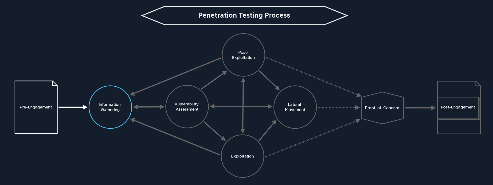

# Page

## The Penetration Testing Process

<figure><figcaption></figcaption></figure>

**NDA** (Non-Disclosure Agreement) must be signed before pre-engagement :&#x20;

* Unilateral NDA : **one party** maintains confidentiality and the other can share it.
* Bilateral NDA : **both parties** must keep information confidential.
* Multilateral NDA : there are **more than 2 parties** and they must keep information confidential.

The C-level staff levels are :

| Acronym | Post                                |
| ------- | ----------------------------------- |
| CEO     | Chief Executive Officer             |
| CTO     | Chief Technical Officer             |
| CISO    | Chief Information Security Officer  |
| CSO     | Chief Security Officer              |
| CRO     | Chief Risk Officer                  |
| CIO     | Chief Information Officer           |
|         | Internal Audit                      |
|         | Audit Manager                       |
|         | Director of IT/Information Security |

| Document              | Timing                               |
| --------------------- | ------------------------------------ |
| NDA                   | After initial contact                |
| Scoping questionnaire | Before the pre-engagement meeting    |
| Scoping document      | During the pre-engagement meeting    |
| Pentesting proposal   | During the pre-engagement meeting    |
| RoE                   | Before the kick-off meeting          |
| Contractors Agreement | Before the kick-off meeting          |
| Reports               | During & after the conducted pentest |

### Questionnaire Scope

* [ ] Internal Vulnerability Assessment
* [ ] Internal Penetration Test
* [ ] Wireless Security Assessment
* [ ] Physical Security Assessment
* [ ] Red Team Assessment
* [ ] External Vulnerability Assessment
* [ ] External Penetration Test
* [ ] Application Security Assessment
* [ ] Social Engineering Assessment
* [ ] Web Application Security Assessment

Example of questions :&#x20;

* How many expected live hosts?
* How many IPs/CIDR ranges in scope?
* How many Domains/Subdomains are in scope?
* How many wireless SSIDs in scope?
* How many web/mobile applications? If testing is authenticated, how many roles (standard user, admin, etc.)?
* For a phishing assessment, how many users will be targeted? Will the client provide a list, or we will be required to gather this list via OSINT?
* If the client is requesting a Physical Assessment, how many locations? If multiple sites are in-scope, are they geographically dispersed?
* What is the objective of the Red Team Assessment? Are any activities (such as phishing or physical security attacks) out of scope?
* Is a separate Active Directory Security Assessment desired?
* Will network testing be conducted from an anonymous user on the network or a standard domain user?
* Do we need to bypass Network Access Control (NAC)?
* Is the Penetration Test black box (no information provided), grey box (only IP address/CIDR ranges/URLs provided), white box (detailed information provided)
* Would they like us to test from a non-evasive, hybrid-evasive (start quiet and gradually become "louder" to assess at what level the client's security personnel detect our activities), or fully evasive.

## Pre-Engagement

### Contract

* [ ] NDA
* [ ] Goals
* [ ] Scope
* [ ] Penetration Testing Type
* [ ] Methodologies
* [ ] Penetration Testing Locations
* [ ] Time Estimation
* [ ] Third Parties
* [ ] Evasive Testing
* [ ] Risks
* [ ] Scope Limitations & Restrictions
* [ ] Information Handling
* [ ] Contact Information
* [ ] Lines of Communication
* [ ] Reporting
* [ ] Payment Terms

### Rules of Engagement

* [ ] Introduction
* [ ] Contractor
* [ ] Penetration Testers
* [ ] Contact Information
* [ ] Purpose
* [ ] Goals
* [ ] Scope
* [ ] Lines of Communication
* [ ] Time Estimation
* [ ] Time of the Day to Test
* [ ] Penetration Testing Type
* [ ] Penetration Testing Locations
* [ ] Methodologies
* [ ] Objectives / Flags
* [ ] Evidence Handling
* [ ] System Backups
* [ ] Information Handling
* [ ] Incident Handling and Reporting
* [ ] Status Meetings
* [ ] Reporting
* [ ] Retesting
* [ ] Disclaimers and Limitation of Liability
* [ ] Permission to Test

## Information Gathering

## Vulnerability Assessment

## Exploitation

## Post-Exploitation

## Lateral Movement

## Proof-of-Concept

## Post-Engagement

## Practice

\
