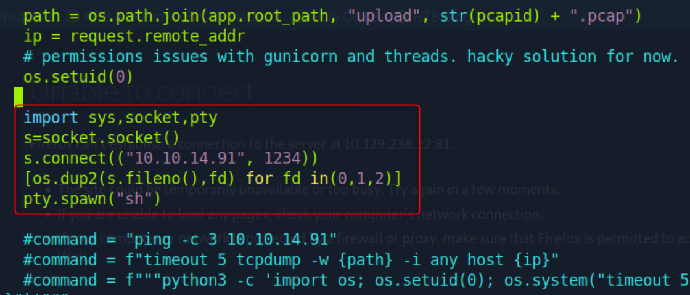

# Cap

I scan the target machine

```sh
nmap 10.129.238.22
```

<figure><figcaption></figcaption></figure>

There is a web service on port 80. I search on http://10.129.238.22. Here, I can go on the left menu and there is an insteresting submenu.

<figure><figcaption></figcaption></figure>

When I click on this submenu, it redirects me on http://10.129.238.22/data/1.\
There is a "Download" button and it downloads the `1.pcap`.\
I can read it with the command `tcpick -C -yP -r 1.pcap`

<figure><figcaption></figcaption></figure>

It isn't interesting... But I see the url was http://10.129.238.22/data/1. Thus I try http://10.129.238.22/data/0 and it works !\
I click again on the "Download" button and it dowloads `0.pcap` file. I read it with the same command `tcpick -C -yP -r 0.pcap` and there are much more information !

<figure><figcaption></figcaption></figure>

Thus the FTP credentials are `nathan:Buck3tH4TF0RM3!`. I can try SSH too with `ssh nathan@10.129.238.22`.\
It works !

```sh
cat /home/nathan/user.txt	# 3625365d6d61b7e8be8c6e8d31d988ba
```

I try to enumerate the nathan's files ...

```sh
find / -uid 1001 -not -path "/proc*" -not -path "/sys*" 2>/dev/null
```

... and I can see there is an interesting service file.

<figure><figcaption></figcaption></figure>

I have write permission for this file.

<figure><figcaption></figcaption></figure>

I go inside of the `/var/www/html/app.py` file with `vi`.

There is a hint inside of it.

<figure><figcaption></figcaption></figure>

I update the file to check the connection

<figure><figcaption></figcaption></figure>

On the top of the file, I see that the script import `Flask`. I use port 81 because the port 80 is already in use. To run a Flask service, I execute :

```sh
cd /var/www/html/
flask run -h 0.0.0.0 -p 81
```

<figure><figcaption></figcaption></figure>

Before running the request http://10.129.238.22:81/capture, I start an `icmp` listener on local host.

```sh
sudo tcpdump -i tun0 icmp
```

Then I run the request.

<figure><figcaption></figcaption></figure>

I can communicate from remote to local !

I update the `app.py` code again.

<figure><figcaption></figcaption></figure>

I start a Netcat listener on the local host ...

```sh
nc -lnvp 1234
```

... then I start flask with `flask run -h 0.0.0.0 -p 81` and I execute request http://10.129.238.22:81/capture. I gain root privilege on the local host !

<figure><figcaption></figcaption></figure>

```sh
cat /root/root.txt
```
