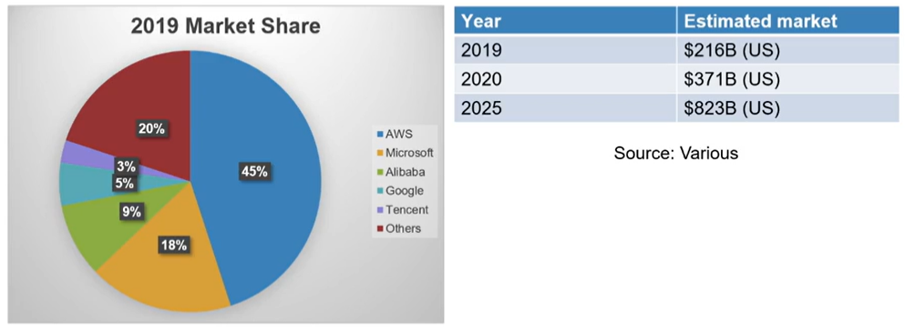
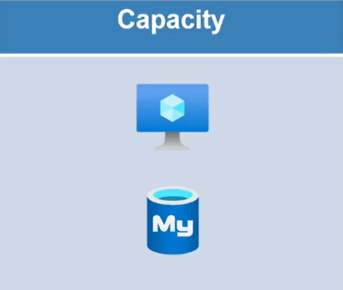
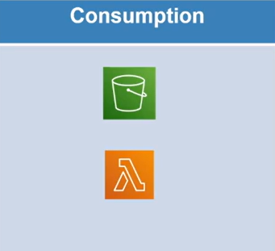
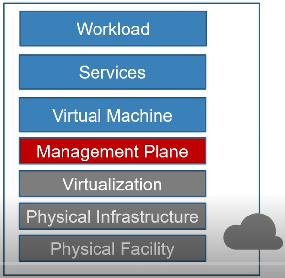
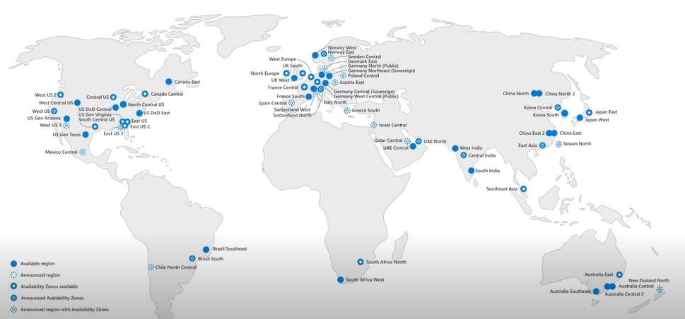

# Cloud Foundations

## Introduction

### Topics

* Introduction
* Cloud management
* Cloud services
* Cloud providers

### Learning objectives

After completing this course, you will be able to :

* Define what is meant by "the cloud".
* Explain why organizations are moving workloads to the cloud.
* Identify services that are provided in the cloud.
* List the major cloud providers.

## What is the Cloud ?

### Cloud architecture

**On-premises information systems architecture**

* Workload
* Services
* Virtual machine
* Virtualization : platform, maintenance, licensing
* Physical infrastructure : power, network, racks, storage
* Physical facility : cost of space, physical security, personnel

### **Cloud architecture**

This is the same architecture of the above list. The cloud takes care of **Physical facility**, **Physical infrastructure** and **Virtualization**. It's providing data centers.

* Workload
* Services
* Virtual machine
* Management plane : it is managing functionality for the workload.
* Virtualization
* Physical infrastructure
* Physical facility

### Types of Cloud Services

* Software as a service (SaaS).
* Platform as a service (PaaS).
* Infrastructure as a service (IaaS).

### Accessing Cloud Services

* Internet
* VPN
* Private circle service

## Who are the Cloud Providers ?

* Cloud Market
* AWS : launched 2006, over 1.000.000 active users, over 190 countries, 18 global regions, over 175 products and services.
* Azure : launched 2010, over 169 services, over 300k customers, 57 regions, 31 geographies.
* Google Cloud Platform : launched 2010, over 90 services, not sure how many users.
* Other Cloud Providers
  * In the neighborhood of 20% of the market.
  * Tencent and Alibaba in China.
  * IBM and Oracle.
  * Digital Ocean.
  * Private cloud providers.

<figure><figcaption></figcaption></figure>

## Why choose the Cloud ?

### **Cloud economics**

### **CapEx vs. OpEx**

* On-premises capacity expansion = capital expense
  * Purchase equipment and licensing up-front
  * Depreciate and replace equipment
  * Renew licenses
* Cloud-base capacity expansion = operational epxense
  * Billed monthly for what is used
  * No equipment purchase
  * May or may not require license purchase
* Capacity reduction
  * On-premises : possibly sell excess equipment
  * Cloud : reduce monthly cost

### **Consumption-based spending**

* Capacity-based spending
  * On-premises resources
  * Some cloud resources - virtual machines
* Consumption-based spending
  * Pay only for what is used
  * Functions, lambda
  * Services
  * Storage

### **Functional Advantages**

* Provision environments in minutes rather than days, weeks, or months
  * No capital equipment purchases
  * Streamlined provisioning process
* Built-in access and allocation management
* Reduced administrative overhead

### **Also, maybe not**

* Existing investment
* On-going operational expenses
* Data fencing
* Regulatory compliance

## Managing Cloud Services

### Tools

* Web-based
  * Azure : https://portal.azure.com
  * AWS : https://console.aws.amazon.com
  * GCP : https://console.cloud.google.com
* Command line
  * AWS : [AWS CLI](https://docs.aws.amazon.com/cli/latest/userguide/install-cliv2.html) & [PowerShell](https://docs.aws.amazon.com/en-US/cli/azure/install-azure-cli)
  * Azure : [Azure CLI](https://docs.microsoft.com/en-us/cli/azure/install-azure-cli) & PowerShell (`Install-Module -Name Az -AllowClobber -Scope CurrentUser`)
  * Google Cloud : Google Cloud SDK, Component management (kubectl) & [Cloud Tools for PowerShell](https://cloud.google.com/tools/powershell/docs/quickstart)
  * Cloud shell
* REST API

### Demo

```bash
aws ec2 describe-instances     # AWS
gcloud compute instances list  # GCloud
az vm list                     # Azure
```

## Cloud Cost Management

### Cloud pricing models

* Capacity : usage per hour/minute/second

<figure><figcaption></figcaption></figure>

* Consumption : AWS, Lambda

<figure><figcaption></figcaption></figure>

The data transfer can be free for upload and you will must pay for download.

### Calculate resource costs

* https://azure.microsoft.com/en-us/pricing/calculator/

### Cloud billing

* Billing entity
* Billing cycle
* Billing management
* Billing rate
* Marketplace billing : if the bill comes from another provider than yours, you could pay additionnal billing.

### Cost monitoring

* Budgets : cloud provider allows to set budget and to set **alerts**.
* Alerts : alerts are easy to do, there are monitoring tools that are built in to the platform.
* Monitoring tools
* Third party

### Cost optimization

* Agents : they are watching your patterns and suggesting to you ways that you can reduce your costs.
  * Azure advisors
  * AWS cost anomaly detection
  * Google recommender
* Sizing
* Autoscale : all of these providers have an autoscale feature, you can react to these conditions.
* **Serverless** options : it requires a little bit of rearchitecture your applications.&#x20;
* Long-term commitments & bulk discounts : if you commit to say running a workload or an EC2 or a virtual machine for three years, it's going to cost a lot less.

## Cloud Support and SLAs

### Cloud resource responsibility

<figure><figcaption></figcaption></figure>

The data you responsible are :&#x20;

* Workload
* Services
* Virtual Machine

The management the cloud responsibility is :&#x20;

* Management plane
* Virtualization
* Physical infrastructure
* Physical facility

I'm running a virtual machine, and I've got a service running nginx and a web app on my workload. For any reason, the services break down and don't work anymore. You are responsible of these services since the nginx is in the **Service** layer and the web app is in the **Workload** layer. The Cloud provider can do anything to solve this.

In the other hand, if I'm working with a PAAS (Platform As A Service) I'm still responsible of the workload but not of the service running on the Cloud provider.

All services delivered by the Cloud provider must respect the **SLA** (Service Level Agreement).

### Cloud SLAs

* AWS : baseline EC2 - 99.99% uptime
* Azure : baseline virtual machine - 99.99% uptime
* GCP : baseline virtual machine - 99.99% uptime

### Cloud Support

* AWS
  * Basic
  * Developer : 29$
  * Business : 100$
  * Enterprise : 15000$
* Azure
  * Basic
  * Developer
  * Standard
  * Professional direct
* Google Cloud Platform
  * Basic
  * Developer
  * Production
  * Premium


## Cloud Infrastructure Services

### Infrastructure as a Service

The lowest of service. You can can create a virtual machine, then a service, then a workload.


### Cloud Networking


### Cloud Storage

* AWS : S3 buckets, EFS, EBS
* Azure : Storage account, managed disks
* Google Cloud : storage buckets, compute engine disks and images

## Cloud Platform Services

### Platform as a Service


### Application Hosting

**Applications**

<table><thead><tr><th width="272">AWS</th><th width="242.33333333333331">Azure</th><th>Google Cloud</th></tr></thead><tbody><tr><td>Lightsail</td><td>Web Apps</td><td>App Engine</td></tr><tr><td>Batch</td><td>API Apps</td><td>Cloud Functions</td></tr><tr><td>Lambda</td><td>Function Apps</td><td>Workflows</td></tr><tr><td>Beanstalk</td><td>Logic Apps</td><td></td></tr><tr><td></td><td>Batch</td><td></td></tr></tbody></table>

**Containers**

| AWS                        | Azure                     | Google Cloud       |
| -------------------------- | ------------------------- | ------------------ |
| Elastic Container Service  | Azure Container Registry  | Cloud Run          |
| Elastic Container Registry | Azure Container Instances | Container Registry |
| Elastic Kubernetes Service | Azure Container Services  | Kubernetes Engine  |
| Fargate                    |                           | Cloud Build        |
|                            |                           | Cloud Code         |

### Data Hosting

**Applications**

| AWS           | Azure                         | Google Cloud  |
| ------------- | ----------------------------- | ------------- |
| Amazon Aurora | Azure SQL database            | Cloud Spanner |
| Amazon RDS    | Azure Database for PostgreSQL | Cloud SQL     |
|               | Azure Database for MySQL      |               |
|               | Azure Database for MariaDB    |               |

**Containers**

| AWS                | Azure             | Google Cloud   |
| ------------------ | ----------------- | -------------- |
| Amazon Redshift    | Cosmos DB         | Cloud Bigtable |
| DynamoDB           | Azure Synapse     | Firestore      |
| Amazon Elasticache | Azure Redis Cache | Bigquery       |
| Amazon DocumentDB  |                   | Firebase       |
| Amazon Keyspaces   |                   | Memorystore    |
| Amazon Neptune     |                   |                |

### Other Services

* Authentication and identity services
* Security services
* Media services
* Migration services
* Archiving services
* Machine learning
* Cognitive services
* IoT services
* ...

## Cloud Application Services

### Software as a Service


### SalesForce

* The leader in customer relations management (CRM)
* Depending on approach, the biggest SaaS provider
* Integration through Lightning platform
* Collaboration, coaching, and training management
* Online marketplace

### Microsoft 365

* Productivity suite : email, collaboration, file management
* Online & offline versions of Office products
* CRM and business process management through Dynamics 365
* Low-code and no-code customization

### G Suite

* Productivity suite : email, collaboration, file management
* Highly integrated

### Collaboration

* Slack
* Zoom
* Microsoft Teams
* Google
* ...

### Others

* Customer relations management
* Enterprise resource planning
* Content management systems
* Accounting
* Business continuity
* ...

## Scalability & Availability

### Regional Computing

<figure><figcaption></figcaption></figure>

### Cloud Scale

**Scale on premise**


**Scale with Cloud**

Thanks to the Cloud Datacenter, it's possible to scale up/down your instance as you wish. Set the CPU, the memory or create new Virtual Machines. Furthermore, you can use the datacenter to compute data with the Lambda function.


### Cloud Availability


## Cloud Providers

### Azure


### AWS


### Google Cloud


