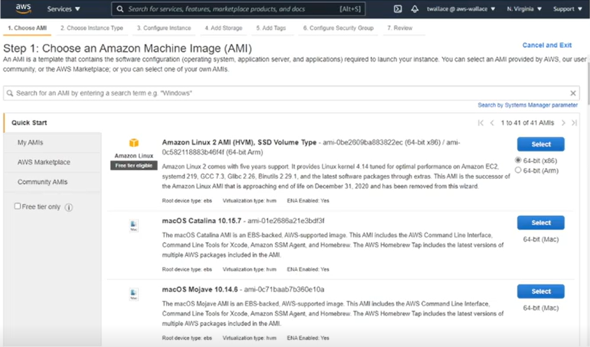
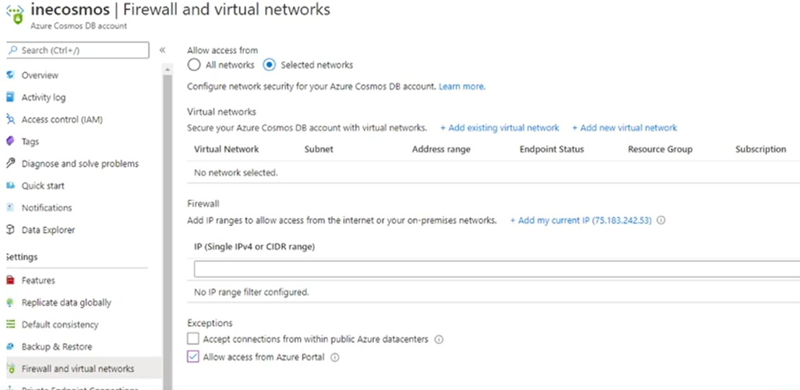
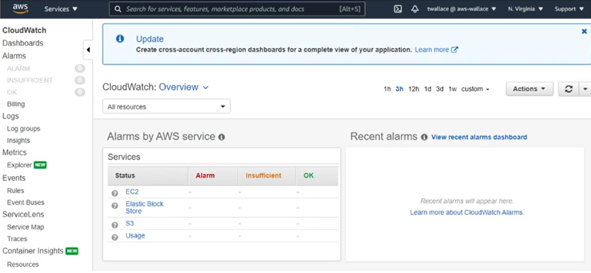
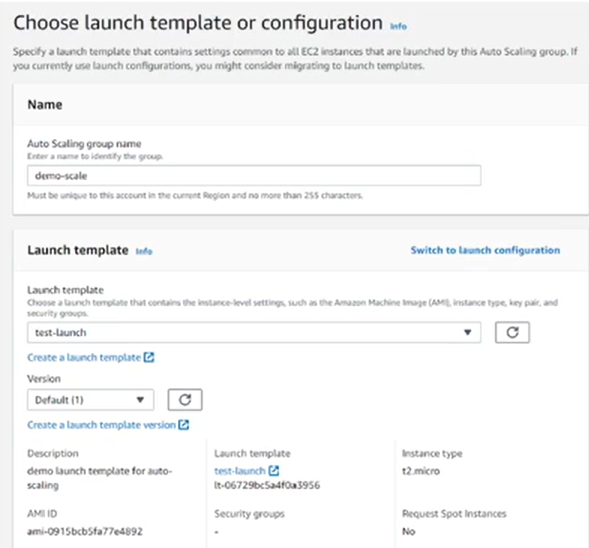

# Cloud Management Concepts

## Learning Objectives

After completing this course, you will be able to :&#x20;

* Describe the unique aspect of managing resources in the cloud
* Identify the cloud resource management tasks
* Explain the fundamentals of cloud access control

## Cloud Shared Responsibility Model

### Shared

### Management

* **You :** you are always responsible for managing your identities, and access to your subscription.
* **Cloud Provider :** it's always responsible for managing and securing the facility, infrastructure, virtualization, and cloud management plane.

Responsiblity in spite of the service :&#x20;

* **IaaS** (Infrastructure as a Service) : you are responsible for managing the virtual machine (OS) and above.
* **PaaS** (Platform as a Service) : you are responsible for managing the workload.
* **SaaS** (Software as a Service) : the provider is responsible for managing the full stack. You may be responsible for managing customizations. You are still responsible for managing usage and adhering to good practices and compliance.

### Security

* Provider responsibility
  * Physical security
  * Infrastructure security
  * Platform security
  * <mark style="color:purple;">Identity system security</mark>
  * <mark style="color:purple;">Standards compliance</mark>
* Customer responsibility
  * <mark style="color:purple;">Identity security</mark>
  * <mark style="color:purple;">Data security</mark>
  * <mark style="color:purple;">Application security</mark>
  * <mark style="color:purple;">Standards compliance</mark>


The elements in <mark style="color:purple;">purple</mark> are shared responsibilities between the customer and the provider.


### Resiliency

* 99.99% uptime service level agreement (SLA)
* Build redundancy to support availability
* Build resiliency into applications

### Workload

* Workload still fail in the cloud
* SaaS out of the box
  * Workload failures are the responsibility of the provider
  * No customization
* Good software lifecycle management practices are still crucial

## Managing Cloud Resources

### Provisioning

<figure><figcaption></figcaption></figure>

### Configuring

<figure><figcaption></figcaption></figure>

### Maintaining

* Maintaining code base
* Maintaining data
* Maintaining security

### Monitoring

<figure><figcaption></figcaption></figure>

### Change Management

* It is easy to change things in the cloud
* Governance is critical in the cloud
* Tools are available for managing change - platform specific and vendor neutral

## Monitoring & Alerts

### Cloud Monitoring

* Resource monitoring
* System monitoring
  * Azure Monitor
  * AWS CloudWatch
  * Google Cloud Monitoring

### Unified Monitoring

Third party monitoring tools :&#x20;

* Nagios
* Splunk
* PRTG

### Proactive Resource Management

* Cloud automation
* Cloud alerting

<figure><figcaption></figcaption></figure>

## Cloud Identity & Access Management

### Cloud-based Identity

### Access Management

**A federated user** is a user account managed in another system, such as Active Directory, that is synchronized with the cloud provider

* Azure
  * Users, Groups, Roles
  * Federated users
* AWS
  * Users, Groups, Permissions
  * Federated users
  * Policies grant permissions
    * Effect (allow/deny)
    * Action
    * Resources
    * Conditions
* GCP
  * Users, Groups, Roles, Policies
  * Federated users (preview as of Feb-2021)
  * Policies link users to roles on resources
    * User
    * Role
    * Resource
    * Condition

