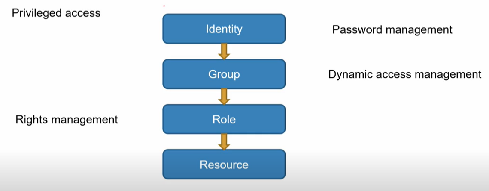
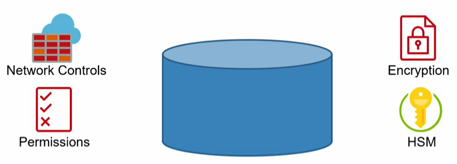
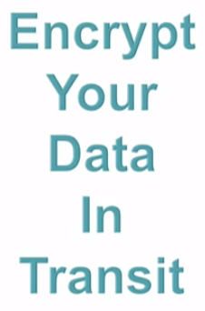
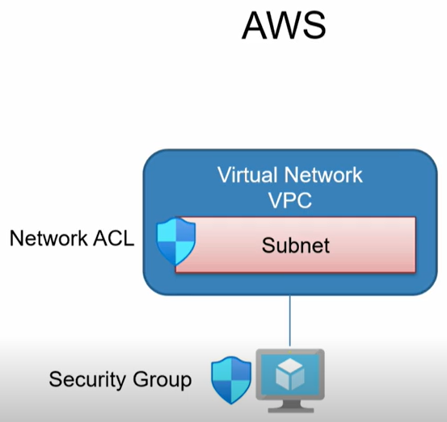
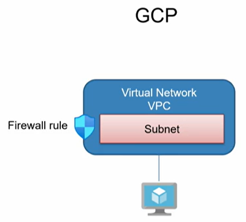

# Identity, Security, Compliance

## Introduction

* Fundamentals of Cloud Security
* Common Cloud Attacks
* Identity Protection
* Resource Protection
* Regulatory Compliance in the Cloud

## Fundamentals of Cloud Security

### Shared Responsibility Model

Who's responsible ? It depends of what type/level of service you're using. You will be never responsible for all level below the Control Plane.

**IaaS :** If you're using a virtual machine running a Nginx web server, you're choosing **IaaS** and you're responsible of 3 layers : workload, services & virtual machine.

**Paas :** you're only using a platform like Google Drive, Gmail, OneDrive, Excel, ... Thus you have less responsibility of the Cloud Provider.

### Securing Cloud Resources

You can divide the block into 3 different concepts :&#x20;

* Data Plane
* Control Plane
* Cloud Provider

### Defense in Depth

## Common Cloud Attacks

### Attack Targets

* Identities
  * Software as a Service) SaaS identities
  * Cloud platform identities : Microsoft 365 uses Azure AD, the cloud environment and the control plane use Azure AD. Thus Azure AD is a major target.
  * Data plane identities
* Data
  * S3 bucket
* Services
  * Emails
  * Control Plane Service itself
  * Compute instance

### Attack Methods

* Misconfiguration
  * Intentional or inadvertent
  * Data stores or services : database, public API, service
  * Allows unauthorized third-party access
* Account Hijacking
  * Brute-force : wordlist of passwords with a known username.
  * ...
  * Credential Stuffing : you compromise credentials by setting a database.
* Service Hijacking : you can hijack a service by dumping its key or certificate. Then you can log in with no username/password, only with the key/certificate.
* Malware : an attacker embeds bad code in a web app, depot code, etc.

## Identity & Access Managmnt (IAM)

### Accessing & Managing Cloud Resources

I've some resources, with a database a virtual machine & a web app. I've the cloud with its Control Plane. The Cloud needs to known who is logged (Identity). Despite of the given identity, the Cloud gives some permissions to the data.

### Managing Cloud Users

The basic best practices are :&#x20;

* Minimize **root** user access
* Organize into groups
* Use dynamic management when possible
* Audit & review user configuration

### Managing Access to Resources

These are the ways you should manage resources :&#x20;

* Always apply least privilege
* Use dynamic access policies when possible
* Audit resource access
* Separate control plane & data plane access : the people that needs have access to the cloud manager may different than the people that needs have access to the data plane. It's better to have 2 different AD : **Control Plane** & **Data Plane**.

## Identity Protection

### Cloud Identity Sources

You need to be aware of the Cloud user.

### Identity Vulnerabilities

| Account                     | Login                           |
| --------------------------- | ------------------------------- |
| Weak passwords              | IP address & location anomalies |
| Leaked credentials          | Password spraying               |
| General threat intelligence | Brute force attacks             |

### Managing Identities

<figure><figcaption></figcaption></figure>

<table><thead><tr><th width="189.33333333333331">AWS</th><th width="316">Azure</th><th>GCP</th></tr></thead><tbody><tr><td>IAM Users</td><td>Azure AD Users</td><td>Google Account</td></tr><tr><td>IAM Roles</td><td>Azure AD Service Principals</td><td>Service Account</td></tr><tr><td>IAM Policies</td><td>Azure AD Managed Identities</td><td>Role</td></tr><tr><td></td><td>Roles</td><td>Policy</td></tr></tbody></table>

**Identity Protection Services** (multi-factor authentication)

<table><thead><tr><th width="193.33333333333331">AWS</th><th width="220"></th><th></th></tr></thead><tbody><tr><td>CloudTrail</td><td>Identity Protection</td><td>Advanced Protection Program</td></tr><tr><td>Trusted Advisor</td><td>Azure AD Logs</td><td>G-suite alert center</td></tr><tr><td></td><td></td><td>Titan security keys</td></tr></tbody></table>

### Best Practices

* Apply password policy
* Implement conditional access
* Implement MFA
* Monitor
* Audit unused accounts

## Responding to Identity Compromise

### The Five R's

* **Revoke :** revoke permissions for the compromised identity, isolate the identity from data services, and resources.
* **Reset :** reset session tokens, API keys, resource access keys, any form of trusted identity.
* **Review :** review with IT, with business personnel & determine impact.
* **Remediate :** remedial training, improve processes, define forward plan of action, report as necessary.
* **Return :** return to operating state, monitor.

## Data Protection

### Types of Cloud Data

<table><thead><tr><th width="144">Files</th><th width="127">Relational</th><th width="154">Non-Relational</th><th width="163">Big Data</th><th>Sensitive</th></tr></thead><tbody><tr><td>Blobs</td><td>Managed</td><td>Managed</td><td>Semi-structured</td><td>Keys</td></tr><tr><td>Buckets</td><td>Proprietary</td><td>Proprietary</td><td></td><td>Certificates</td></tr><tr><td>File Services</td><td>IaaS hosted</td><td>IaaS hosted</td><td></td><td>Audit</td></tr></tbody></table>

### Protecting Data at Rest

<figure><figcaption></figcaption></figure>

Moreover, you must replication and backups of your data. The data protection is also check if it isn't corrupted.

### Protecting Data in Transit

<figure><figcaption></figcaption></figure>

### Connecting to Data

The **MySQL** database is managed by the Cloud. A client can interact with the database. If you publish the database and gain access publicly (<mark style="color:red;">the red arrows</mark>), you expose your database.

If you have the access by the Cloud, the attackers can't try directy to gain access to the database and must go through the Cloud (<mark style="color:green;">the green arrows</mark>).

### Best Practices

* **Limit access :** resource, data, network
* **Always encrypt :** at rest, in transit, end-to-end
* **Protect from failure :** replicate, backup
* **Audit**

## Network Protection

### Cloud Provider Network Protection

* DDoS protection
* General threat protection

### Tenant Network Protection

<figure><figcaption></figcaption></figure>

<figure><figcaption></figcaption></figure>

You can set VPC Virtual Network :&#x20;

* GCP : VPC Service Control
* Azure : Private Endpoint
* AWS : PrivateLink

**Network Security Services**

| AWS           | Azure               | GCP                |
| ------------- | ------------------- | ------------------ |
| AWS Shield    | Azure Firewall      | Google Cloud Armor |
| AWS WAF       | Application Gateway |                    |
| AWS GuardDuty | Azure FrontDoor     |                    |


WAF means Web Application Firewall


### Best Practices

* Leverage provider tools
* Limit public attack surface
* Monitor
* Alert atypical usage patterns
* Have a playbook

## Compute Protection

### Infrastructure Compute Protection

For one instance, the protections are :&#x20;

* Patch management : update the version when it's possible.
* Attack surface minimization : don't run services that aren't required.
* OS hardening&#x20;
* Resource protection&#x20;
* Monitoring

### Platform Compute Protection

### Patching

* Infrastructure as a Service
  * OS : automated option in AWS & Azure
  * Service : such as web server or database server
* Platform as a Service
  * Always patched by the provider

### Confidential Compute

An enclave is a confidential compute, it allows to put up an encrypted wall around that data while you compute it. It can be done at a hardware/software level. It completely isolates your data that's inside an execution. It runs in an isolated space on the processor & memory.

### Compute Monitoring

## Regulatory Compliance in the Cloud

### Cloud Provider Regulatry Support

* Cloud tools
  * Amazon GuardDuty
  * Azure Compliance Manager
  * GCP Security Command Center
* Documentation
  * Microsoft Trust Center
  * Amazon Artifact
  * GCP Compliance Resource Center

### Tenant Responsibilitites

* Understand your regulatory requirements
* Document provider compliance with regulations
* Implement your repsonsibilities
* Use the provider tools to achieve, maintain & document compliance

### Common Protected Data

* Types of data
  * PII (Personal Identifiable Information)
  * Health Care (Protected Health Information)
  * Financial Services (PII, PCI-DSS, Sarbanes Oxley)
* Business relevance
  * Intellectual property
  * Legal considerations
  * Business reputation
* Regional considerations
  * GDPR-EU
  * California
  * US Federal Protected Data Type (research, technology, weapon, etc.)
