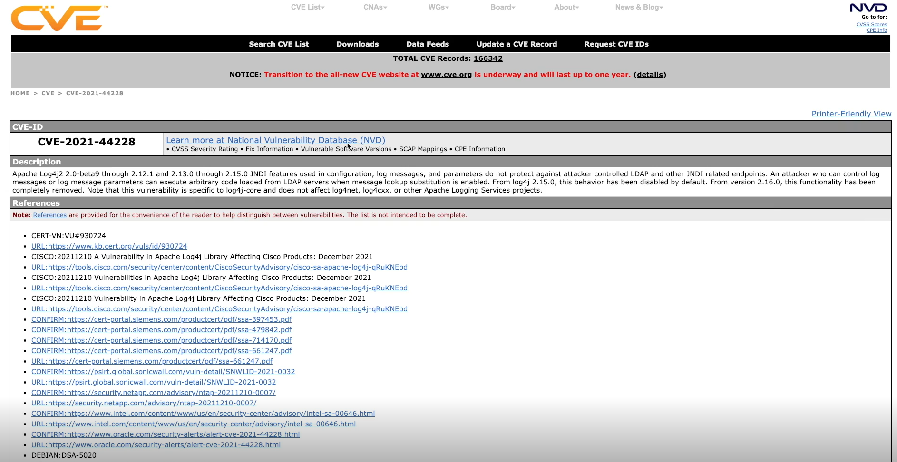
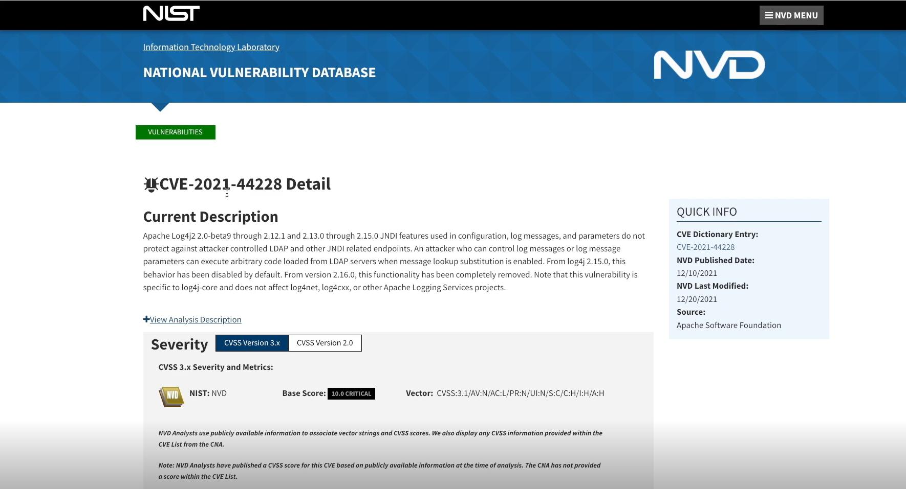
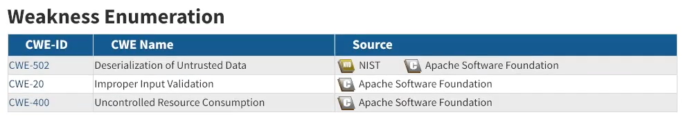

# 4. Vulnerability assessment

### Topics

* Vulnerabilities
* Case studies
  * Heartbleed
  * EternalBlue
  * Log4j
* Labs
  * Nessus
  * ExploitDB

### Learning objectives

* Students will describe vulnerabilities.
* Students will recognize Common Vulnerabilities and Exposures reports and National Vulnerability Database submissions.
* Students will understand non-technical vulnerabilities.
* Students will describe vulnerability management.
* Students will perform network auditing.
* Students will perform vulnerability research.

### Overview

#### Definitions

**NIST :** a weakness in the computational logic (e.g. code) found in software and hardware components that, when exploited, results in a negative impact to confidentiality, integirty, or availability.

There are several types of vulnerabilities :

* Heist vulnerabilities : the physical layer of the OSI model covers different physical access : mantraps, volts, proper door lock, gates, fences, lighting, cameras.
* Cybersecurity vulnerabilities : they come from a software or the operating system itself. Vulnerabilities are found by DevSecOps engineers, security researchers, pentesters, software developers or users.

**CVE :** Common Vulnerabilities and Exposures. One of them is managed by MITRE Corporation funded through the National Cybersecurity Division of US Department of Homeland Security.

**NVD :** National Vulnerability Database.

#### CVE identifiers

The CVE identifiers aliases are _CSV names_, _CVE numbers_, _CVE-IDs_ or _CVEs_. All of these CVEs have a unique identifier, example :

* CVE-2021-44228 : Log4j
* CVE-2014-0160 : Heartbleed
* CVE-2017-0143 : Eternal Blue

#### Vulnerability detail pages

* Description
* Severity
* References
* Weakness enumeration
* Known affected software configurations

<figure><figcaption></figcaption></figure>

<figure><figcaption></figcaption></figure>

These are the detail page of the `CVE-2021-44228` or `Log4j`.

* https://nvd.nist.gov/vuln/detail/cve-2021-44228
* https://cve.mitre.org/cgi-bin/cvename.cgi?name=cve-2021-44228

Weakness enumeration helps to solve the CVE in the future.

<figure><figcaption></figcaption></figure>

The **critical score (CVSS)** can be calcutated [here](https://nvd.nist.gov/vuln-metrics/cvss/v3-calculator?name=CVE-2021-44228\&vector=AV:N/AC:L/PR:N/UI:N/S:C/C:H/I:H/A:H\&version=3.1\&source=NIST).

| cMetric                         | Acronym | Parameter                                                                            |
| ------------------------------- | ------- | ------------------------------------------------------------------------------------ |
| **Base Score Metrics**          |         |                                                                                      |
| Attack Vector                   | AV      | Network - Adjacent network - Local - Physical                                        |
| Attack Complexity               | AC      | Low - High                                                                           |
| Privileges Required             | PR      | Not defined - Low - High                                                             |
| User Interaction                | UI      | Not defined - Required                                                               |
| Scope                           | S       | Unchanged - Changed                                                                  |
| Confidentiality Impact          | C       | Not defined - Low - High                                                             |
| Integrity Impact                | I       | Not defined - Low - High                                                             |
| Availability Impact             | A       | Not defined - Low - High                                                             |
| **Temporal Score Metrics**      |         |                                                                                      |
| Exploit Code Maturity           | E       | Not defined - Unproven that exploit exists - POCC - Functional exploit exists - High |
| Remediation Level               | RL      | Not defined - Official fix - Temporary fix - Workaround - Unavailable                |
| Report Confidence               | RC      | Not defined - Unkown - Reasonable - Confirmed                                        |
| **Environmental Score Metrics** |         |                                                                                      |
| Attack Vector                   | MAV     | Not defined - Network - Adjacent Network - Local - Physical                          |
| Attack Complexity               | MAC     | Not defined - Low - High                                                             |
| Privileges Required             | MPR     | Not defined - Low - High                                                             |
| User Interaction                | MUI     | Not defined - Required                                                               |
| Scope                           | MS      | Not defined - Unchanged - Changed                                                    |
| Confidentiality Impact          | MC      | Not defined - Low - High                                                             |
| Integrity Impact                | MI      | Not defined - Low - High                                                             |
| Availability Impact             | MA      | Not defined - Low - High                                                             |
| Confidentiality Requirement     | CR      | Not defined - Low - Medium - High                                                    |
| Intergrity Requirement          | IR      | Not defined - Low - Medium - High                                                    |
| Availability Requirement        | AR      | Not defined - Low - Medium - High                                                    |
| ### Zero day                    |         |                                                                                      |

There are vulnerabilities that haven't been found. That we call a zero-day exploit, meaning no one else knows about it or no one else has exploited it or no one else has at least reported it to the CVE organisation.

#### Other vulnerabilities

Not all vulnerabilities are computer code. Social engineering and utilizing interpersonal skills are going to be just as helpful for a hacker or a pentester in order to get access to information or the network. Than can include using known social engineering for passwords or taking advantage of maybe some of your physical operational technology controls, such as card readers or access badges.

#### How to find vulnerabilities ?

* Scanning
* Asset identification + research
* Fuzz testing (input/handling validation)

### Case studies

#### Heartbleed CVE-2014-0160

Link : https://cve.mitre.org/cgi-bin/cvename.cgi?name=cve-2014-0160

#### EternalBlue CVE-2017-0143

#### Log4J CVE-2021-44228

### Lab 1 : Nessus

Nessus is an enumeration tool and vulnerabilities scanning tool : https://www.tenable.com/downloads/nessus?loginAttempted=true

### Lab 2 : vulnerability research

```bash
john@kali> ip a
john@kali> nmap 10.3.27.0
john@kali> nmap 10.3.27.0 -p 80,135,139,445,3389 -sV

john@kali> msfconsole
msf5> use exploit/windows/http/badblue_passthru
msf5> set rhosts 10.3.27.0
msf5> run
```
