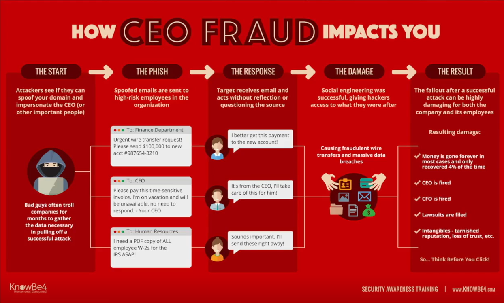

# Social engineering

### Fundamentals

The goal of social engineering is either to gain access or to gather information. So either we're getting something from the or we're getting access via a human being.

#### Ways

* Impersonation
* Pretexting
* Emotional pull
* Urgent
* Free stuff
* Blackmail/Extortion
* Quid pro quo

#### Tactics

* Phishing
* Watering hole
* Baiting
* Physical access

#### Phishing

* Reply with information
* Click on links
* Download files

| Type           | Description                                                        |
| -------------- | ------------------------------------------------------------------ |
| Spear phishing | Targeted phishing.                                                 |
| Whaling        | Spear phishing of high-value individuals (C-suite, Board Members). |
| Smishing       | Like phishing, but through SMS messaging.                          |
| Vishing        | Like phishing, but through voice calls.                            |

**Phishing sources**

* Pharming : redirecting web traffic maliciously.
* Watering hole : use a trusted site against you.
* BEC : Business Email Compromise.
* Impersonation/Spoofing : additional tactic.

### Case studies

* CEO fraud

<figure><figcaption></figcaption></figure>

* Robinhood vishing
* Fake Excel file
* HTML table Windows logo
* FIN7 USB mail

### Phishing lab

Install package from Github : https://github.com/gophish/gophish.git.

```bash
kali@kali> git clone https://github.com/gophish/gophish.git
kali@kali> cd gophish
kali@kali> go build
kali@kali> ./gophish
```

Go to https://localhost:3333 and use the credentials from the shell.
