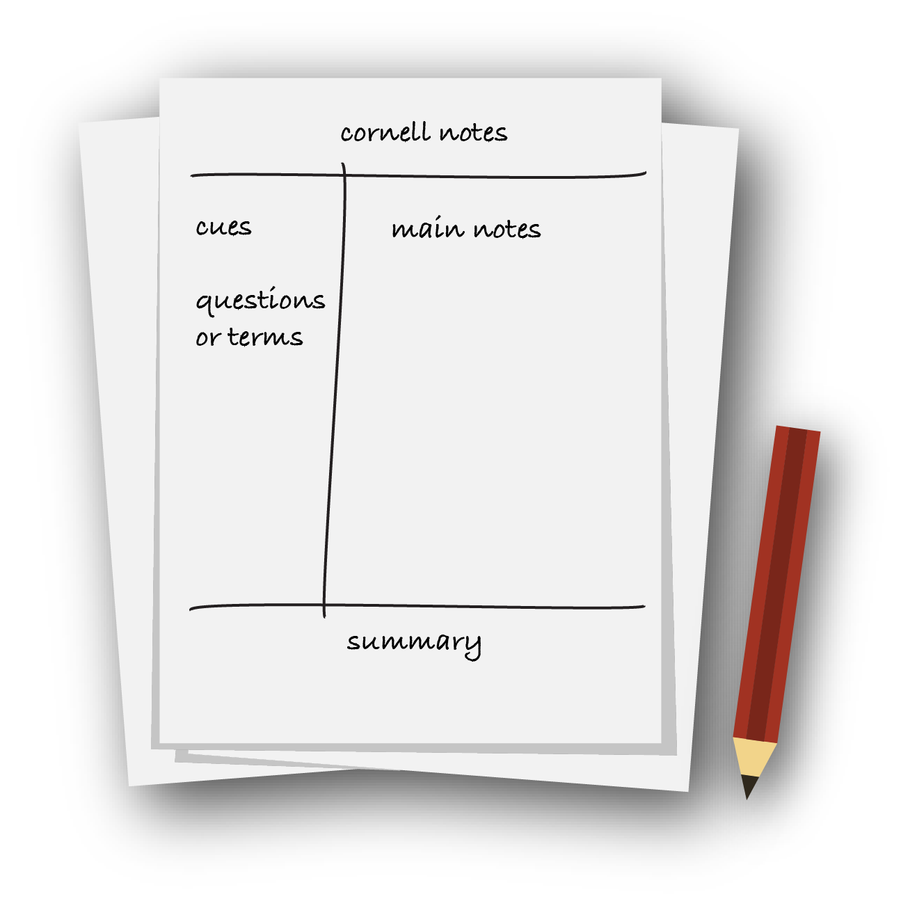

# 4. Effective Learning Strategies

## Learning Theory

The learning depends on:

* The learners
* The teacher
* The material
* The education format
* ...

We can improve memory by doing:

* Improve the <mark style="color:yellow;">quality of information</mark> we take in.
* Improve the <mark style="color:yellow;">way or mode</mark> in which we receive information.
* Improve our <mark style="color:yellow;">practice</mark> of retrieving information.

<mark style="color:yellow;">Dual Coding</mark> is reading an explanation and then watching a video about the same Module.

The 2 factors of forgetting are <mark style="color:yellow;">Too Long Ago</mark> and <mark style="color:yellow;">Too Much Information at Once</mark>.

The <mark style="color:yellow;">Forgetting Curve</mark> says by learning a document, you will remember:

* 100% at the time of acquisition
* 58% 20 minutes later
* 23% a day later

The <mark style="color:yellow;">Cognitive Load</mark> may be helpful to imagine our brain as sort of a room, with pieces of information (that take up space) moving in and out.

## Way of Learning

### Digital vs Material

Book learning

* It forces us to be distraction-free and allows for deeper focus.

Screen learning

* Smaller screens make learning more difficult than books.
* It can cause visual or sensory fatigue.
* Get easy access to a lot of resources and tools.

<mark style="color:yellow;">Contextual Learning</mark> is important too. It's easier to learn how a language works on a computer rather than on a book. On the other hand, it seems more comfortable to read History things in a book.

### Remote Learning

The consequences of remote learning are:

* No guarantee of peer support, community, and camaraderie.
* The timing of the course is the learner's responsibility.
* Flexible hours of learning.
* Asynchronous record for the instructor.

## OffSec Training

### Ways of Demonstration

That's better to demonstrate this way (<mark style="color:yellow;">Modeling</mark>):

```bash
kali@kali:~$ ls *.txt
oldfilename.txt

kali@kali:~$ mv oldfilename.txt newfilename.txt
 
kali@kali:~$ ls *.txt
newfilename.txt
```

Instead of this way which is wrong:

```
Use the "mv" command.
```

The first one is better because you add context and you show how to run this command. You can also verify content before & after running the command to increase understanding.

### Learning by Doing

The method of Learning by Doing is split in several ways:

* The <mark style="color:yellow;">Training Materials</mark> themselves will always trend toward focusing on scenarios that we can follow along with.
* The <mark style="color:yellow;">Module Exercices</mark> themselves will often involve working with a VM as well.
* The <mark style="color:yellow;">Challenge Labs</mark> is, essentially, an environment of additional practice exercises specifically created to help learners prepare for an exam
* <mark style="color:yellow;">Proving Grounds</mark> are exercises and networked lab environments specifically for proving the skills we've learned.

### Facing Difficulty

* Memorizing syntax is less important than <mark style="color:yellow;">being familiar with challenges</mark> and comfortable with some struggles.
* Getting stuck can help us to repeat the covered material. That's an **indirect route** to the finish line.

The <mark style="color:yellow;">Interleaving</mark> says that our brain can make more connections to help us learn effectively if we are learning about how an attack method might be both executed and detected at the same time.

## Case Studies

If you accidentally remove the `chmod` executable permission, you can restore it by doing this procedure.

```bash
kali@kali:~$ echo '#!/usr/bin/python\nprint("Hello")' > script.py
kali@kali:~$ ls -l script.py
-rw-r--r-- 1 kali kali 34 Sep 28 04:48 script.py

kali@kali:~$ sudo chmod -x /usr/bin/chmod    # remove exec permission for chmod
kali@kali:~$ cp /usr/bin/ls chmodfix         # copy file permissions to chmodfix
kali@kali:~$ cat /usr/bin/chmod > chmodfix   # copy content file of chmod to chmodfix
kali@kali:~$ ./chmodfix +x /usr/bin/chmod    # restore exec permissions
kali@kali:~$ chmod +x script.py              # add exec permissions the Python script
kali@kali:~$ ./script.py
Hello
```

## Tactics & Common Methods

### The Cornell Notes

<figure><figcaption></figcaption></figure>

* The <mark style="color:yellow;">cue</mark> is the questions we have about the text keywords or phrases.
* The <mark style="color:yellow;">notes</mark> are related to the cue section. We can write a definition of what is meant by this term.
* The <mark style="color:yellow;">summary</mark> is a review of our notes.

### Practices

* [Retrieval Practice](https://psychology.ucsd.edu/undergraduate-program/undergraduate-resources/academic-writing-resources/effective-studying/retrieval-practice.html) is the practice of determining whether or not information can be recalled. You can create **FlashCards** with the question on one side and its response on the other side.
* [Spaced Practice](https://www.learningscientists.org/blog/2016/7/21-1) has to do with the timing and duration of our study time. It is recommended to spread out the study time over days and weeks rather than do it all at once. It's the opposite of "cramming"-style.

### SQ3R

[SQ3R](https://ucc.vt.edu/academic\_support/study\_skills\_information/sq3r\_reading-study\_system.html) stands for **S**urvey **Q**uestion **R**ead **R**ecite **R**eview.

* The <mark style="color:yellow;">Survey</mark> is reviewing a high-level outline and scanning through the material that might be covered during the study session.
* The learner will create a list of <mark style="color:yellow;">Questions</mark> that they hope to have answered via the material.
* The learner <mark style="color:yellow;">Reads</mark> the material one section at a time.
* The learner should try and <mark style="color:yellow;">Recite</mark> the questions back from memory and determine if he can now answer them.
* The learner <mark style="color:yellow;">Reviews</mark> to all of the smaller sections from a larger Module or chapter to check whether or not the questions have been answered and they can recall the answers.

### Feynman

1. Learn a module
2. Explain it to a beginner like a child
3. Identify gaps
4. Return to study

## Practical Steps

### Long Term Strategy

Planning can reduce stress levels. It helps us to create an idea of what will happen rather than allowing it to happen to us ([1](https://healthland.time.com/2011/05/31/study-25-of-happiness-depends-on-stress-management/)).

> _"Failing to plan is planning to fail"_

### Time Allotment Strategies

The strategy <mark style="color:yellow;">Spaced Practice</mark> requires looking at a calendar, finding reasonable time slots, and sticking to a schedule. Furthermore, studying in the evening before or after physical exercises is better. But the bedtime must be respected ([1](https://psychology.ucsd.edu/undergraduate-program/undergraduate-resources/academic-writing-resources/effective-studying/spaced-practice.html), [2](https://www.medicalnewstoday.com/articles/321161), [3](https://www.sciencedaily.com/releases/2019/10/191001083956.htm), [4](https://www.webmd.com/diet/news/20061103/exercise-fights-fatigue-boosts-energy), [5](https://www.scientificamerican.com/article/hit-the-gym-after-studying-to-boost-recall/)).

### Narrowing our Focus

* Changing the <mark style="color:yellow;">environment</mark> occasionally is good for us.
* Don't multitask, do <mark style="color:yellow;">one task</mark> at a time.
* Minimize extra noise, the music takes up mental space.
* Minimize distractions, airplane mode, isolation space for study, etc.

### Strategies

After a session, ask yourself these questions:

* What time did I start the study session?
* How long was the study session?
* Did I get interrupted? (if so, how did that happen)
* What did I do just before I started studying?
* What did I eat or drink before I started studying?
* What was my study location like? Was it quiet or busy?
* What did I do during the study session specifically?

That makes it easier to structure the outcomes session. If something goes wrong with this session, you can target the specific element of the list. If everything goes right, you can try to repeat the next session with the same environment.

