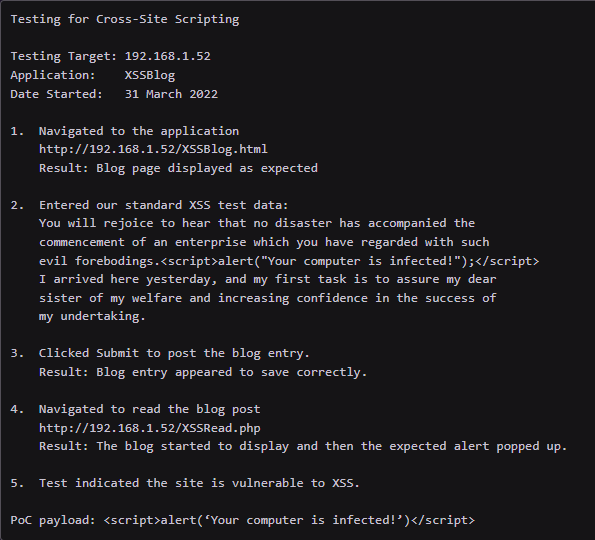

# 5. Report Writing

## Note-taking

### Deliverable

The report must be as detailed as possible such as:

* You can repeat the pentest to <mark style="color:yellow;">demonstrate the issue</mark>.
* You can repeat the pentest to show <mark style="color:yellow;">the issue has been fixed</mark>.
* You can check the pentest flow if there's <mark style="color:yellow;">a system failure</mark>, thus you can determine if the pentest is the cause.

> _"No plan survives first contact with the enemy"_

Sometimes, you don't have a lot of information about the environment and you won't be able to predict the form of the report. Furthermore, you have to be clear about the <mark style="color:yellow;">Rules of Engagement</mark> of RoE and their constraints.

### Structure

The principles to respect are:

* You record exactly what we did.
* Every line of code and action in the GUI must be in the notes.
* You must be able to remember the steps later with these notes.
* It must be structured & detailed to remove ambiguity.
* You provide sufficient technical details.

An example of a web application notes:

* Application name
* URL
* Request type
* Issue detail
* Proof of concept payload

<figure><figcaption><p>web application notes</p></figcaption></figure>

### Tool

The important items the tool must supply are:

* Screenshots
* Code blocks
* Portability
* Directory structure

Example of tools:

* [Sublime](https://www.sublimetext.com/download)
* [CherryTree](https://github.com/giuspen/cherrytree)
* [Obsidian](https://obsidian.md/)

### Screenshot

A <mark style="color:green;">good</mark> screenshot:

* is legible
* contains some visual indication that it applies to the client
* contains the material that is being described
* supports the description of the material
* properly frames the material being described

A <mark style="color:red;">bad</mark> screenshot:

* is illegible
* is generic rather than client-specific
* contains obfuscated or irrelevant information
* is improperly framed

Use the caption to describe the picture in a few words (**maximum 10 words**). If you have to provide additional information for this picture, you must create a new **block of text** below.

A great tool is [FlameShot](https://github.com/flameshot-org/flameshot).

## Report

### Environment

The two questions are:

* What is the purpose of the report?
* How we can deliver the information we've collected in a way that the audience can understand?

Most of the time, you have to highlight the issues that can concern the system itself. You must consider the following points:

* You must highlight the real issues.
* You must be as technical as the client wants to. Generally, you can just report there are no vulnerabilities at this location and write more detailed information about the location that hosts issues.
* You must organize vulnerability levels according to the environment you're testing on. A hospital will be more interested in the machine availability (HIPAA) than an eBusiness website. On the other hand, this website will provide more importance about the patches and the updates to secure the card payment.

### Audience

As you get several sections of the enterprise, you must build a report with several points of view. You can make a structure with a proper section for each type of audience.

1. <mark style="color:yellow;">Director</mark>: provide a section that highlights the outcome and impact of the engagement in a way that accurately reports on the vulnerabilities found while not being overloaded with technical details.
2. <mark style="color:yellow;">Technical Staff</mark>: you must provide more details to explain how to reproduce the issue and how to fix it.

### Executive Summary

1. You must start with the scope of the engagement.
2. Add the time frame of the test.
3. Refer to the Rules of Engagement.
4. Include supporting infrastructure and accounts.

<figure><figcaption><p>pertinent details</p></figcaption></figure>

Then break down the section:

* A brief description of the engagement
* The effective hardening
* The vulnerabilities discovered
* The conclusion


```
- "The Client hired OffSec to conduct a penetration test of
their kali.org web application in October of 2025. The test was conducted
from a remote IP between the hours of 9 AM and 5 PM, with no users
provided by the Client."
```



```
- "The application had many forms of hardening in place. First, 
OffSec was unable to upload malicious files due to the strong filtering
in place. OffSec was also unable to brute force user accounts
because of the robust lockout policy in place. Finally, the strong
password policy made trivial password attacks unlikely to succeed.
This points to a commendable culture of user account protections."
```



```
- "However, there were still areas of concern within the application.
OffSec was able to inject arbitrary JavaScript into the browser of
an unwitting victim that would then be run in the context of that
victim. In conjunction with the username enumeration on the login
field, there seems to be a trend of unsanitized user input compounded
by verbose error messages being returned to the user. This can lead
to some impactful issues, such as password or session stealing. It is
recommended that all input and error messages that are returned to the
user be sanitized and made generic to prevent this class of issue from
cropping up."
```



```
"These vulnerabilities and their remediations are described in more
detail below. Should any questions arise, OffSec is happy
to provide further advice and remediation help."
```


### Testing Considerations

The <mark style="color:yellow;">first</mark> section of the full report should detail issues that affected the testing. The are 3 states:

* Positive outcome: sufficient time for testing.
* Neutral outcome: the time doesn't affect the outcomes.
* Negative outcome: not enough time to test to environment.

### Technical Summary

The <mark style="color:yellow;">second</mark> section lists all of the key findings in the report, the structure can be:

* User & privilege management
* Architecture
* Authorization
* Patch management
* Integrity & signatures
* Authentication
* Access Control
* Audit, log management & monitoring
* Traffic & data encryption
* Security misconfigurations


```
4. Patch Management

Windows and Ubuntu operating systems that are not up to date were
identified. These are shown to be vulnerable to publicly-available
exploits and could result in malicious execution of code, theft
of sensitive information, or cause denial of services which may
impact the infrastructure. Using outdated applications increases the
possibility of an intruder gaining unauthorized access by exploiting
known vulnerabilities. Patch management ought to be improved and
updates should be applied in conjunction with change management.
```


### Technical Findings & Recommendation

In this section, you will describe all vulnerabilities in a table with findings and recommendations. It must be easy to understand for most people.

<table data-full-width="true"><thead><tr><th width="85">Ref</th><th width="67">Risk</th><th width="456">Issue Description</th><th>Recommendations</th></tr></thead><tbody><tr><td>1</td><td>H</td><td>Account, Password, and Privilege Management is inadequate. Account management is the process of provisioning new accounts and removing accounts that are no longer required. The following issues were identified by performing an analysis of 122,624 user accounts post-compromise: 722 user accounts were configured to never expire; 23,142 users had never logged in; 6 users were members of the domain administrator group; default initial passwords were in use for 968 accounts.</td><td>All accounts should have passwords that are enforced by a strict policy. All accounts with weak passwords should be forced to change them. All accounts should be set to expire automatically. Accounts no longer required should be removed.</td></tr><tr><td>2</td><td>H</td><td>Information was enumerated through an anonymous SMB session. An anonymous SMB session connection was made, and the information gained was then used to gain unauthorized user access as detailed in Appendix E.9.</td><td>To prevent information gathering via anonymous SMB sessions: Access to TCP ports 139 and 445 should be restricted based on roles and requirements. Enumeration of SAM accounts should be disabled using the Local Security Policy > Local Policies > Security Options</td></tr></tbody></table>

The sentence might follow these steps:

1. Describe what the **vulnerability** is.
2. Why it is **dangerous**.
3. What an **attacker** can accomplish with it.
4. Include evidence to prove the vulnerability. Write it in this section if it is simple, otherwise in the appendix.


The appendix must reflect your notes & screenshots. The maintainers must be able to fix the vulnerability by following the steps.


If the vulnerability is present in more than one area, just reference it. Furthermore, if there are a lot of issues that come from this vulnerability, recommend <mark style="color:yellow;">systemic remediation</mark> and mention that this vulnerability is not in only one area.

### Appendices, Info & References

* <mark style="color:yellow;">Appendices</mark> include long lists of compromised users of affected areas or are too lengthy or detailed to include inline.
* The <mark style="color:yellow;">Further Information</mark> section includes things that may be not necessary for the main write-up but could provide value for the client.
* <mark style="color:yellow;">References</mark> can provide more insight for the client in areas not directly relevant to the testing you carried out.

